# Apple OS 26

> Cosmos collection: [apple-os-26](https://www.cosmos.so/arjunphlox/apple-os-26)
> Total items: 86
> Exported: 2026-03-30

---

## 1. Item 1

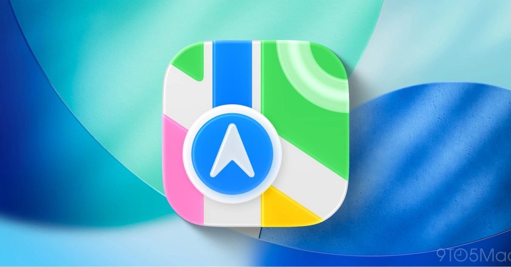

| Field | Value |
|-------|-------|
| Type | TwitterElement (TWITTER) |
| Source | [https://x.com/9to5mac/status/1942305679466754426?s=12](https://x.com/9to5mac/status/1942305679466754426?s=12) |
| Tags | graphic design, apple, ios |

---

## 2. iOS 26 Adds a Useful New Wi-Fi Feature to Your iPhone

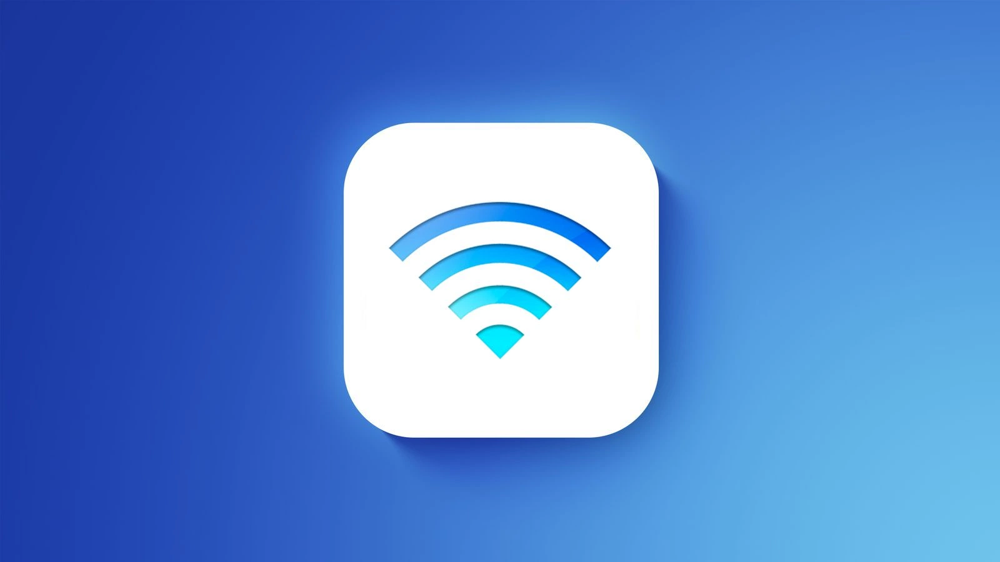

| Field | Value |
|-------|-------|
| Type | ArticleElement (ARTICLE) |
| Source | [https://www.macrumors.com/2025/07/02/ios-26-captive-wifi-fea...](https://www.macrumors.com/2025/07/02/ios-26-captive-wifi-feature/) |
| Tags | graphic design, macrumors, design |

---

## 3. Item 3

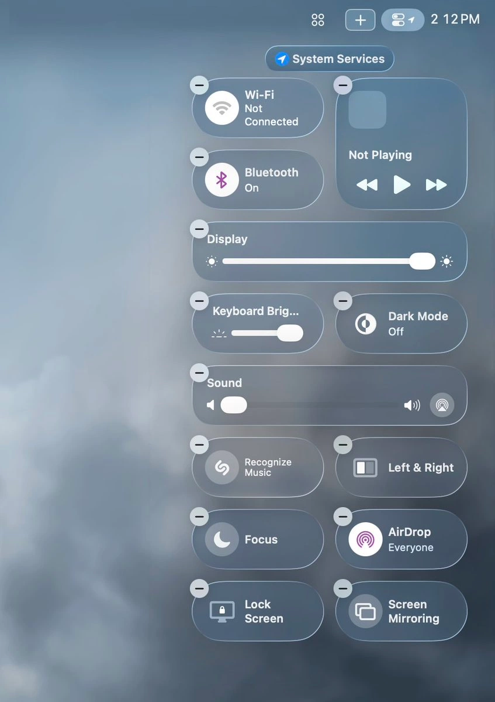

| Field | Value |
|-------|-------|
| Type | TwitterElement (TWITTER) |
| Source | [https://x.com/futur3sn0w/status/1938299598063472674?s=12](https://x.com/futur3sn0w/status/1938299598063472674?s=12) |
| Tags | screenshot |

---

## 4. Item 4

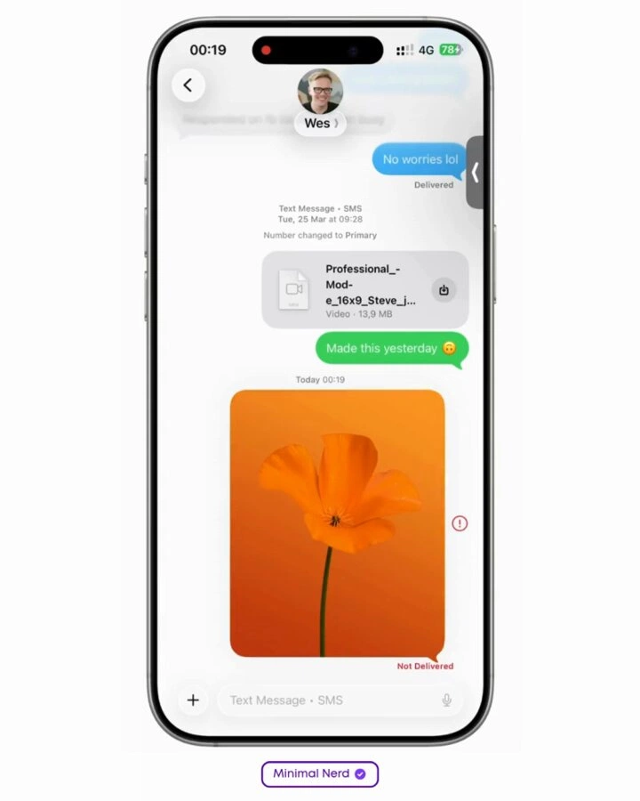

| Field | Value |
|-------|-------|
| Type | TwitterElement (TWITTER) |
| Source | [https://x.com/minimalnerd1/status/1937933125327438307?s=12](https://x.com/minimalnerd1/status/1937933125327438307?s=12) |
| Tags | smartphone |

---

## 5. Item 5

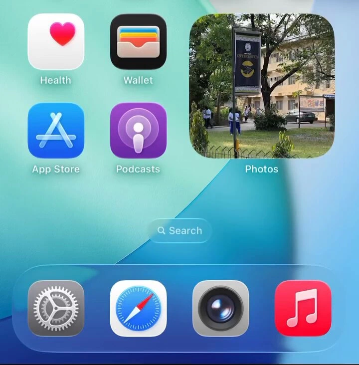

| Field | Value |
|-------|-------|
| Type | TwitterElement (TWITTER) |
| Source | [https://x.com/theappledesign/status/1938014503863537923?s=12...](https://x.com/theappledesign/status/1938014503863537923?s=12&t=Kbl6Kd9qhuaRg9Z7iATEEw) |
| Tags | appstore ios 26, ios |

---

## 6. Liquid Glass, but in CSS

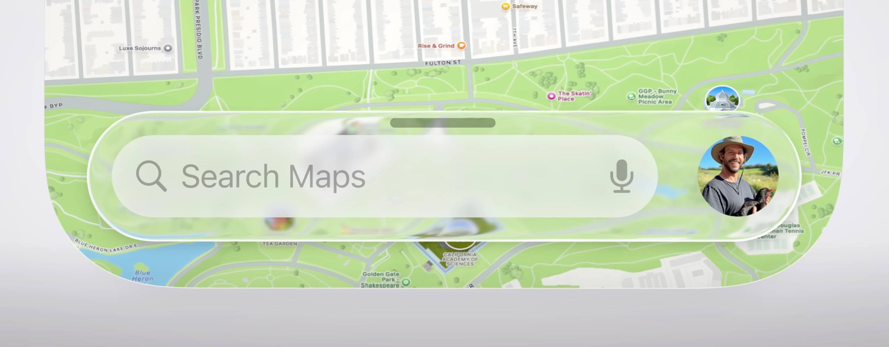

| Field | Value |
|-------|-------|
| Type | ArticleElement (ARTICLE) |
| Source | [https://atlaspuplabs.com/blog/liquid-glass-but-in-css](https://atlaspuplabs.com/blog/liquid-glass-but-in-css) |
| Tags | apple liquid glass, craig federighi, liquid glass, apple |

---

## 7. Item 7

| Field | Value |
|-------|-------|
| Type | TwitterElement (TWITTER) |
| Source | [https://x.com/minimalnerd1/status/1937661074456850765?s=12](https://x.com/minimalnerd1/status/1937661074456850765?s=12) |
| Tags | screenshot |

---

## 8. Item 8

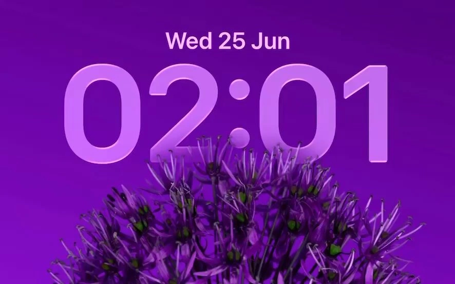

| Field | Value |
|-------|-------|
| Type | TwitterElement (TWITTER) |
| Source | [https://x.com/minimalnerd1/status/1937639636777771368?s=12](https://x.com/minimalnerd1/status/1937639636777771368?s=12) |
| Tags | crocus |

---

## 9. Item 9

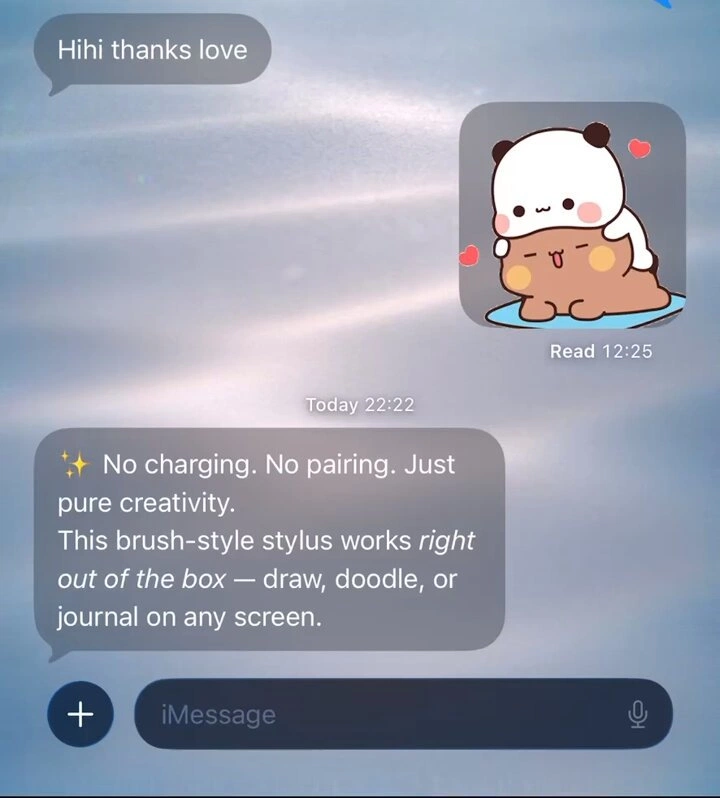

| Field | Value |
|-------|-------|
| Type | TwitterElement (TWITTER) |
| Source | [https://x.com/minimalnerd1/status/1937269238772949422?s=12](https://x.com/minimalnerd1/status/1937269238772949422?s=12) |
| Tags | screenshot |

---

## 10. Item 10

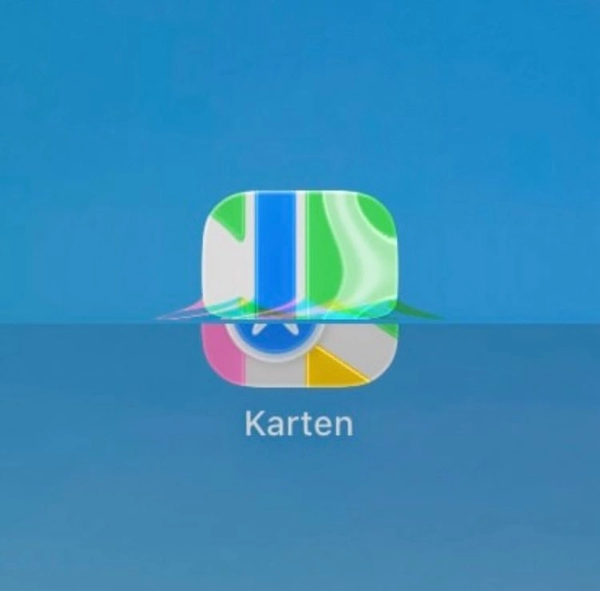

| Field | Value |
|-------|-------|
| Type | TwitterElement (TWITTER) |
| Source | [https://x.com/theappledesign/status/1937481470894874914?s=12](https://x.com/theappledesign/status/1937481470894874914?s=12) |
| Tags | graphic design |

---

## 11. Item 11

| Field | Value |
|-------|-------|
| Type | TwitterElement (TWITTER) |
| Source | [https://x.com/ordinaryinds/status/1937259816491032772?s=12](https://x.com/ordinaryinds/status/1937259816491032772?s=12) |

---

## 12. Item 12

| Field | Value |
|-------|-------|
| Type | TwitterElement (TWITTER) |
| Source | [https://x.com/aaronp613/status/1937221878462214209?s=12](https://x.com/aaronp613/status/1937221878462214209?s=12) |

---

## 13. Item 13

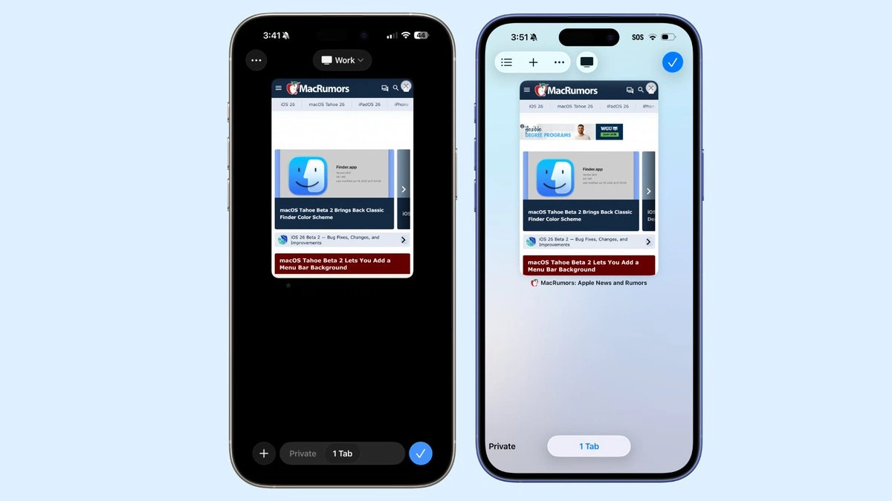

| Field | Value |
|-------|-------|
| Type | TwitterElement (TWITTER) |
| Source | [https://x.com/macrumors/status/1937239118247002566?s=12](https://x.com/macrumors/status/1937239118247002566?s=12) |
| Tags | iphone, ios, macrumors, apple |

---

## 14. iOS 26 Includes These 100 New Features and Changes for Your iPhone

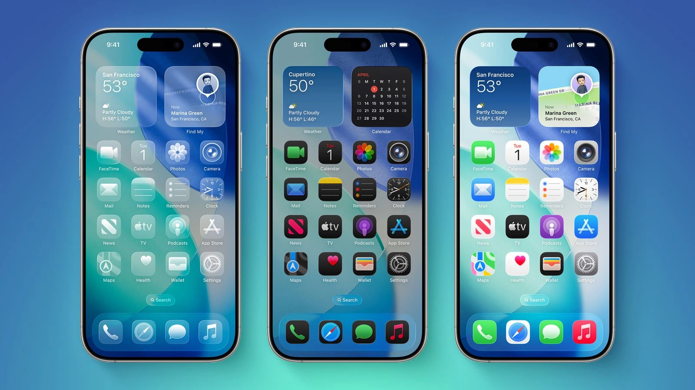

| Field | Value |
|-------|-------|
| Type | ArticleElement (ARTICLE) |
| Source | [https://www.macrumors.com/2025/06/10/ios-26-includes-these-1...](https://www.macrumors.com/2025/06/10/ios-26-includes-these-100-changes/) |
| Tags | apple liquid glass, iphone, worldwide developers conference, apple, ios |

---

## 15. Item 15

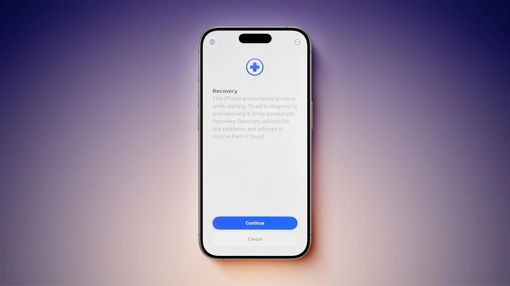

| Field | Value |
|-------|-------|
| Type | TwitterElement (TWITTER) |
| Source | [https://x.com/macrumors/status/1937216425560801485?s=12](https://x.com/macrumors/status/1937216425560801485?s=12) |
| Tags | iphone |

---

## 16. Item 16

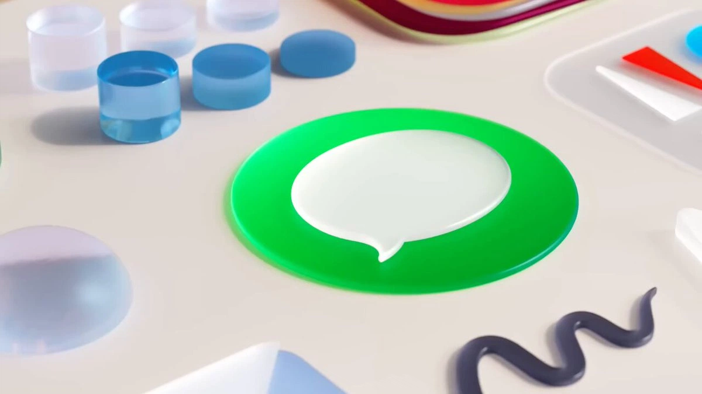

| Field | Value |
|-------|-------|
| Type | TwitterElement (TWITTER) |
| Source | [https://x.com/theappledesign/status/1937178517558706479?s=12](https://x.com/theappledesign/status/1937178517558706479?s=12) |
| Tags | apple new icons, icon, icon composer, apple |

---

## 17. Item 17

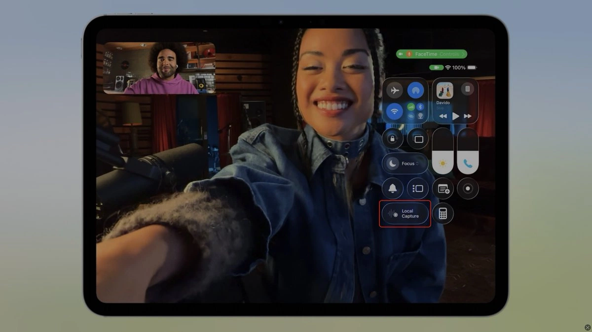

| Field | Value |
|-------|-------|
| Type | TwitterElement (TWITTER) |
| Source | [https://x.com/macrumors/status/1937126601055252980?s=12](https://x.com/macrumors/status/1937126601055252980?s=12) |
| Tags | airpods 4 apple, apple |

---

## 18. <n>Apple</n>'s <n>Liquid Glass</n> software design for <n>iOS 26</n>, introduced at <n>WWDC 2025</n>.

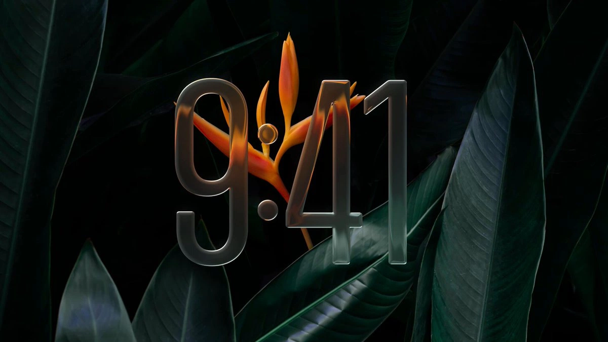

| Field | Value |
|-------|-------|
| Type | TwitterElement (TWITTER) |
| Source | [https://x.com/avstorm/status/1932129514752241867](https://x.com/avstorm/status/1932129514752241867) |
| Caption | <n>Apple</n>'s <n>Liquid Glass</n> software design for <n>iOS 26</n>, introduced at <n>WWDC 2025</n>. |
| Tags | liquid glass apple, apple, worldwide developers conference, liquid glass |

---

## 19. Item 19

| Field | Value |
|-------|-------|
| Type | TwitterElement (TWITTER) |
| Source | [https://x.com/zielinskiwoj/status/1932061789157486872](https://x.com/zielinskiwoj/status/1932061789157486872) |
| Tags | screenshot |

---

## 20. Item 20

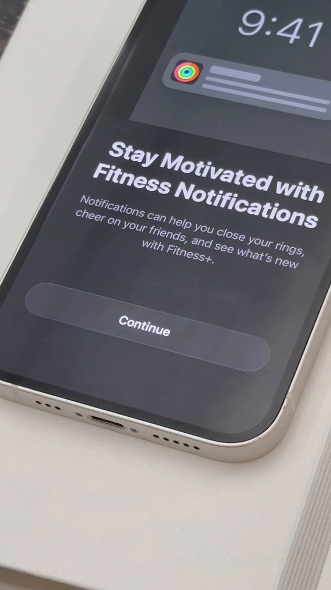

| Field | Value |
|-------|-------|
| Type | TwitterElement (TWITTER) |
| Source | [https://x.com/GregSarafian/status/1932161552611999870](https://x.com/GregSarafian/status/1932161552611999870) |
| Tags | smartphone |

---

## 21. Item 21

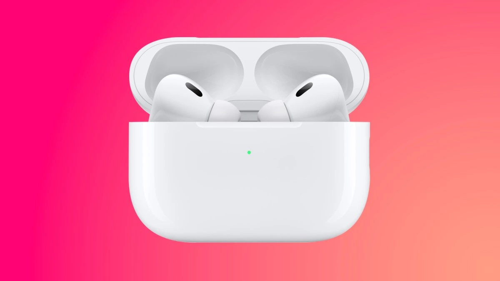

| Field | Value |
|-------|-------|
| Type | TwitterElement (TWITTER) |
| Source | [https://x.com/MacRumors/status/1932173415408111988](https://x.com/MacRumors/status/1932173415408111988) |
| Tags | airpods, apple, airpods pro |

---

## 22. Item 22

| Field | Value |
|-------|-------|
| Type | TwitterElement (TWITTER) |
| Source | [https://x.com/avstorm/status/1932181766778798428](https://x.com/avstorm/status/1932181766778798428) |
| Tags | graphic design |

---

## 23. Item 23

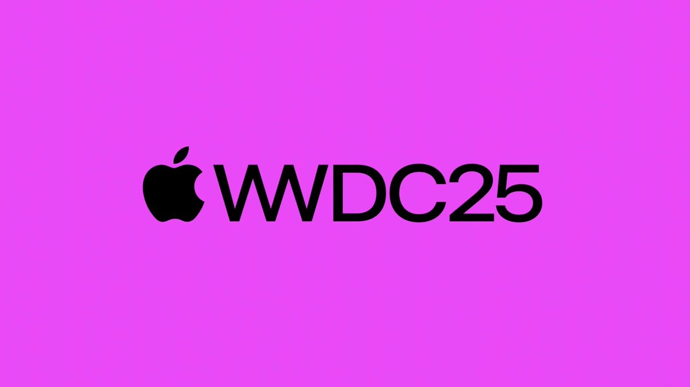

| Field | Value |
|-------|-------|
| Type | TwitterElement (TWITTER) |
| Source | [https://x.com/signulll/status/1932193234152783934?s=12](https://x.com/signulll/status/1932193234152783934?s=12) |
| Tags | graphic design |

---

## 24. Item 24

| Field | Value |
|-------|-------|
| Type | TwitterElement (TWITTER) |
| Source | [https://x.com/znebrakr/status/1932209520262152231](https://x.com/znebrakr/status/1932209520262152231) |

---

## 25. Item 25

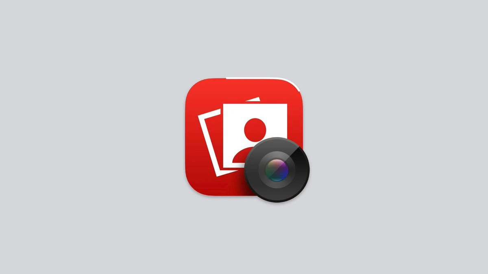

| Field | Value |
|-------|-------|
| Type | TwitterElement (TWITTER) |
| Source | [https://x.com/flarup/status/1932196963576914249](https://x.com/flarup/status/1932196963576914249) |
| Tags | graphic design, design |

---

## 26. Examples of <n>Apple</n>'s <n>Liquid Glass</n> user interface from <n>iOS 26</n> and <n>macOS 26 Tahoe</n>.

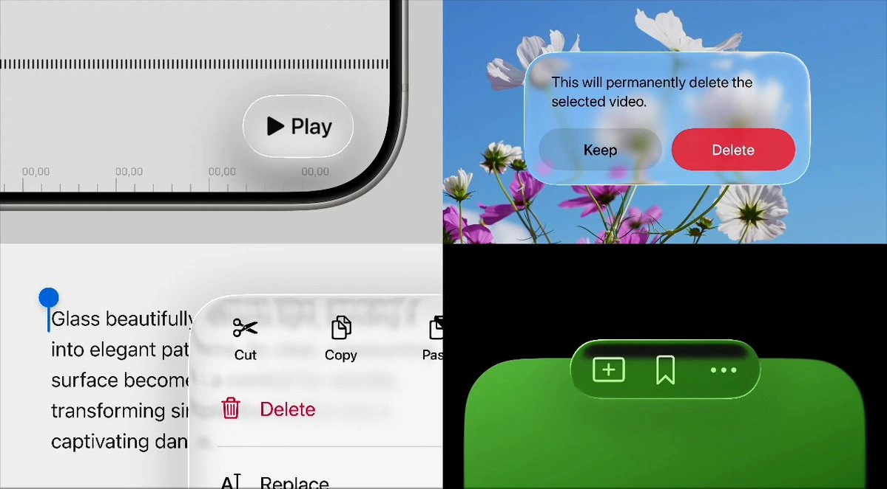

| Field | Value |
|-------|-------|
| Type | TwitterElement (TWITTER) |
| Source | [https://x.com/sdw/status/1932204581989274107?s=12](https://x.com/sdw/status/1932204581989274107?s=12) |
| Caption | Examples of <n>Apple</n>'s <n>Liquid Glass</n> user interface from <n>iOS 26</n> and <n>macOS 26 Tahoe</n>. |
| Tags | screenshot |

---

## 27. A collection of <n>Interactive Snippets</n>, a UI feature presented by <n>Apple</n> at <n>WWDC25</n>.

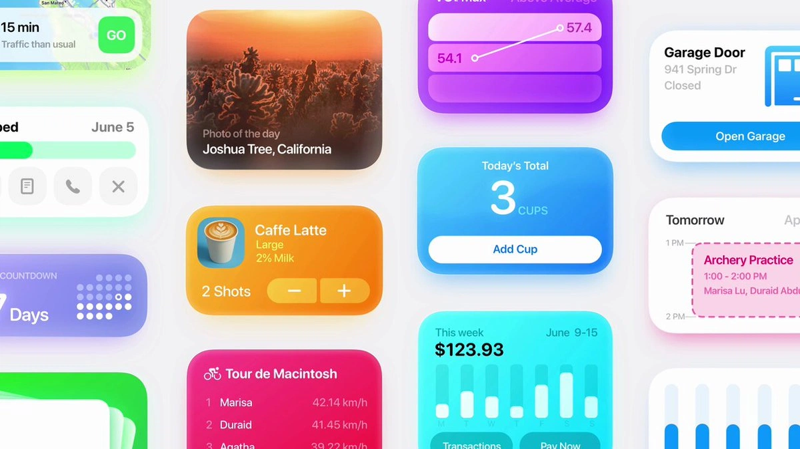

| Field | Value |
|-------|-------|
| Type | TwitterElement (TWITTER) |
| Source | [https://x.com/raypai_/status/1932230174579548232](https://x.com/raypai_/status/1932230174579548232) |
| Caption | A collection of <n>Interactive Snippets</n>, a UI feature presented by <n>Apple</n> at <n>WWDC25</n>. |
| Tags | screenshot, apple developer |

---

## 28. Item 28

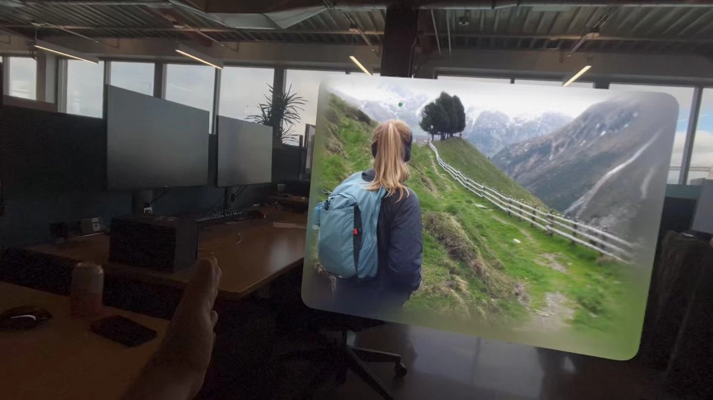

| Field | Value |
|-------|-------|
| Type | TwitterElement (TWITTER) |
| Source | [https://x.com/Azadux/status/1932236355146543366](https://x.com/Azadux/status/1932236355146543366) |
| Tags | mountain |

---

## 29. Item 29

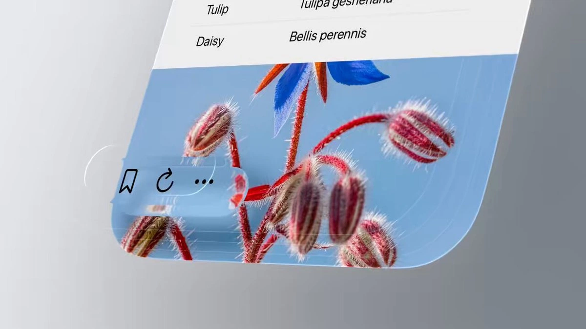

| Field | Value |
|-------|-------|
| Type | TwitterElement (TWITTER) |
| Source | [https://x.com/_canalesbr1/status/1932208425217540350](https://x.com/_canalesbr1/status/1932208425217540350) |
| Tags | jellyfish, worldwide developers conference, apple vision pro, apple |

---

## 30. A close-up of the <n>Rabbit R1</n>.

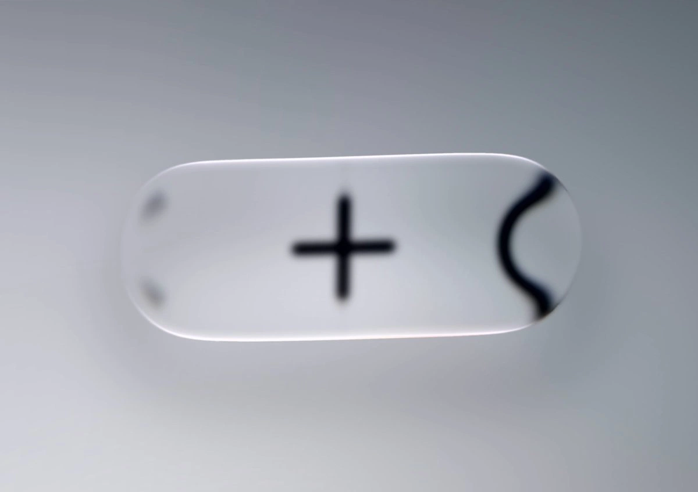

| Field | Value |
|-------|-------|
| Type | TwitterElement (TWITTER) |
| Source | [https://x.com/chan_k/status/1932185261162766459](https://x.com/chan_k/status/1932185261162766459) |
| Caption | A close-up of the <n>Rabbit R1</n>. |
| Tags | cross |

---

## 31. Item 31

| Field | Value |
|-------|-------|
| Type | TwitterElement (TWITTER) |
| Source | [https://x.com/novikoff/status/1932215683116408931](https://x.com/novikoff/status/1932215683116408931) |

---

## 32. Item 32

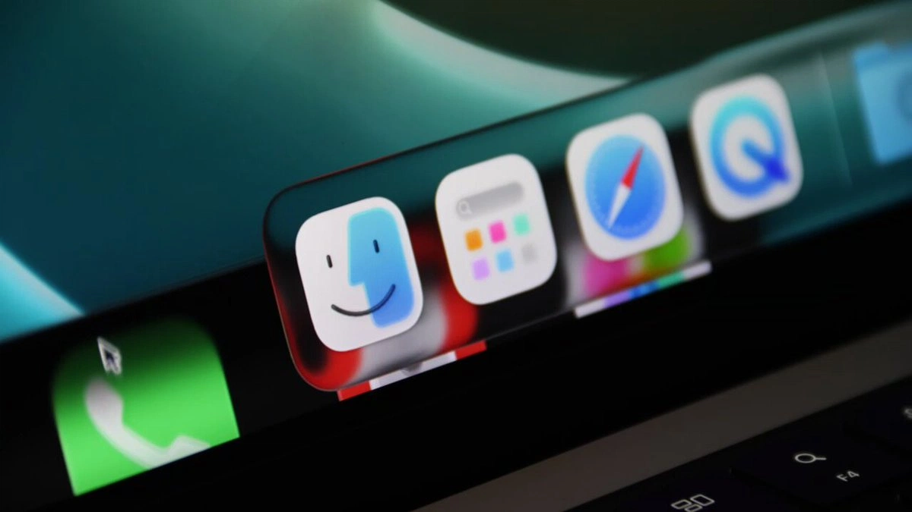

| Field | Value |
|-------|-------|
| Type | TwitterElement (TWITTER) |
| Source | [https://x.com/thecomputerclan/status/1932196702166950309](https://x.com/thecomputerclan/status/1932196702166950309) |
| Tags | electronics, transsion tecno electronics |

---

## 33. Item 33

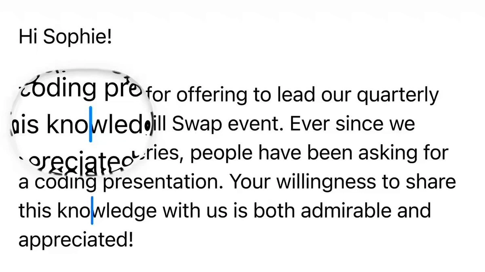

| Field | Value |
|-------|-------|
| Type | TwitterElement (TWITTER) |
| Source | [https://x.com/malonso/status/1932305126448046508](https://x.com/malonso/status/1932305126448046508) |
| Tags | number |

---

## 34. Item 34

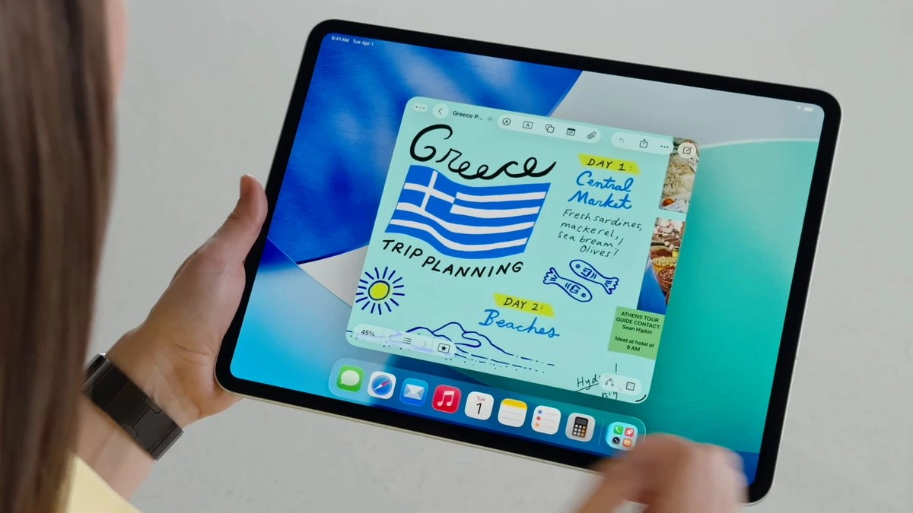

| Field | Value |
|-------|-------|
| Type | TwitterElement (TWITTER) |
| Source | [https://x.com/kediashubham/status/1932247030942036135](https://x.com/kediashubham/status/1932247030942036135) |
| Tags | ipados 26, worldwide developers conference, ipados, ipad, apple, computer, tablet |

---

## 35. Item 35

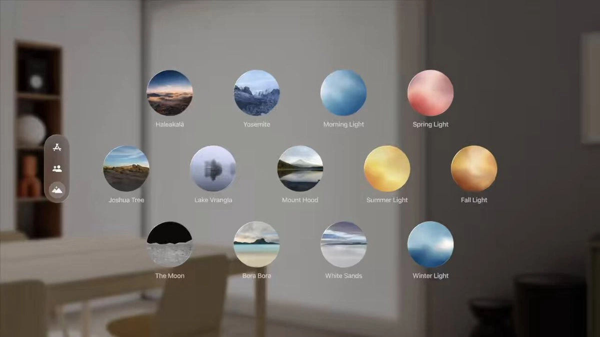

| Field | Value |
|-------|-------|
| Type | TwitterElement (TWITTER) |
| Source | [https://x.com/nathangitter/status/1932261881328357383](https://x.com/nathangitter/status/1932261881328357383) |
| Tags | collection |

---

## 36. Item 36

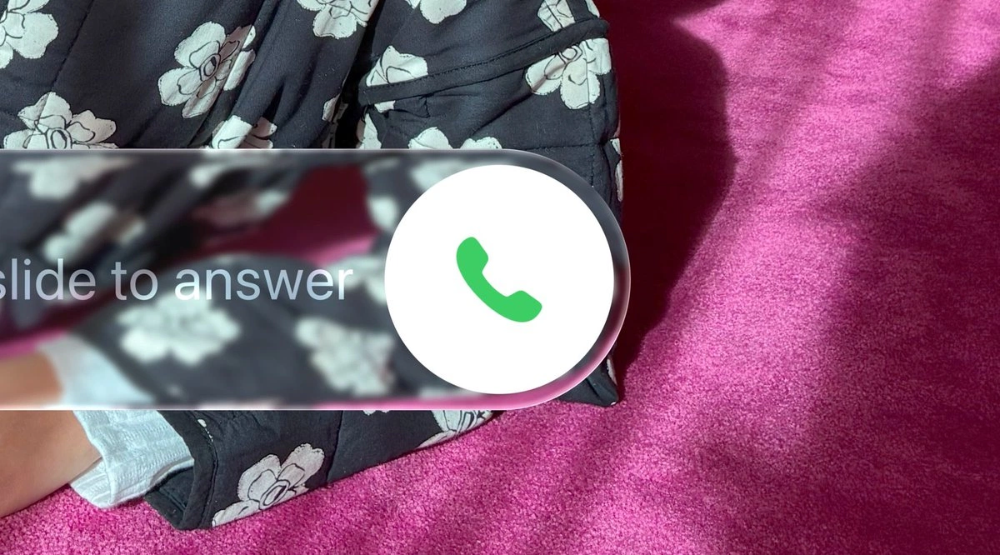

| Field | Value |
|-------|-------|
| Type | TwitterElement (TWITTER) |
| Source | [https://x.com/almmaasoglu/status/1932134365116453341](https://x.com/almmaasoglu/status/1932134365116453341) |
| Tags | apple liquid glass ui, liquid glass, apple, worldwide developers conference, user interface |

---

## 37. Item 37

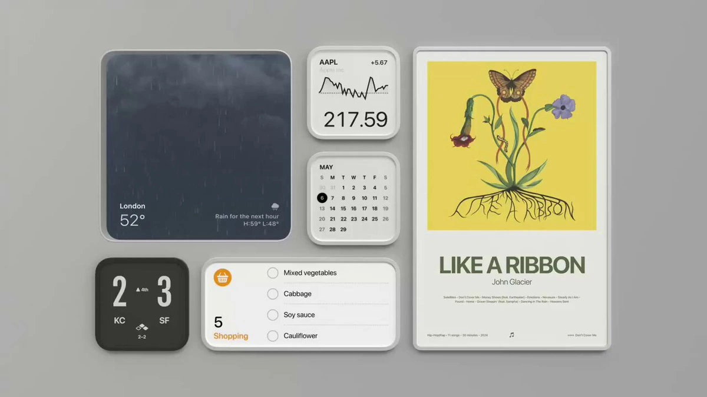

| Field | Value |
|-------|-------|
| Type | TwitterElement (TWITTER) |
| Source | [https://x.com/jonathan_ravasz/status/1932218968603082948](https://x.com/jonathan_ravasz/status/1932218968603082948) |
| Tags | vision pro widgets, visionos, apple vision pro, worldwide developers conference, apple, visionos 2 |

---

## 38. Item 38

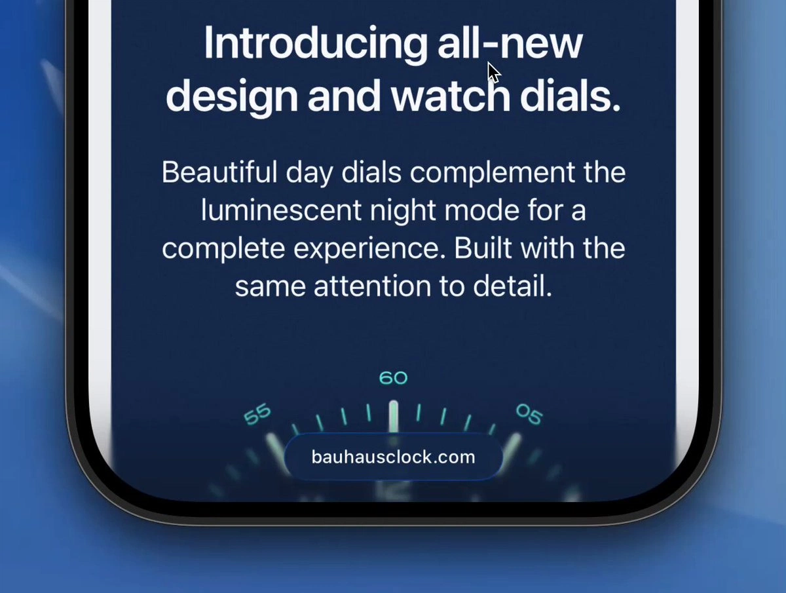

| Field | Value |
|-------|-------|
| Type | TwitterElement (TWITTER) |
| Source | [https://x.com/_atilla1/status/1932355846287102445](https://x.com/_atilla1/status/1932355846287102445) |
| Tags | screenshot |

---

## 39. Branding for <n>Subform</n>, by founder <n>Tamir Yankevich</n> and product designer <n>Emin Temiz</n>.

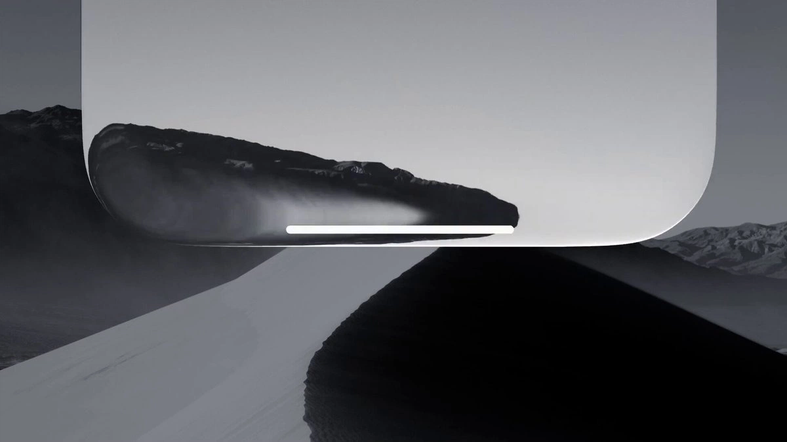

| Field | Value |
|-------|-------|
| Type | TwitterElement (TWITTER) |
| Source | [https://x.com/pie6k/status/1932375641657389210?s=12&t=zAmwBp...](https://x.com/pie6k/status/1932375641657389210?s=12&t=zAmwBpdndJoWf_8Rr150tA) |
| Caption | Branding for <n>Subform</n>, by founder <n>Tamir Yankevich</n> and product designer <n>Emin Temiz</n>. |
| Tags | mountain |

---

## 40. Item 40

| Field | Value |
|-------|-------|
| Type | TwitterElement (TWITTER) |
| Source | [https://x.com/marckohlbrugge/status/1932233997272183015](https://x.com/marckohlbrugge/status/1932233997272183015) |

---

## 41. Item 41

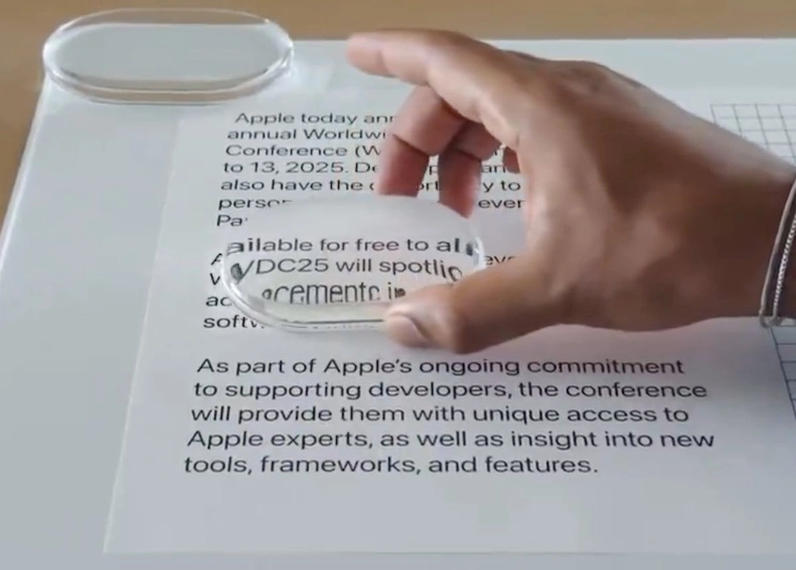

| Field | Value |
|-------|-------|
| Type | TwitterElement (TWITTER) |
| Source | [https://x.com/sentry/status/1932181593776693619](https://x.com/sentry/status/1932181593776693619) |
| Tags | hand |

---

## 42. Item 42

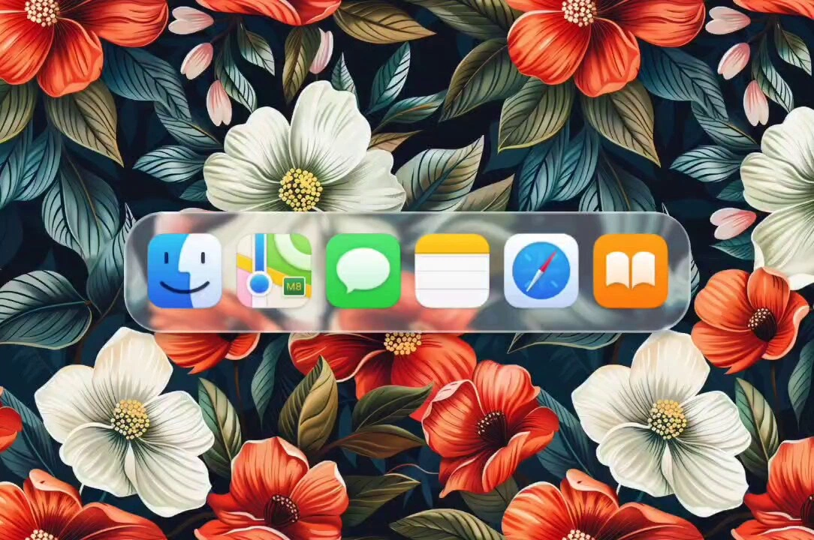

| Field | Value |
|-------|-------|
| Type | TwitterElement (TWITTER) |
| Source | [https://x.com/lucasromerodb/status/1932249068505293257](https://x.com/lucasromerodb/status/1932249068505293257) |
| Tags | hibiscus, web template |

---

## 43. Item 43

| Field | Value |
|-------|-------|
| Type | TwitterElement (TWITTER) |
| Source | [https://x.com/jsngr/status/1932194975288103310](https://x.com/jsngr/status/1932194975288103310) |

---

## 44. <n>Anatomy of a Water Drop</n>, an instructional drawing by artist <n>Wes Modes</n>.

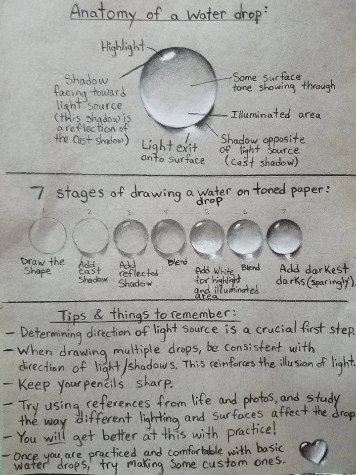

| Field | Value |
|-------|-------|
| Type | TwitterElement (TWITTER) |
| Source | [https://x.com/raphaelschaad/status/1932408346470236545](https://x.com/raphaelschaad/status/1932408346470236545) |
| Caption | <n>Anatomy of a Water Drop</n>, an instructional drawing by artist <n>Wes Modes</n>. |
| Tags | draw a water drop, water, drawing, image |

---

## 45. Item 45

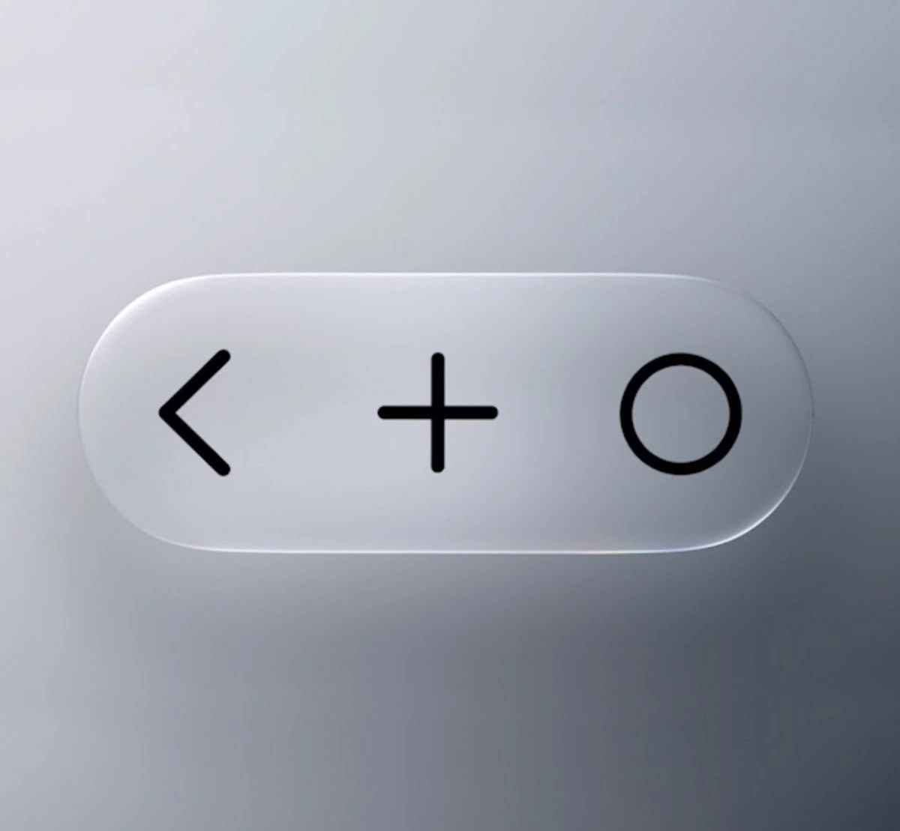

| Field | Value |
|-------|-------|
| Type | TwitterElement (TWITTER) |
| Source | [https://x.com/asallen/status/1932474736308871239?s=12&t=HX3D...](https://x.com/asallen/status/1932474736308871239?s=12&t=HX3DZmtw83ZYVFMkl7qAjA) |
| Tags | pregnancy test |

---

## 46. Item 46

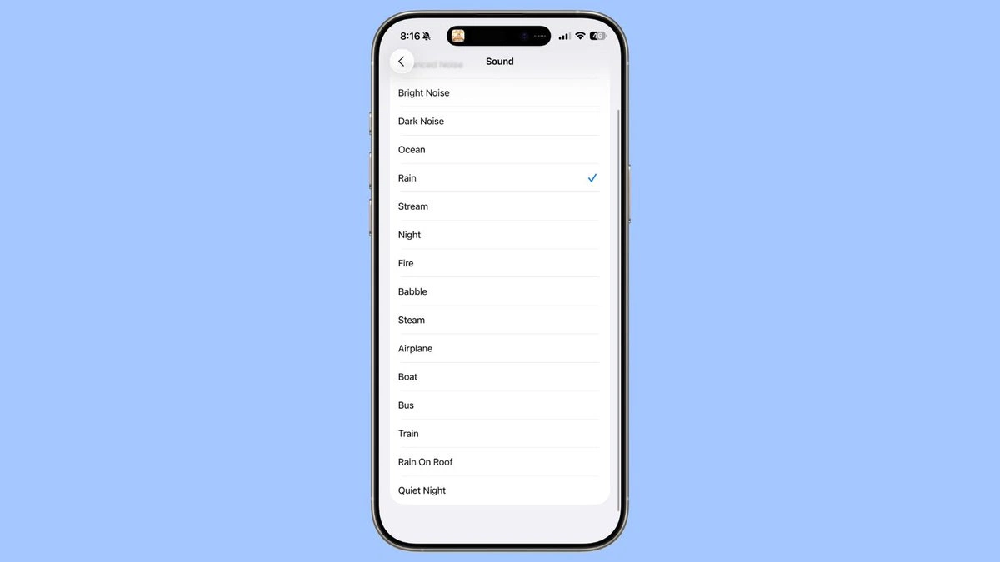

| Field | Value |
|-------|-------|
| Type | TwitterElement (TWITTER) |
| Source | [https://x.com/MacRumors/status/1932239807490740551](https://x.com/MacRumors/status/1932239807490740551) |
| Tags | iphone |

---

## 47. Item 47

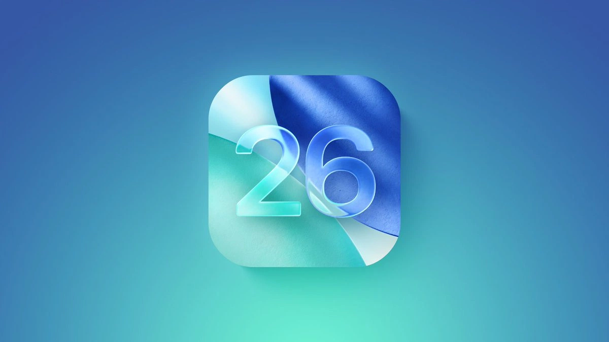

| Field | Value |
|-------|-------|
| Type | TwitterElement (TWITTER) |
| Source | [https://x.com/MacRumors/status/1932237917239316789](https://x.com/MacRumors/status/1932237917239316789) |
| Tags | ipados 26 logo, ios, ios 26 |

---

## 48. Item 48

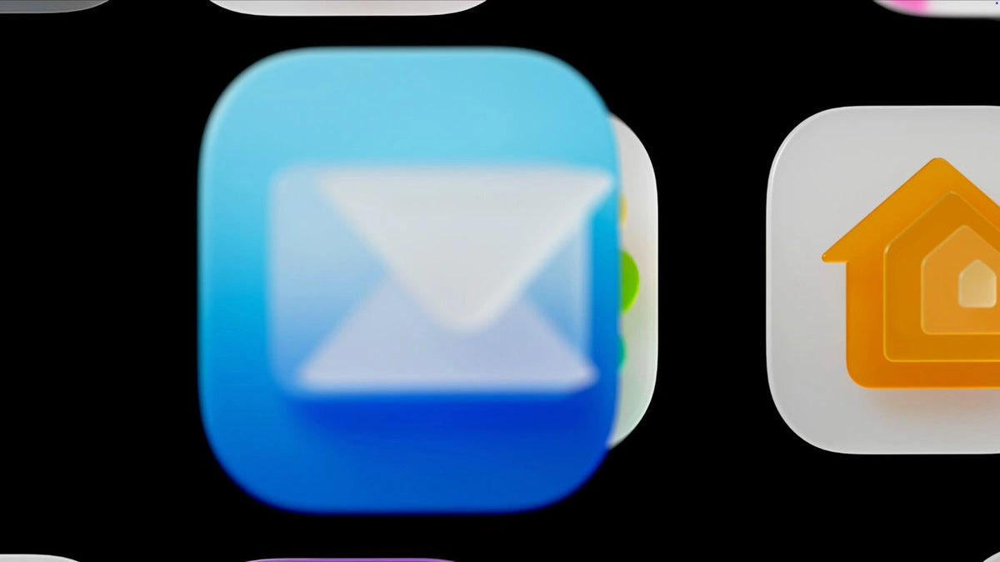

| Field | Value |
|-------|-------|
| Type | TwitterElement (TWITTER) |
| Source | [https://x.com/philipcdavis/status/1932505755523166584](https://x.com/philipcdavis/status/1932505755523166584) |
| Tags | graphic design |

---

## 49. Item 49

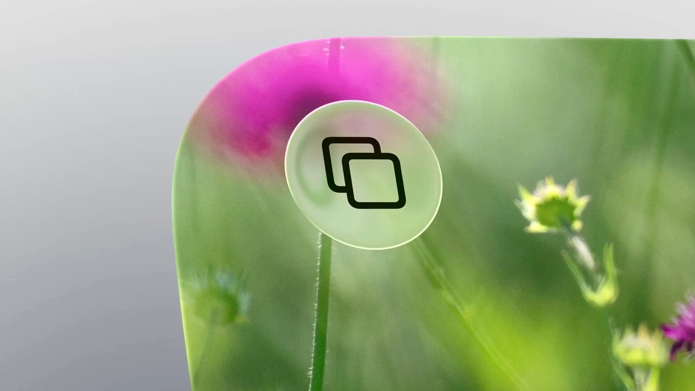

| Field | Value |
|-------|-------|
| Type | TwitterElement (TWITTER) |
| Source | [https://x.com/avstorm/status/1932702457341358363](https://x.com/avstorm/status/1932702457341358363) |
| Tags | close-up, mario kart world |

---

## 50. A demonstration of the <n>Liquid Glass</n> feature in the <n>Play</n> design application.

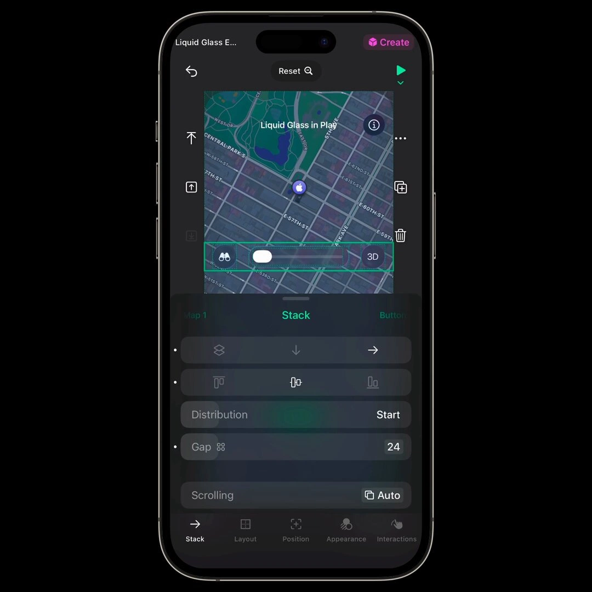

| Field | Value |
|-------|-------|
| Type | TwitterElement (TWITTER) |
| Source | [https://x.com/createwithplay/status/1932764094378963121?s=12...](https://x.com/createwithplay/status/1932764094378963121?s=12&t=GmbgdtIP0-xMEWqkVBFv4w) |
| Caption | A demonstration of the <n>Liquid Glass</n> feature in the <n>Play</n> design application. |
| Tags | smartphone, mobile device |

---

## 51. Item 51

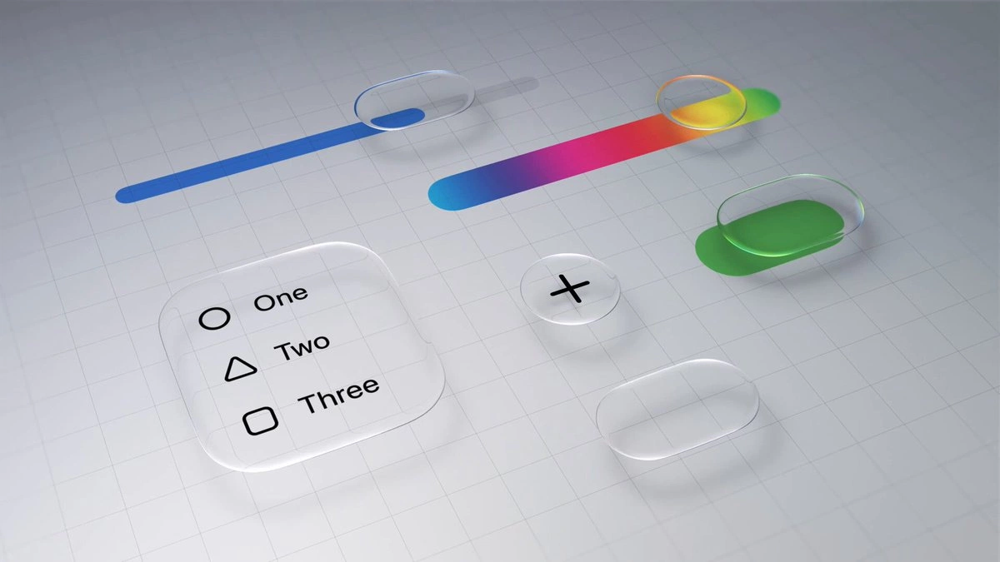

| Field | Value |
|-------|-------|
| Type | TwitterElement (TWITTER) |
| Source | [https://x.com/flarup/status/1932746669885391084](https://x.com/flarup/status/1932746669885391084) |
| Tags | plastic |

---

## 52. Item 52

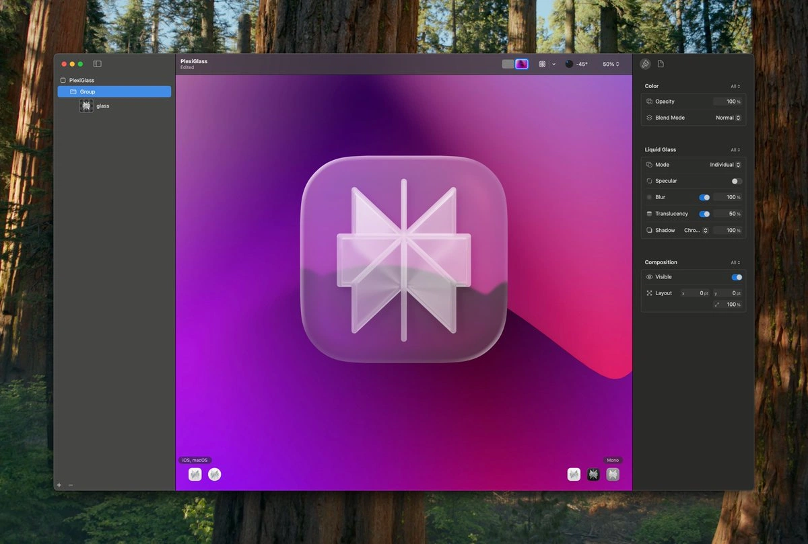

| Field | Value |
|-------|-------|
| Type | TwitterElement (TWITTER) |
| Source | [https://x.com/gunnargray/status/1932845614829551970](https://x.com/gunnargray/status/1932845614829551970) |
| Tags | screenshot, perplexity ai |

---

## 53. A UI detail from the <n>Liquid Glass design system</n> by designer <n>Maria Hristoforova</n>.

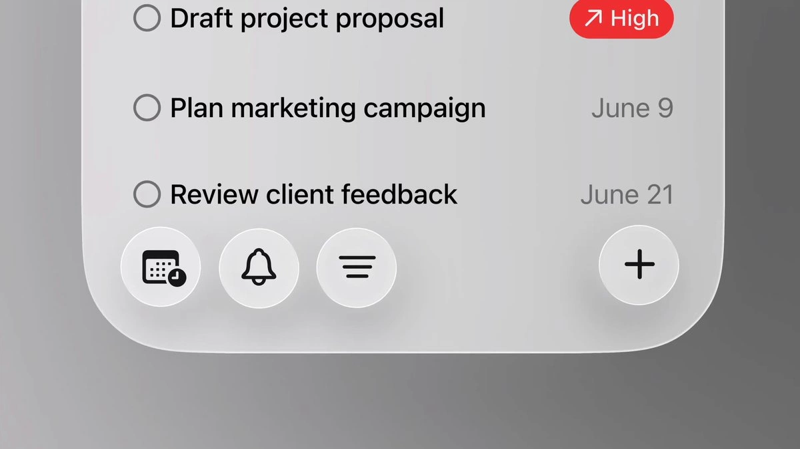

| Field | Value |
|-------|-------|
| Type | TwitterElement (TWITTER) |
| Source | [https://x.com/mariachrstphr/status/1932862072251207840](https://x.com/mariachrstphr/status/1932862072251207840) |
| Caption | A UI detail from the <n>Liquid Glass design system</n> by designer <n>Maria Hristoforova</n>. |
| Tags | screenshot |

---

## 54. Item 54

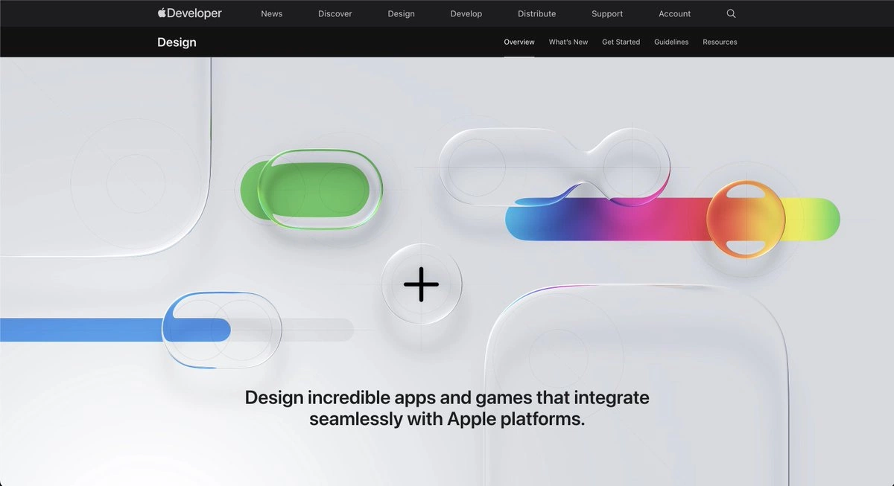

| Field | Value |
|-------|-------|
| Type | TwitterElement (TWITTER) |
| Source | [https://x.com/seanallen_dev/status/1932828809780138267](https://x.com/seanallen_dev/status/1932828809780138267) |
| Tags | screenshot |

---

## 55. Item 55

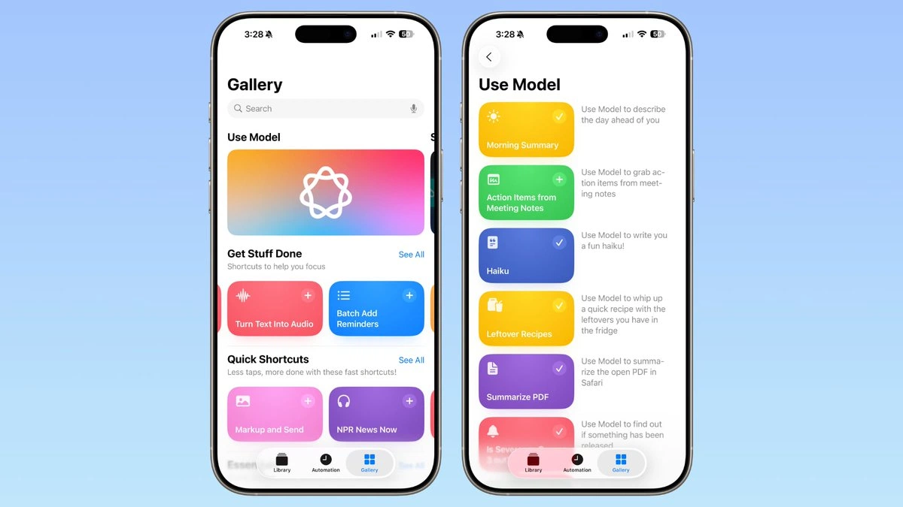

| Field | Value |
|-------|-------|
| Type | TwitterElement (TWITTER) |
| Source | [https://x.com/MacRumors/status/1932921249275277458](https://x.com/MacRumors/status/1932921249275277458) |
| Tags | apple ios 26 shortcuts, shortcuts, apple intelligence, ios, apple |

---

## 56. Item 56

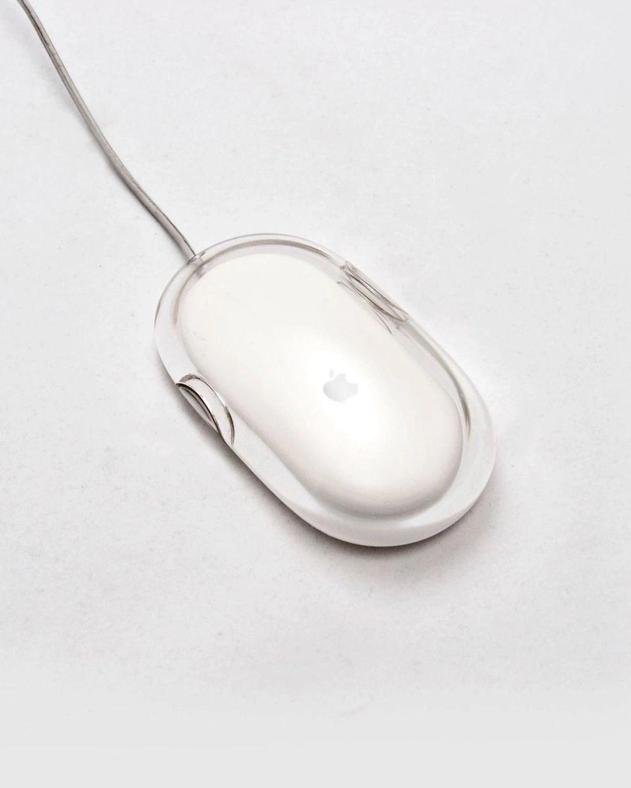

| Field | Value |
|-------|-------|
| Type | TwitterElement (TWITTER) |
| Source | [https://x.com/app_settings/status/1932754856173056272](https://x.com/app_settings/status/1932754856173056272) |
| Tags | locket, apple |

---

## 57. Item 57

| Field | Value |
|-------|-------|
| Type | TwitterElement (TWITTER) |
| Source | [https://x.com/twostraws/status/1932993760775815405](https://x.com/twostraws/status/1932993760775815405) |

---

## 58. Item 58

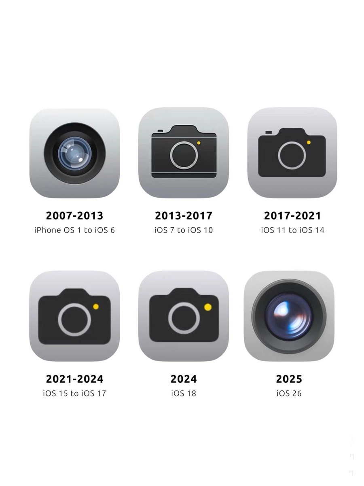

| Field | Value |
|-------|-------|
| Type | TwitterElement (TWITTER) |
| Source | [https://x.com/flarup/status/1933067506727420098](https://x.com/flarup/status/1933067506727420098) |
| Tags | iphone camera app icon over the years, iphone, ios, camera |

---

## 59. Item 59

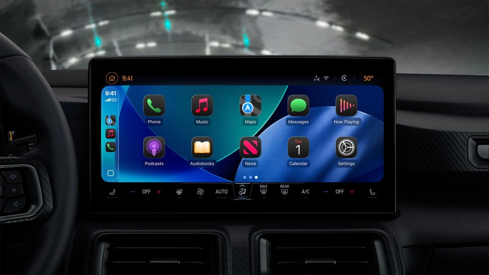

| Field | Value |
|-------|-------|
| Type | TwitterElement (TWITTER) |
| Source | [https://x.com/MacRumors/status/1933151489339605439](https://x.com/MacRumors/status/1933151489339605439) |
| Tags | ios 26 carplay, carplay, ios, apple |

---

## 60. Item 60

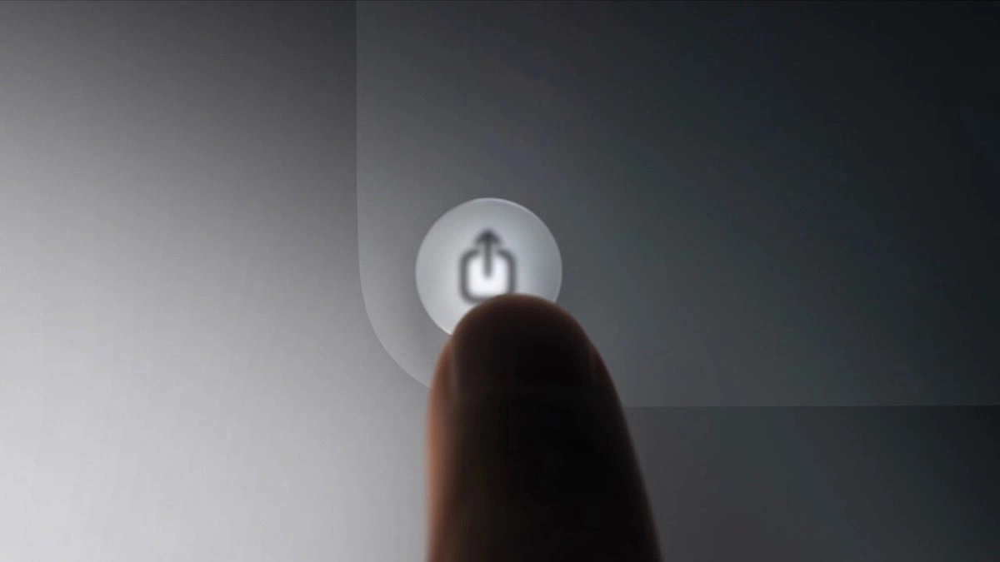

| Field | Value |
|-------|-------|
| Type | TwitterElement (TWITTER) |
| Source | [https://x.com/flarup/status/1933137648824287260](https://x.com/flarup/status/1933137648824287260) |
| Tags | darkness |

---

## 61. Item 61

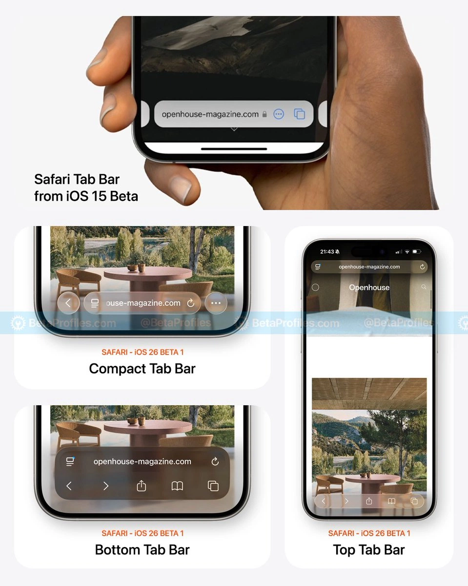

| Field | Value |
|-------|-------|
| Type | TwitterElement (TWITTER) |
| Source | [https://x.com/BetaProfiles/status/1933213755716088299](https://x.com/BetaProfiles/status/1933213755716088299) |
| Tags | ios 26 tabbar, ios 18, ios |

---

## 62. <n>Apple</n>'s <n>Liquid Glass</n> app icon style for <n>iOS 26</n>, introduced at <n>WWDC25</n>.

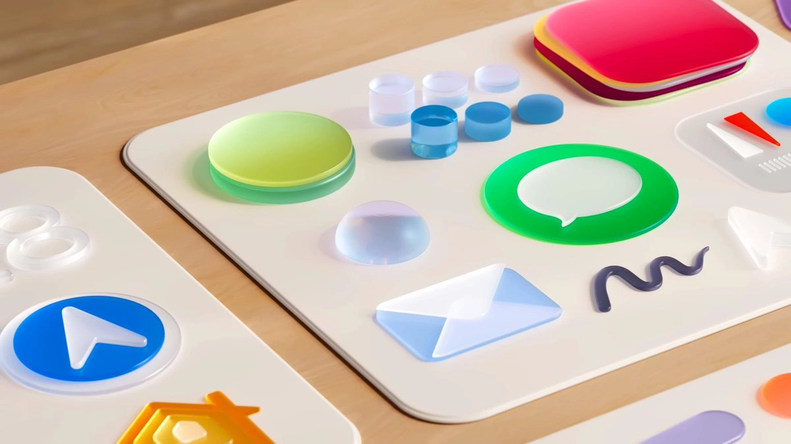

| Field | Value |
|-------|-------|
| Type | TwitterElement (TWITTER) |
| Source | [https://x.com/BasicAppleGuy/status/1933359719693050002](https://x.com/BasicAppleGuy/status/1933359719693050002) |
| Caption | <n>Apple</n>'s <n>Liquid Glass</n> app icon style for <n>iOS 26</n>, introduced at <n>WWDC25</n>. |
| Tags | apple new icons, icon, apple developer, icon composer, apple |

---

## 63. Item 63

| Field | Value |
|-------|-------|
| Type | TwitterElement (TWITTER) |
| Source | [https://x.com/DylanMcD8/status/1933402457884750218](https://x.com/DylanMcD8/status/1933402457884750218) |

---

## 64. Item 64

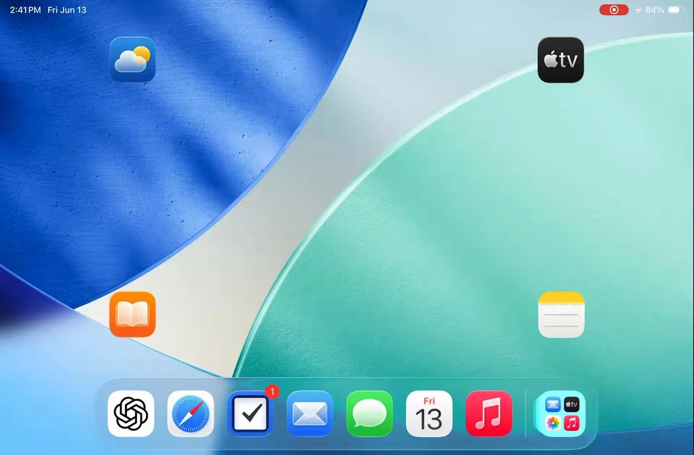

| Field | Value |
|-------|-------|
| Type | TwitterElement (TWITTER) |
| Source | [https://x.com/Gavmn/status/1933491608789410226](https://x.com/Gavmn/status/1933491608789410226) |
| Tags | screenshot |

---

## 65. Item 65

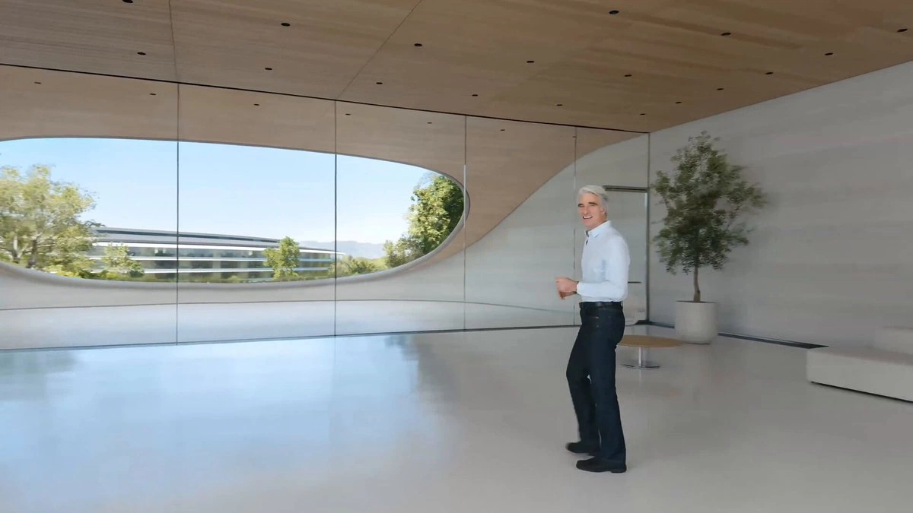

| Field | Value |
|-------|-------|
| Type | TwitterElement (TWITTER) |
| Source | [https://x.com/aaronp613/status/1933510844178198970](https://x.com/aaronp613/status/1933510844178198970) |
| Tags | architecture |

---

## 66. Item 66

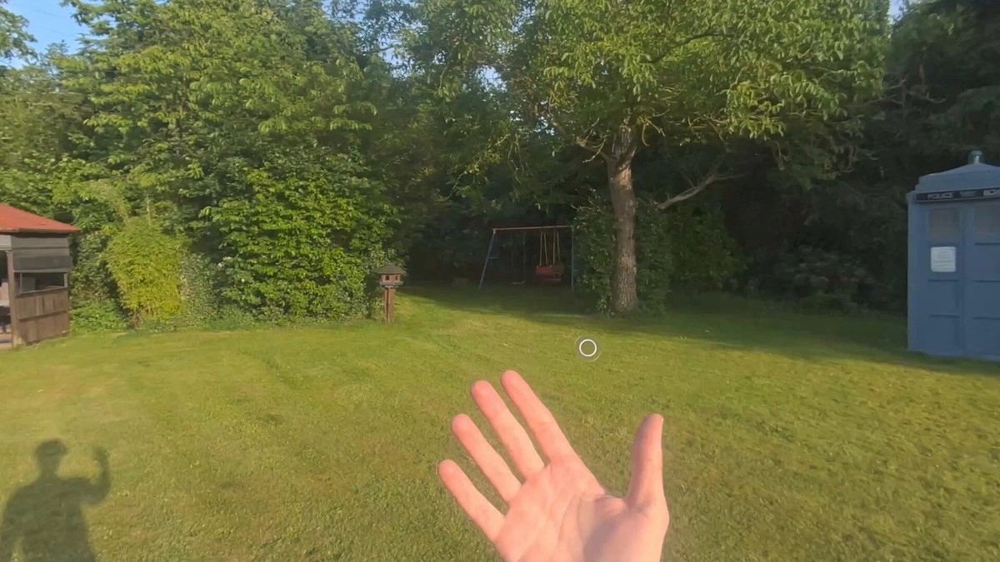

| Field | Value |
|-------|-------|
| Type | TwitterElement (TWITTER) |
| Source | [https://x.com/spatiallyme/status/1933239718579478830](https://x.com/spatiallyme/status/1933239718579478830) |
| Tags | tree, apple vision pro |

---

## 67. Item 67

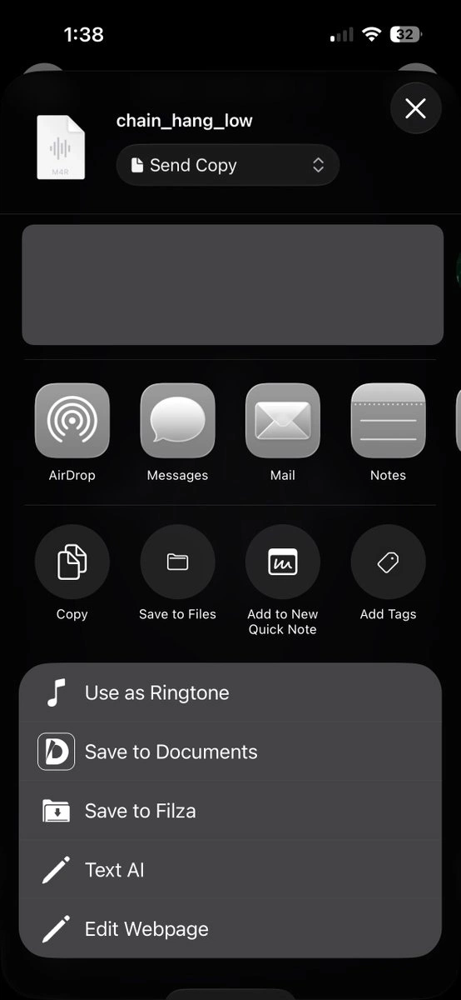

| Field | Value |
|-------|-------|
| Type | TwitterElement (TWITTER) |
| Source | [https://x.com/iTechExpert21/status/1933263820241448995](https://x.com/iTechExpert21/status/1933263820241448995) |
| Tags | screenshot |

---

## 68. Item 68

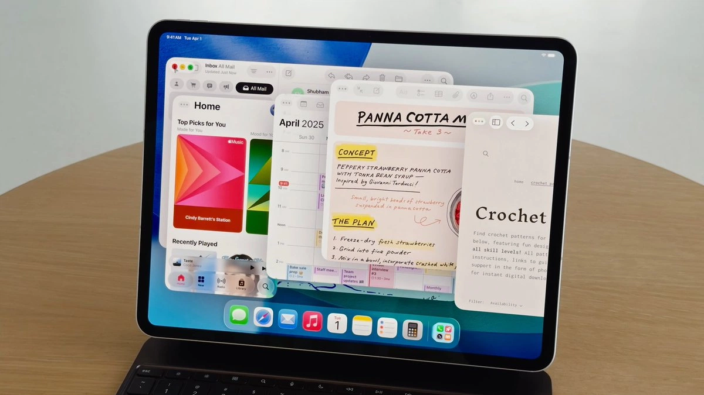

| Field | Value |
|-------|-------|
| Type | TwitterElement (TWITTER) |
| Source | [https://x.com/MacRumors/status/1933536478841483341](https://x.com/MacRumors/status/1933536478841483341) |
| Tags | wwdc 2025 ipad, worldwide developers conference, tablet, apple, ipados |

---

## 69. Item 69

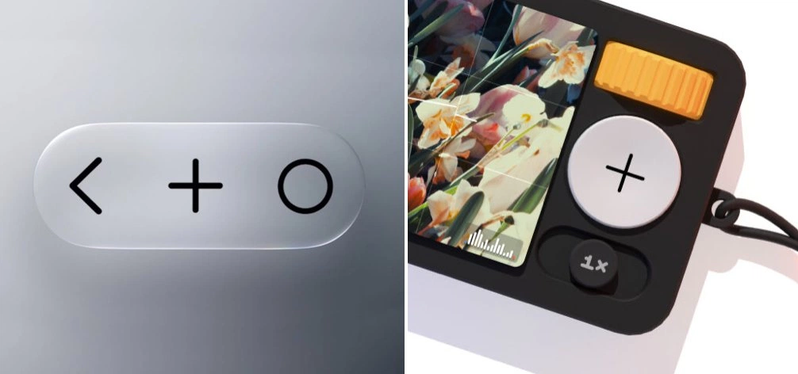

| Field | Value |
|-------|-------|
| Type | TwitterElement (TWITTER) |
| Source | [https://x.com/asallen/status/1933572226600874480](https://x.com/asallen/status/1933572226600874480) |
| Tags | gadget |

---

## 70. Item 70

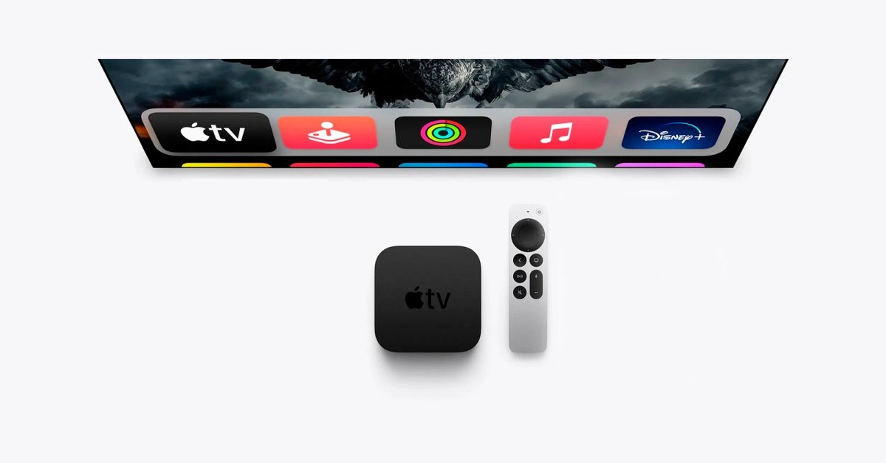

| Field | Value |
|-------|-------|
| Type | TwitterElement (TWITTER) |
| Source | [https://x.com/9to5mac/status/1933528086877794722](https://x.com/9to5mac/status/1933528086877794722) |
| Tags | newest apple tv, homepod mini, apple, tvos |

---

## 71. Item 71

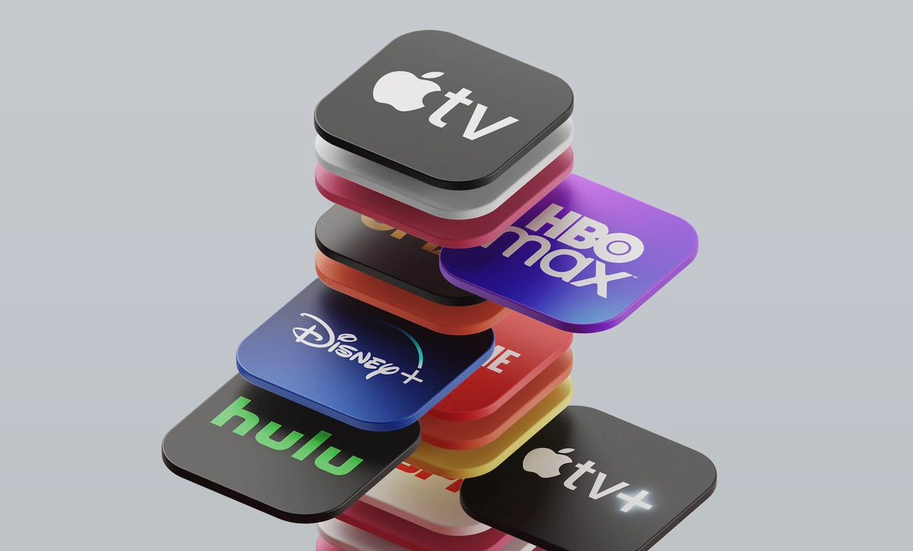

| Field | Value |
|-------|-------|
| Type | TwitterElement (TWITTER) |
| Source | [https://x.com/MacRumors/status/1933589630840123504](https://x.com/MacRumors/status/1933589630840123504) |
| Tags | streaming services, streaming media, apple tv |

---

## 72. Item 72

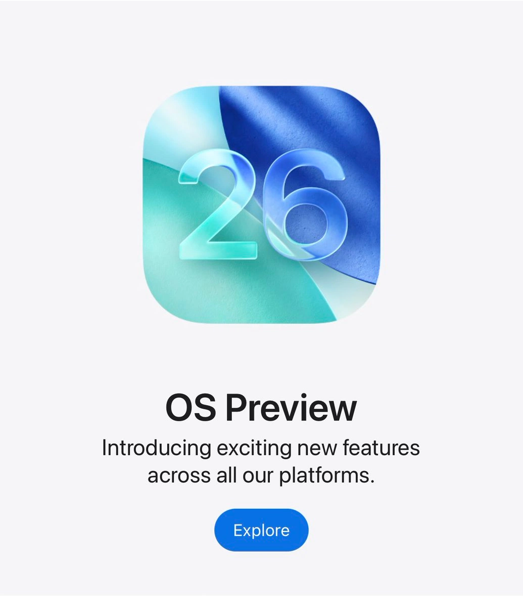

| Field | Value |
|-------|-------|
| Type | TwitterElement (TWITTER) |
| Source | [https://x.com/DylanMcD8/status/1933557203400839396](https://x.com/DylanMcD8/status/1933557203400839396) |
| Tags | graphic design |

---

## 73. Item 73

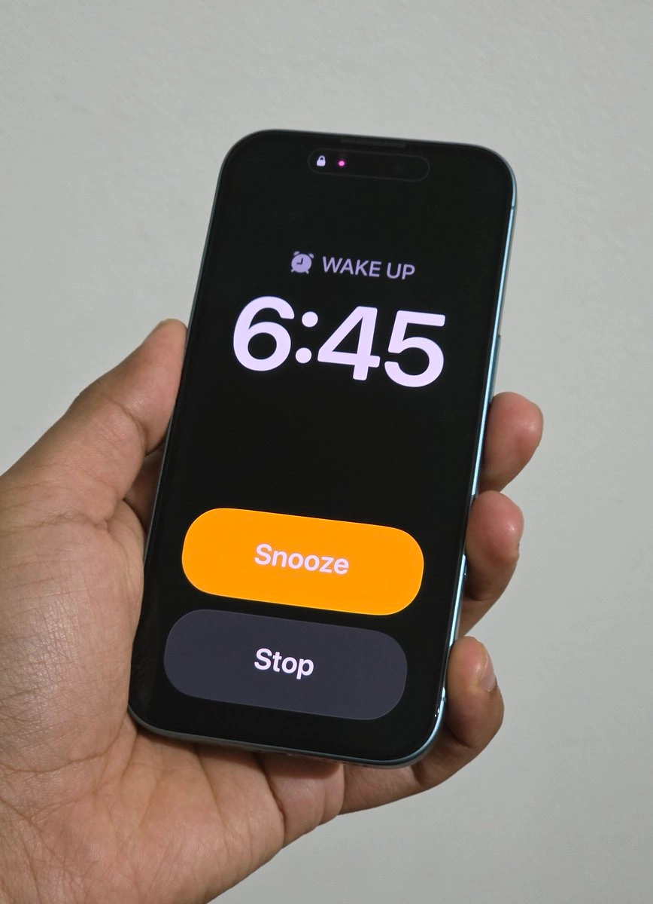

| Field | Value |
|-------|-------|
| Type | TwitterElement (TWITTER) |
| Source | [https://x.com/ShishirShelke1/status/1933010477808050309](https://x.com/ShishirShelke1/status/1933010477808050309) |
| Tags | ios 26 alarm ui |

---

## 74. Item 74

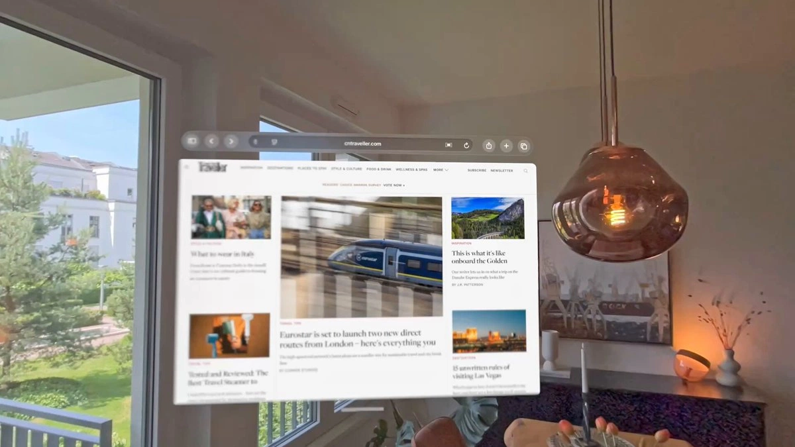

| Field | Value |
|-------|-------|
| Type | TwitterElement (TWITTER) |
| Source | [https://x.com/spatiallyme/status/1933873027285930391](https://x.com/spatiallyme/status/1933873027285930391) |
| Tags | online advertising |

---

## 75. Item 75

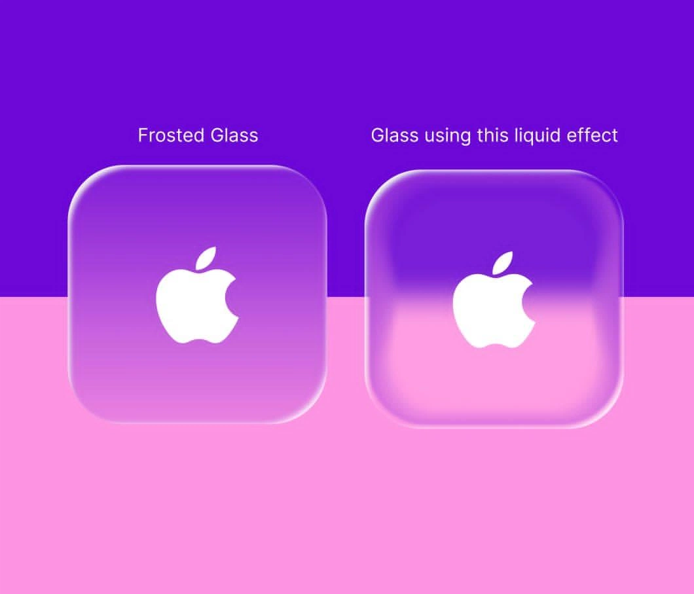

| Field | Value |
|-------|-------|
| Type | TwitterElement (TWITTER) |
| Source | [https://x.com/TECHINFOSOCIALS/status/1933564484666143139](https://x.com/TECHINFOSOCIALS/status/1933564484666143139) |
| Tags | apple |

---

## 76. Item 76

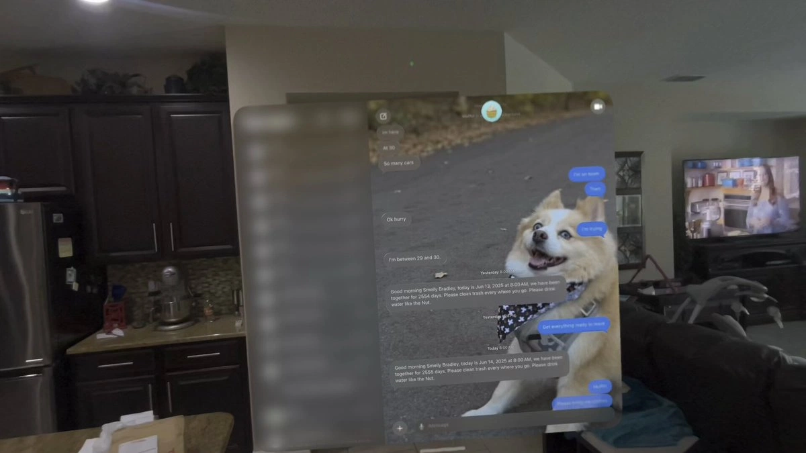

| Field | Value |
|-------|-------|
| Type | TwitterElement (TWITTER) |
| Source | [https://x.com/SadlyItsBradley/status/1933893355227996640](https://x.com/SadlyItsBradley/status/1933893355227996640) |
| Tags | terrier, havanese, samoyed, coton de tulear, siberian husky, white shepherd |

---

## 77. Item 77

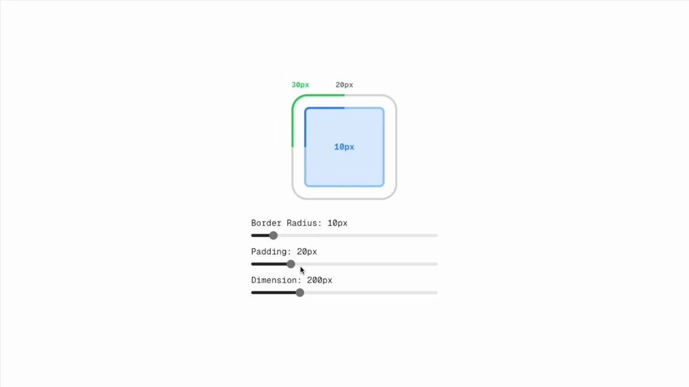

| Field | Value |
|-------|-------|
| Type | TwitterElement (TWITTER) |
| Source | [https://x.com/ivanglpz/status/1933971598807126268](https://x.com/ivanglpz/status/1933971598807126268) |
| Tags | iphone |

---

## 78. Item 78

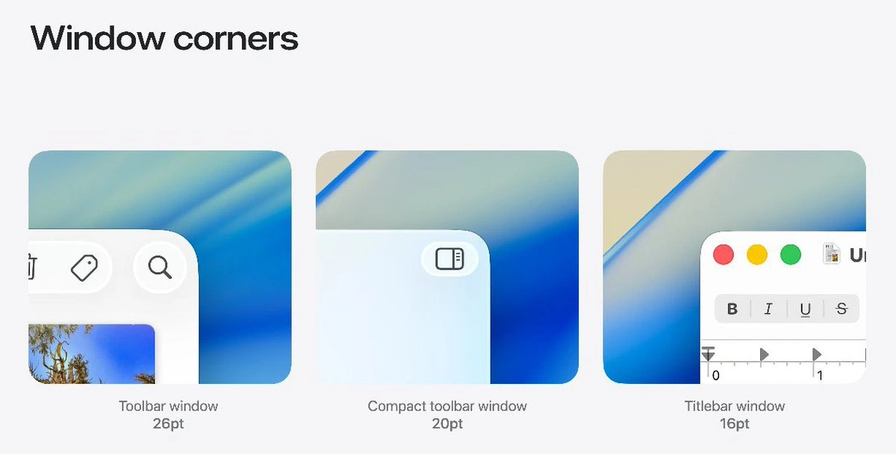

| Field | Value |
|-------|-------|
| Type | TwitterElement (TWITTER) |
| Source | [https://x.com/aleksliving/status/1934050415810679155](https://x.com/aleksliving/status/1934050415810679155) |
| Tags | screenshot, 2021 apple worldwide developers conference, 2023 apple worldwide developers conference, apple |

---

## 79. Item 79

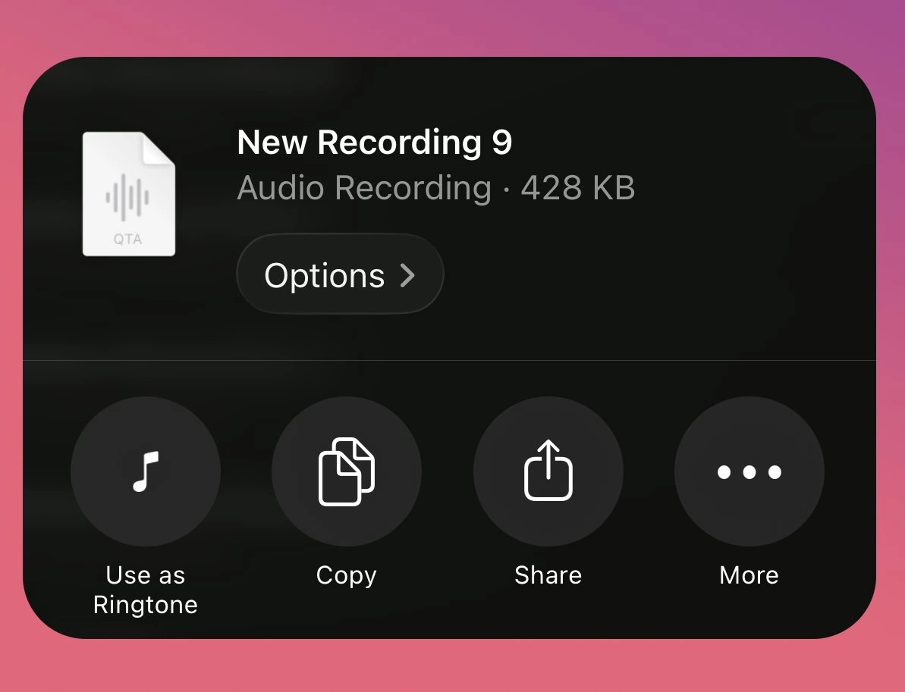

| Field | Value |
|-------|-------|
| Type | TwitterElement (TWITTER) |
| Source | [https://x.com/aaronp613/status/1933948271874957352](https://x.com/aaronp613/status/1933948271874957352) |
| Tags | screenshot, ringtone |

---

## 80. Item 80

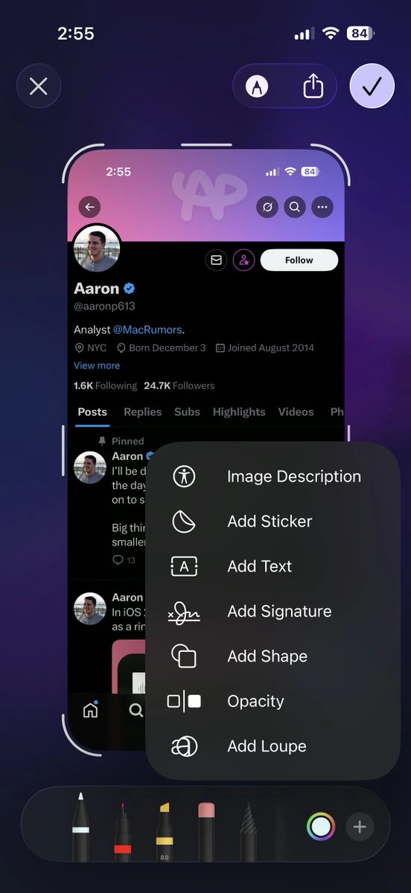

| Field | Value |
|-------|-------|
| Type | TwitterElement (TWITTER) |
| Source | [https://x.com/aaronp613/status/1933970722172666358](https://x.com/aaronp613/status/1933970722172666358) |
| Tags | screenshot |

---

## 81. Item 81

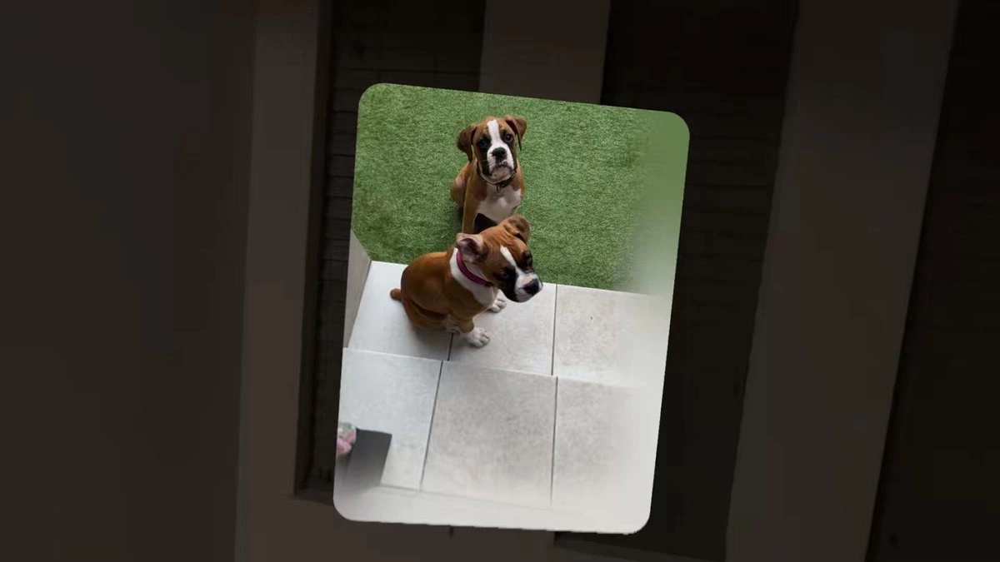

| Field | Value |
|-------|-------|
| Type | TwitterElement (TWITTER) |
| Source | [https://x.com/josh3D_IRL/status/1934096541209505870](https://x.com/josh3D_IRL/status/1934096541209505870) |
| Tags | beagle |

---

## 82. Item 82

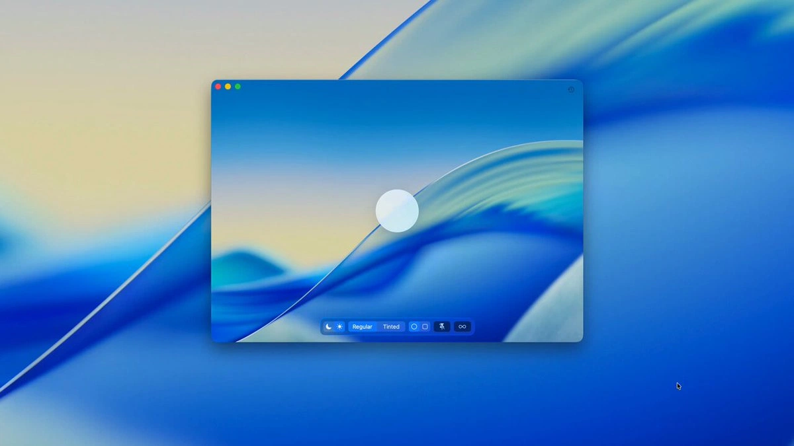

| Field | Value |
|-------|-------|
| Type | TwitterElement (TWITTER) |
| Source | [https://x.com/rafahari/status/1934658757436273069](https://x.com/rafahari/status/1934658757436273069) |
| Tags | graphic design, design |

---

## 83. Item 83

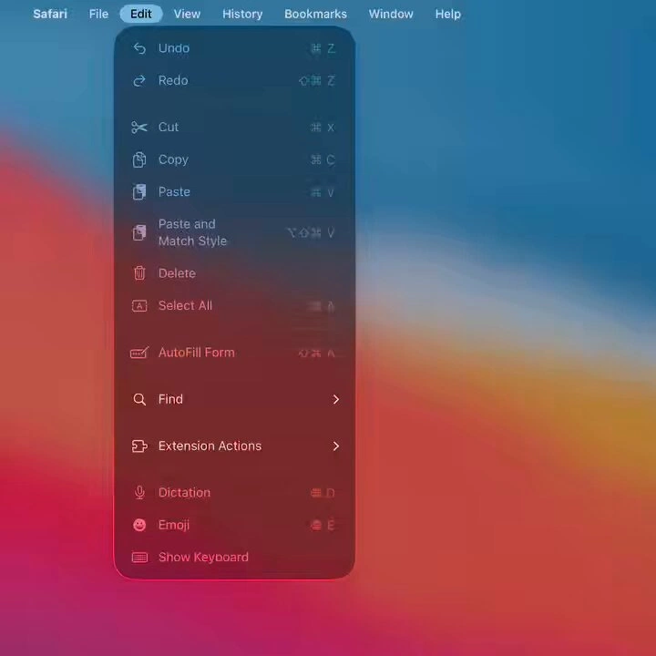

| Field | Value |
|-------|-------|
| Type | TwitterElement (TWITTER) |
| Source | [https://x.com/JohnnyMorlin/status/1934664825994666034](https://x.com/JohnnyMorlin/status/1934664825994666034) |
| Tags | screenshot |

---

## 84. Item 84

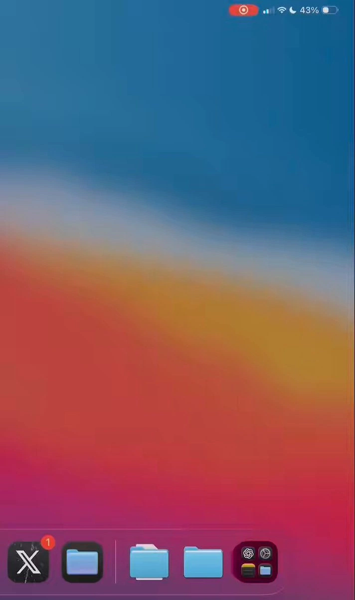

| Field | Value |
|-------|-------|
| Type | TwitterElement (TWITTER) |
| Source | [https://x.com/JohnnyMorlin/status/1934668030572941418](https://x.com/JohnnyMorlin/status/1934668030572941418) |
| Tags | screenshot |

---

## 85. Item 85

| Field | Value |
|-------|-------|
| Type | TwitterElement (TWITTER) |
| Source | [https://x.com/avstorm/status/1934859606360248357](https://x.com/avstorm/status/1934859606360248357) |
| Tags | circle |

---

## 86. Item 86

| Field | Value |
|-------|-------|
| Type | TwitterElement (TWITTER) |
| Source | [https://x.com/jh3yy/status/1936212860893364635?s=12](https://x.com/jh3yy/status/1936212860893364635?s=12) |
| Tags | screenshot |

---
