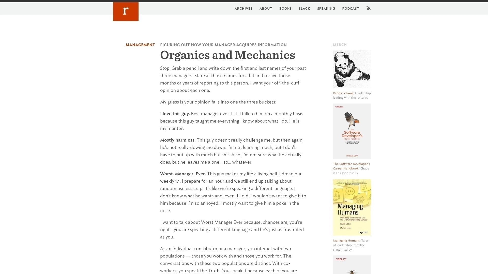
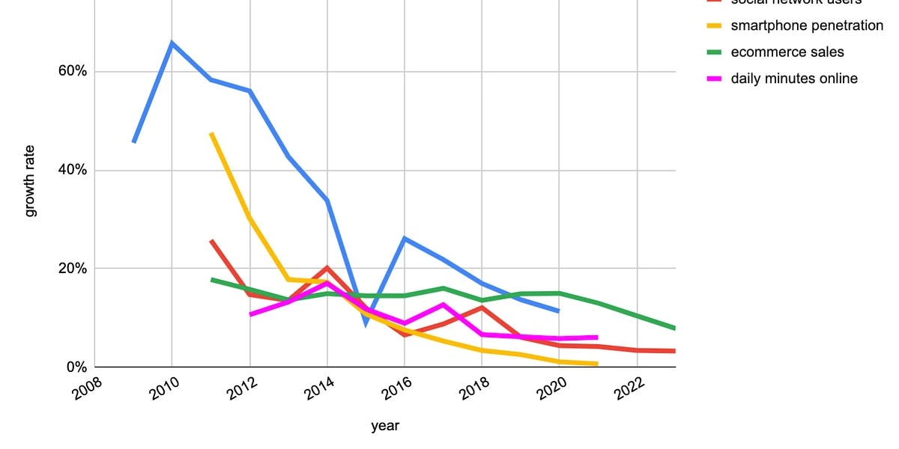
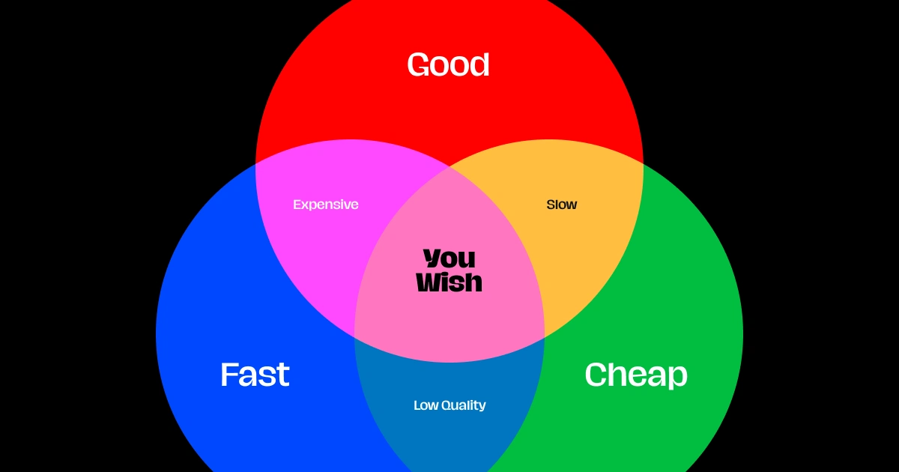
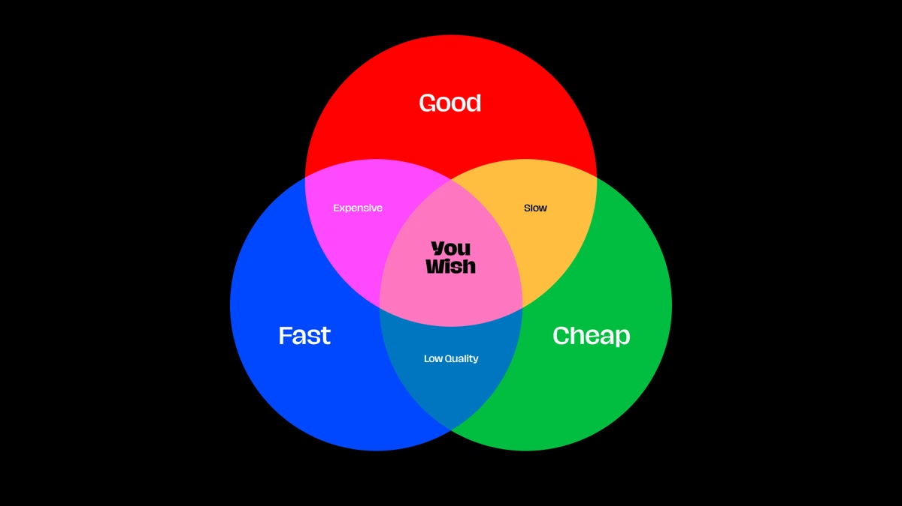
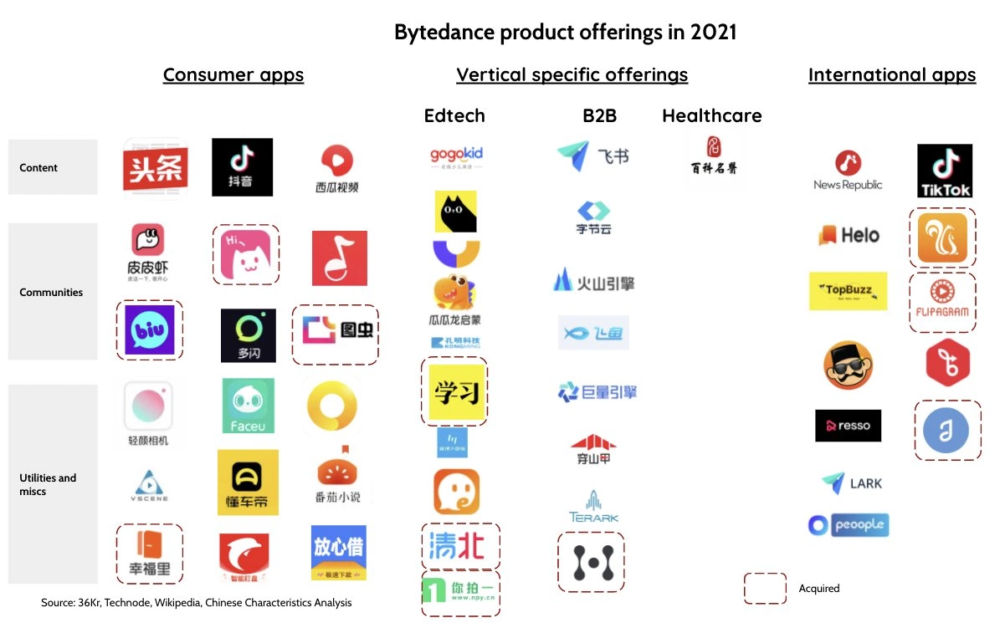
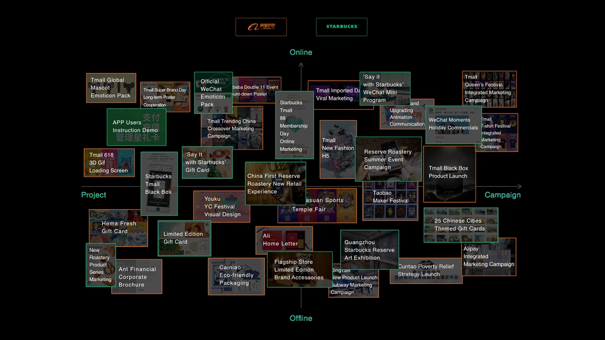
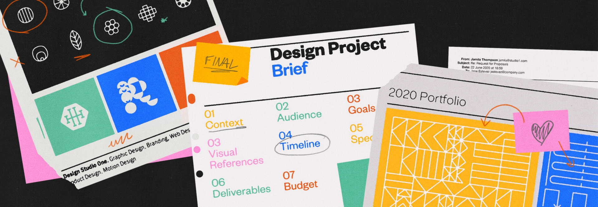
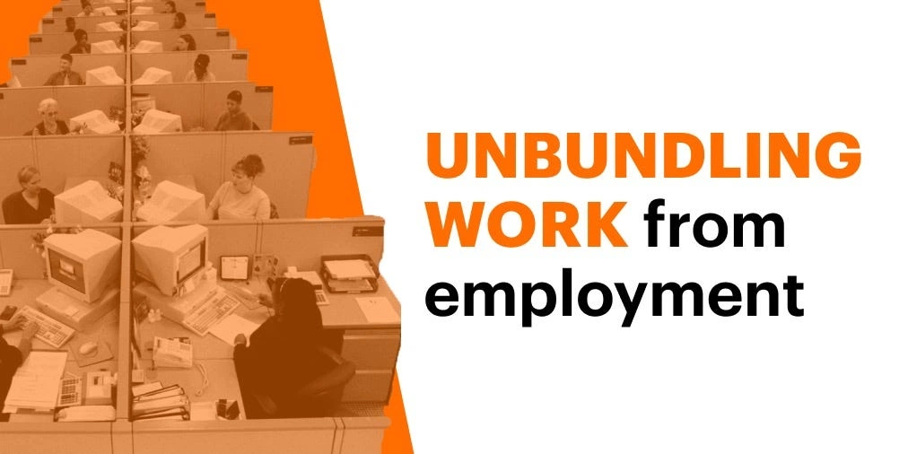
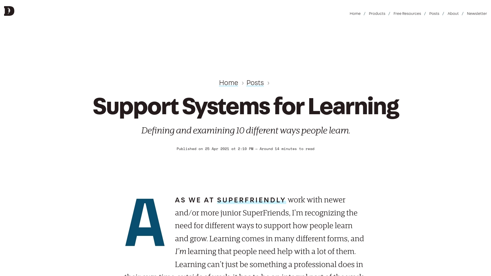

# Business Design

Total items: 34

| Item | Source |
|------|--------|
|  **Organics and Mechanics** | [https://randsinrepose.com/archives/organics-and-mechanics/](https://randsinrepose.com/archives/organics-and-mechanics/) |
|  **Keep Figma weird: Life after an IPO** | [https://sfstandard.com/2025/08/18/inside-figma-ipo-public-sa...](https://sfstandard.com/2025/08/18/inside-figma-ipo-public-san-francisco-tech-office-tour/?taid=68a34ef36e936c0001cf1c66&utm_campaign=trueanthem&utm_medium=social&utm_source=twitter) |
|  **The 12 Key Slides Every Winning Pitch Deck Needs** | [https://pitch.works/post/the-12-key-slides-every-winning-pit...](https://pitch.works/post/the-12-key-slides-every-winning-pitch-deck-needs) |
|  **Leading and building Raycast with Thomas Paul Mann, Co-founder & CEO of Raycast (Changelog Interviews #587)** | [https://changelog.com/podcast/587](https://changelog.com/podcast/587) |
|  **When Tailwinds Vanish** | [https://blog.johnluttig.com/p/when-tailwinds-vanish](https://blog.johnluttig.com/p/when-tailwinds-vanish) |
| **x.com** | [https://x.com/jesseddy/status/1791003392061641047?s=12&t=Kbl...](https://x.com/jesseddy/status/1791003392061641047?s=12&t=Kbl6Kd9qhuaRg9Z7iATEEw) |
|  **“Good, Fast, Cheap: Pick Three?,” an article by Dan Mall** | [https://danmall.com/posts/good-fast-cheap-pick-three/](https://danmall.com/posts/good-fast-cheap-pick-three/) |
|  **circle, colorfulness, font** | [https://twitter.com/danmall/status/1790029746346025380](https://twitter.com/danmall/status/1790029746346025380) |
|  **Conceptzilla – Concepts for $3000 within one week** | [https://www.conceptzilla.com/](https://www.conceptzilla.com/) |
|  **40 trailblazing companies that are beating the West** | [https://restofworld.org/2023/rest-vs-west/](https://restofworld.org/2023/rest-vs-west/) |
| **x.com** | [https://x.com/awilkinson/status/1778914422888812759?s=12&t=K...](https://x.com/awilkinson/status/1778914422888812759?s=12&t=Kbl6Kd9qhuaRg9Z7iATEEw) |
|  **screenshot, font, rectangle** | [https://twitter.com/anurag_pagaria/status/177512512688475375...](https://twitter.com/anurag_pagaria/status/1775125126884753753) |
| **x.com** | [https://x.com/ridder_mark/status/1774338041148067961?s=12&t=...](https://x.com/ridder_mark/status/1774338041148067961?s=12&t=Kbl6Kd9qhuaRg9Z7iATEEw) |
|  **Cherry is Shutting Down + Our Story** | [https://gillian-obrien.medium.com/cherry-is-shutting-down-ou...](https://gillian-obrien.medium.com/cherry-is-shutting-down-our-story-4f4a67a9b1e9) |
|  **What Is Business Design? A Comprehensive Guide - d.MBA** | [https://d.mba/guides/what-is-business-design-guide](https://d.mba/guides/what-is-business-design-guide) |
|  **Tezign, where design meets technology** | [https://www.compasslist.com/insights/Tezign,-where-design-me...](https://www.compasslist.com/insights/Tezign,-where-design-meets-technology) |
|  **Secrets of my success: Nigel Vaz, global CEO of Publicis Sapient** | [https://www.standard.co.uk/business/secrets-of-my-success-ni...](https://www.standard.co.uk/business/secrets-of-my-success-nigel-vaz-chief-executive-of-publicis-sapient-a4207696.html) |
|  **From Communism To Coding: How  Daniel Dines Of $7 Billion UiPath Became The First Bot Billionaire** | [https://www.forbes.com/sites/alexkonrad/2019/09/11/from-comm...](https://www.forbes.com/sites/alexkonrad/2019/09/11/from-communism-to-coding-how--daniel-dines-of-7-billion-uipath-became-the-first-bot-billionaire/?sh=435b2c6e206e) |
|  **How to improve employee communications with long-lasting results** | [https://slack.com/intl/en-in/blog/collaboration/improve-empl...](https://slack.com/intl/en-in/blog/collaboration/improve-employee-communications-with-results) |
|  **Having the guts to say no to bad money | Louder Than Ten** | [https://louderthanten.com/coax/having-the-guts-to-say-no-to-...](https://louderthanten.com/coax/having-the-guts-to-say-no-to-bad-money?utm_source=densediscovery&utm_medium=email&utm_campaign=newsletter-issue-58) |
| **justinjackson.ca** | [https://justinjackson.ca/margin](https://justinjackson.ca/margin) |
|  **A Steve Jobs masterclass (from a decade ago)** | [https://blog.thinkst.com/2020/07/a-steve-jobs-masterclass-fr...](https://blog.thinkst.com/2020/07/a-steve-jobs-masterclass-from-decade-ago.html) |
|  **The Discipline of Innovation** | [https://hbr.org/2002/08/the-discipline-of-innovation](https://hbr.org/2002/08/the-discipline-of-innovation) |
|  **Inside Figma: the product design team’s process | Figma Blog** | [https://www.figma.com/blog/inside-figma-the-product-design-t...](https://www.figma.com/blog/inside-figma-the-product-design-teams-process/) |
|  **A Guide for Working with Design Freelancers and Creative Studios | Designer Fund** | [https://www.designerfund.com/blog/a-guide-for-working-with-d...](https://www.designerfund.com/blog/a-guide-for-working-with-design-freelancers-and-creative-studios/?utm_source=DFUND+MASTER+EMAIL+LIST&utm_campaign=be07981619-EMAIL_CAMPAIGN_2020_07_24_05_20&utm_medium=email&utm_term=0_023e8e3c40-be07981619-108130333) |
|  **Unbundling Work from Employment** | [https://www.lisnewsletter.com/p/unbundling-work-from-employm...](https://www.lisnewsletter.com/p/unbundling-work-from-employment) |
| **Untitled** | — |
|  **Choosing Your North Star Metric** | [https://future.com/north-star-metrics/](https://future.com/north-star-metrics/) |
|  **Design Town** | [https://designtown.nyc/](https://designtown.nyc/) |
| **Untitled** | — |
|  **“Support Systems for Learning,” an essay by Dan Mall** | [https://danmall.com/posts/support-systems-for-learning/](https://danmall.com/posts/support-systems-for-learning/) |
|  **Personio: Unlock the Power of Your People** | [https://www.personio.com/](https://www.personio.com/) |
|  **23 Tactical Company Building Lessons, Learned From Scaling Stripe & Notion** | [https://review.firstround.com/23-tactical-company-building-l...](https://review.firstround.com/23-tactical-company-building-lessons-learned-from-scaling-stripe-and-notion/) |
|  **Why we pay equal salaries, wherever you work - Raycast Blog** | [https://www.raycast.com/blog/why-we-pay-equal-salaries-where...](https://www.raycast.com/blog/why-we-pay-equal-salaries-wherever-you-work) |
