# Calligraphy

> Cosmos.so collection by **arjunphlox** -- 103 items
> Source: https://www.cosmos.so/arjunphlox/calligraphy1

---

### 1. Jackson Alves

**Type:** Article | **Format:** ARTICLE

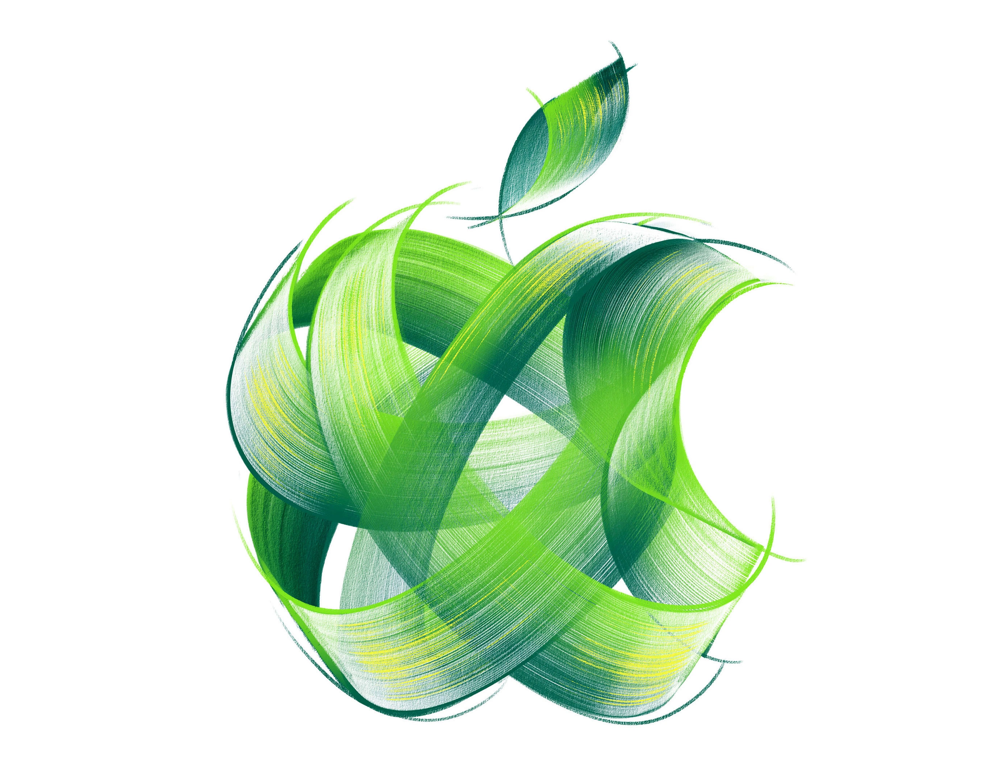

> Artistic logo by <n>Jackson Alves</n> for <n>Apple</n>'s <n>Let Loose</n> event on May 7, 2024.

**Tags:** `apple event let loose`, `ipad air`, `magic keyboard`, `apple`

[Source](https://jacksonalves.com/work)

---

### 2. A customized bottle with the name 'Madhur' created using a <n>Cricut Explore Air 2</n>.

**Type:** Instagram | **Format:** INSTAGRAM

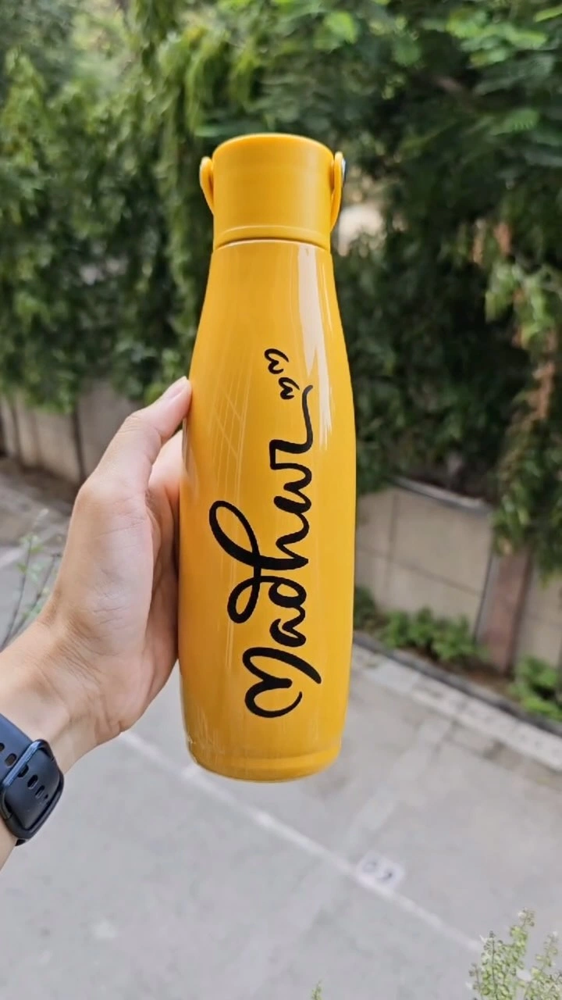

**Tags:** `plastic bottle`

[Source](https://www.instagram.com/reel/C9aFQNNJRVl/?igsh=N3lydmNrZGRvYWox)

---

### 3. <n>Gothic Textura</n> calligraphy by <n>Emmanuel Buron</n> for a workshop with the <n>Westcoast Calligraphy Society</n>.

**Type:** Instagram | **Format:** INSTAGRAM

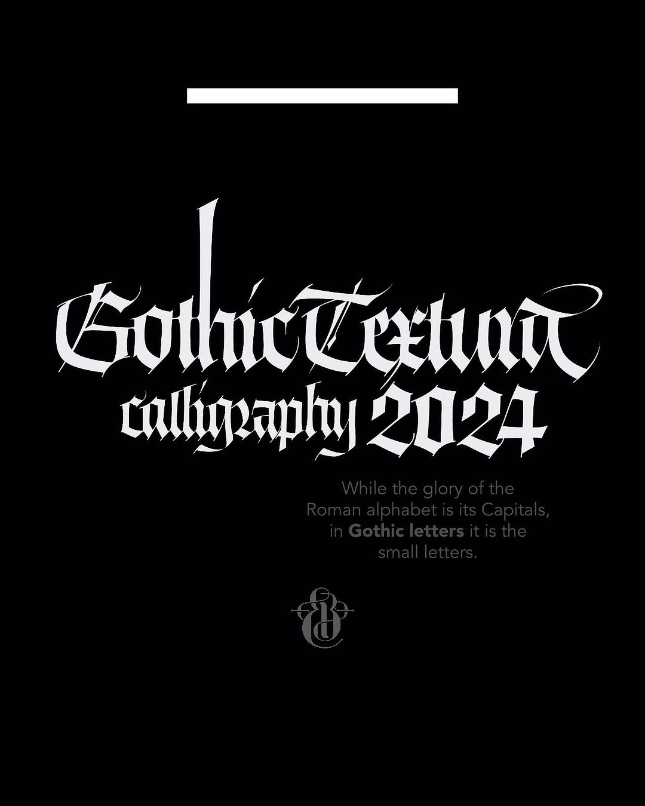

**Tags:** `poster`, `font`

[Source](https://www.instagram.com/p/C5_1g1DyTJS/?igsh=YmNlamRlcGp4NHJo)

---

### 4. A <n>Gothic calligraphy</n> rendering of the letter E.

**Type:** Instagram | **Format:** INSTAGRAM

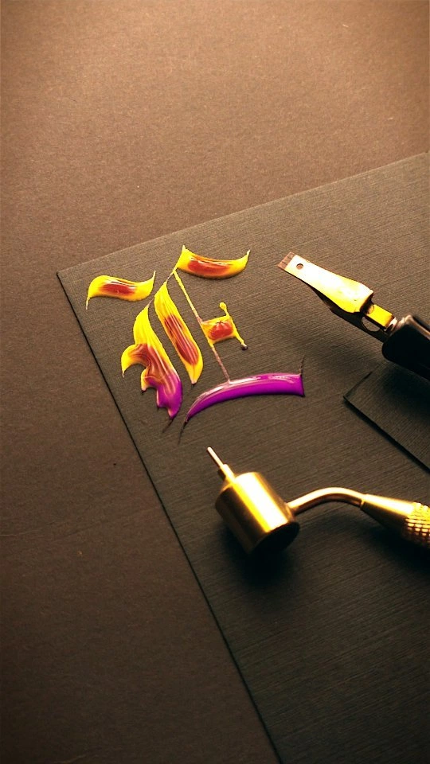

**Tags:** `graphic design`, `gesture`, `material property`, `font`, `automotive design`

[Source](https://www.instagram.com/reel/C6EjKsxgxQC/?igsh=MThhdzl1d3pjbWF5Ng==)

---

### 5. Item 5

**Type:** Instagram | **Format:** INSTAGRAM

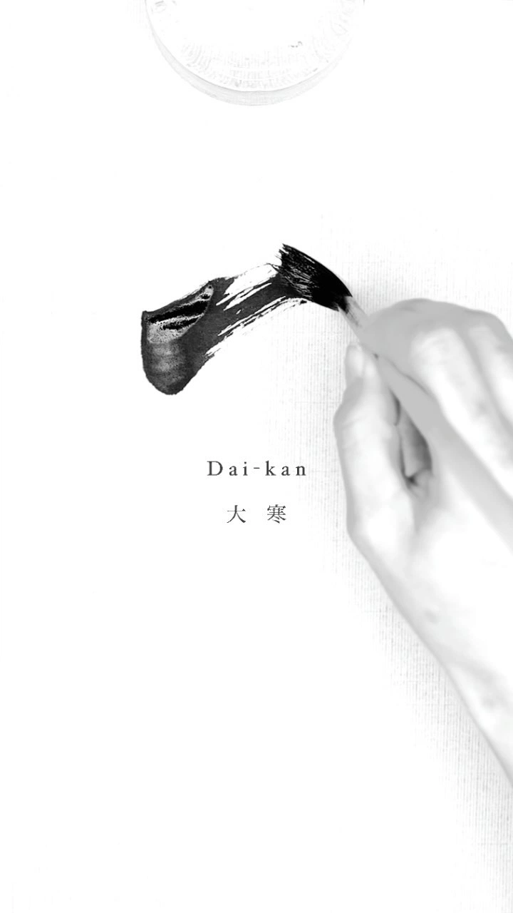

**Tags:** `sketch`, `dahan`, `eyebrow`, `eyelash`, `handwriting`, `jaw`, `gesture`, `nail`, `font`, `thumb`

[Source](https://www.instagram.com/reel/C2XFeKxRFlJ/?igsh=bWRnandrNDd0MzR0)

---

### 6. Item 6

**Type:** Instagram | **Format:** INSTAGRAM

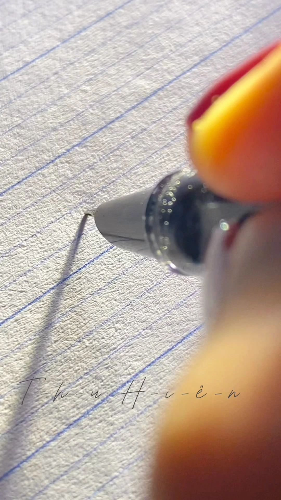

**Tags:** `close up`, `road surface`, `line`, `asphalt`

[Source](https://www.instagram.com/reel/C4t66pCIF9R/?igsh=bTdzbjJtNDU2aTl4)

---

### 7. Item 7

**Type:** Instagram | **Format:** INSTAGRAM

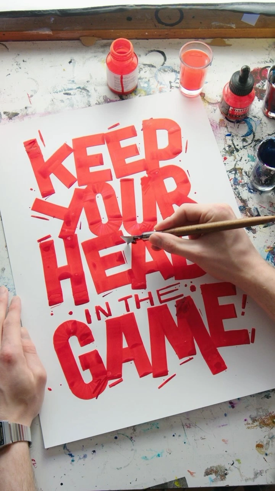

**Tags:** `poster`, `hand`, `tableware`, `gesture`, `finger`, `font`, `red`, `community`, `drinkware`

[Source](https://www.instagram.com/reel/C4LaltLidHF/?igsh=MWt3MnVocW10azhpYw==)

---

### 8. Item 8

**Type:** Twitter | **Format:** TWITTER

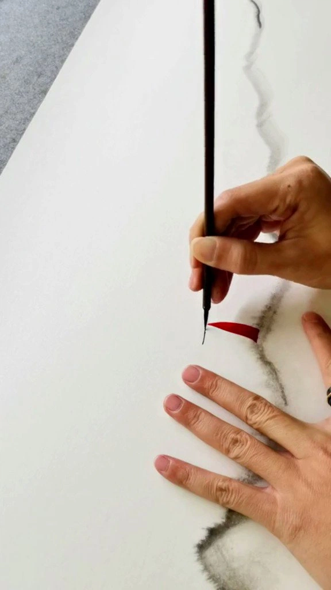

**Tags:** `hand`, `gesture`, `finger`, `nail`, `thumb`, `font`, `cosmetics`, `nail care`, `paint`

[Source](https://twitter.com/Rainmaker1973/status/1699345222088462803)

---

### 9. <n>Fraktur Capitals</n> by artist <n>Paul Antonio</n>, 2015. Ink on Kraft paper.

**Type:** Pinterest | **Format:** PINTEREST

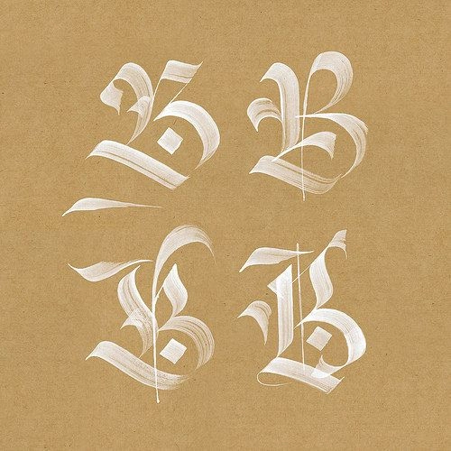

**Tags:** `design`, `calligraphy`, `brown`, `art`, `font`

[Source](https://www.flickr.com/photos/krissserz/15736782288/in/photostream)

---

### 10. Item 10

**Type:** Pinterest | **Format:** PINTEREST

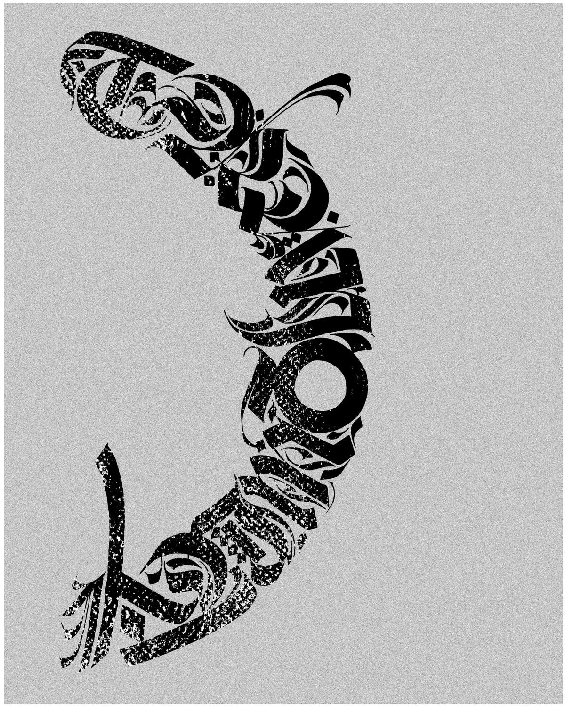

**Tags:** `invertebrate`, `design`, `visual arts`, `calligraphy`, `sketch`, `lettering`, `sleeve`, `gesture`, `font`, `eyelash`, `art`

[Source](http://www.artreproductionservices.com/)

---

### 11. Item 11

**Type:** Pinterest | **Format:** PINTEREST

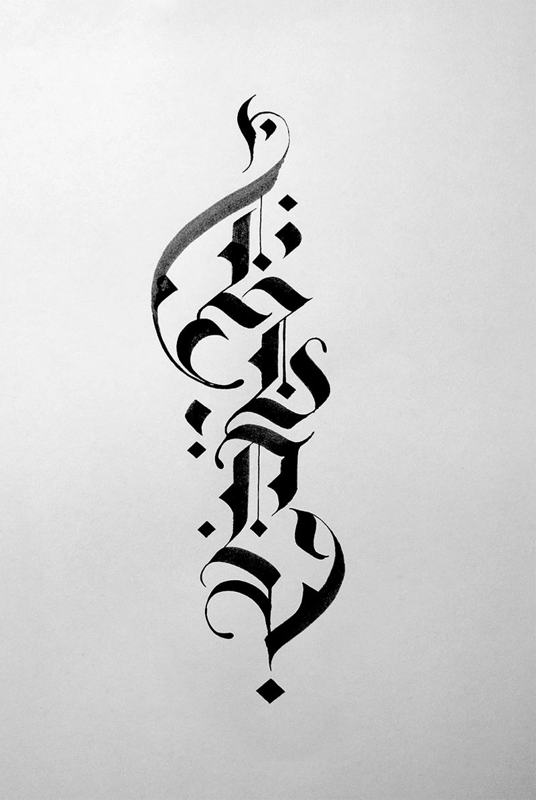

**Tags:** `tattoo thai schrift`, `calligraphy`, `tattoo`, `tattoo design`, `handwriting`, `art`, `font`

[Source](https://www.pinterest.com/pin/101260691613115287/)

---

### 12. <n>Scapegoat calligraphy strokes</n>.

**Type:** Pinterest | **Format:** PINTEREST

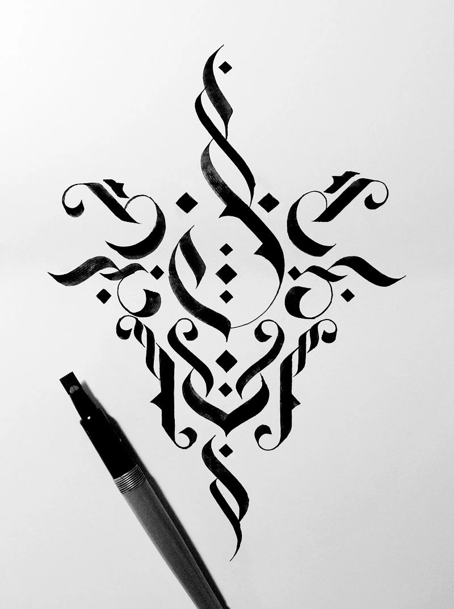

**Tags:** `calligraphy`, `art`, `design`, `handwriting`, `writing implement`, `font`

[Source](https://www.behance.net/gallery/43821121/Scapegoat)

---

### 13. Item 13

**Type:** Pinterest | **Format:** PINTEREST

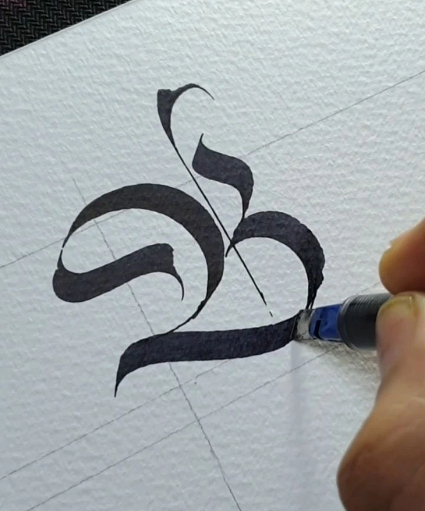

**Tags:** `drawing`, `gesture`, `art`, `font`, `material property`, `thumb`

[Source](https://www.instagram.com/p/CCT9ensHGba/)

---

### 14. The logo for <n>Shekano Tattoo</n> in a <n>Gothic calligraphy</n> style.

**Type:** Pinterest | **Format:** PINTEREST

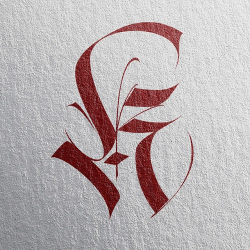

**Tags:** `graphics`, `graffiti`, `font`, `art`, `tints and shades`

[Source](https://misterkams.com/)

---

### 15. Item 15

**Type:** Pinterest | **Format:** PINTEREST

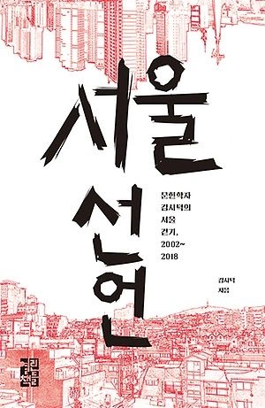

**Tags:** `poster`, `서울 선언`, `line`, `font`, `material property`, `handwriting`

[Source](http://book.interpark.com/product/BookDisplay.do?_method=detail&sc.prdNo=285166951&utm_medium=email&utm_source=interparkbook&utm_campaign=book_20180612_regular_MKT_mail)

---

### 16. Calligraphy by <n>Hassan Massoudy</n>.

**Type:** Pinterest | **Format:** PINTEREST

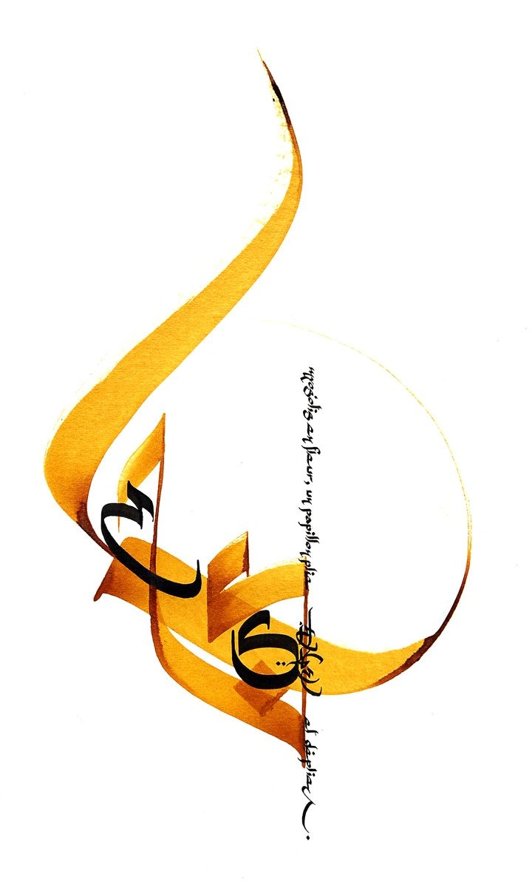

**Tags:** `orange`, `art`, `calligraphy`, `arabic calligraphy`, `font`

[Source](http://kaalam.fr/#!/http://kaalam.fr/calligraphy/paper-calligraphy-calligraphie-papier/)

---

### 17. A calligraphy guide demonstrating the strokes for <n>Bastard Capitals</n>.

**Type:** Pinterest | **Format:** PINTEREST

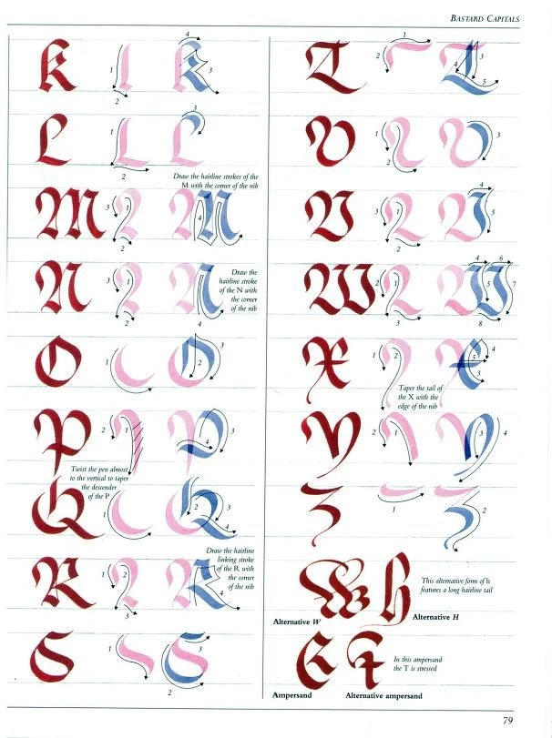

**Tags:** `bastarda calligraphy`, `calligraphy`, `bastarda`, `font`, `rectangle`

[Source](http://archive.org/stream/TheArtOfCalligraphy/ArtOfCalligraphy)

---

### 18. Item 18

**Type:** Pinterest | **Format:** PINTEREST

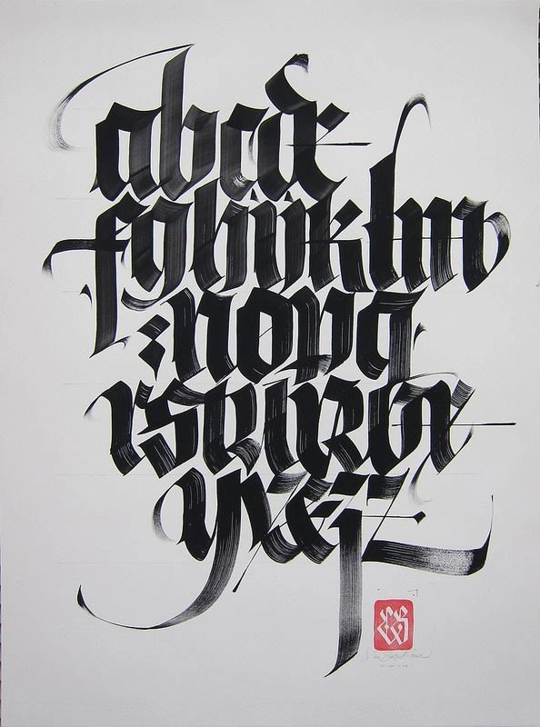

**Tags:** `alphabet lettering`, `blackletter`, `calligraphy`, `visual arts`, `design`, `art`, `font`

[Source](https://www.flickr.com/photos/luca-beanone-barcellona/17024789759/in/contacts/)

---

### 19. Alphabet circle, a 1999 calligraphy piece by <n>Jeremy Slagle</n>.

**Type:** Pinterest | **Format:** PINTEREST

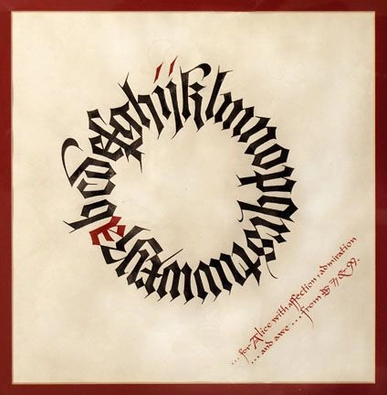

**Tags:** `vector ashi logo`, `vector graphics`, `logo`, `graphics`, `font`, `sketch pad`, `eyelash`, `art`

[Source](http://societyofscribes.org/old/gallery.htm)

---

### 20. Item 20

**Type:** Pinterest | **Format:** PINTEREST

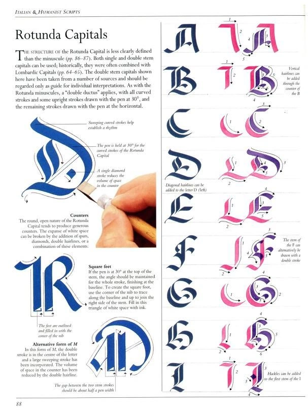

**Tags:** `paper`, `font`, `material property`

[Source](http://www.ebay.com/itm/Vintage-Calligraphy-Lettering-Alphabets-Monogram-Advertising-Writing-50-Books-CD-/261177518488?pt=Antiquarian_Books_UK&hash=item3ccf64a998)

---

### 21. A guide to drawing <n>Rotunda Capitals</n>.

**Type:** Pinterest | **Format:** PINTEREST

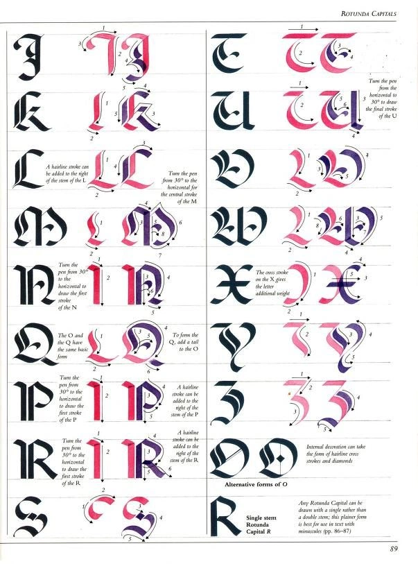

**Tags:** `design`, `font`

[Source](http://archive.org/stream/TheArtOfCalligraphy/ArtOfCalligraphy)

---

### 22. Item 22

**Type:** Pinterest | **Format:** PINTEREST

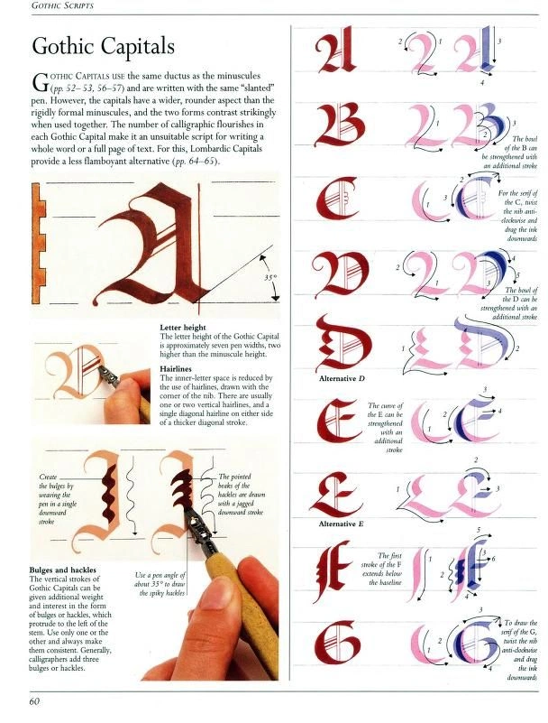

**Tags:** `paper`, `product`, `font`, `line`, `material property`

[Source](http://archive.org/stream/TheArtOfCalligraphy/ArtOfCalligraphy)

---

### 23. A tutorial on writing lowercase letters in the <n>Fraktur</n> calligraphic script.

**Type:** Pinterest | **Format:** PINTEREST

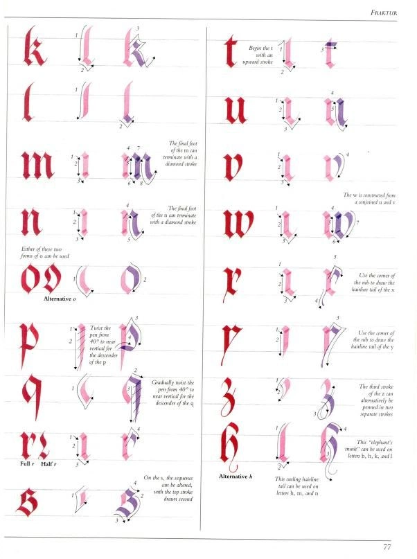

**Tags:** `design`, `rectangle`, `font`, `magenta`, `parallel`

[Source](http://archive.org/stream/TheArtOfCalligraphy/ArtOfCalligraphy)

---

### 24. A comparison of writing pens, including models by <n>Sakura</n>, <n>Uniball</n>, <n>Staedtler</n>, <n>Sharpie</n>, an...

**Type:** Pinterest | **Format:** PINTEREST

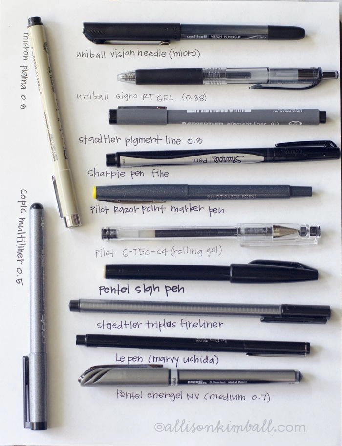

> A comparison of writing pens, including models by <n>Sakura</n>, <n>Uniball</n>, <n>Staedtler</n>, <n>Sharpie</n>, and <n>Pentel</n>.

**Tags:** `melhores canetas para escrever`, `ballpoint pen`, `gel pen`, `pen`, `rollerball pen`, `eye`, `writing implement`, `writing instrument accessory`, `office supplies`, `font`, `office instrument`, `material property`

[Source](http://www.allisonkimball.com/my_weblog/2013/06/sketchnotes-and-another-pen-review.html)

---

### 25. Item 25

**Type:** Pinterest | **Format:** PINTEREST

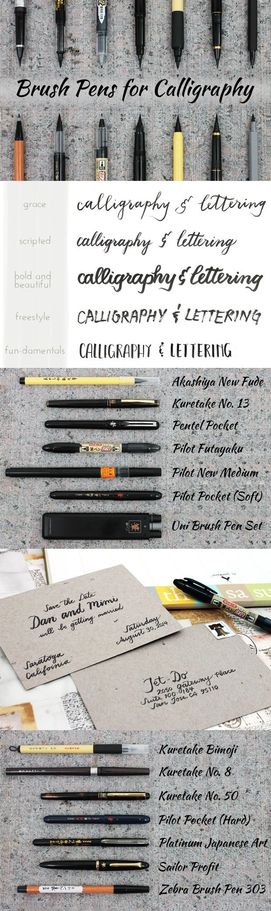

**Tags:** `material`, `office supplies`, `font`, `writing implement`, `pen`, `material property`

[Source](http://www.jetpens.com/blog/guide-to-choosing-a-brush-pen-for-calligraphy/pt/621?utm_source=JetPens+Newsletter&utm_campaign=c0ff1622ad-20140416_enews&utm_medium=email&utm_term=0_e853d77ed9-c0ff1622ad-294530901&mc_cid=c0ff1622ad&mc_eid=31ede95428)

---

### 26. Item 26

**Type:** Pinterest | **Format:** PINTEREST

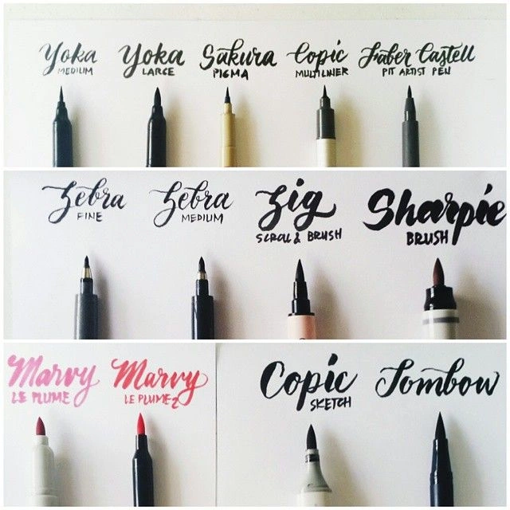

**Tags:** `things you need for calligraphy`, `calligraphy`, `hand lettering`, `photograph`, `white`, `product`, `black`, `fashion`, `yellow`, `font`, `cosmetics`

[Source](http://calligrafikas.tumblr.com/)

---

### 27. Item 27

**Type:** Pinterest | **Format:** PINTEREST

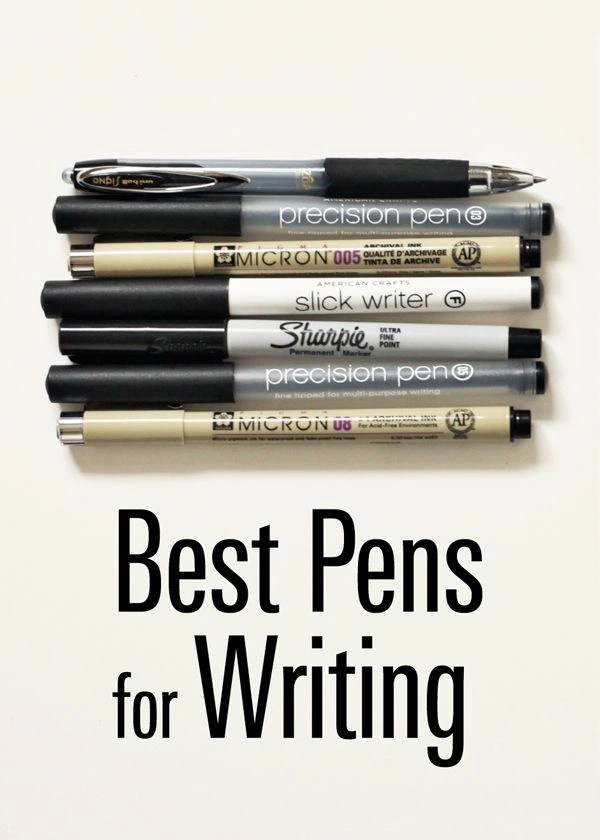

**Tags:** `good pens for writing`, `pen`, `wood`, `font`, `rectangle`

[Source](http://thehandcraftedstory.com/best-pens-for-writing/)

---

### 28. Item 28

**Type:** Pinterest | **Format:** PINTEREST

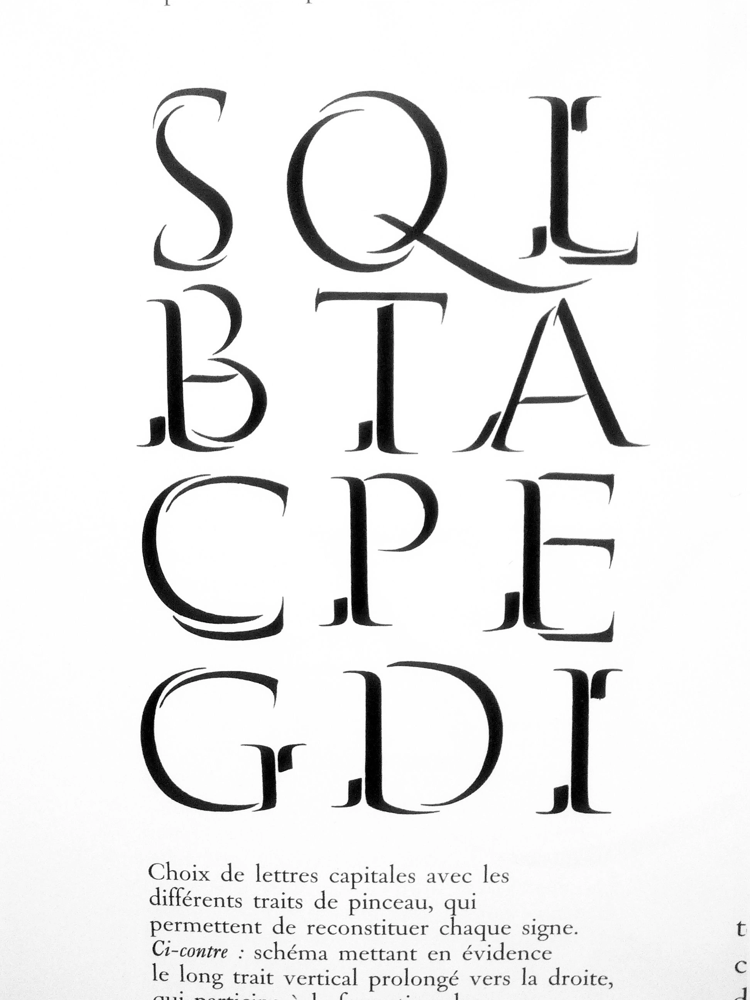

**Tags:** `design`, `the origin of the serif`, `calligraphy`, `font`

[Source](https://www.google.ru/search?q=edward+katich&newwindow=1&espv=2&biw=1366&bih=643&source=lnms&tbm=isch&sa=X&ei=2JVTVJT0NsLUOYjUgLAN&ved=0CAYQ_AUoAQ#newwindow=1&tbm=isch&q=edward+catich&facrc=_&imgdii=_&imgrc=z3PKKAuHX_BQLM%253A;CJ0lvrsAK968_M;http%253A%252F%252Fzigzaganimal.be%252Fwp-content%252Fuploads%252F2014%252F02%252FIMG_20130508_121822.jpg;http%253A%252F%252Fzigzaganimal.be%252F%253Fp%253D4318;1944;2592)

---

### 29. Item 29

**Type:** Pinterest | **Format:** PINTEREST

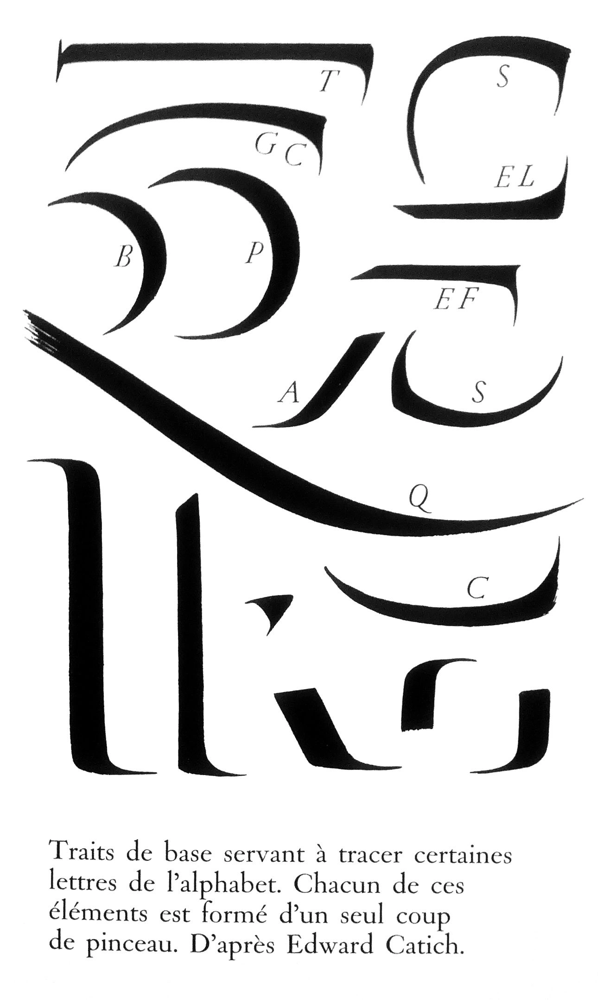

**Tags:** `edward catich handwriting`, `the origin of the serif`, `calligraphy`, `typography`, `font`

[Source](https://www.pinterest.com/pin/101260691601299314/)

---

### 30. Item 30

**Type:** Pinterest | **Format:** PINTEREST

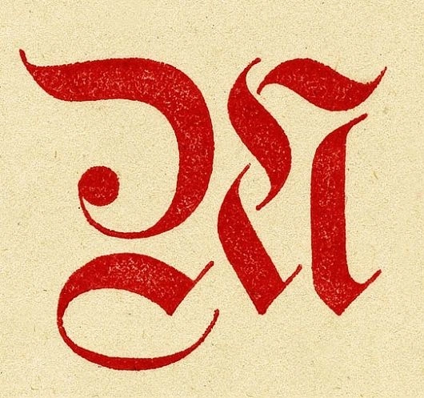

**Tags:** `design`, `font`, `rectangle`

[Source](http://designspiration.net/image/428485820285/?utm_source=feedburner&utm_medium=feed&utm_campaign=Feed:+dspn+(Designspiration+-+Popular))

---

### 31. Item 31

**Type:** Pinterest | **Format:** PINTEREST

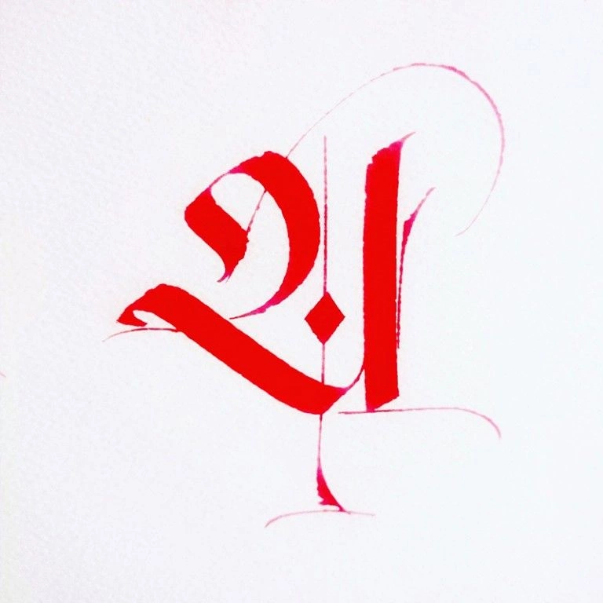

**Tags:** `fraktur u`, `birds`, `gesture`, `slope`, `font`

[Source](http://calligraphymasters.com/fraktur-capitals-calligraphy-alphabet-by-igor-sturion/)

---

### 32. Title calligraphy for the 2015 <n>NHK</n> drama <n>Burning Flower</n>, created by <n>Soun Takeda</n>.

**Type:** Pinterest | **Format:** PINTEREST

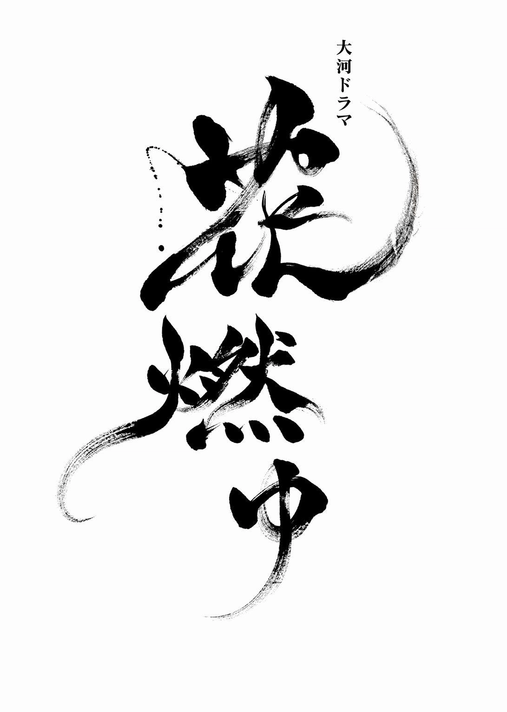

**Tags:** `花 燃 ゆ`, `blu-ray disc`, `花燃ゆ: 前編`, `nhk`, `花燃ゆ: 後編`, `genzui kusaka`, `taiga drama`, `flower`, `art`, `font`

[Source](http://www.yuda-onsen.jp/kitsune/nhk%E5%A4%A7%E6%B2%B3%E3%83%89%E3%83%A9%E3%83%9E%E3%80%8C%E8%8A%B1%E7%87%83%E3%82%86%E3%80%8D%E3%83%91%E3%83%8D%E3%83%AB%E4%BC%81%E7%94%BB%E5%B1%95-3/)

---

### 33. Item 33

**Type:** Pinterest | **Format:** PINTEREST

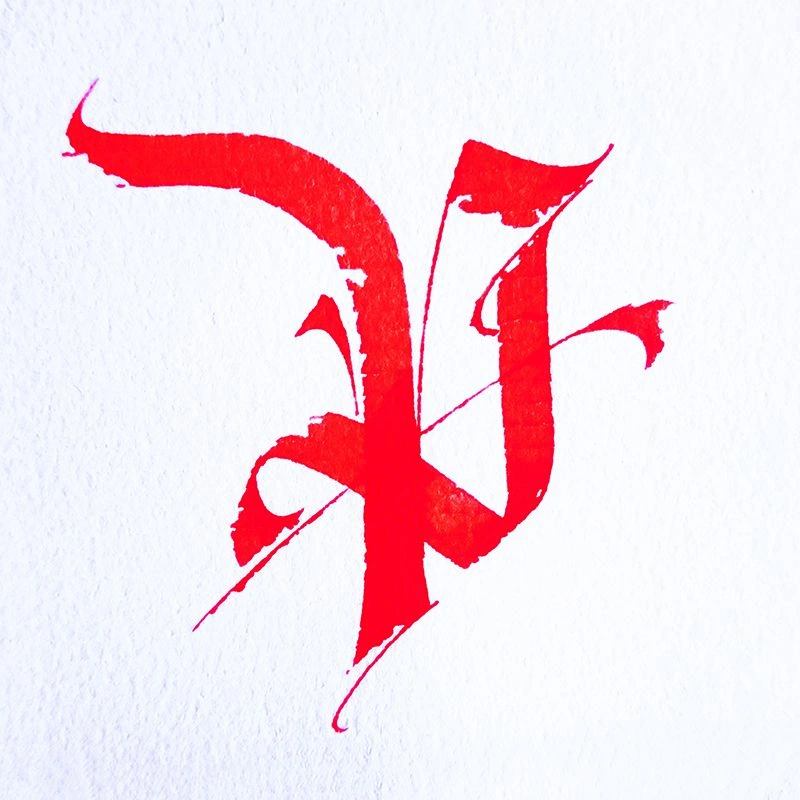

**Tags:** `graphics`, `art`, `red`, `font`

[Source](http://calligraphymasters.com/fraktur-capitals-calligraphy-alphabet-by-igor-sturion/)

---

### 34. Item 34

**Type:** Pinterest | **Format:** PINTEREST

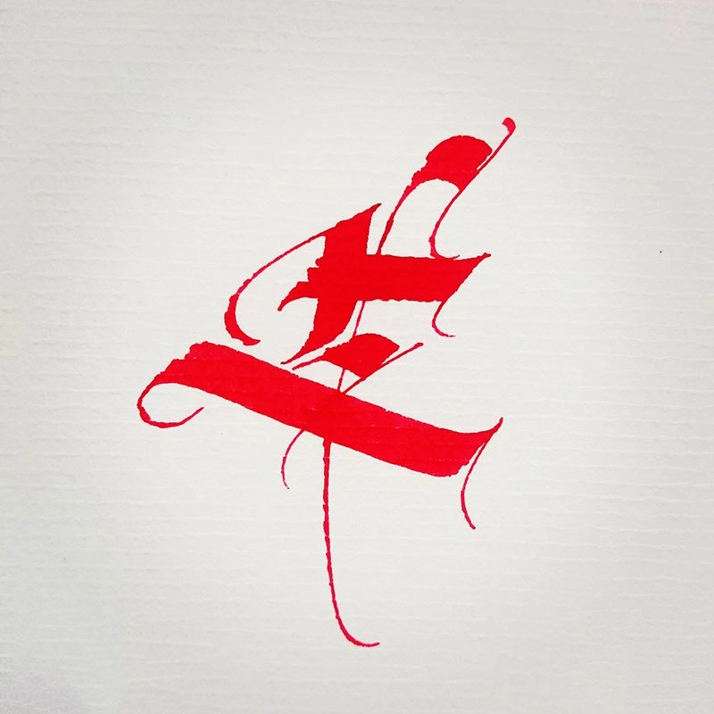

**Tags:** `art`, `fraktur latin`, `graphic design`, `design`, `gesture`, `font`, `sleeve`, `slope`

[Source](http://calligraphymasters.com/fraktur-capitals-calligraphy-alphabet-by-igor-sturion/)

---

### 35. A <n>Fraktur</n> capital 'H' by calligrapher <n>Igor Sturion</n>.

**Type:** Pinterest | **Format:** PINTEREST

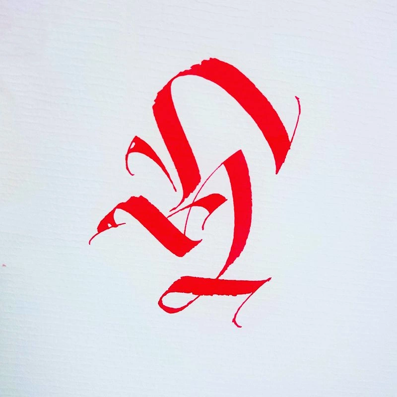

**Tags:** `graphics`, `gesture`, `art`, `font`

[Source](http://calligraphymasters.com/fraktur-capitals-calligraphy-alphabet-by-igor-sturion/)

---

### 36. Item 36

**Type:** Pinterest | **Format:** PINTEREST

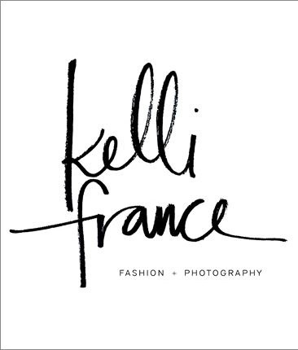

**Tags:** `handwritten`, `handwriting`, `rectangle`, `font`, `art`, `slope`

[Source](http://kellifrance.com/category/fashion-friday/)

---

### 37. Item 37

**Type:** Pinterest | **Format:** PINTEREST

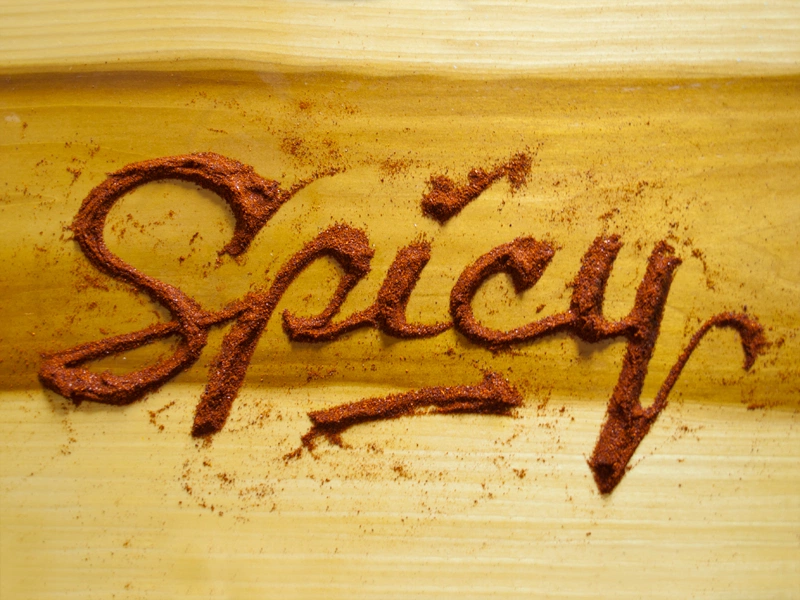

**Tags:** `type made out of food`, `typography`, `brown`, `handwriting`, `amber`, `wood`, `font`, `paint`, `tints and shades`, `art`

[Source](http://dribbble.com/shots/1075207-Spicy-Chili)

---

### 38. Gothic alphabet calligraphy by Milan-based artist <n>Luca Barcellona</n>.

**Type:** Pinterest | **Format:** PINTEREST

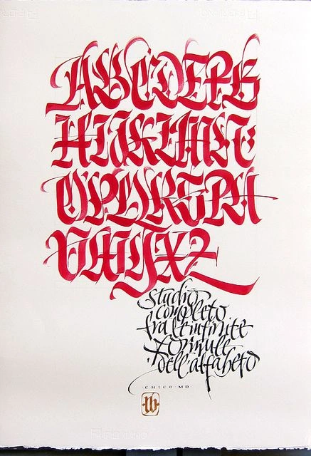

**Tags:** `graffiti letters calligraphy`, `graffiti`, `calligraphy`, `lettering`, `hand lettering`, `art`, `font`, `handwriting`

[Source](http://www.flickr.com/photos/luca-beanone-barcellona/6634099793/in/photostream)

---

### 39. Item 39

**Type:** Pinterest | **Format:** PINTEREST

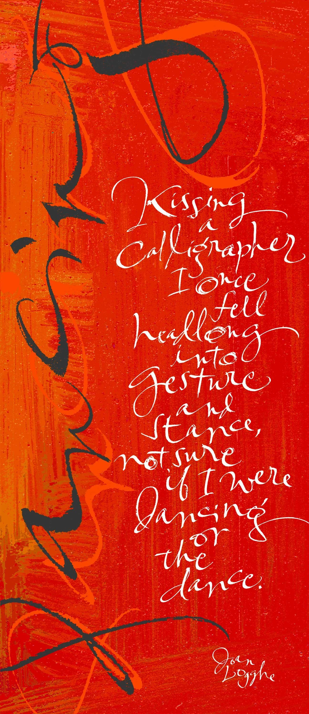

**Tags:** `calligraphy`, `visual arts`, `handwriting`, `font`, `liquid`, `red`, `art`, `rectangle`, `tints and shades`

[Source](http://chicagocalligraphy.org/wp-content/uploads/2012/05/photo-14.jpg)

---

### 40. Item 40

**Type:** Pinterest | **Format:** PINTEREST

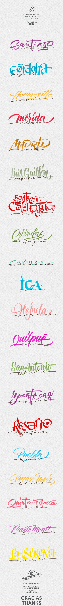

**Tags:** `design`, `font`, `aqua`, `poster`, `liquid`

[Source](https://www.behance.net/gallery/23600581/Viajar-con-Letras-Travel-with-letters)

---

### 41. Item 41

**Type:** Pinterest | **Format:** PINTEREST

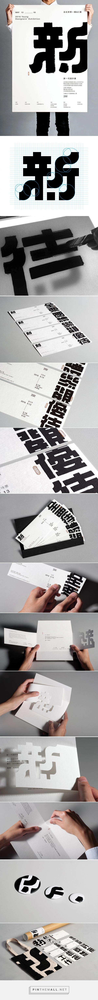

**Tags:** `design`, `black`, `sleeve`, `font`, `line`, `publication`

[Source](https://pinthemall.net/pin/57186de6b8bb7/)

---

### 42. Item 42

**Type:** Pinterest | **Format:** PINTEREST

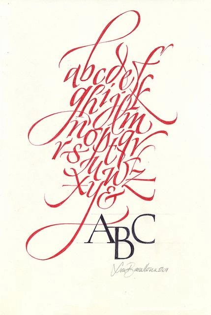

**Tags:** `calligraphy`, `art`, `font`

[Source](http://www.flickr.com/photos/luca-beanone-barcellona/5859309651/in/set-72157627020568080/)

---

### 43. Item 43

**Type:** Pinterest | **Format:** PINTEREST

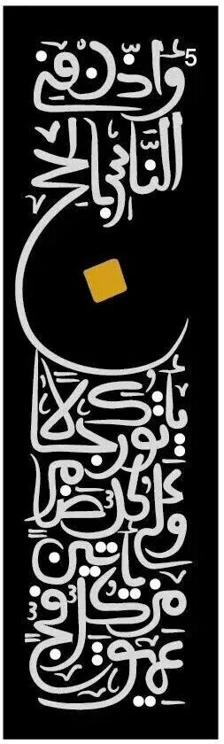

**Tags:** `واذن في الناس بالحج ياتوك رجالا وعلى كل ضامر ياتين من كل فج عميق`, `font`, `art`

[Source](https://www.pinterest.com/pin/101260691600139292/)

---

### 44. Item 44

**Type:** Pinterest | **Format:** PINTEREST

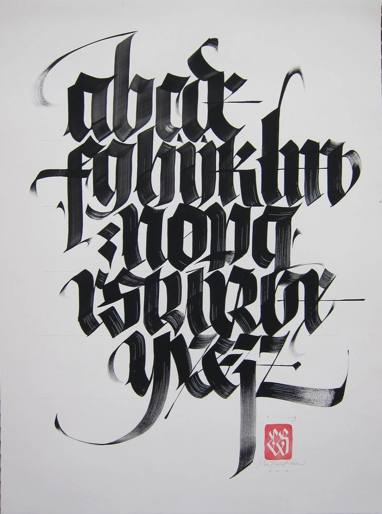

**Tags:** `black letter alphabet`, `blackletter`, `alphabet`, `typography`, `letter`, `art`, `font`

[Source](https://www.flickr.com/photos/luca-beanone-barcellona/17024789759/sizes/l)

---

### 45. Calligraphy piece <n>Fraktur vs. Textura</n> by artist <n>krissserz</n>, based on an alphabet by <n>Art Core</n>.

**Type:** Pinterest | **Format:** PINTEREST

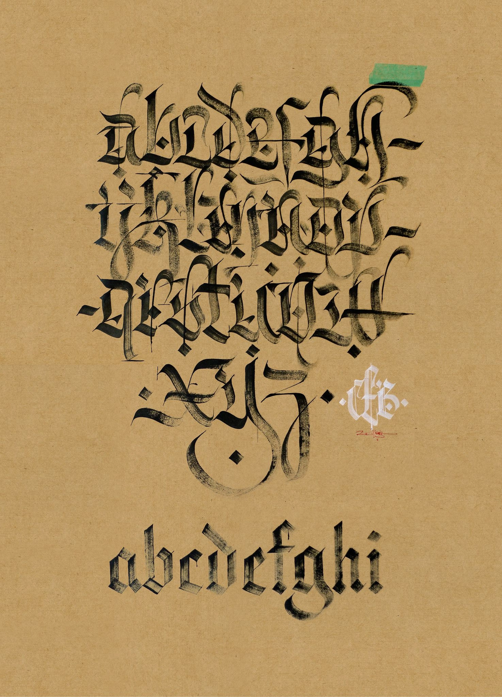

**Tags:** `fraktur alphabet`, `calligraphy`, `fraktur latin`, `alphabet`, `art`, `font`

[Source](https://www.flickr.com/photos/krissserz/16884849742/)

---

### 46. Item 46

**Type:** Pinterest | **Format:** PINTEREST

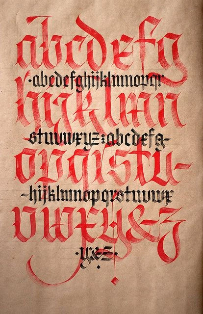

**Tags:** `calligraphy`, `fraktur latin`, `blackletter`, `font`, `happy`, `art`, `poster`

[Source](https://www.flickr.com/photos/krissserz/16806187857/in/photostream/)

---

### 47. Calligraphic work <n>Love beyond words…</n> (2013) by <n>Wissam Shawkat</n>, based on lines by mystic <n>al-Hallaj</n>.

**Type:** Pinterest | **Format:** PINTEREST

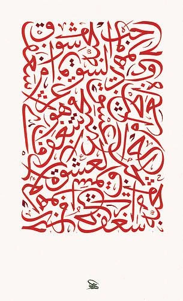

**Tags:** `arabic calligraphy fonts`, `calligraphy`, `arabic calligraphy`, `rectangle`, `font`, `art`, `pattern`

[Source](http://www.khtt.net/page/25738/en)

---

### 48. A work of <n>Islamic calligraphy</n> in the <n>Karalama</n> style, depicting verse 4 of Surah Al-Balad.

**Type:** Pinterest | **Format:** PINTEREST

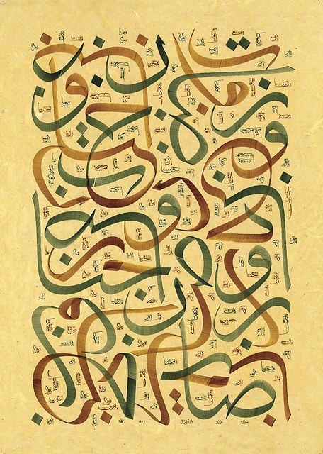

**Tags:** `calligraphy`, `islamic calligraphy`, `islamic art`, `arabic calligraphy`, `art`, `font`, `rectangle`, `pattern`

[Source](http://www.flickr.com/photos/ottomancalligraphy/4584093128/in/photostream)

---

### 49. Arabic calligraphy by artist <n>Sami Al-Gharbi</n>.

**Type:** Pinterest | **Format:** PINTEREST

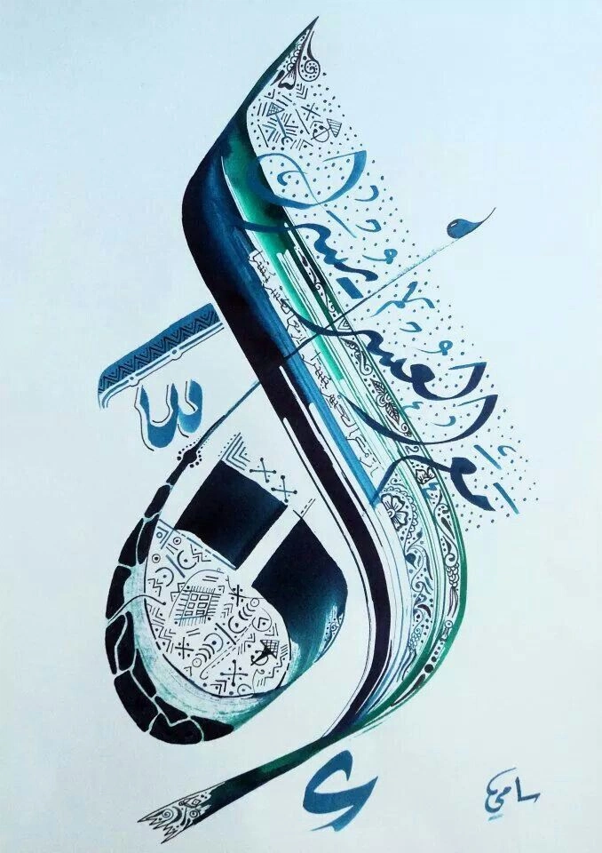

**Tags:** `ان مع العسر يسرا calligraphy`, `calligraphy`, `islamic art`, `arabic calligraphy`, `drinkware`, `art`, `font`, `body jewelry`, `liquid`, `electric blue`

[Source](https://www.pinterest.com/pin/101260691600119918/)

---

### 50. Calligraphic artwork titled <n>MANTRA I | OM SHANTI SHANTI SHANTI</n>.

**Type:** Pinterest | **Format:** PINTEREST

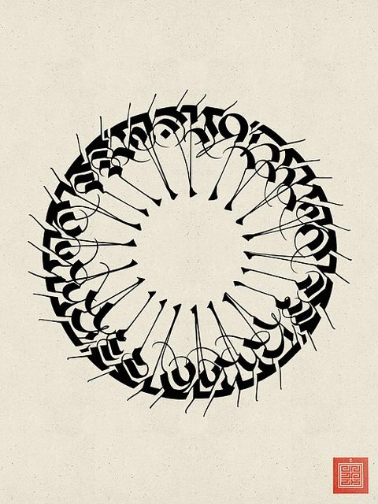

**Tags:** `circle`, `brillo box`, `font`, `art`, `pattern`

[Source](http://www.flickr.com/photos/cryptikmovement/6437909111/in/photostream/)

---

### 51. Item 51

**Type:** Pinterest | **Format:** PINTEREST

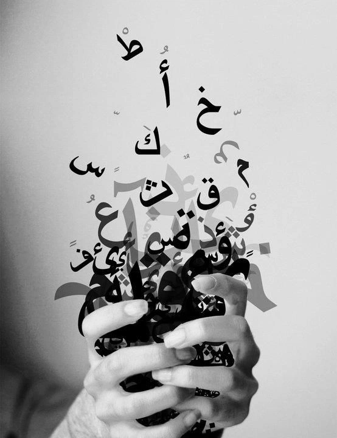

**Tags:** `arabic letters`, `arabic language`, `arabic alphabet`, `hand`, `liquid`, `plant`, `fluid`, `gesture`, `drinkware`, `font`, `art`

[Source](https://www.pinterest.com/pin/101260691600119637/)

---

### 52. A stock vector pattern of <n>Arabic letters with no particular meaning</n>.

**Type:** Pinterest | **Format:** PINTEREST

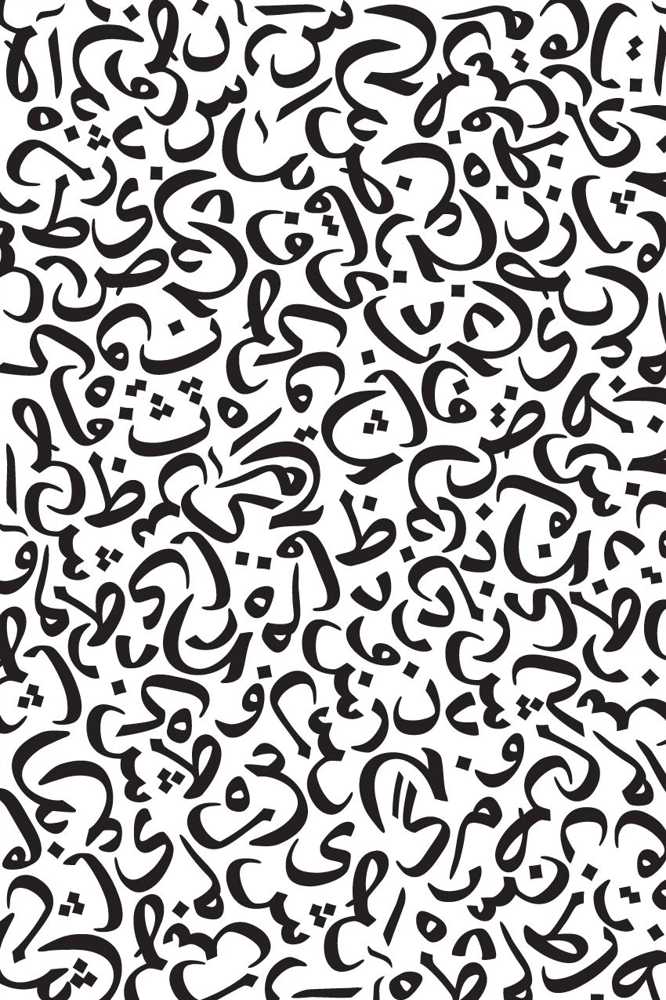

**Tags:** `arabic alphabet pattern`, `arabic alphabet`, `alphabet`, `arabic language`, `art`, `font`, `symmetry`, `pattern`

[Source](http://geotypografika.com/2009/10/20/let-it-snow/)

---

### 53. Item 53

**Type:** Pinterest | **Format:** PINTEREST

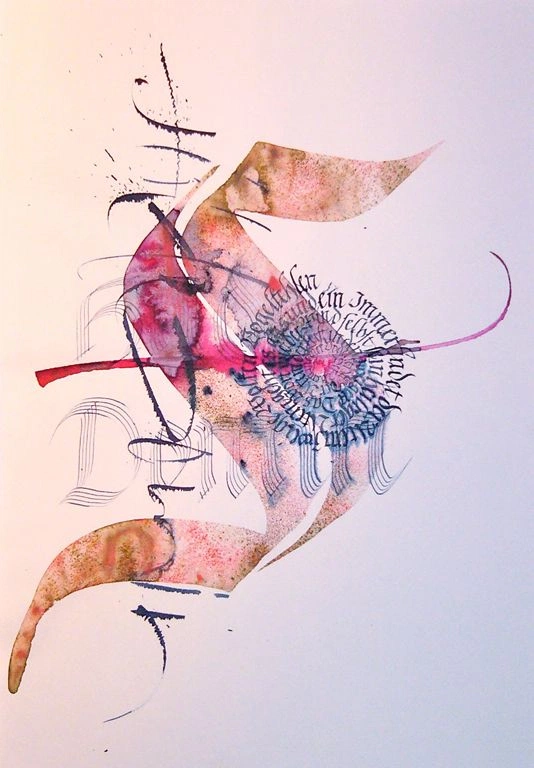

**Tags:** `illustration`, `calligraphy`, `visual arts`, `drawing`, `art`, `design`, `paint`, `gesture`, `creative arts`, `painting`, `twig`

[Source](http://www.schreibwerkstatt-klingspor.de/index.php/kursangebote/programm-a-anmeldung)

---

### 54. Item 54

**Type:** Pinterest | **Format:** PINTEREST

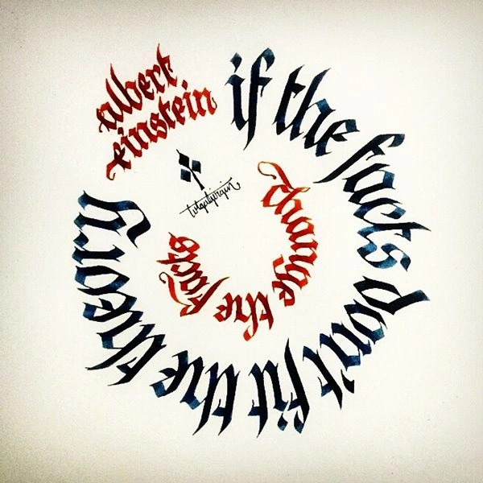

**Tags:** `art`, `gesture`, `font`

[Source](https://www.behance.net/gallery/18282699/Some-Circular-Lettering-with-Parallelpen-Part-1)

---

### 55. Item 55

**Type:** Pinterest | **Format:** PINTEREST

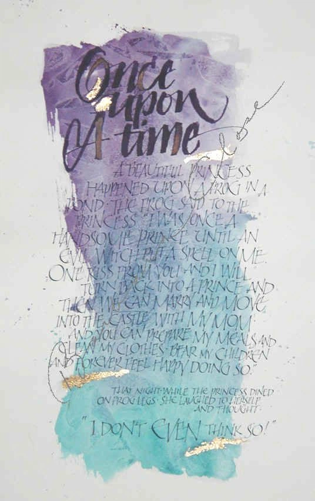

**Tags:** `poster`, `font`, `handwriting`, `art`

[Source](http://bcdezigns.com/BCWordPaint2.htm)

---

### 56. Item 56

**Type:** Pinterest | **Format:** PINTEREST

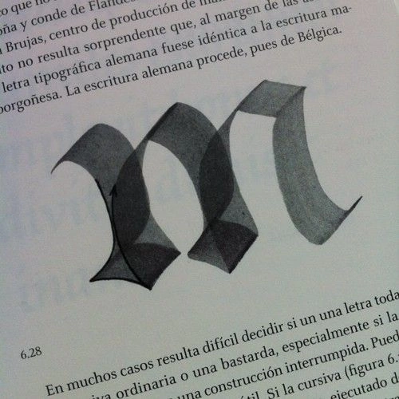

**Tags:** `angle`, `font`

[Source](http://epiplecticpencil.tumblr.com/page/8)

---

### 57. Item 57

**Type:** Pinterest | **Format:** PINTEREST

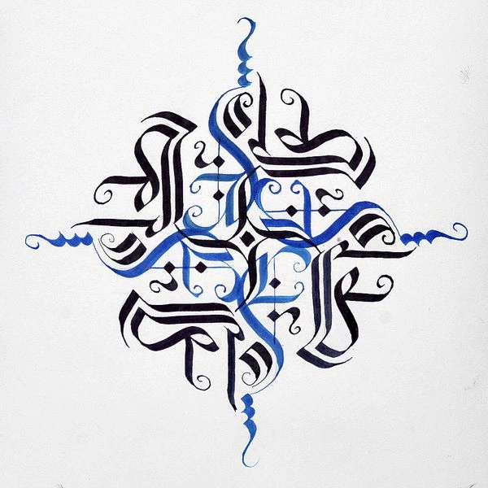

**Tags:** `arabesque calligraphy`, `visual arts`, `design`, `calligraphy`, `drawing`, `arabic calligraphy`, `art`, `gesture`, `font`

[Source](http://www.behance.net/gallery/Elle/200670)

---

### 58. A work of calligraphy titled <n>Revolution calligraphy</n>.

**Type:** Pinterest | **Format:** PINTEREST

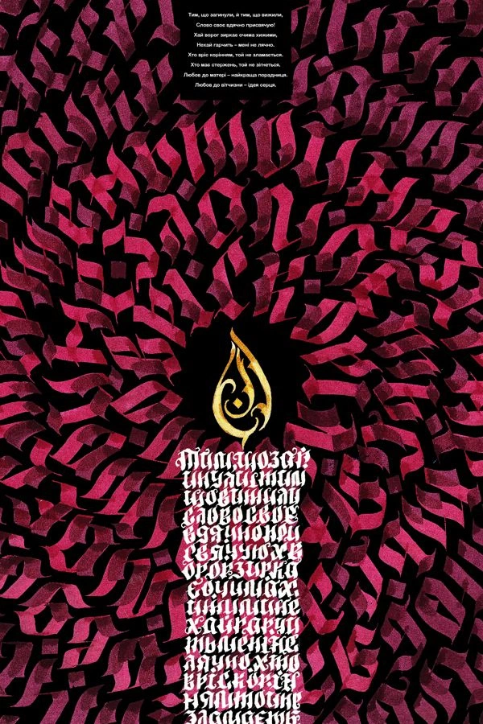

**Tags:** `hmas sydney ii memorial`, `calligraphy`, `graphic design`, `art`, `organism`, `font`, `magenta`, `symmetry`, `pattern`

[Source](http://www.typographyserved.com/gallery/15369125/Revolution-calligraphy)

---

### 59. Item 59

**Type:** Pinterest | **Format:** PINTEREST

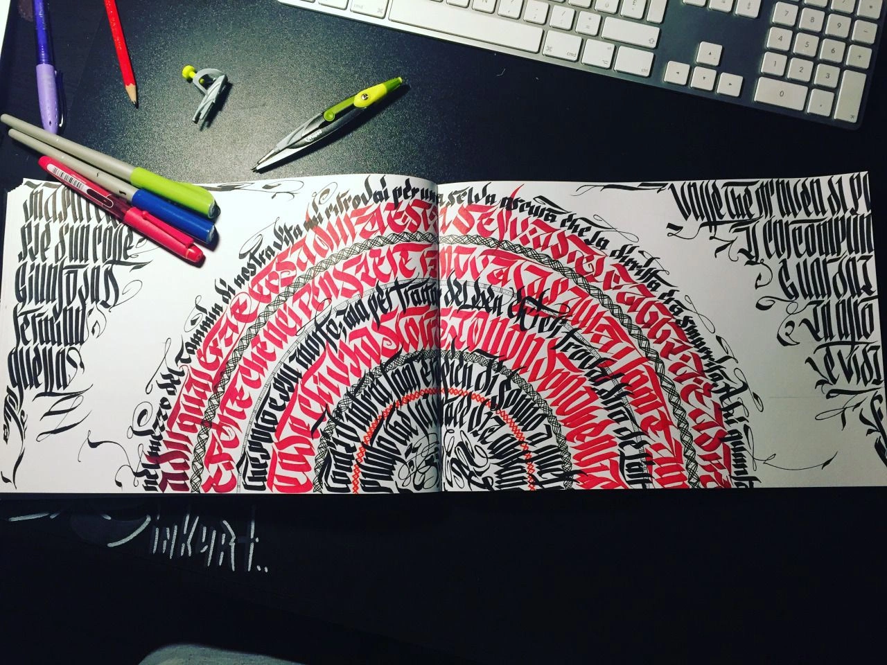

**Tags:** `graphic design`, `font`, `line`, `input device`, `material property`, `rectangle`, `triangle`, `technology`, `pen`

[Source](http://abduzeedo.com/typography-mania-321)

---

### 60. Item 60

**Type:** Pinterest | **Format:** PINTEREST

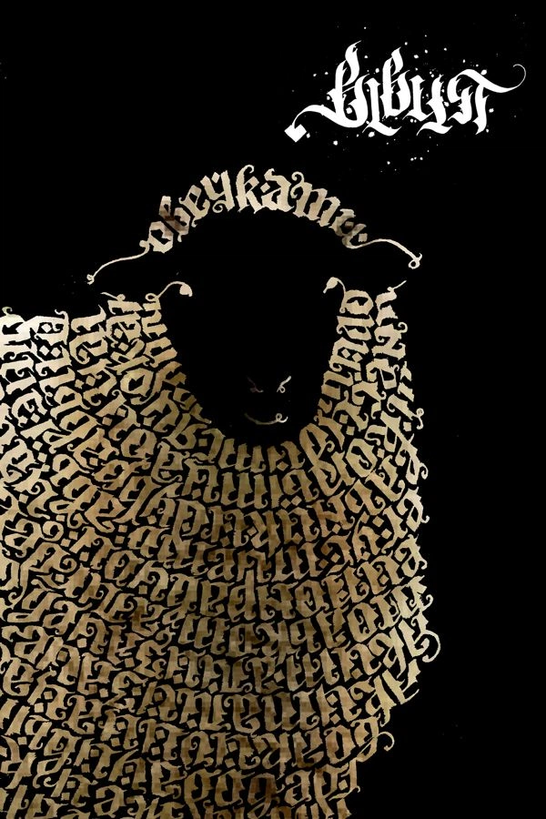

**Tags:** `poster`, `sleeve`, `font`

[Source](http://www.behance.net/gallery/15519565/Animal-calligraphy)

---

### 61. Calligraphic artwork of the Arabic word 'Ruh' (spirit) by artist <n>Ruh Al-Alam</n>.

**Type:** Pinterest | **Format:** PINTEREST

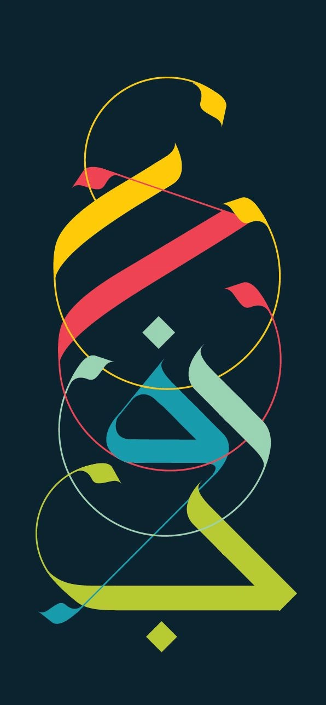

**Tags:** `ruh al alam art`, `calligraphy`, `arabic calligraphy`, `art`, `gesture`, `font`, `happy`, `thumb`

[Source](https://www.behance.net/gallery/17173183/Spirit-Arabic-Calligraphic-Script?utm_medium=email&utm_source=transactional&utm_campaign=project-published)

---

### 62. Item 62

**Type:** Pinterest | **Format:** PINTEREST

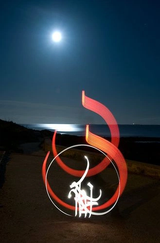

**Tags:** `light`, `calligraphy`, `light painting`, `art`, `sky`, `moon`, `flash photography`

[Source](http://www.flickr.com/photos/13093604@N03/page6/)

---

### 63. Item 63

**Type:** Pinterest | **Format:** PINTEREST

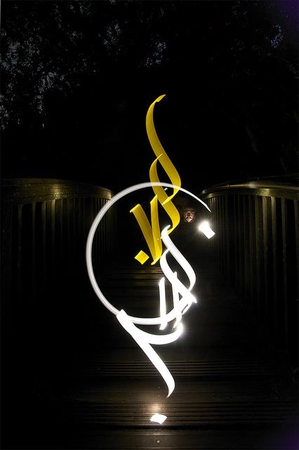

**Tags:** `long exposure calligraphy`, `calligraphy`, `light painting`, `arabic calligraphy`, `photography`, `art`, `automotive lighting`, `font`, `midnight`

[Source](http://www.flickr.com/photos/13093604@N03/4722689083/in/photostream)

---

### 64. Typographic poster <n>Hangul Mandala</n> (2002) by graphic designer <n>Ahn Sang-soo</n>.

**Type:** Pinterest | **Format:** PINTEREST

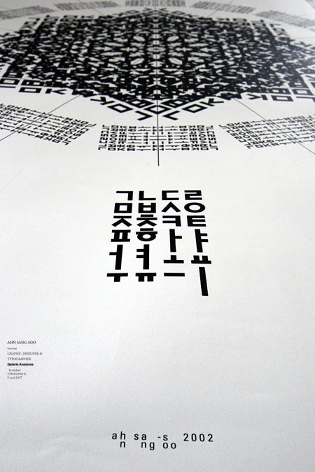

**Tags:** `안상수 한글 만다라`, `design`, `font`

[Source](http://creativeroots.org/2010/03/ahn-sang-soo/)

---

### 65. Item 65

**Type:** Pinterest | **Format:** PINTEREST

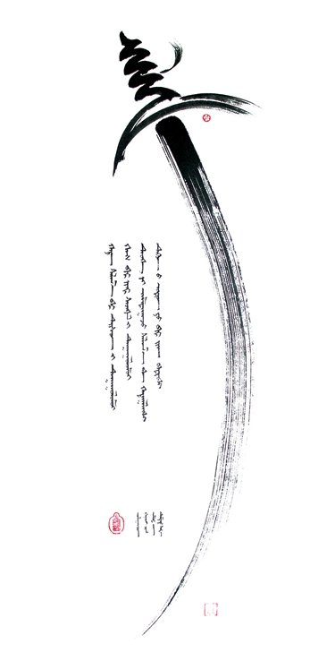

**Tags:** `minimalist japanese wallpaper 4k phone`, `japanese`, `japanese calligraphy`, `eye`, `vision care`, `eyelash`, `street light`, `font`

[Source](http://webseeker.tumblr.com/page/6)

---

### 66. Item 66

**Type:** Pinterest | **Format:** PINTEREST

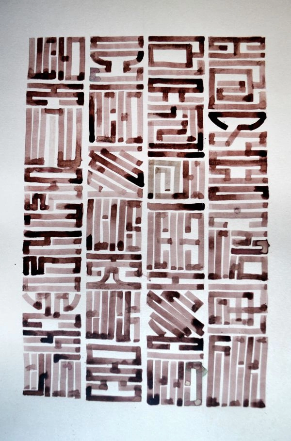

**Tags:** `design`, `rectangle`, `wood`, `art`, `font`, `pattern`, `parallel`, `painting`

[Source](http://www.typographyserved.com/gallery/Caligraphy/14528745)

---

### 67. Spirit - Arabic Calligraphic Script by artist <n>Simone Pakker</n>. Photo from <n>Shutterstock</n>.

**Type:** Pinterest | **Format:** PINTEREST

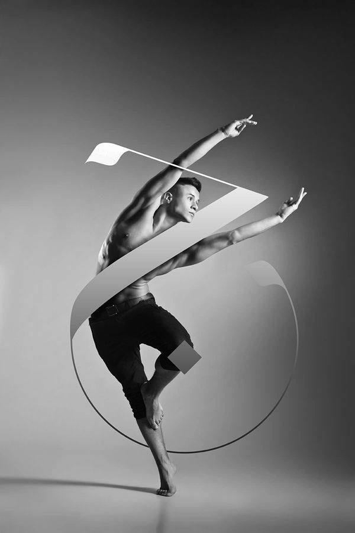

**Tags:** `ballet man poster`, `ballet dancer`, `ballet`, `poster`, `photo agency`, `image`, `flash photography`, `athletic dance move`, `dance`, `elbow`, `performing arts`, `entertainment`

[Source](https://www.behance.net/gallery/17173183/Spirit-Arabic-Calligraphic-Script?utm_medium=email&utm_source=transactional&utm_campaign=project-published)

---

### 68. Item 68

**Type:** Pinterest | **Format:** PINTEREST

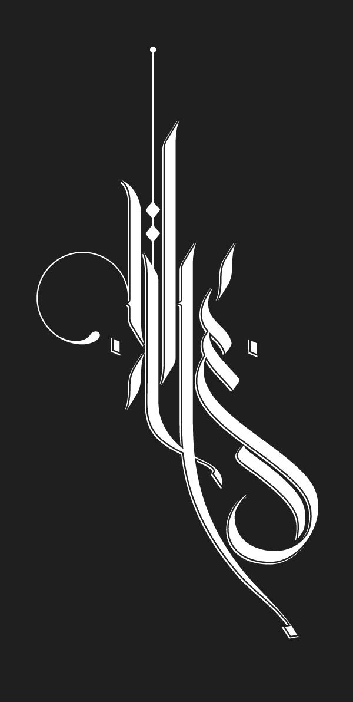

**Tags:** `monochrome photography`, `graphic design`, `calligraphy`, `arabic calligraphy`, `art`, `islamic calligraphy`, `gesture`, `font`, `symbol`

[Source](http://www.behance.net/gallery/HOPELIES/265145)

---

### 69. September 2014 calendar page with Arabic and Tatar calligraphy by <n>Mardesign</n>.

**Type:** Pinterest | **Format:** PINTEREST

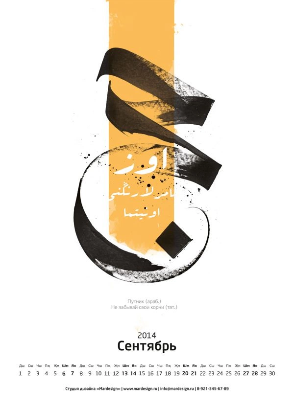

**Tags:** `hajj typography`, `calligraphy`, `arabic calligraphy`, `font`

[Source](http://www.behance.net/gallery/Hajj-Tatar-calendar/12994035)

---

### 70. <n>Spirit</n>, an <n>Arabic calligraphic script</n> by <n>Mostafa El Abasiry</n>.

**Type:** Pinterest | **Format:** PINTEREST

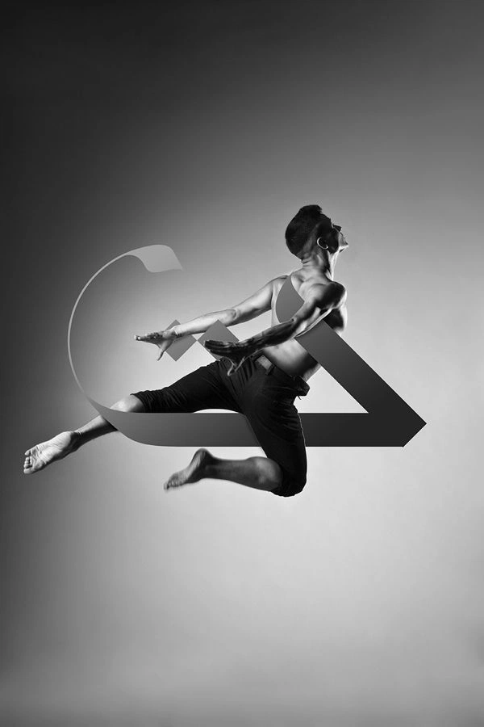

**Tags:** `monochrome photography`, `flash photography`, `athletic dance move`, `gesture`, `happy`, `art`, `recreation`, `choreography`, `performing arts`

[Source](https://www.behance.net/gallery/17173183/Spirit-Arabic-Calligraphic-Script)

---

### 71. Item 71

**Type:** Pinterest | **Format:** PINTEREST

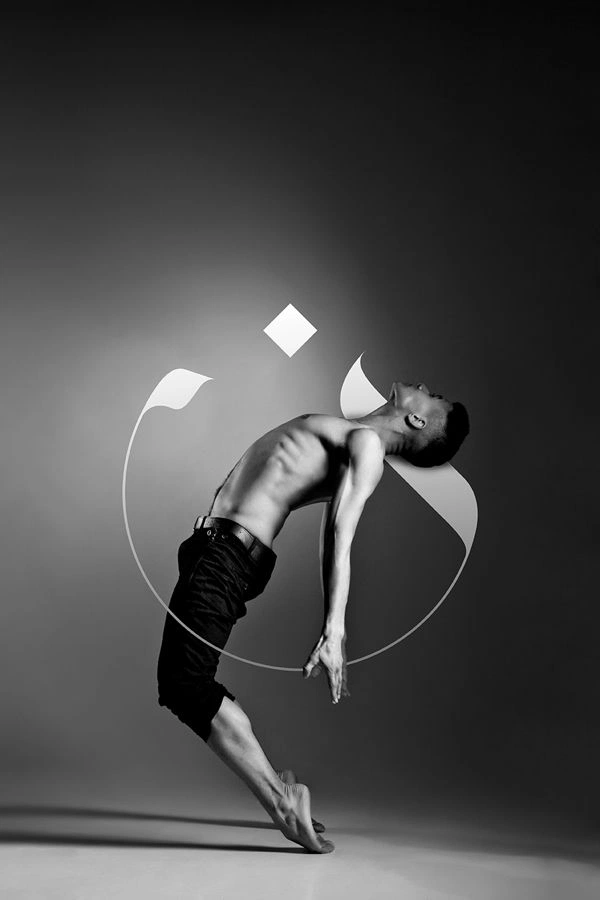

**Tags:** `photograph`, `photo agency`, `ruh al-alam`, `image`, `art`, `leg`, `flash photography`, `shorts`, `athletic dance move`, `elbow`, `knee`, `performing arts`, `entertainment`

[Source](https://www.behance.net/gallery/17173183/Spirit-Arabic-Calligraphic-Script?utm_medium=email&utm_source=transactional&utm_campaign=project-published)

---

### 72. Item 72

**Type:** Pinterest | **Format:** PINTEREST

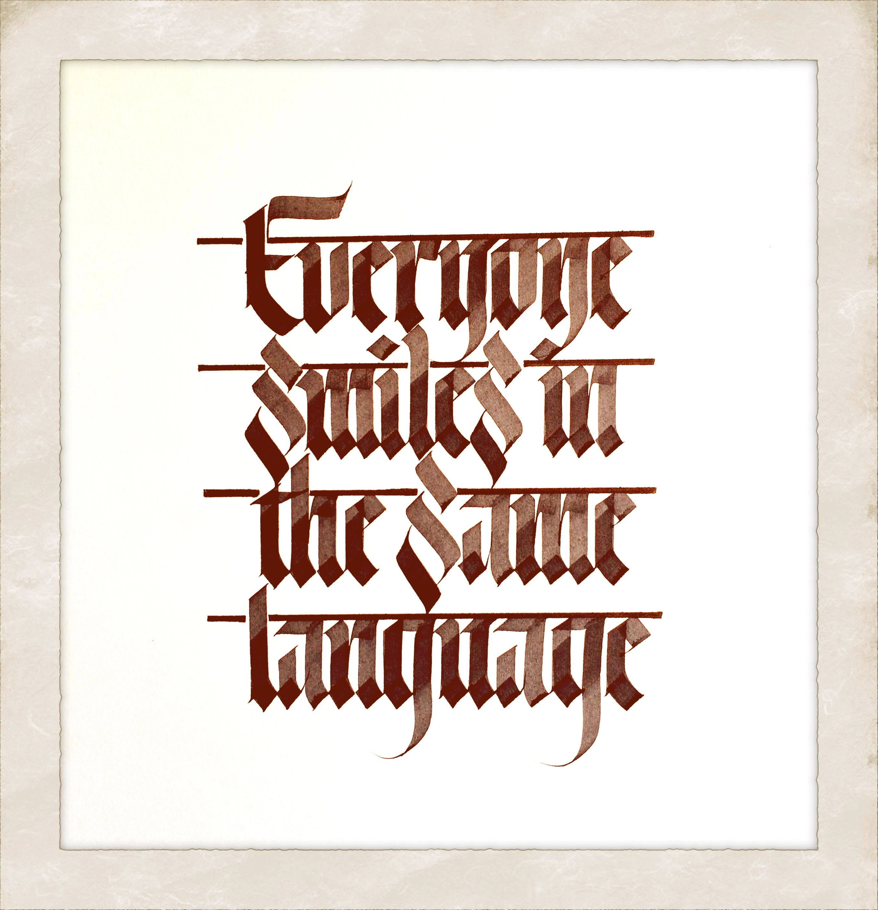

**Tags:** `calligraphy`, `rectangle`, `font`, `art`

[Source](https://www.pinterest.com/pin/101260691598772507/)

---

### 73. Item 73

**Type:** Pinterest | **Format:** PINTEREST

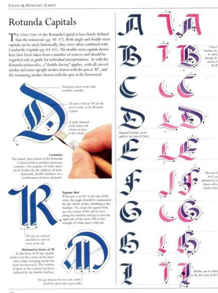

**Tags:** `paper`, `font`, `material property`, `eyelash`

[Source](http://www.letteringtime.org/2010/11/art-of-calligraphy.html)

---

### 74. <n>Risk Failure</n> in a <n>Gothic</n> calligraphic style.

**Type:** Pinterest | **Format:** PINTEREST

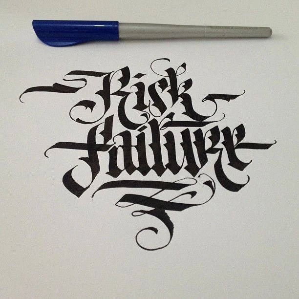

**Tags:** `write your name in calligraphy style`, `calligraphy`, `hand lettering`, `lettering`, `handwriting`, `font`, `art`

[Source](http://instagram.com/p/dvEyHQwAtL/)

---

### 75. Item 75

**Type:** Pinterest | **Format:** PINTEREST

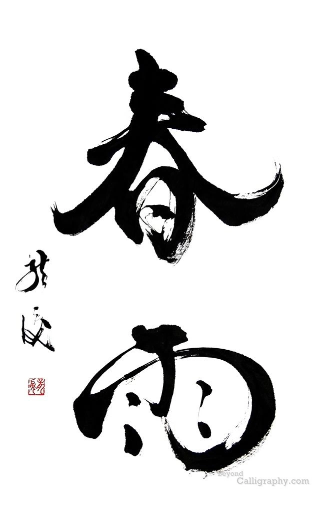

**Tags:** `calligraphy rain japanese`, `japanese calligraphy`, `visual arts`, `drawing`, `calligraphy`, `art`, `font`

[Source](http://www.flickr.com/photos/beyondcalligraphy/6027107964/sizes/l/in/photostream/)

---

### 76. Item 76

**Type:** Pinterest | **Format:** PINTEREST

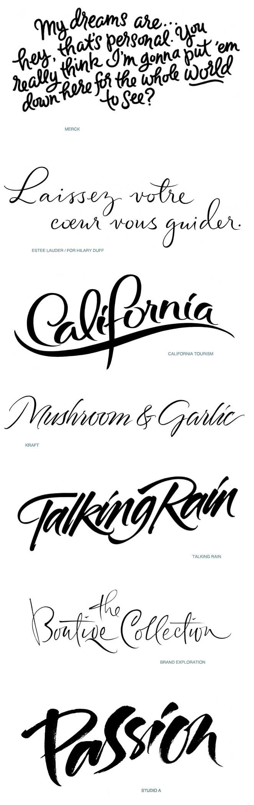

**Tags:** `duentes de letras`, `handwriting`, `calligraphy`, `font`, `typography`

[Source](http://alphabetroadtrip.typepad.com/.a/6a011570334453970b019affa8caa6970c-pi)

---

### 77. Item 77

**Type:** Pinterest | **Format:** PINTEREST

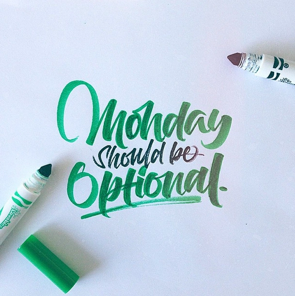

**Tags:** `crayola hand lettering`, `crayola`, `hand lettering`, `calligraphy`, `font`

[Source](https://www.behance.net/gallery/25764813/Crayola-Brushpen-Lettering-Set?utm_medium=email&utm_source=transactional&utm_campaign=project-published)

---

### 78. Item 78

**Type:** Pinterest | **Format:** PINTEREST

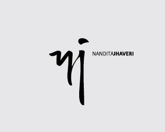

**Tags:** `graphic design`, `logo`, `design`, `font`, `art`

[Source](http://logopond.com/gallery/detail/52508)

---

### 79. Item 79

**Type:** Pinterest | **Format:** PINTEREST

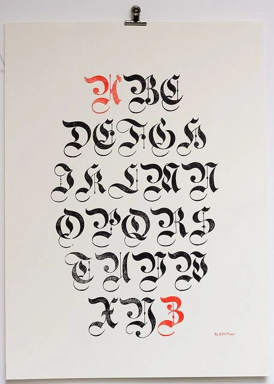

**Tags:** `black letter type specimen`, `blackletter`, `calligraphy`, `handwriting`, `font`, `art`

[Source](http://www.flickr.com/photos/46165392@N05/6847507334/sizes/o/in/pool-74503026@N00/)

---

### 80. A collection of calligraphy pens, including a <n>Pilot parallel pen</n>.

**Type:** Pinterest | **Format:** PINTEREST

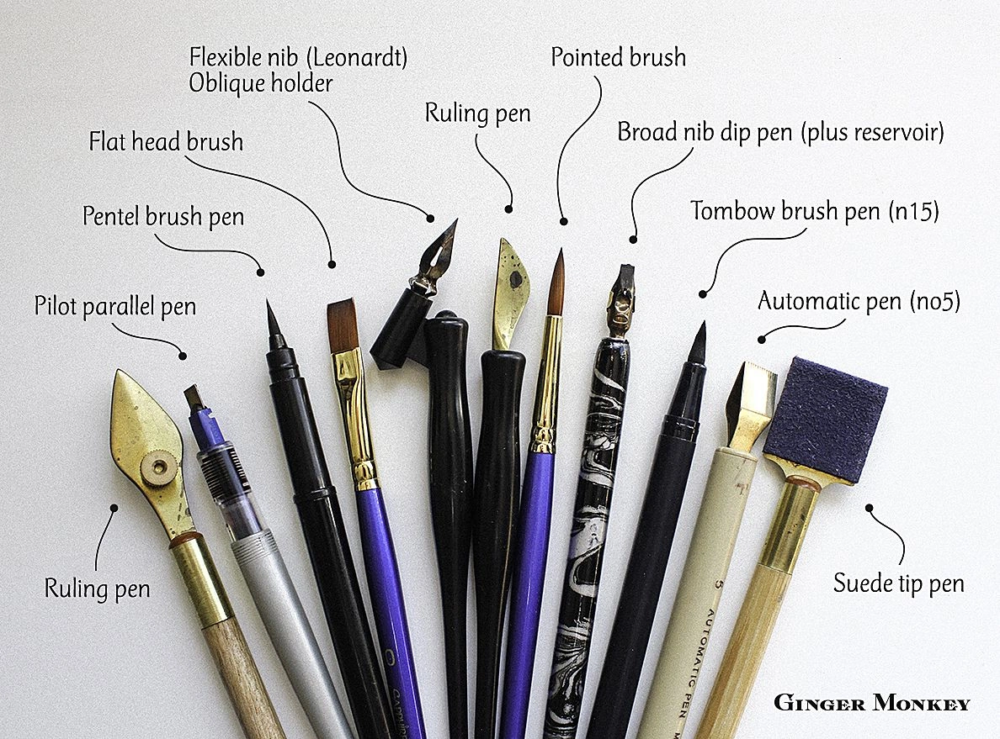

**Tags:** `types of calligraphy pens`, `calligraphy`, `pen`, `dip pen`, `fountain pen`, `nib`, `writing implement`, `office supplies`, `writing instrument accessory`, `font`, `ball pen`, `brush`, `office instrument`

[Source](https://www.pinterest.com/pin/101260691598501808/)

---

### 81. Arabic calligraphy of the phrase <n>إن الله جميل يحب الجمال</n>, meaning 'Allah is beautiful and loves beauty'.

**Type:** Pinterest | **Format:** PINTEREST

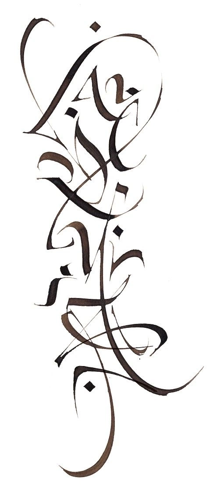

**Tags:** `line art`, `art`, `font`

[Source](http://ggggbook.tumblr.com/image/37956017528)

---

### 82. Item 82

**Type:** Pinterest | **Format:** PINTEREST

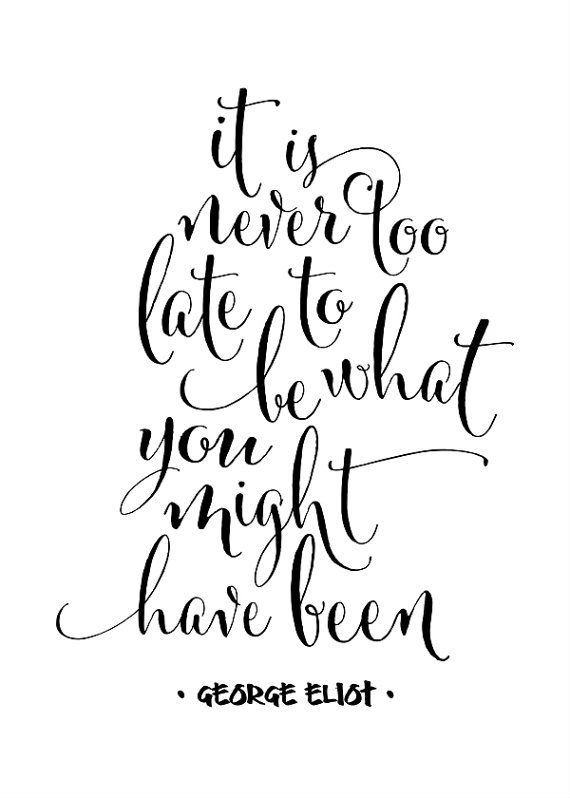

**Tags:** `line art`, `plant`, `art`, `font`, `handwriting`

[Source](https://www.etsy.com/listing/169371690/typography-print-typographic-print-art?ref=br_feed_21&br_feed_tlp=art)

---

### 83. Item 83

**Type:** Pinterest | **Format:** PINTEREST

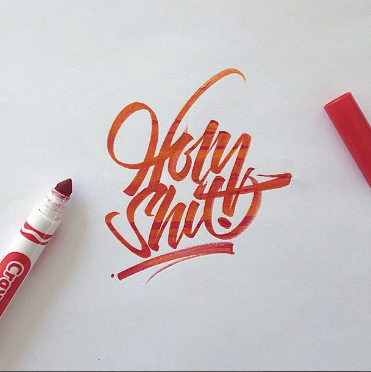

**Tags:** `calligraphy`, `font`

[Source](https://www.behance.net/gallery/25764813/Crayola-Brushpen-Lettering-Set?utm_medium=email&utm_source=transactional&utm_campaign=project-published)

---

### 84. Ad campaign for <n>Mandarin Oriental, Singapore</n>'s <n>Cherry Garden</n> restaurant, featuring mooncakes by Chef <n...

**Type:** Pinterest | **Format:** PINTEREST

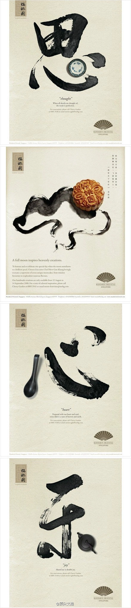

> Ad campaign for <n>Mandarin Oriental, Singapore</n>'s <n>Cherry Garden</n> restaurant, featuring mooncakes by Chef <n>Hiew Gun Khong</n> in 2008.

**Tags:** `shoe`, `mandarin oriental hotel group`, `jaw`, `font`

[Source](http://www.behance.net/gallery/Singapore-mandarin-Oriental-hotel-image-advertising/8221299)

---

### 85. Item 85

**Type:** Pinterest | **Format:** PINTEREST

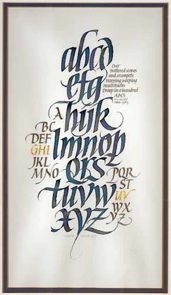

**Tags:** `calligraphy`, `haunted fort`, `font`, `handwriting`, `art`

[Source](http://hauntedspaces.wordpress.com/2009/01/19/calligraphy-art/)

---

### 86. Item 86

**Type:** Pinterest | **Format:** PINTEREST

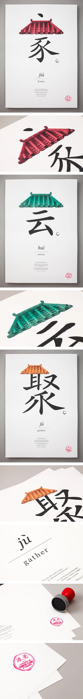

**Tags:** `design`, `font`, `rectangle`, `art`

[Source](https://www.behance.net/gallery/-A-Retrospect-on-Chinese-Clans-(The-Posters)/14427953)

---

### 87. Item 87

**Type:** Pinterest | **Format:** PINTEREST

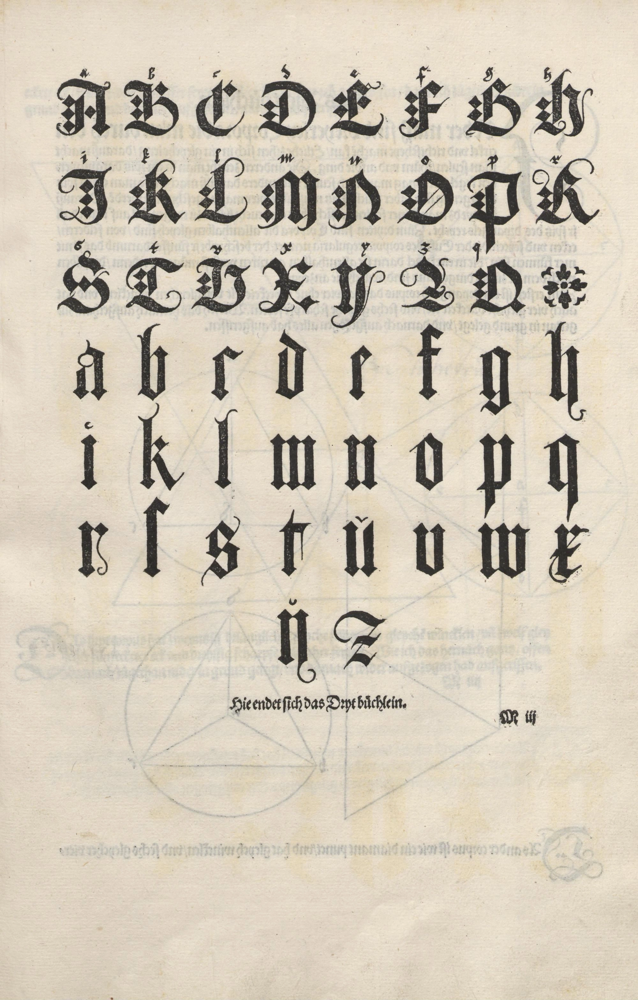

**Tags:** `ecriture gothique durer`, `underweysung der messung`, `calligraphy`, `alphabet`, `font`, `art`, `handwriting`

[Source](http://upload.wikimedia.org/wikipedia/commons/b/b1/Duerer_Underweysung_der_Messung_141.jpg)

---

### 88. Calligraphy by <n>Luca Barcellona</n> for the <n>Good Old Boys Orchestra</n> album, 2014.

**Type:** Pinterest | **Format:** PINTEREST

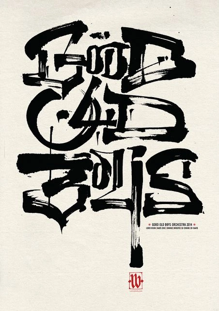

**Tags:** `poster`, `calligraphy`, `design`, `visual arts`, `art`, `font`

[Source](https://www.flickr.com/photos/luca-beanone-barcellona/12068784273/sizes/o/in/photostream/)

---

### 89. <n>"R" letter</n> (2013), a calligraphic work by artist <n>Pokras Lampas</n>.

**Type:** Pinterest | **Format:** PINTEREST

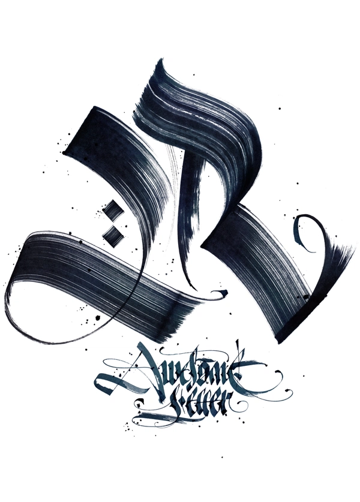

**Tags:** `alphabet pokras lampas`, `calligraphy & lettering`, `calligraphy`, `calligraffiti`, `art`, `font`, `automotive design`

[Source](http://www.behance.net/gallery/Check-our-new-project-awesomeletteronthetshirtcom/6660631)

---

### 90. Item 90

**Type:** Pinterest | **Format:** PINTEREST

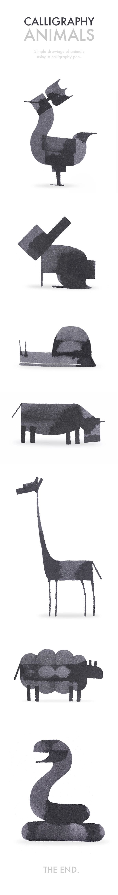

**Tags:** `design`, `calligraphy`, `furniture`, `table`, `wood`, `rectangle`, `art`

[Source](https://www.behance.net/gallery/18015865/Even-More-Calligraphy-Animals)

---

### 91. Item 91

**Type:** Pinterest | **Format:** PINTEREST

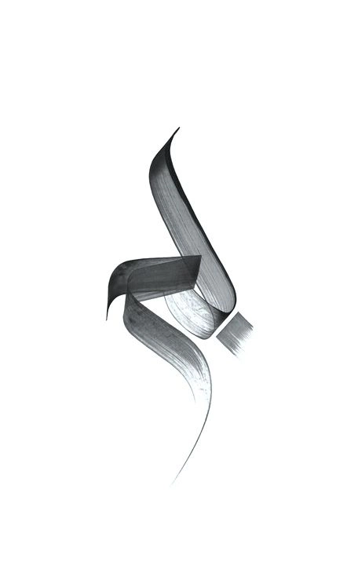

**Tags:** `brush stroke arabic calligraphy`, `calligraphy`, `arabic calligraphy`, `automotive design`

[Source](http://mydarkwhisper.tumblr.com/post/102842427640)

---

### 92. Item 92

**Type:** Pinterest | **Format:** PINTEREST

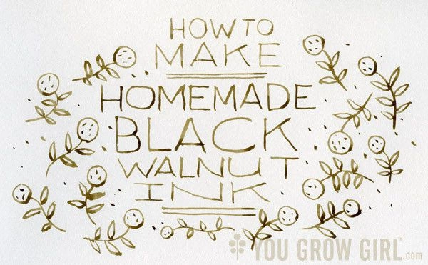

**Tags:** `calligraphy`, `branch`, `font`, `art`

[Source](http://yougrowgirl.com/make-black-walnut-ink/)

---

### 93. Item 93

**Type:** Pinterest | **Format:** PINTEREST

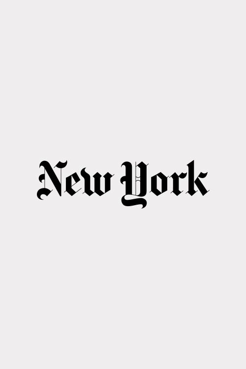

**Tags:** `new york times`, `font`

[Source](http://blackrainbowss.tumblr.com/post/80860844711)

---

### 94. Item 94

**Type:** Pinterest | **Format:** PINTEREST

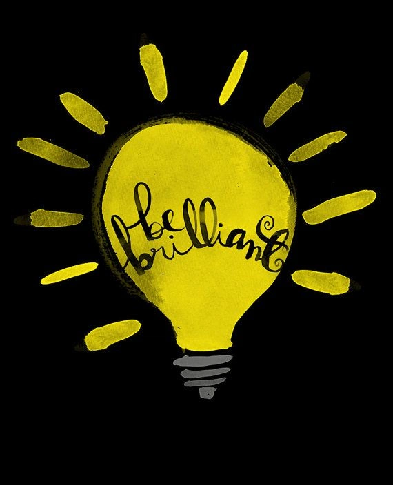

**Tags:** `computer wallpaper`, `balloon`, `gesture`, `font`, `happy`, `toy`, `insect`, `thumb`

[Source](http://www.etsy.com/listing/91857272/be-brilliant-wall-art-print)

---

### 95. Item 95

**Type:** Pinterest | **Format:** PINTEREST

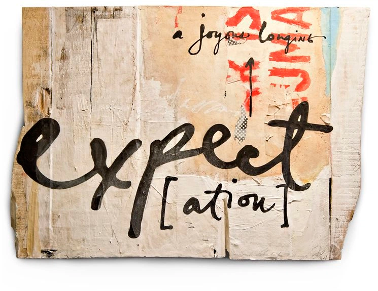

**Tags:** `calligraphy`, `brown`, `handwriting`, `rectangle`, `wood`, `font`, `art`

[Source](http://www.lettercult.com/archives/3055/5)

---

### 96. Item 96

**Type:** Pinterest | **Format:** PINTEREST

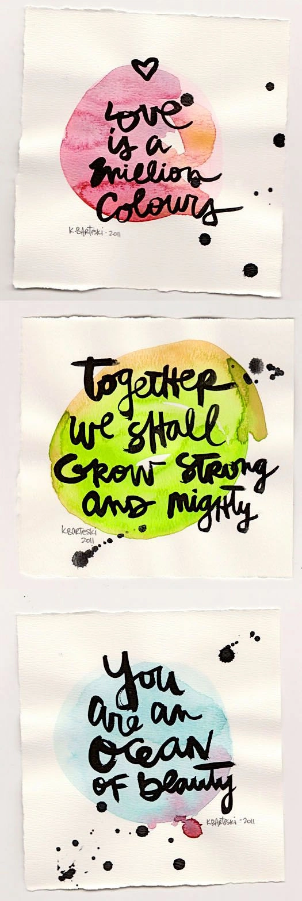

**Tags:** `calligraphy`, `handwriting`, `font`

[Source](http://lovelife.typepad.com/my_weblog/2011/11/small-artsy.html)

---

### 97. Calligraphy of the word <n>Philadelphia</n>.

**Type:** Pinterest | **Format:** PINTEREST

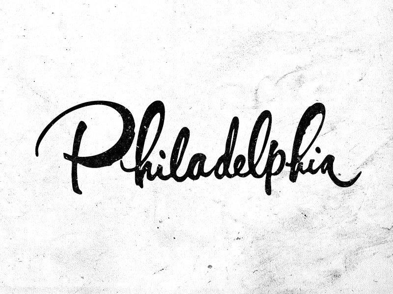

**Tags:** `brownwood`, `handwriting`, `font`, `art`

[Source](http://dribbble.com/shots/1344059-Philly/attachments/190639)

---

### 98. Item 98

**Type:** Pinterest | **Format:** PINTEREST

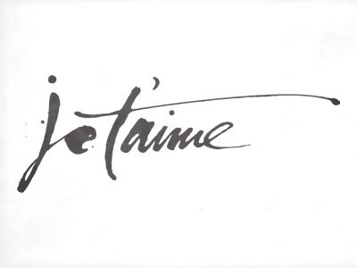

**Tags:** `jetaime tattoo`, `tattoo`, `calligraphy`, `handwriting`, `font`

[Source](http://thehartblog.tumblr.com/post/64979624113)

---

### 99. Wedding calligraphy by <n>Mara Zepeda</n> of <n>Neither Snow</n>.

**Type:** Pinterest | **Format:** PINTEREST

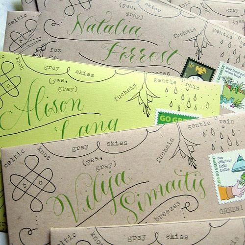

**Tags:** `calligraphy`, `handwriting`, `botany`, `organism`, `font`, `line`, `writing`

[Source](http://junebugweddings.com/blogs/what_junebug_loves/archive/2012/09/20/stylish-fanciful-wedding-calligraphy.aspx)

---

### 100. <n>Libertad</n> (2015), a calligraphy by <n>Hassan Massoudy</n> based on a quote from <n>Victor Hugo</n>.

**Type:** Pinterest | **Format:** PINTEREST

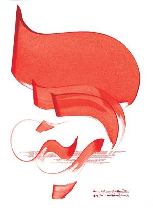

**Tags:** `monument 100 years of japanese immigration - artist tomie ohtake`, `hassan massoudy calligraphe`, `calligraphy`, `arabic calligraphy`, `art`, `font`

[Source](https://www.pinterest.com/pin/101260691593080705/)

---

### 101. Item 101

**Type:** Pinterest | **Format:** PINTEREST

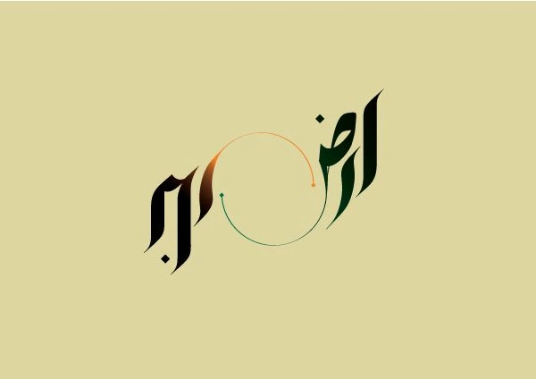

**Tags:** `arabic calligraphy n`, `graphic design`, `font`

[Source](http://www.behance.net/gallery/Earth-and-Fire/494131)

---

### 102. Contemporary calligraphy by artist <n>Kitty Sabatier</n>.

**Type:** Pinterest | **Format:** PINTEREST

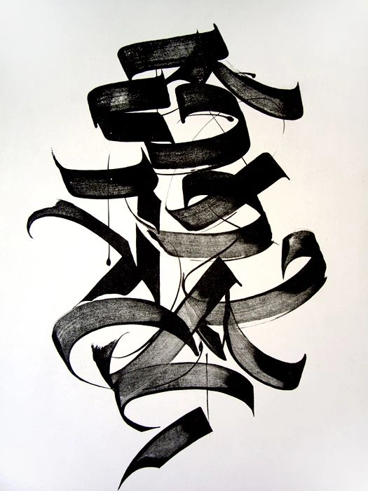

**Tags:** `drawing`, `visual arts`, `art`, `font`

[Source](http://steinarbergolsen.tumblr.com/post/23100257590/2colorsdaily-the-works-of-kitty-sabatier)

---

### 103. Item 103

**Type:** Pinterest | **Format:** PINTEREST

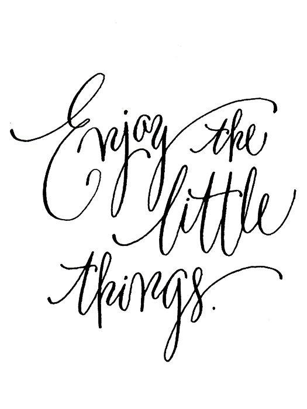

**Tags:** `quotes in cursive font`, `quotation`, `calligraphy`, `motivational quote`, `writing`, `handwriting`, `font`

[Source](http://zsazsabellagio.blogspot.com/2012/03/lovely-lovely.html)

---
