# Career Growth

> Collection from [Cosmos.so](https://www.cosmos.so/arjunphlox/career-growth) — 46 items

---

## 1. From Singapore to Silicon Valley, this young woman now shapes ChatGPT's future

**Type:** Article
  
**Source:** [https://www.channelnewsasia.com/today/up-close/chatgpt-openai-singaporean-jerene...](https://www.channelnewsasia.com/today/up-close/chatgpt-openai-singaporean-jerene-yang-artificial-intelligence-chatbot-5231291)
  
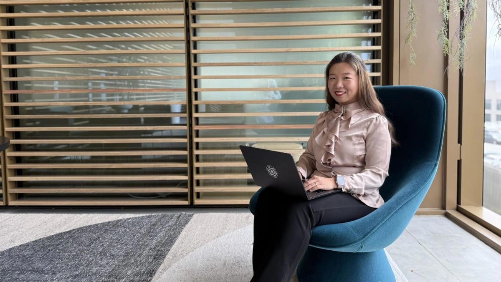
  
**Tags:** `sitting` · `singapore`

---

## 2. Creative Lives In Progress

**Type:** Article
  
**Source:** [https://creativelivesinprogress.com/](https://creativelivesinprogress.com/)
  
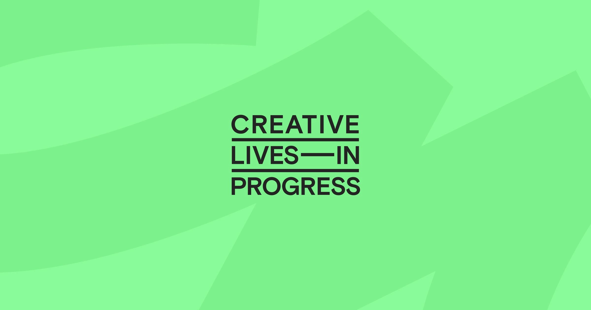
  
**Tags:** `graphic design`

---

## 3. How to navigate the complexities of the creative working life?

**Type:** Article
  
**Source:** [https://www.ifyoucouldjobs.com/journal/how-to-navigate-the-complexities-of-the-c...](https://www.ifyoucouldjobs.com/journal/how-to-navigate-the-complexities-of-the-creative-working-life?utm_source=form&utm_medium=ccc&utm_campaign=question_submission)
  
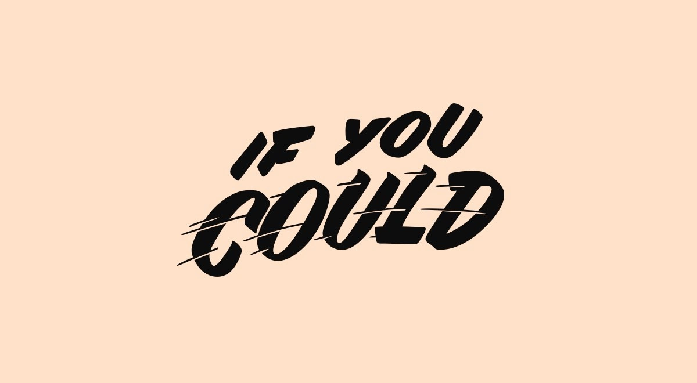
  
**Tags:** `calligraphy`

---

## 4. 41 Years in UX: A Career Retrospective

**Type:** Article
  
**Source:** [https://www.uxtigers.com/post/41-years-in-ux](https://www.uxtigers.com/post/41-years-in-ux)
  
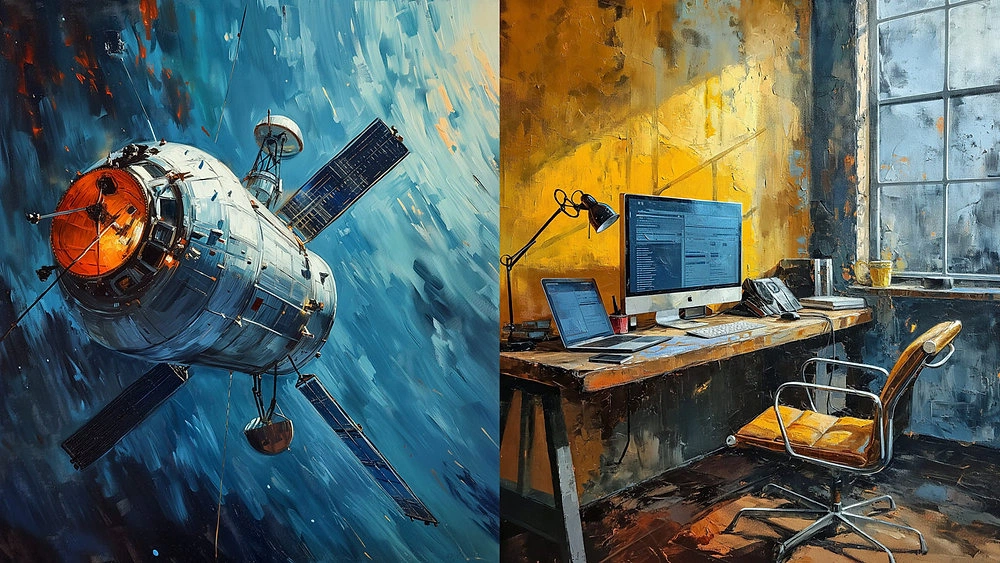
  
**Tags:** `painting`

---

## 5. Lessons of Design

**Type:** Article
  
**Source:** [https://lessons.design/](https://lessons.design/)
  
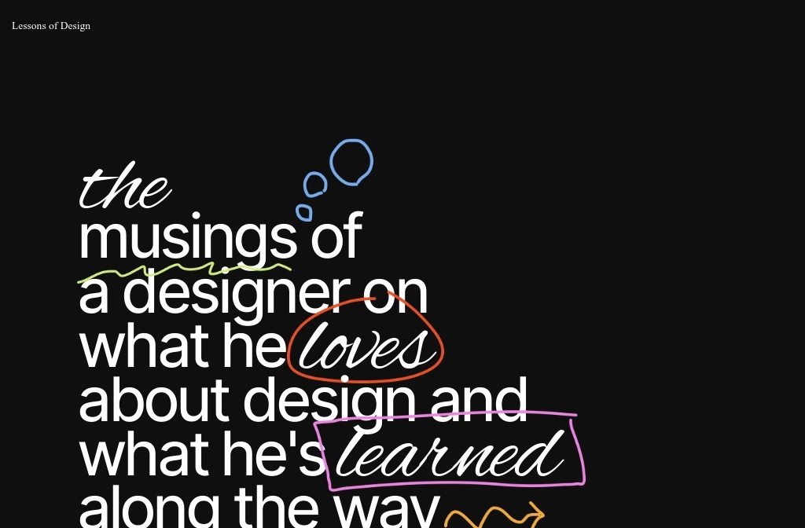
  
**Tags:** `font` · `graphic design`

---

## 6. The End of Influencers | SquarePlanet

**Type:** Article
  
**Source:** [https://hype4.academy/articles/design/the-end-of-influencers](https://hype4.academy/articles/design/the-end-of-influencers)
  
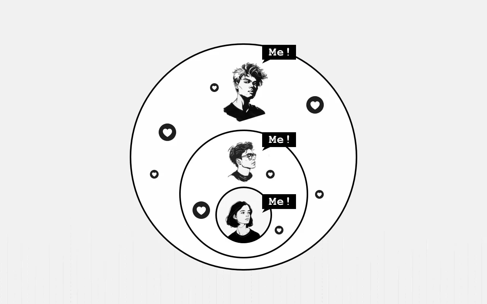
  
> Illustration from the article '<n>The End of Influencers. The Personal Brand is dead.</n>' by <n>Michal Malewicz</n>.
  
**Tags:** `circle` · `graphic designer`

---

## 7. Every

**Type:** Article
  
**Source:** [https://every.to/superorganizers](https://every.to/superorganizers)
  

  
**Tags:** `cumulus`

---

## 8. How do I tell someone that I can’t write them a strong letter of recommendation?

**Type:** Article
  
**Source:** [https://www.nature.com/articles/d41586-024-03398-y](https://www.nature.com/articles/d41586-024-03398-y)
  
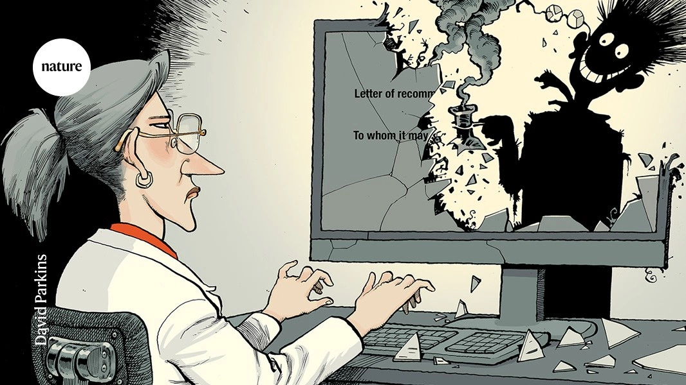
  
**Tags:** `cartoon`

---

## 9. Item 9

**Type:** UPLOAD
  
**Source:** [https://www.are.na/block/9096934](https://www.are.na/block/9096934)
  
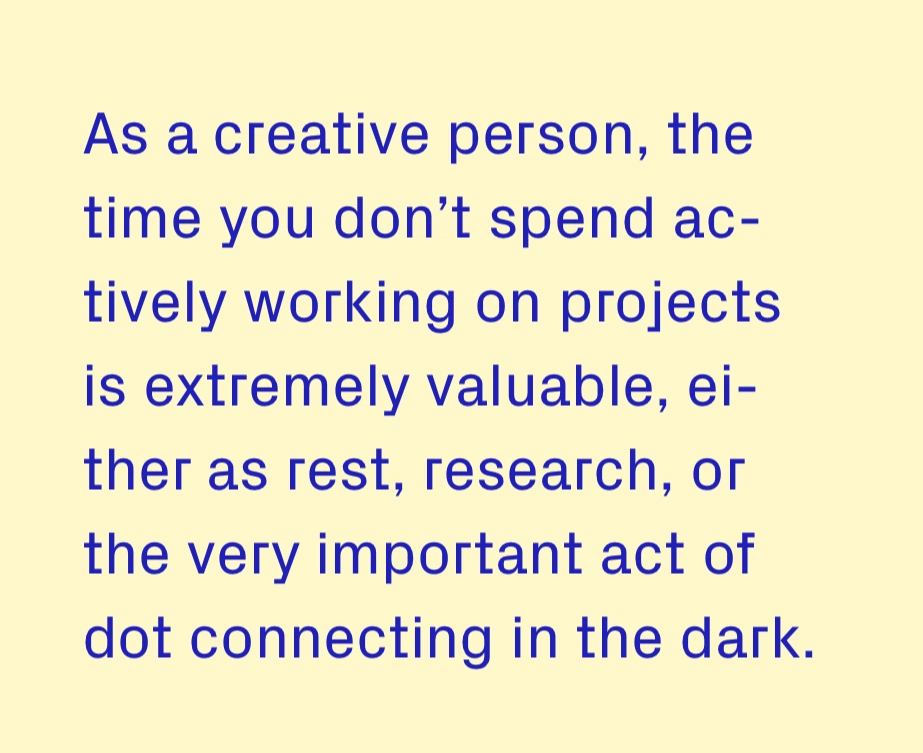
  
**Tags:** `font` · `trust quotes`

---

## 10. Dubai is a paradise for “digital nomads”— and hell for low-wage gig workers

**Type:** Article
  
**Source:** [https://restofworld.org/2021/dubai-is-a-paradise-for-digital-nomads-and-hell-for...](https://restofworld.org/2021/dubai-is-a-paradise-for-digital-nomads-and-hell-for-low-wage-gig-workers/)
  
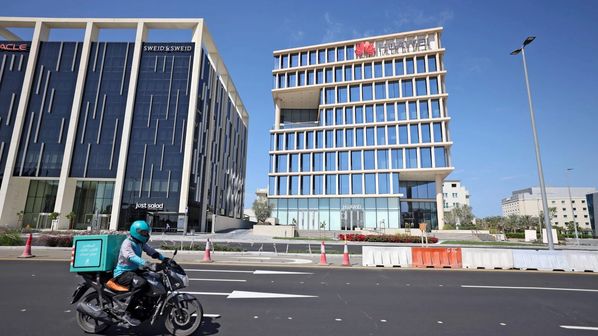
  
**Tags:** `freeway` · `dubai`

---

## 11. Sagittarius and Aquarius compatibility: What to know about the 2 signs coming together

**Type:** Article
  
**Source:** [https://www.today.com/life/astrology/sagittarius-aquarius-compatibility-rcna1405...](https://www.today.com/life/astrology/sagittarius-aquarius-compatibility-rcna140548)
  
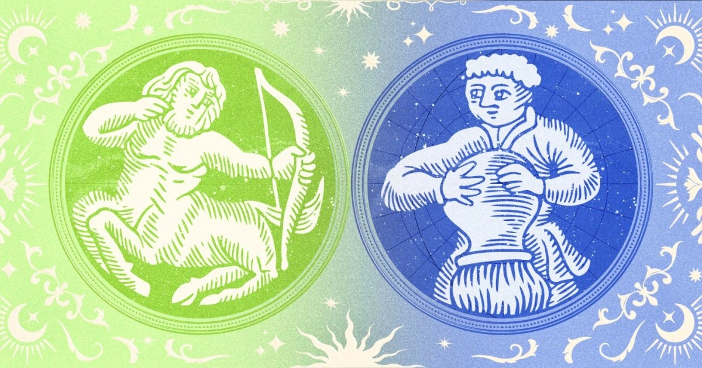
  
**Tags:** `aquarius and leo compatibility` · `aquarius` · `leo` · `astrological sign` · `dishware` · `organism` · `font` · `circle` · `art`

---

## 12. Fun and freedom-seeking: What to know about the Sagittarius personality

**Type:** Article
  
**Source:** [https://www.today.com/life/astrology/sagittarius-traits-personality-rcna58252](https://www.today.com/life/astrology/sagittarius-traits-personality-rcna58252)
  
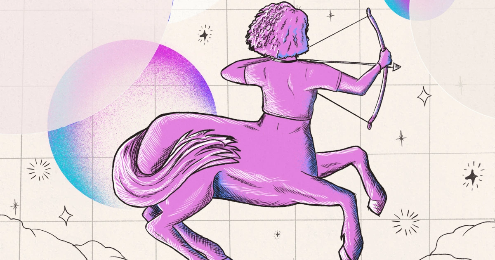
  
**Tags:** `illustration` · `sagittarius` · `astrological sign` · `joint` · `hand` · `arm` · `leg` · `purple` · `human body` · `organism` · `pink`

---

## 13. Item 13

**Type:** Twitter
  
**Source:** [https://x.com/RyanHoliday/status/1762166777394409670](https://x.com/RyanHoliday/status/1762166777394409670)
  

  
**Tags:** `ryan holiday desk` · `ryan holiday` · `the obstacle is the way` · `ego is the enemy` · `computer` · `personal computer` · `computer keyboard` · `peripheral` · `computer monitor` · `table` · `desk` · `computer desk`

---

## 14. How to Earn Passive Income: Build and Sell Glide App Templates | Glide Blog

**Type:** Article
  
**Source:** [https://www.glideapps.com/blog/build-app-templates](https://www.glideapps.com/blog/build-app-templates)
  

  
**Tags:** `graphic design` · `azure` · `line` · `font` · `aqua` · `electric blue`

---

## 15. Starter Guide to Delhi NCR

**Type:** Article
  
**Source:** [https://starterguide.plumhq.com/delhi](https://starterguide.plumhq.com/delhi)
  

  
**Tags:** `mosque` · `font` · `landmark`

---

## 16. Starter Guide to Mumbai by Plum

**Type:** Article
  
**Source:** [https://starterguide.plumhq.com/mumbai](https://starterguide.plumhq.com/mumbai)
  

  
**Tags:** `mosque` · `mumbai` · `property` · `building` · `architecture` · `window` · `landmark` · `facade` · `font`

---

## 17. Starters Guide to Bengaluru by Plum

**Type:** Article
  
**Source:** [https://starterguide.plumhq.com/bengaluru](https://starterguide.plumhq.com/bengaluru)
  

  
**Tags:** `mosque` · `building` · `architecture` · `window` · `font` · `plant` · `landmark` · `tree` · `facade`

---

## 18. Item 18

**Type:** Twitter
  
**Source:** [https://x.com/subhashchy/status/1786805558495834379?s=12&t=Kbl6Kd9qhuaRg9Z7iATEE...](https://x.com/subhashchy/status/1786805558495834379?s=12&t=Kbl6Kd9qhuaRg9Z7iATEEw)

---

## 19. Item 19

**Type:** Twitter
  
**Source:** [https://x.com/pepicrft/status/1786657012345958844?s=12&t=Kbl6Kd9qhuaRg9Z7iATEEw](https://x.com/pepicrft/status/1786657012345958844?s=12&t=Kbl6Kd9qhuaRg9Z7iATEEw)

---

## 20. Item 20

**Type:** TEXT

---

## 21. Product Designer Salary

**Type:** Article
  
**Source:** [https://www.levels.fyi/t/product-designer?compare=Stripe%2CSalesforce%2CMicrosof...](https://www.levels.fyi/t/product-designer?compare=Stripe%2CSalesforce%2CMicrosoft%2CAmazon%2CGoogle&countryId=113)
  
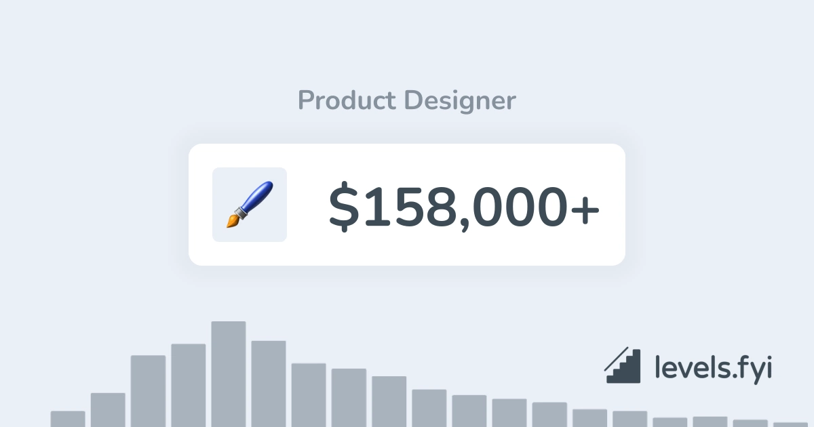
  
**Tags:** `graphic design` · `rectangle` · `font` · `parallel`

---

## 22. Levels.fyi | Salaries & Tools to Level Up Your Career

**Type:** Article
  
**Source:** [https://www.levels.fyi/?compare=Tata Consultancy Services,Accenture,VMware&track...](https://www.levels.fyi/?compare=Tata Consultancy Services,Accenture,VMware&track=Software Engineer)
  

  
**Tags:** `levels fyi` · `levels.fyi` · `font` · `electric blue`

---

## 23. Item 23

**Type:** Twitter
  
**Source:** [https://twitter.com/jdluk87/status/1783643369576804651](https://twitter.com/jdluk87/status/1783643369576804651)
  
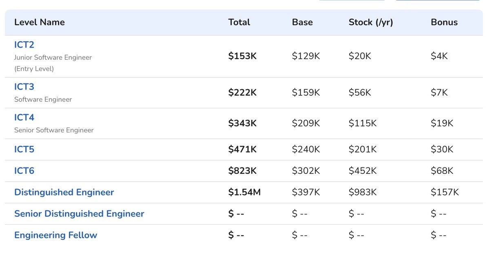
  
**Tags:** `number` · `font` · `rectangle`

---

## 24. Freelance Things

**Type:** Article
  
**Source:** [https://www.freelancethings.co/](https://www.freelancethings.co/)
  
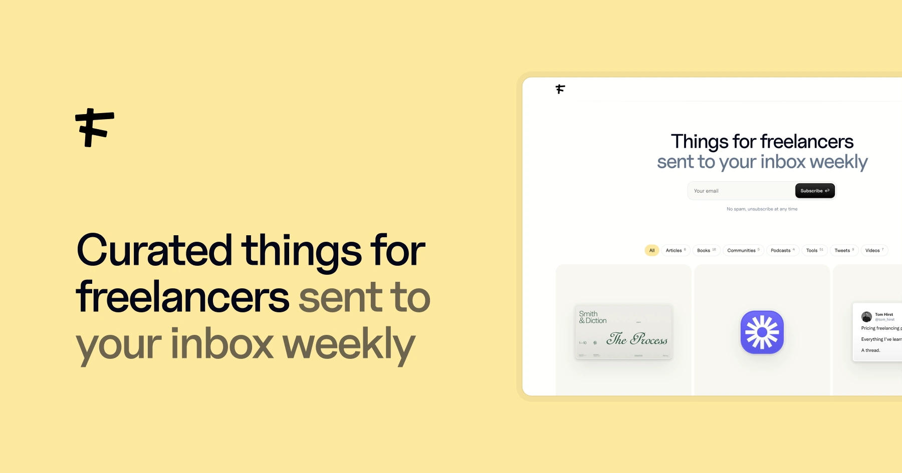
  
**Tags:** `font` · `rectangle` · `media`

---

## 25. Item 25

**Type:** Twitter
  
**Source:** [https://x.com/clairevo/status/1780583848503607361?s=12&t=Kbl6Kd9qhuaRg9Z7iATEEw](https://x.com/clairevo/status/1780583848503607361?s=12&t=Kbl6Kd9qhuaRg9Z7iATEEw)

---

## 26. Item 26

**Type:** Twitter
  
**Source:** [https://twitter.com/SergioRocks/status/1779876063230734839](https://twitter.com/SergioRocks/status/1779876063230734839)
  
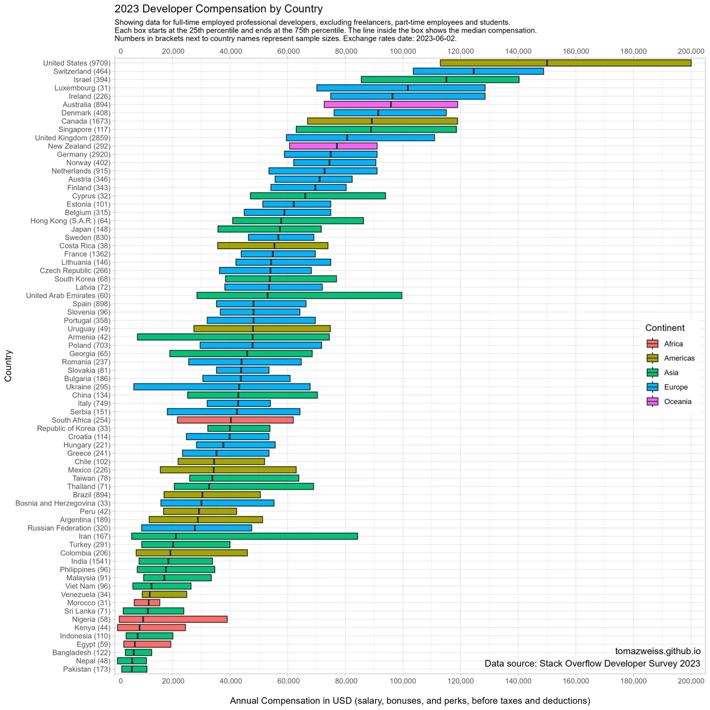
  
**Tags:** `software developer` · `r/dataisbeautiful` · `rectangle` · `font` · `slope` · `plot` · `parallel`

---

## 27. Item 27

**Type:** Twitter
  
**Source:** [https://twitter.com/shreyas/status/1779148378879979796](https://twitter.com/shreyas/status/1779148378879979796)
  
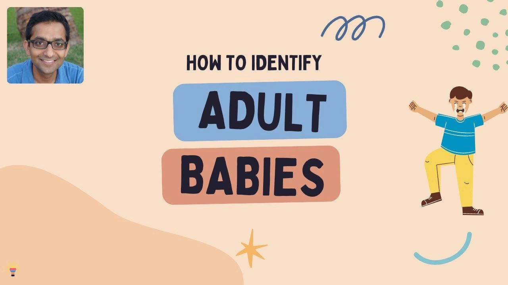
  
**Tags:** `child` · `sunglasses` · `gesture` · `font` · `sharing` · `goggles` · `happy` · `smile`

---

## 28. Item 28

**Type:** Twitter
  
**Source:** [https://twitter.com/hpdailyrant/status/1766479899928502423](https://twitter.com/hpdailyrant/status/1766479899928502423)

---

## 29. Design Engineering at Vercel: What we do and how we do it – Vercel

**Type:** Article
  
**Source:** [https://vercel.com/blog/design-engineering-at-vercel](https://vercel.com/blog/design-engineering-at-vercel)
  
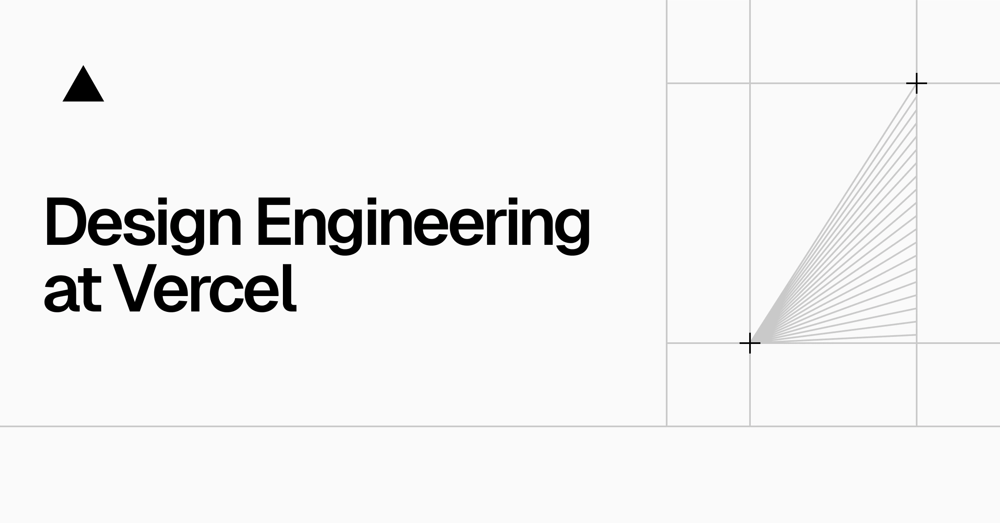
  
**Tags:** `triangle` · `rectangle` · `font` · `parallel`

---

## 30. Item 30

**Type:** Twitter
  
**Source:** [https://x.com/robhope/status/1772971532513386832?s=20](https://x.com/robhope/status/1772971532513386832?s=20)
  

  
**Tags:** `atmosphere` · `font` · `astronomical object` · `lens flare` · `circle`

---

## 31. Intro - Book experts & get advice

**Type:** Article
  
**Source:** [https://intro.co/](https://intro.co/)
  

  
**Tags:** `hair` · `sleeve` · `head` · `jaw` · `beard` · `font` · `smile` · `eyelash` · `face` · `skin` · `intro co` · `spencer rascoff`

---

## 32. Tim Cook says he uses ‘a very good formula’ to look for Apple employees—these are the 4 traits he seeks out

**Type:** Article
  
**Source:** [https://fortune.com/2022/10/03/tim-cook-4-qualities-get-hired-at-apple/](https://fortune.com/2022/10/03/tim-cook-4-qualities-get-hired-at-apple/)
  
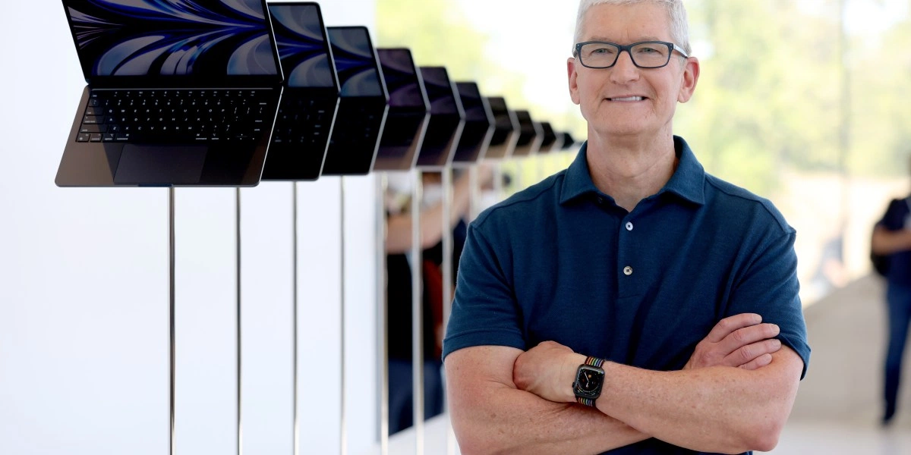
  
**Tags:** `shoulder` · `standing` · `sleeve` · `leisure` · `eyewear` · `white-collar worker` · `smile` · `glasses` · `vision care` · `apple` · `watch`

---

## 33. Item 33

**Type:** Instagram
  
**Source:** [https://www.instagram.com/reel/C4tDajHKl0T/?igsh=YTZyZGxsenJ5eXNo](https://www.instagram.com/reel/C4tDajHKl0T/?igsh=YTZyZGxsenJ5eXNo)
  
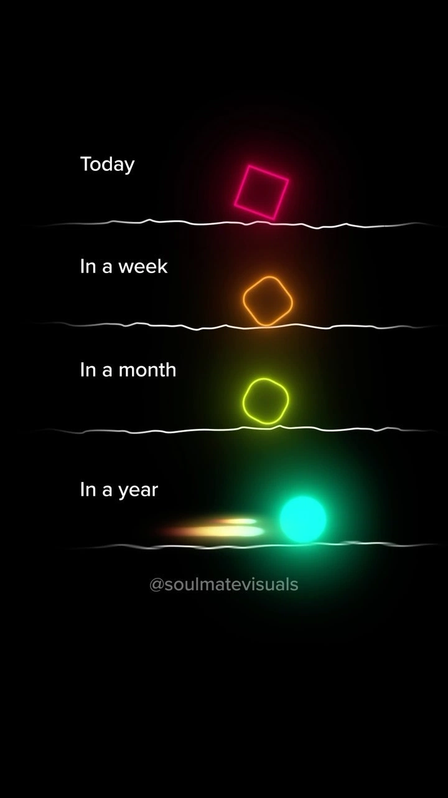
  
**Tags:** `light` · `rectangle` · `font` · `gas` · `lens flare` · `electricity`

---

## 34. TeamPlan | Index Ventures

**Type:** Article
  
**Source:** [https://www.indexventures.com/teamplan/](https://www.indexventures.com/teamplan/)
  
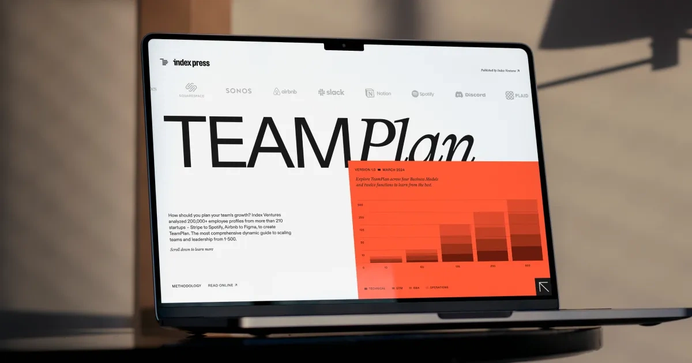
  
**Tags:** `led-backlit lcd display` · `index ventures` · `personal computer` · `computer` · `laptop` · `netbook` · `gadget` · `font`

---

## 35. Item 35

**Type:** Twitter
  
**Source:** [https://x.com/hpdailyrant/status/1770469210378137863?s=12&t=Kbl6Kd9qhuaRg9Z7iATE...](https://x.com/hpdailyrant/status/1770469210378137863?s=12&t=Kbl6Kd9qhuaRg9Z7iATEEw)
  
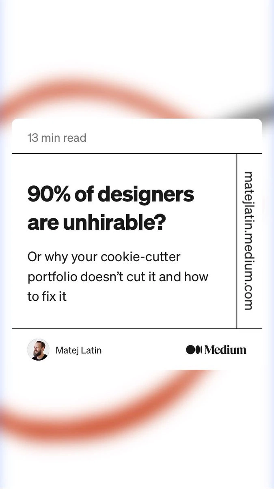
  
**Tags:** `document` · `font` · `material property`

---

## 36. 101 design rules

**Type:** Article
  
**Source:** [https://www.wearecollins.com/ideas/101-design-rules/](https://www.wearecollins.com/ideas/101-design-rules/)
  
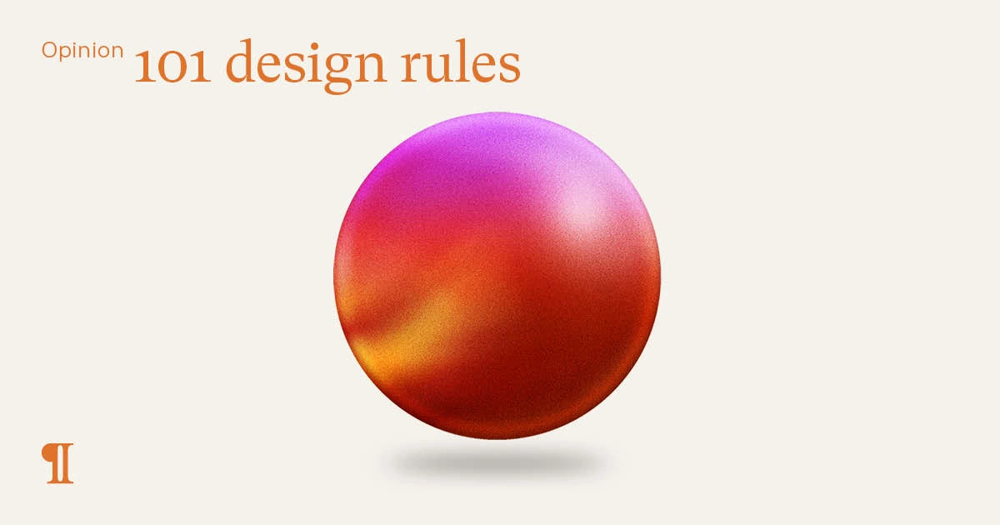
  
**Tags:** `circle` · `egg`

---

## 37. Item 37

**Type:** Twitter
  
**Source:** [https://twitter.com/dvassallo/status/1767945479697190966](https://twitter.com/dvassallo/status/1767945479697190966)
  

---

## 38. Item 38

**Type:** Twitter
  
**Source:** [https://x.com/orangebook_/status/1767361724976648550?s=12&t=Kbl6Kd9qhuaRg9Z7iATE...](https://x.com/orangebook_/status/1767361724976648550?s=12&t=Kbl6Kd9qhuaRg9Z7iATEEw)

---

## 39. Item 39

**Type:** Twitter
  
**Source:** [https://twitter.com/hvpandya/status/1766454765225906393](https://twitter.com/hvpandya/status/1766454765225906393)

---

## 40. Item 40

**Type:** Twitter
  
**Source:** [https://twitter.com/MrNick_Buzz/status/1765653652897976553](https://twitter.com/MrNick_Buzz/status/1765653652897976553)
  
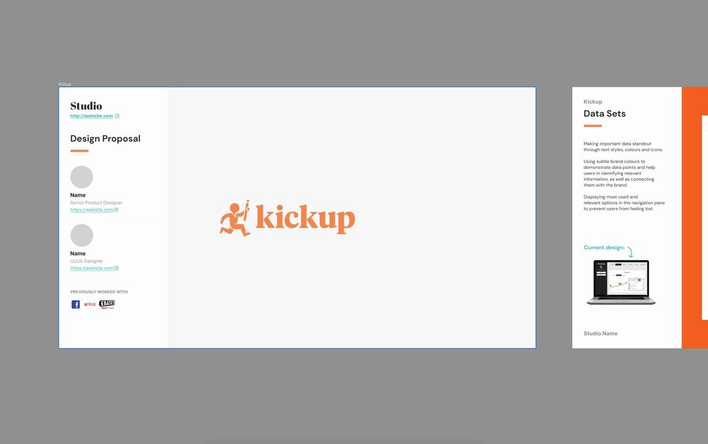
  
**Tags:** `orange` · `rectangle` · `font` · `screenshot` · `software`

---

## 41. Item 41

**Type:** Twitter
  
**Source:** [https://x.com/mindaugaslt/status/1764210981163372912?s=12&t=Kbl6Kd9qhuaRg9Z7iATE...](https://x.com/mindaugaslt/status/1764210981163372912?s=12&t=Kbl6Kd9qhuaRg9Z7iATEEw)

---

## 42. Item 42

**Type:** Twitter
  
**Source:** [https://x.com/orangebook_/status/1764229224578322802?s=12&t=Kbl6Kd9qhuaRg9Z7iATE...](https://x.com/orangebook_/status/1764229224578322802?s=12&t=Kbl6Kd9qhuaRg9Z7iATEEw)

---

## 43. Item 43

**Type:** Twitter
  
**Source:** [https://x.com/orangebook_/status/1763786105399529504?s=12&t=Kbl6Kd9qhuaRg9Z7iATE...](https://x.com/orangebook_/status/1763786105399529504?s=12&t=Kbl6Kd9qhuaRg9Z7iATEEw)

---

## 44. Item 44

**Type:** Twitter
  
**Source:** [https://twitter.com/orangebook_/status/1763577627066196323](https://twitter.com/orangebook_/status/1763577627066196323)

---

## 45. Item 45

**Type:** Twitter
  
**Source:** [https://twitter.com/orangebook_/status/1763398228714930344](https://twitter.com/orangebook_/status/1763398228714930344)

---

## 46. How can the industry make design careers seem more accessible?

**Type:** Article
  
**Source:** [https://www.designweek.co.uk/issues/04-september-8-september-2023/industry-desig...](https://www.designweek.co.uk/issues/04-september-8-september-2023/industry-design-careers-accessible/)
  

  
**Tags:** `table` · `gesture` · `gadget` · `output device` · `audio equipment` · `product` · `desk` · `technology` · `personal computer` · `computer` · `communication device` · `computer monitor` · `peripheral` · `engineering` · `computer desk`

---
