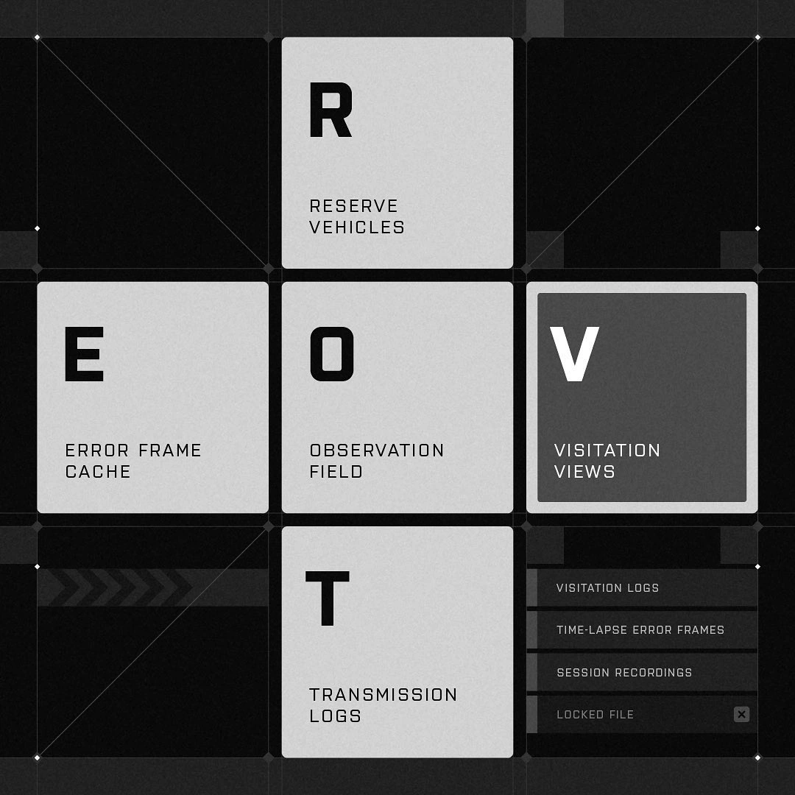
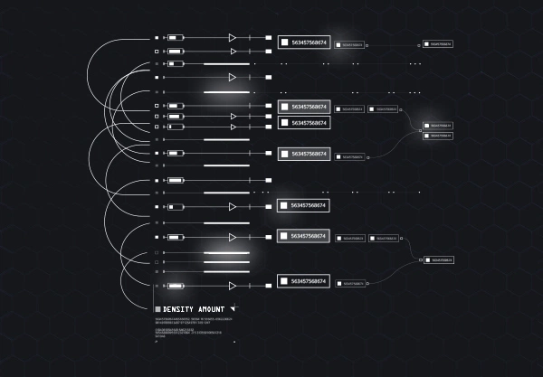
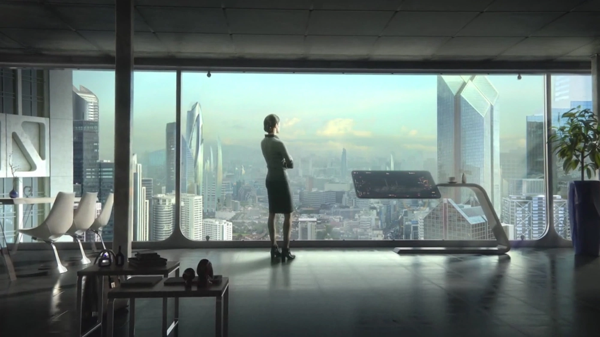
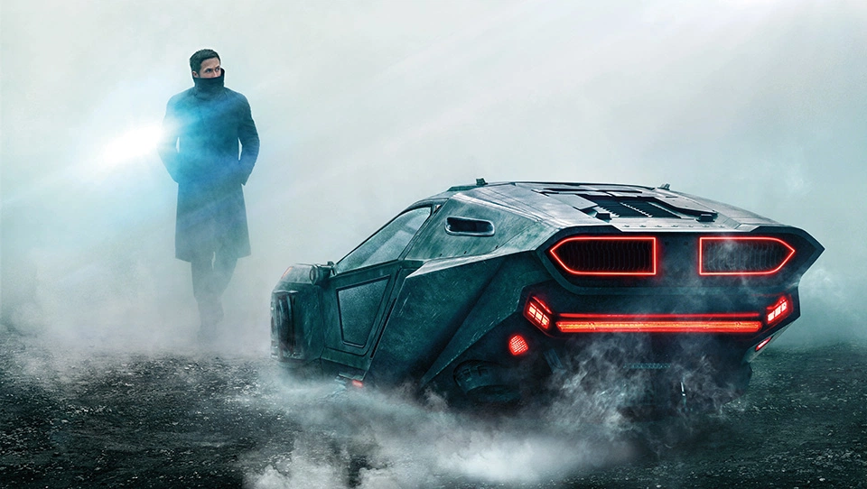

# Conceptual Interfaces

> Cosmos.so collection by [@arjunphlox](https://www.cosmos.so/arjunphlox/conceptual-interfaces)
>
> 7 items collected

---

## 1. InstagramElement #295107168

**Type:** Instagram  
**Source:** [https://www.instagram.com/p/C5B3aUfvmf1/?igsh=aTMzeWl2ZG9kNnp6](https://www.instagram.com/p/C5B3aUfvmf1/?igsh=aTMzeWl2ZG9kNnp6)  

**Tags:** `number` `mathematics` `cube net` `colorfulness` `rectangle` `slope` `font` `parallel`

---

## 2. Element #965392985

**Type:** UPLOAD  
**Source:** [https://www.behance.net/gallery/19411533/Quantum-HUD-Infographic-Pack](https://www.behance.net/gallery/19411533/Quantum-HUD-Infographic-Pack)  

**Tags:** `font` `rectangle` `light`

---

## 3. Interface In Game | Collection of video games UI | Screenshots and videos

**Type:** Article  
**Source:** [https://interfaceingame.com/](https://interfaceingame.com/)  

*The logo for <n>Interface In Game</n>, a collection of video game user interfaces.*

**Tags:** `black-and-white` `tints and shades` `plant` `font` `grey` `darkness`

---

## 4. Sci-fi Interface — Toshiba USA Campaign.

**Type:** Article  
**Source:** [https://www.behance.net/gallery/53457579/Sci-fi-Interface-Toshiba-USA-Campaign](https://www.behance.net/gallery/53457579/Sci-fi-Interface-Toshiba-USA-Campaign)  

**Tags:** `building` `art` `city` `metropolitan area` `glass` `tower block` `skyscraper` `toshiba bring life forward jpg` `the omega man`

---

## 5. Blade Runner 2049 - Territory Studio

**Type:** Article  
**Source:** [http://territorystudio.com/project/blade-runner-2049/](http://territorystudio.com/project/blade-runner-2049/)  

**Tags:** `vehicle` `automotive design` `motor vehicle` `car` `tire` `hood` `automotive lighting` `personal luxury car` `automotive exterior` `automotive tire` `bumper` `rolling` `land vehicle` `helmet` `racing` `blade runner` `blade runner 2049` `ryan gosling` `officer k` `blade runner carro voador`

---

## 6. Lukas ‎Havlik

**Type:** Article  
**Source:** [https://www.behance.net/ludenworks](https://www.behance.net/ludenworks)  

**Tags:** `font` `material property` `pattern` `circle` `symbol` `monochrome photography`

---

## 7. Star Wars Jedi: Fallen Order | Game UI Database

**Type:** Article  
**Source:** [https://www.gameuidatabase.com/gameData.php?id=278#&gid=1&pid=33](https://www.gameuidatabase.com/gameData.php?id=278#&gid=1&pid=33)  

**Tags:** `font` `game ui database logo` `game ui database` `fight for america: country war`

---
