# Design by Nature

*Exported from [Cosmos.so](https://www.cosmos.so/arjunphlox/design-by-nature) -- 52 items*

---

## 1. The New Science of Plant Intelligence and the Mystery of What Makes a Mind

**Type:** Article | **Format:** ARTICLE

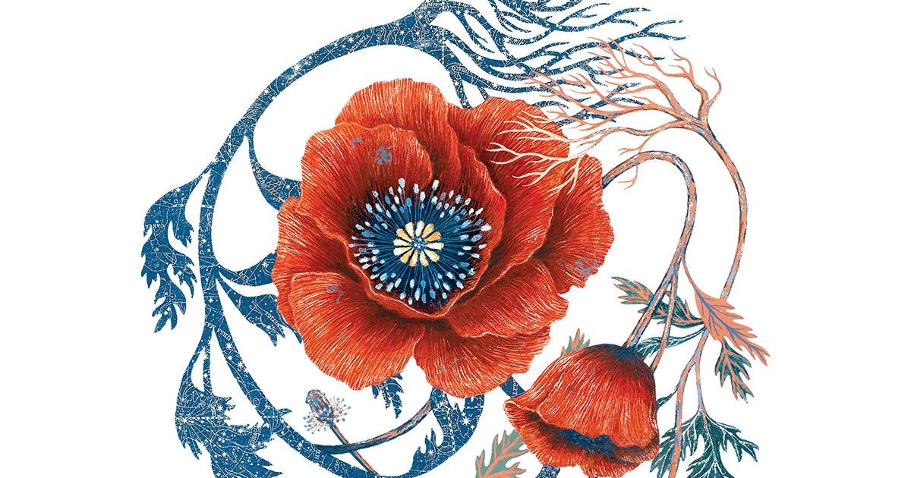

**Tags:** `carolina rose`

[Source](https://www.themarginalian.org/2024/05/24/the-light-eaters/)

---

## 2. An Indian peafowl perched on a branch.

**Type:** Instagram | **Format:** INSTAGRAM

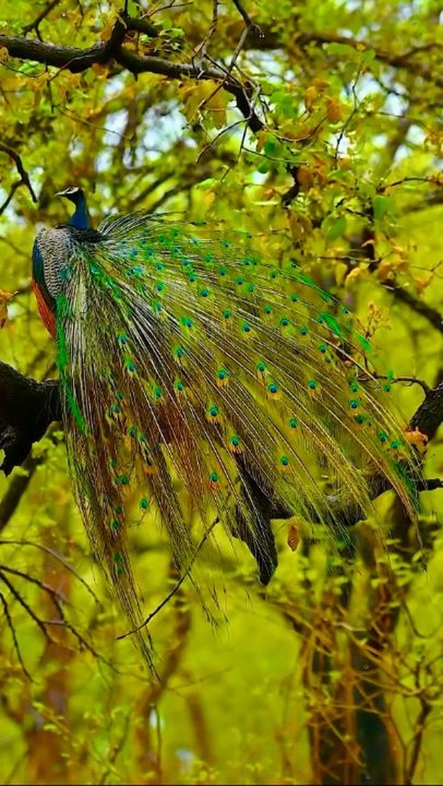

> An Indian peafowl perched on a branch.

**Tags:** `tree` `peafowl` `bird` `vegetation` `terrestrial plant` `beak` `feather` `plant` `twig`

[Source](https://www.instagram.com/reel/C5ZgTHAv-DD/?igsh=czh1M3JlZjFraXJu)

---

## 3. Item 3

**Type:** Pinterest | **Format:** PINTEREST

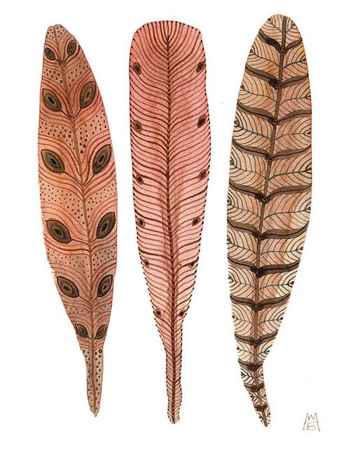

**Tags:** `feather` `wood` `organism` `terrestrial plant` `tree` `plant` `grass family`

[Source](http://farm5.static.flickr.com/4092/5040990835_6a64ac8cc9_z.jpg)

---

## 4. An illustration of the Sphaerocoris annulus, or Picasso Bug, by artist Bernard D...

**Type:** Pinterest | **Format:** PINTEREST

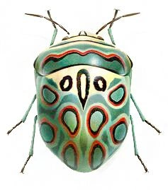

> An illustration of the Sphaerocoris annulus, or Picasso Bug, by artist Bernard Durin.

**Tags:** `picasso bug zulu hud bug` `jewel bugs` `insects` `beetles` `beetles and other insects` `true bugs` `arthropod` `stink bugs` `sphaerocoris annulus` `insect` `art` `creative arts`

[Source](http://hyiyh.com/)

---

## 5. Item 5

**Type:** Pinterest | **Format:** PINTEREST

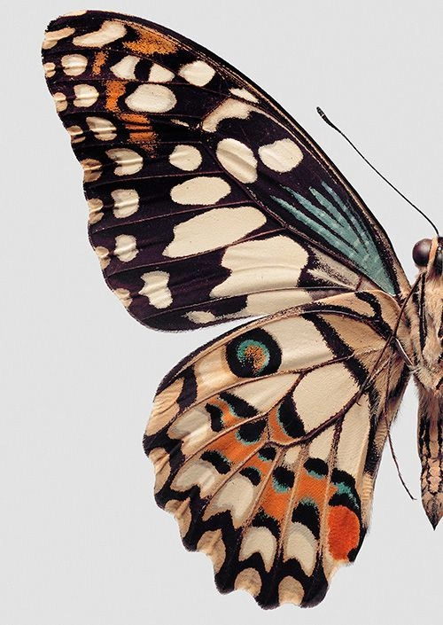

**Tags:** `half butterfly` `pollinator` `butterfly` `insect` `arthropod` `moths and butterflies` `wing`

[Source](https://www.tumblr.com/dashboard/3/93975487777)

---

## 6. Item 6

**Type:** Pinterest | **Format:** PINTEREST

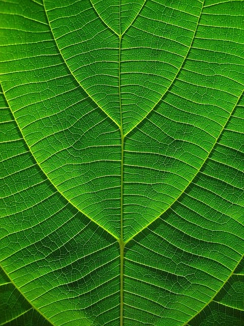

**Tags:** `naturaleza texturas visuales naturales` `texture` `plant` `terrestrial plant` `tree` `flowering plant`

[Source](http://www.flickr.com/photos/omnia/775218170/)

---

## 7. Macro photograph of Panacea prola butterfly wing scales by Charles Krebs, 2012.

**Type:** Pinterest | **Format:** PINTEREST

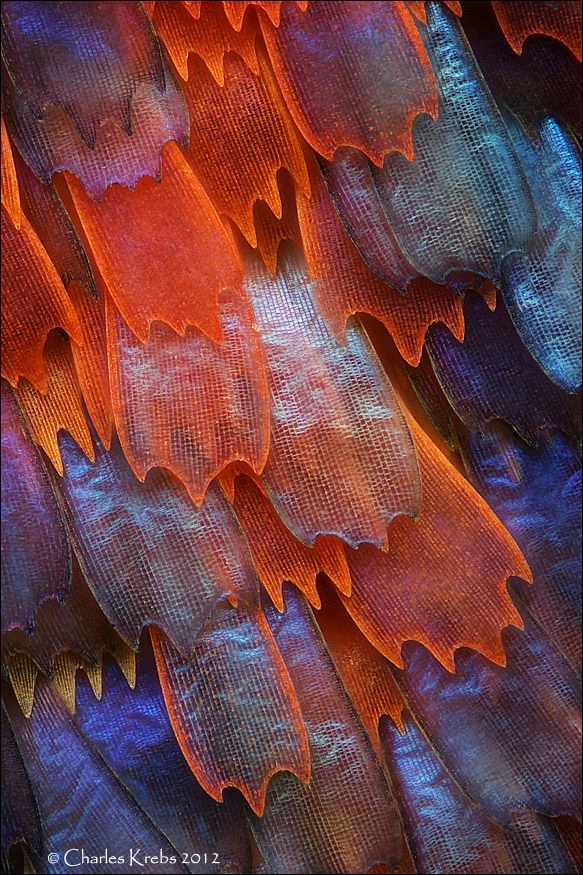

> Macro photograph of Panacea prola butterfly wing scales by Charles Krebs, 2012.

**Tags:** `leaf` `photography` `microscope` `macro photography` `panacea prola` `orange` `organism` `wood` `tints and shades` `electric blue` `pattern`

[Source](http://www.photomacrography.net/forum/viewtopic.php?t=17638)

---

## 8. Item 8

**Type:** Pinterest | **Format:** PINTEREST

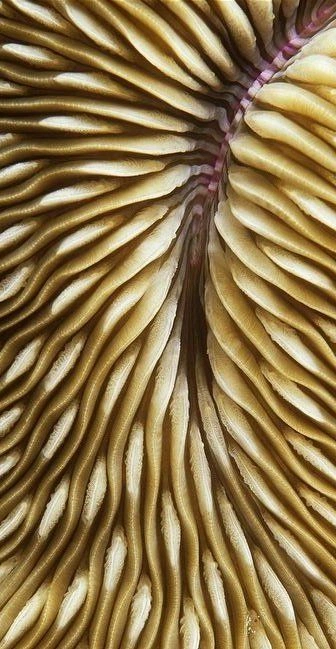

**Tags:** `close up` `art` `plant` `terrestrial plant`

[Source](http://www.brabbu.com/en/inspiration-and-ideas/)

---

## 9. Moth specimens, including Pseudasellodes laternaria.

**Type:** Pinterest | **Format:** PINTEREST

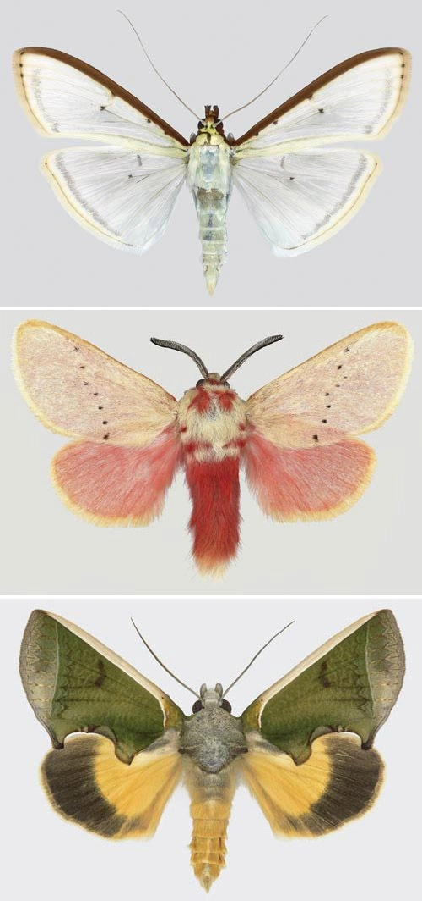

> Moth specimens, including Pseudasellodes laternaria.

**Tags:** `fauna` `lepidoptera` `arthropod` `clouded yellows` `domestic silk moth` `pollinator` `insect` `butterfly` `white` `moths and butterflies` `organism` `symmetry`

[Source](http://www.unruly-things.com/2010/06/joseph-scheer-moths.html)

---

## 10. Item 10

**Type:** Pinterest | **Format:** PINTEREST

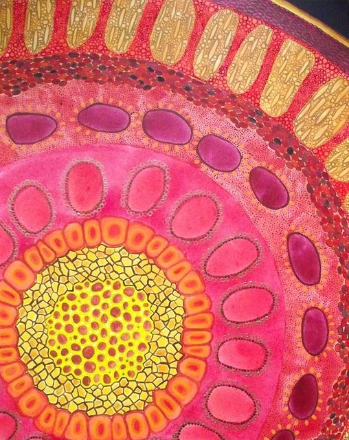

**Tags:** `orange` `art` `painting` `petal` `red` `circle` `pattern` `magenta`

[Source](http://www.flickr.com/photos/nimanoma/6702475553/in/photostream)

---

## 11. A natural, free-form beehive.

**Type:** Pinterest | **Format:** PINTEREST

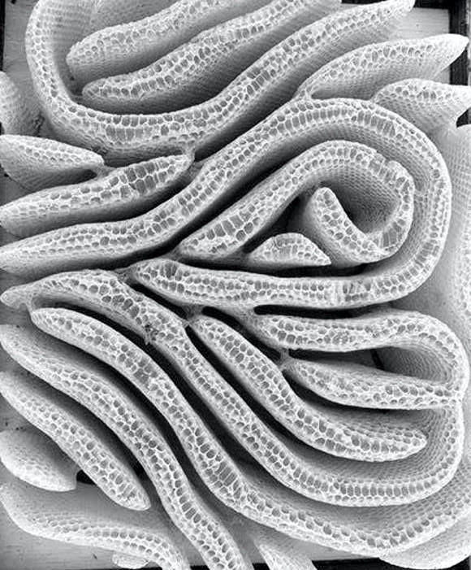

> A natural, free-form beehive.

**Tags:** `honeycomb organic texture` `bees` `honeycomb` `vertebrate` `organism` `art` `pattern`

[Source](https://www.pinterest.com/pin/101260691598866806/)

---

## 12. Item 12

**Type:** Pinterest | **Format:** PINTEREST

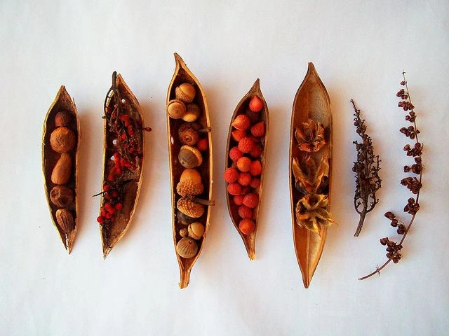

**Tags:** `plant` `food` `tree` `vegetable` `spice` `wood`

[Source](http://www.flickr.com/photos/monsterandmolehill/5085062484/in/photostream/)

---

## 13. A 2013 micrograph of Moss Leaf Chloroplasts by photographer Waldo Nell.

**Type:** Pinterest | **Format:** PINTEREST

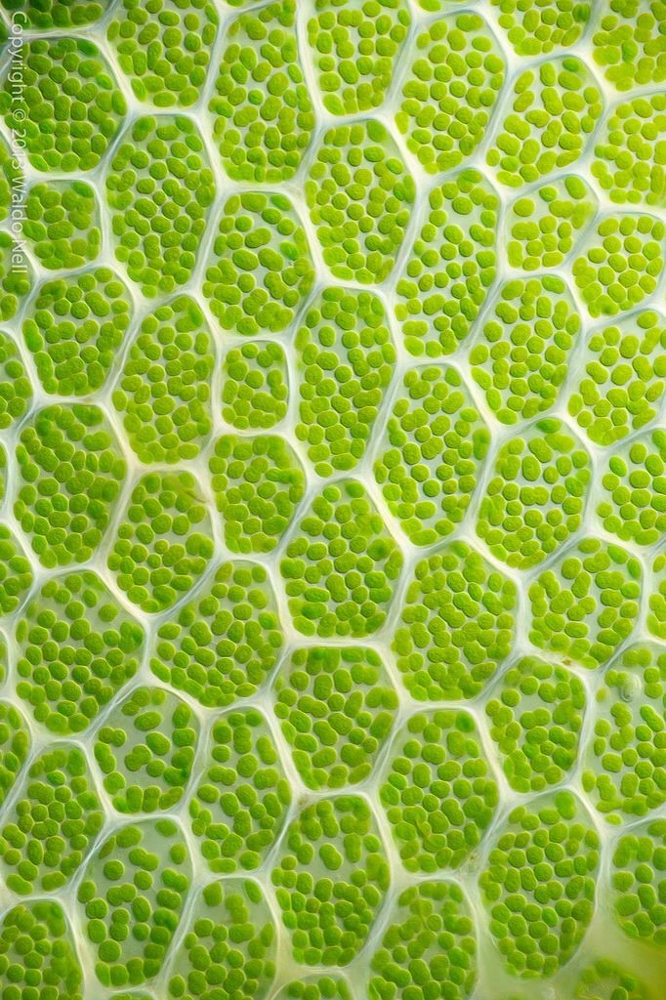

> A 2013 micrograph of Moss Leaf Chloroplasts by photographer Waldo Nell.

**Tags:** `microscopic patterns in nature` `pattern` `cell` `green` `leaf` `flower` `plant` `botany` `organism` `vegetation` `terrestrial plant`

[Source](https://www.flickr.com/photos/pwnell/with/10655617516/)

---

## 14. Item 14

**Type:** Pinterest | **Format:** PINTEREST

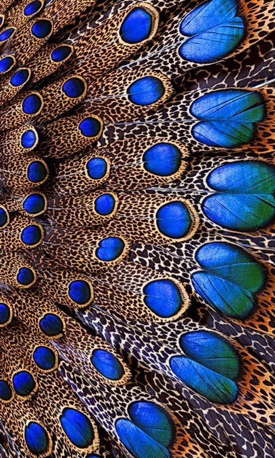

**Tags:** `animal patterns in natur` `birds` `nature` `patterns in nature` `pattern` `blue` `water` `azure` `organism` `natural material` `art` `aqua` `symmetry`

[Source](http://hugsforbears.tumblr.com/post/61745196995)

---

## 15. A photograph from the Arrangements series by Emily Blincoe showing the process o...

**Type:** Pinterest | **Format:** PINTEREST

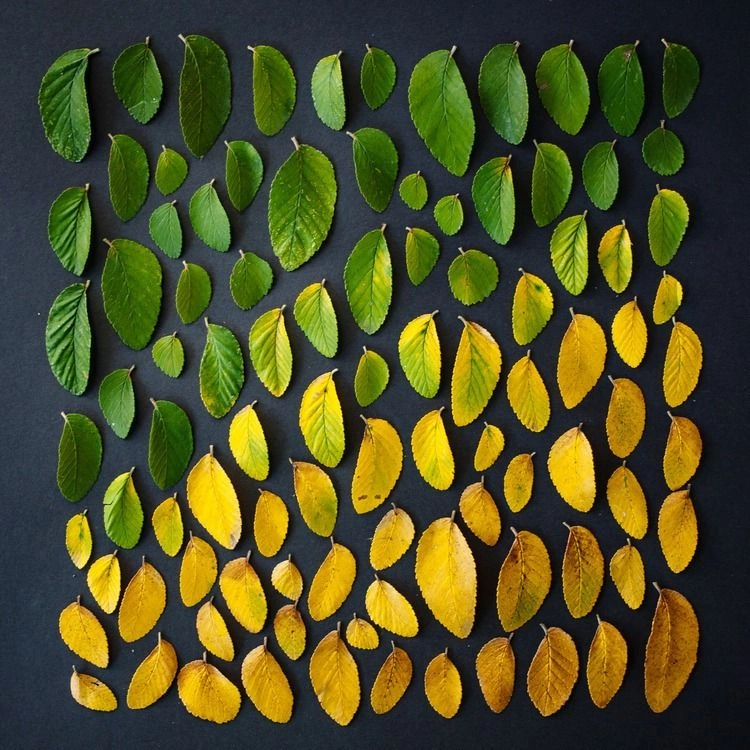

> A photograph from the Arrangements series by Emily Blincoe showing the process of leaf senescence.

**Tags:** `arrangement photography` `photography` `photograph` `photographer` `plant` `botany` `fruit` `terrestrial plant` `tree` `font`

[Source](http://mashable.com/2014/09/01/emily-blincoe-photography/)

---

## 16. Item 16

**Type:** Pinterest | **Format:** PINTEREST

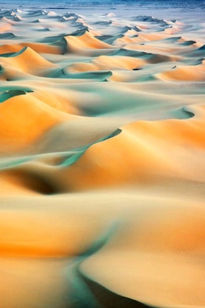

**Tags:** `zoo park` `desert` `liquid` `water` `orange` `sky` `natural landscape` `cloud` `art` `landscape`

[Source](http://furkl.com/dunes-at-sunrise/)

---

## 17. Item 17

**Type:** Pinterest | **Format:** PINTEREST

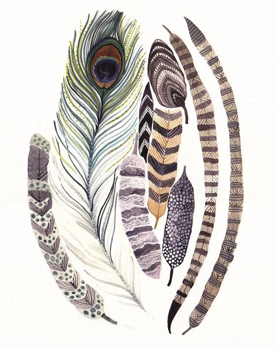

**Tags:** `gandhi park` `boot` `shoe` `feather` `beak` `natural material` `art` `phasianidae` `font` `terrestrial animal` `wing`

[Source](http://www.etsy.com/listing/80616284/feathers-large-archival-print)

---

## 18. A photograph of a goldfish by Hiroshi Iwasaki.

**Type:** Pinterest | **Format:** PINTEREST

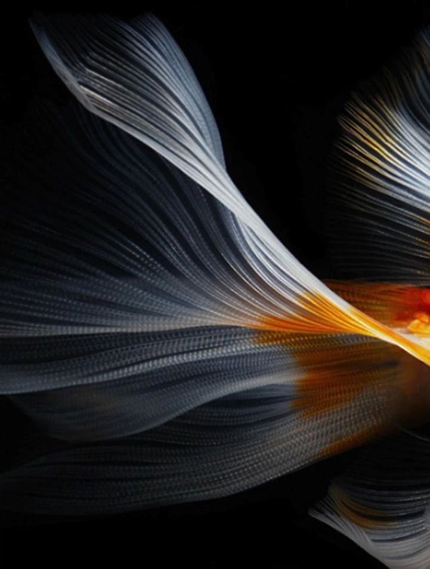

> A photograph of a goldfish by Hiroshi Iwasaki.

**Tags:** `feather` `photography` `automotive lighting` `plant` `petal` `automotive design` `tints and shades` `art`

[Source](http://www.mymodernmet.com/profiles/blogs/hiroshi-iwasaki-fish)

---

## 19. Item 19

**Type:** Pinterest | **Format:** PINTEREST

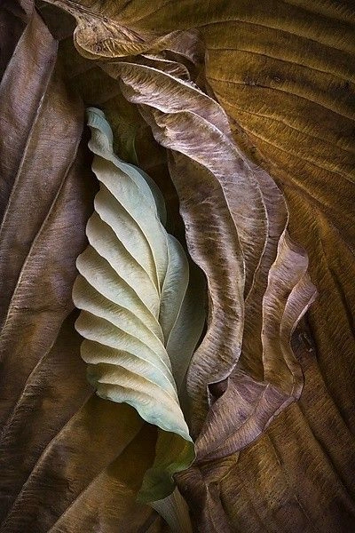

**Tags:** `ralph gabriner photography` `photography` `photograph` `art` `color photography` `wood` `tints and shades`

[Source](http://www.artfulhome.com/product/Color-Photograph/Hosta-Leaves-10/73338)

---

## 20. Item 20

**Type:** Pinterest | **Format:** PINTEREST

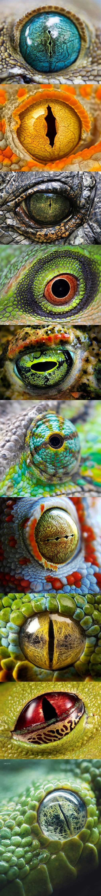

**Tags:** `water` `reptiles` `eye` `green` `nature` `botany` `reptile` `iguania` `organism` `iris`

[Source](http://flightlessfeather.tumblr.com/post/34277486236)

---

## 21. Item 21

**Type:** Pinterest | **Format:** PINTEREST

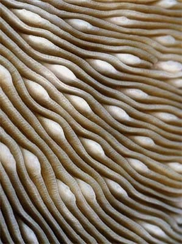

**Tags:** `natures textures` `nature` `patterns in nature` `wood` `art`

[Source](http://www.medioambiente.org/2012/06/coral-hongo-no-espermatozoides.html)

---

## 22. Item 22

**Type:** Pinterest | **Format:** PINTEREST

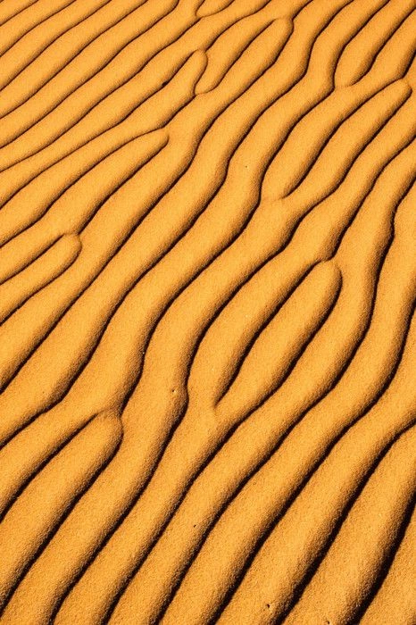

**Tags:** `desert natural pattern` `nature` `sand` `desert` `kalahari desert` `brown` `amber` `tints and shades` `wood` `pattern`

[Source](http://harvestheart.tumblr.com/page/681)

---

## 23. Hyperrealistic paintings of citrus fruit by artist Dennis Wojtkiewicz.

**Type:** Pinterest | **Format:** PINTEREST

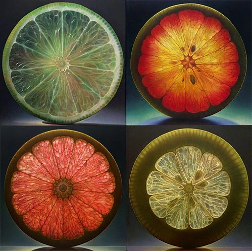

> Hyperrealistic paintings of citrus fruit by artist Dennis Wojtkiewicz.

**Tags:** `math do you see` `geometry` `mathematics` `photograph` `green` `light` `orange` `yellow` `amber`

[Source](http://vincepeterson.tumblr.com/post/16177484441)

---

## 24. A close-up of the feathers of an Indian Peafowl.

**Type:** Pinterest | **Format:** PINTEREST

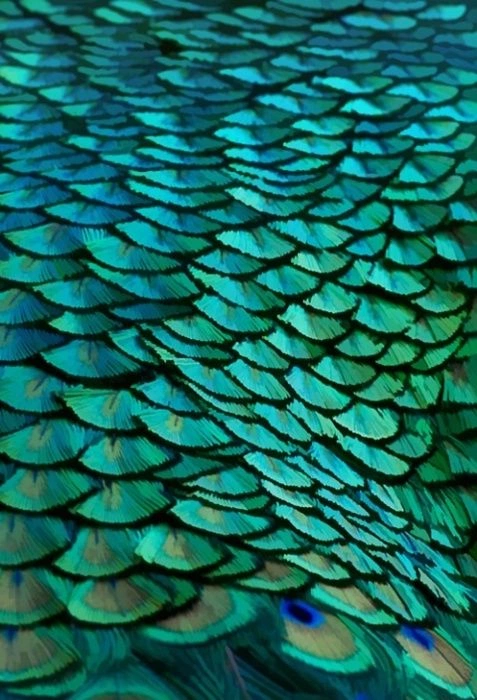

> A close-up of the feathers of an Indian Peafowl.

**Tags:** `peacock color texture` `color` `water` `natural material` `body of water` `aqua` `pattern` `marine biology` `electric blue`

[Source](http://houseoffallingleaves.tumblr.com/post/16073868811/peacock-feathers-being-beautiful)

---

## 25. The Wandkleed Zebra Patroon tapestry from Canvasso.

**Type:** Pinterest | **Format:** PINTEREST

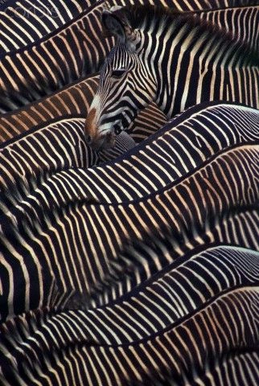

> The Wandkleed Zebra Patroon tapestry from Canvasso.

**Tags:** `pattern` `grévy's zebra` `せかいの動物` `zebra` `vertebrate` `mammal` `terrestrial animal` `wood` `plant` `water` `landscape`

[Source](http://www.corbisimages.com/stock-photo/rights-managed/42-18537730/grevys-zebras)

---

## 26. An illustration of a Loop pattern fingerprint.

**Type:** Pinterest | **Format:** PINTEREST

> An illustration of a Loop pattern fingerprint.

**Tags:** `fingerprint loop pattern` `fingerprint` `line` `symmetry` `art` `font` `pattern`

[Source](http://ridgesandfurrows.homestead.com/fingerprint_patterns.html)

---

## 27. A photograph of Monarch butterflies by Elmira Amirova.

**Type:** Pinterest | **Format:** PINTEREST

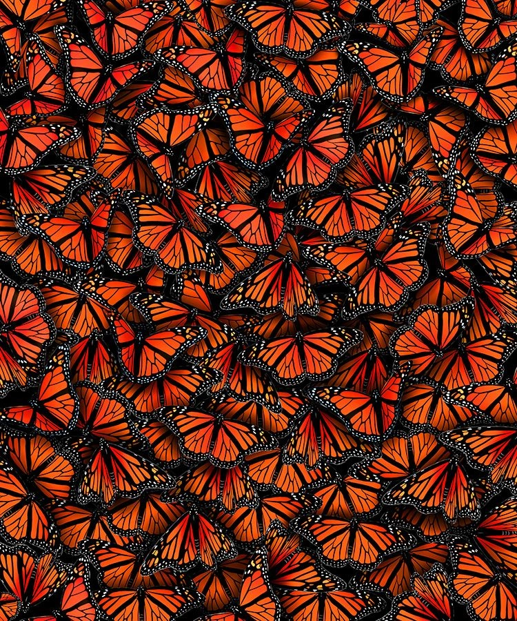

> A photograph of Monarch butterflies by Elmira Amirova.

**Tags:** `pile of butterflies` `monarch butterfly` `butterflies` `swallowtail butterfly` `butterfly` `orange` `motif` `amber` `material property` `rectangle` `symmetry` `pattern` `art`

[Source](https://www.betafashion.com/competitionratedesign.aspx?SubmissionID=3508)

---

## 28. A microscopic view of a peacock feather. Photo by Waldo Nell, 2013.

**Type:** Pinterest | **Format:** PINTEREST

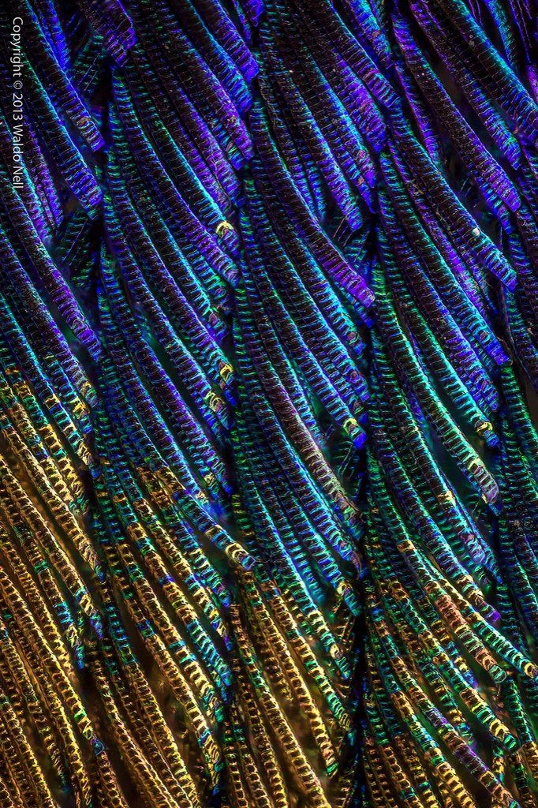

> A microscopic view of a peacock feather. Photo by Waldo Nell, 2013.

**Tags:** `paon au microscope` `microscope` `electron microscope` `structural coloration` `magenta` `electric blue`

[Source](https://www.flickr.com/photos/pwnell/with/10655617516/)

---

## 29. Item 29

**Type:** Pinterest | **Format:** PINTEREST

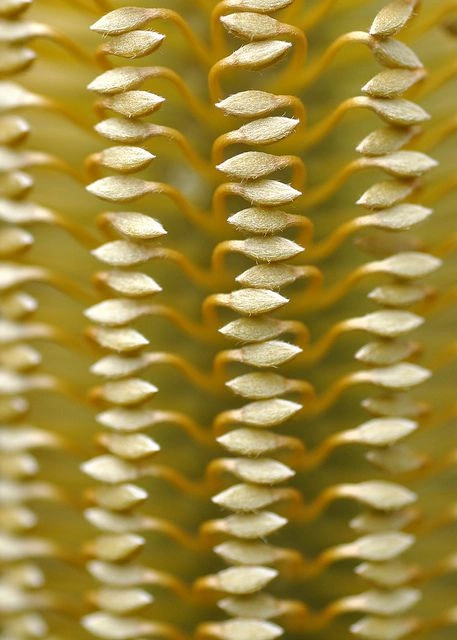

**Tags:** `close up` `patterns in nature` `terrestrial plant` `pattern`

[Source](http://www.flickr.com/photos/flowerpress/5629776970/)

---

## 30. Photograph of a green tiled roof by Bertrand Linet.

**Type:** Pinterest | **Format:** PINTEREST

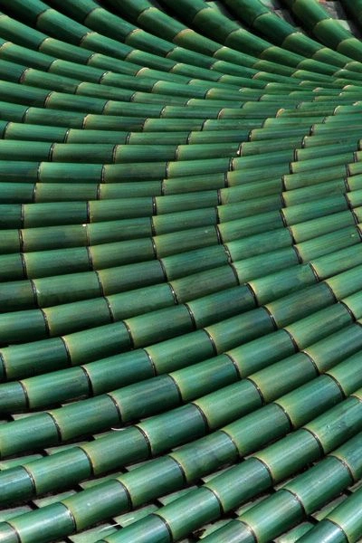

> Photograph of a green tiled roof by Bertrand Linet.

**Tags:** `glazed roof tile` `tile` `roof tiles` `roof` `azure` `organism` `vegetation` `terrestrial plant` `line` `aqua` `material property` `symmetry`

[Source](http://www.flickr.com/photos/23133487@N07/4705910830)

---

## 31. A Spotted Tortoise Beetle on a leaf.

**Type:** Pinterest | **Format:** PINTEREST

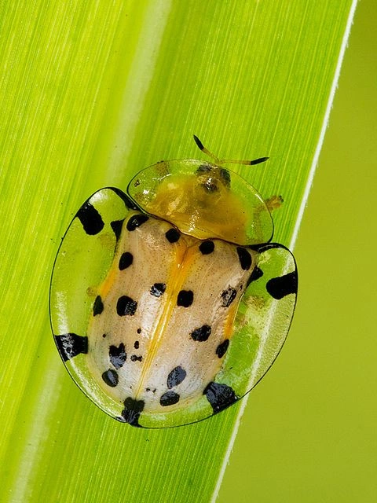

> A Spotted Tortoise Beetle on a leaf.

**Tags:** `macro photography` `beetles` `insects` `insect` `arthropod` `liquid` `terrestrial plant` `pest`

[Source](http://www.flickr.com/photos/allanlee/8266168344/lightbox/)

---

## 32. Sunflower (2015), a photograph by Alva Art & Design.

**Type:** Pinterest | **Format:** PINTEREST

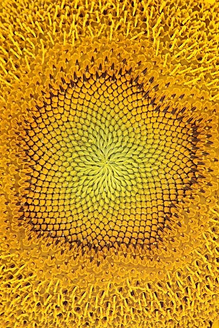

> Sunflower (2015), a photograph by Alva Art & Design.

**Tags:** `sunflower` `pattern` `symmetry`

[Source](http://www.flickr.com/photos/sophiediana/4835163865/in/photostream/)

---

## 33. A microscopic view of a dragonfly wing from a Bresser smart slide.

**Type:** Pinterest | **Format:** PINTEREST

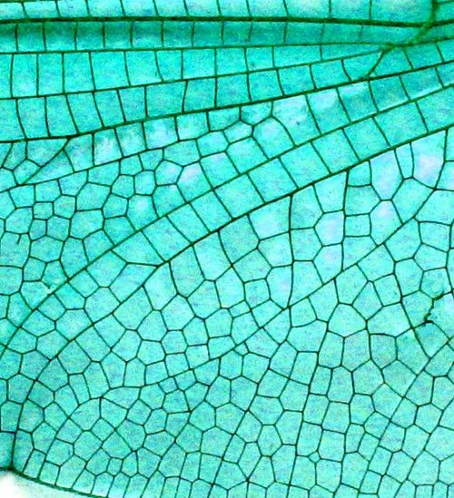

> A microscopic view of a dragonfly wing from a Bresser smart slide.

**Tags:** `dragonfly texture` `turquoise` `azure` `rectangle` `line` `aqua` `mesh` `pattern` `electric blue`

[Source](http://adorablelife.tumblr.com/page/15)

---

## 34. A Porpita porpita, a marine hydrozoan commonly known as the Blue Button.

**Type:** Pinterest | **Format:** PINTEREST

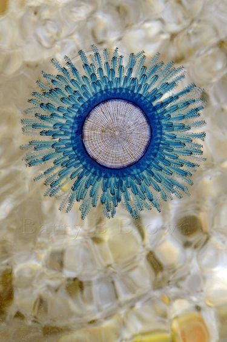

> A Porpita porpita, a marine hydrozoan commonly known as the Blue Button.

**Tags:** `blue button jellyfish` `blue button` `portuguese man o' war` `jellyfish` `azure` `petal` `textile` `aqua` `art` `eyelash` `dishware` `electric blue`

[Source](http://www.coralreefphotos.com/2011/07/)

---

## 35. Item 35

**Type:** Pinterest | **Format:** PINTEREST

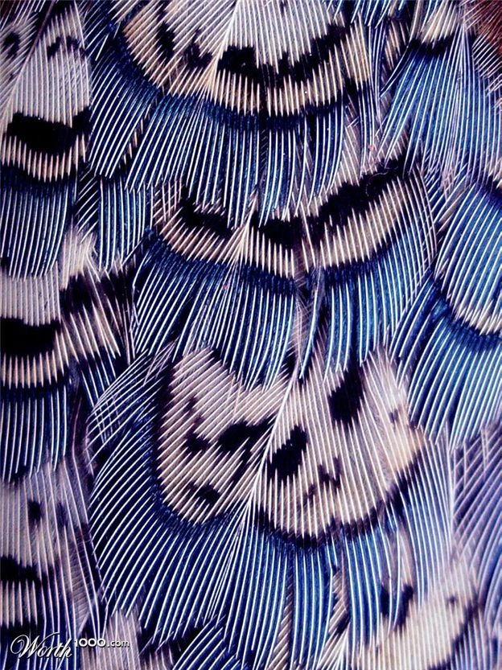

**Tags:** `feather` `birds` `purple` `water` `art` `tints and shades` `pattern` `electric blue` `symmetry`

[Source](http://fxb.worth1000.com/contests/2577/macro)

---

## 36. Item 36

**Type:** Pinterest | **Format:** PINTEREST

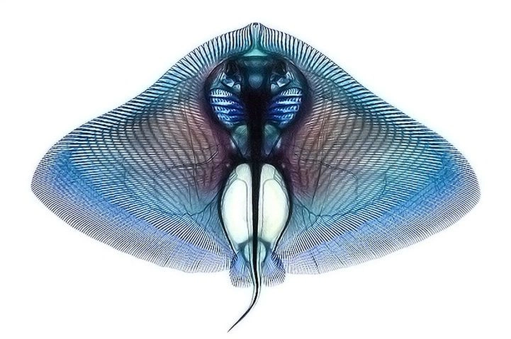

**Tags:** `dyed fish bones` `batoids` `smooth butterfly ray` `cartilaginous fishes` `fish` `freshwater butterflyfish` `head` `insect` `arthropod` `pollinator` `plant` `wing` `symmetry`

[Source](http://www.mymodernmet.com/profiles/blogs/adam-summers-cleared)

---

## 37. Item 37

**Type:** Pinterest | **Format:** PINTEREST

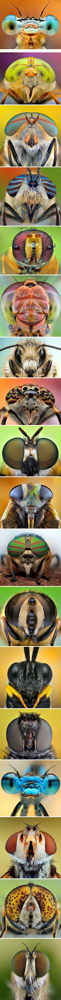

**Tags:** `water` `photograph` `green` `vertebrate` `nature` `arthropod` `organism` `insect` `mammal`

[Source](https://www.pinterest.com/pin/101260691595398520/)

---

## 38. A black and white photograph of Aspen Tree trunks.

**Type:** Pinterest | **Format:** PINTEREST

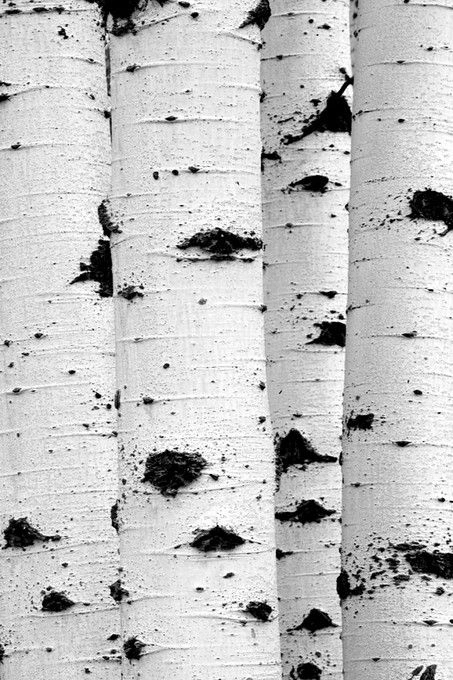

> A black and white photograph of Aspen Tree trunks.

**Tags:** `black and white bark trees` `bark` `black` `black-and-white` `wall` `font` `tints and shades` `pattern`

[Source](http://jeffreymurray.photoshelter.com/gallery-image/FOREST/G0000oCOLnLl6P2c/I0000AJqMoUwzrZ0)

---

## 39. Item 39

**Type:** Pinterest | **Format:** PINTEREST

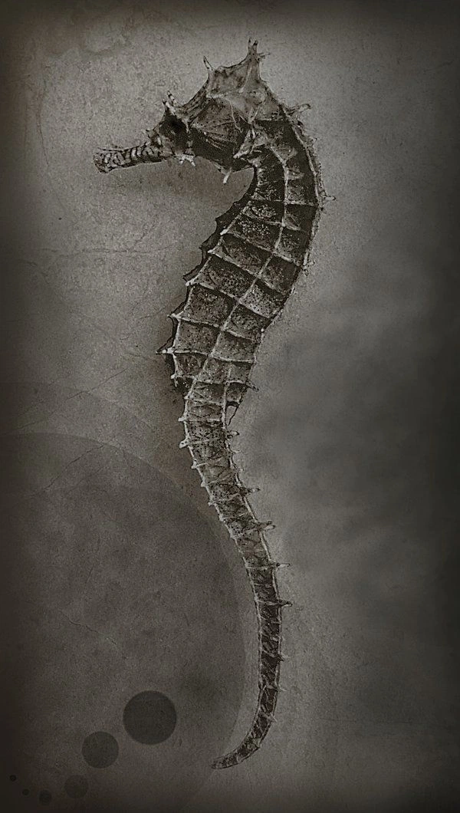

**Tags:** `monochrome photography` `insect` `syngnathiformes` `northern seahorse`

[Source](https://www.pinterest.com/pin/101260691595312848/)

---

## 40. Item 40

**Type:** Pinterest | **Format:** PINTEREST

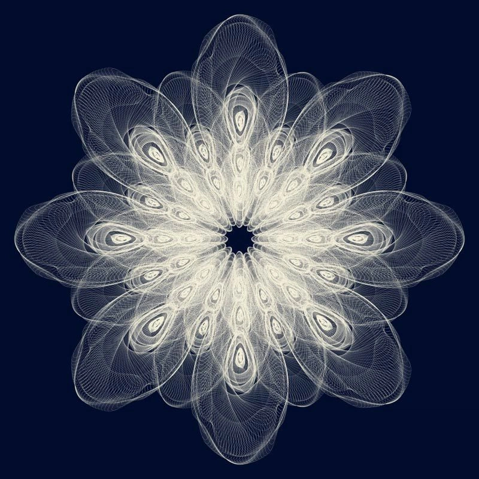

**Tags:** `vibrazioni dell anima` `naniirodemonai hana (a flower of no color)` `flower` `plant` `petal` `art` `font`

[Source](http://eeryelegance.blogspot.com/2011/01/mandala-circular-symbol-of-wholeness.html)

---

## 41. The 2012 sculpture STIR by artist Kate MccGwire.

**Type:** Pinterest | **Format:** PINTEREST

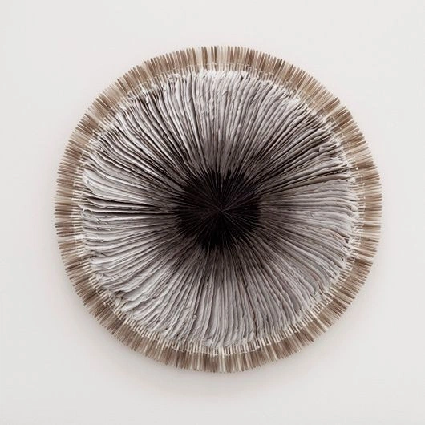

> The 2012 sculpture STIR by artist Kate MccGwire.

**Tags:** `brush` `sol` `grey`

[Source](http://www.theyutopia.com/)

---

## 42. Item 42

**Type:** Pinterest | **Format:** PINTEREST

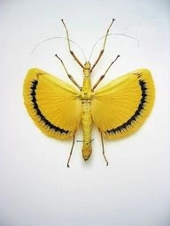

**Tags:** `insect that is yellow` `lepidoptera` `phasmids` `pterygota` `beetles` `pollinator` `insect` `arthropod` `butterfly` `moths and butterflies` `wing`

[Source](https://www.pinterest.com/pin/101260691593718814/)

---

## 43. Item 43

**Type:** Pinterest | **Format:** PINTEREST

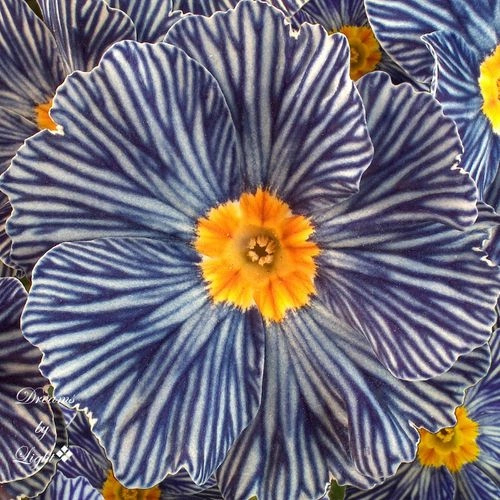

**Tags:** `flor cebra` `annual plant` `flower` `plant` `petal` `botany` `nature` `organism` `yellow` `terrestrial plant`

[Source](http://oooilike.imgfave.com/page:26?after=18845306)

---

## 44. Item 44

**Type:** Pinterest | **Format:** PINTEREST

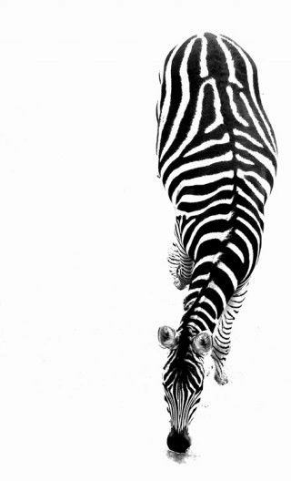

**Tags:** `zebra top view` `image` `drawing` `painting` `eye` `human body` `sleeve` `eyelash` `font` `art` `snout`

[Source](http://piccsy.com/?page=2)

---

## 45. Coloured scanning electron micrograph of the diatom Arachnoidiscus sp. by Steve ...

**Type:** Pinterest | **Format:** PINTEREST

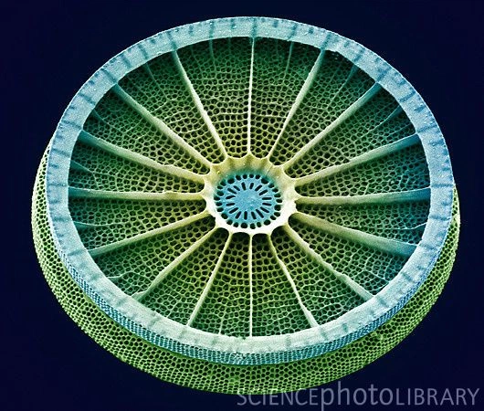

> Coloured scanning electron micrograph of the diatom Arachnoidiscus sp. by Steve Gschmeissner.

**Tags:** `diatoms under electron microscope` `diatom` `microscope` `electron microscope` `scanning electron microscope` `terrestrial plant` `dishware` `symmetry` `circle`

[Source](http://www.sciencephoto.com/media/16048/enlarge)

---

## 46. Item 46

**Type:** Pinterest | **Format:** PINTEREST

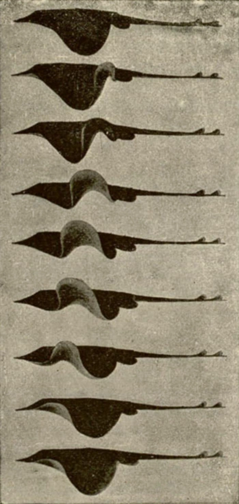

**Tags:** `stingray reference` `stingray` `drawing` `illustration` `wood` `font` `art`

[Source](http://lushlight.tumblr.com/post/38290959862/splattergut-undulations-of-the-fins-of-a-skate)

---

## 47. A close-up of a purple Pansy flower.

**Type:** Pinterest | **Format:** PINTEREST

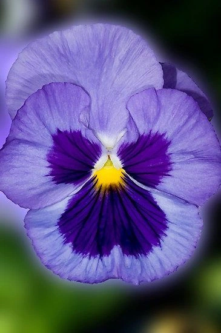

> A close-up of a purple Pansy flower.

**Tags:** `pansy` `violet` `flower` `plant` `purple` `petal` `terrestrial plant`

[Source](http://baenk.com/purple/purple-pansy-by-bonnie-t-barry/)

---

## 48. Item 48

**Type:** Pinterest | **Format:** PINTEREST

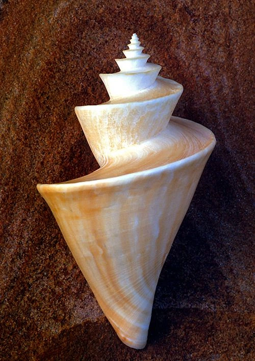

**Tags:** `conchology` `seashell` `wood` `tree` `dishware` `serveware` `shell` `pottery`

[Source](http://www.thephotoargus.com/inspiration/shells-are-swell-beautiful-examples-of-seashell-photography/)

---

## 49. An illustrative plate from The Anatomy of Plants (1682) by botanist Nehemiah Gre...

**Type:** Pinterest | **Format:** PINTEREST

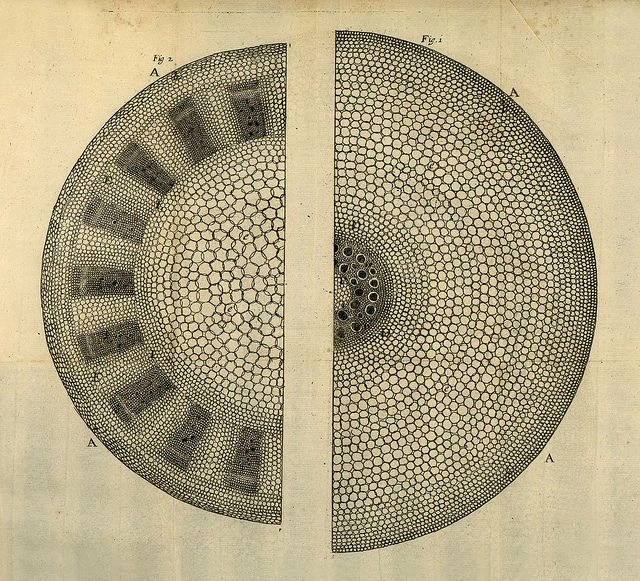

> An illustrative plate from The Anatomy of Plants (1682) by botanist Nehemiah Grew.

**Tags:** `anatomy nehemiah grew` `the anatomy of plants` `the anatomy of vegetables begun.` `art` `circle`

[Source](http://publicdomainreview.org/2012/04/25/nehemiah-grews-anatomy-of-plants-1680/)

---

## 50. Item 50

**Type:** Pinterest | **Format:** PINTEREST

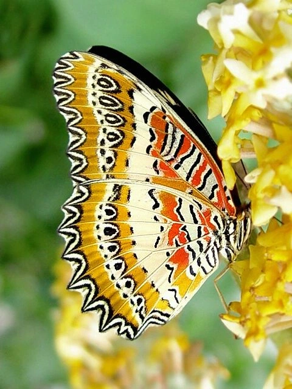

**Tags:** `butterfly patterns in nature` `lepidoptera` `brush-footed butterflies` `patterns in nature` `moth` `ring butterflies` `butterfly` `pollinator` `flower` `pearl crescent` `insect` `arthropod` `plant` `botany`

[Source](http://www.betterphoto.com/gallery/dynoGallDetail.asp?photoID=85443&catID=1370)

---

## 51. Item 51

**Type:** Pinterest | **Format:** PINTEREST

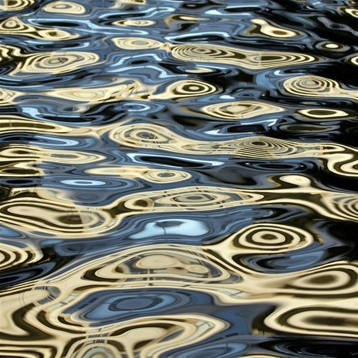

**Tags:** `water` `liquid` `vertebrate` `fluid` `organism` `art` `pattern` `electric blue`

[Source](http://www.fotoblur.com/images/133315)

---

## 52. The Eye of the Zebre by photographer MrC.

**Type:** Pinterest | **Format:** PINTEREST

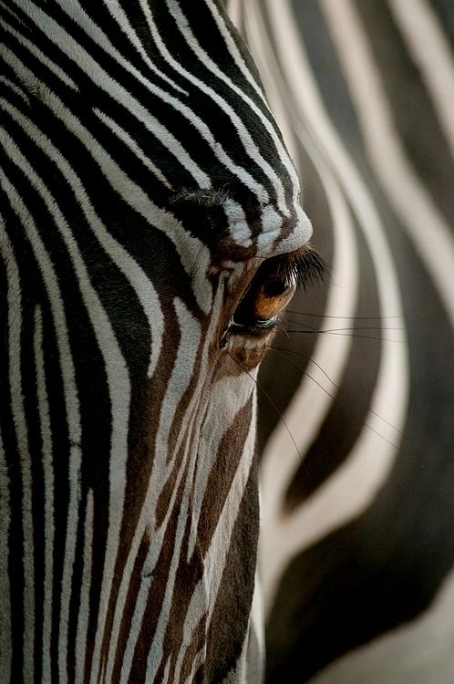

> The Eye of the Zebre by photographer MrC.

**Tags:** `beautiful zebra` `zebra` `head` `eye` `organism` `terrestrial animal` `eyelash` `snout` `whiskers`

[Source](https://www.pinterest.com/pin/101260691593463741/)

---
