# Digital Product Design

> Cosmos.so collection: [digital-product-design](https://www.cosmos.so/arjunphlox/digital-product-design)
> Total items: 56

---

## 1. 60fps

**Source:** [https://60fps.design/](https://60fps.design/)

**Type:** ArticleElement

**Tags:** shirt

---

## 2. Don't design for mobile

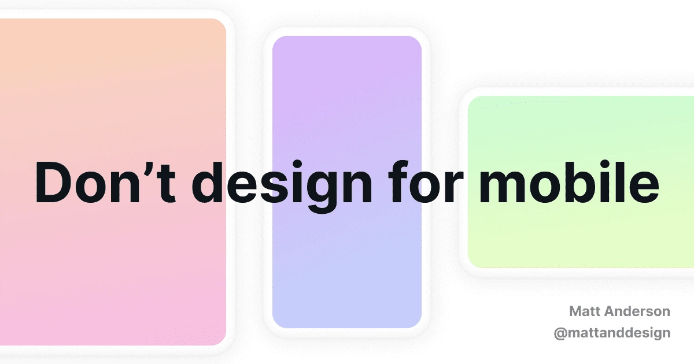

**Source:** [https://mattanddesign.com/dont-design-for-mobile/](https://mattanddesign.com/dont-design-for-mobile/)

**Type:** ArticleElement

**Tags:** parallel

---

## 3. PAN Assistant, 2022–2025

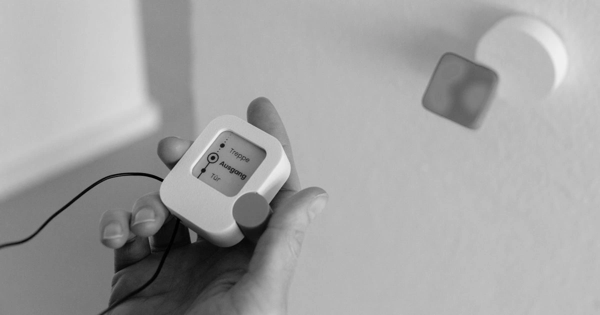

**Source:** [https://artcom.de/en/department/research-en/](https://artcom.de/en/department/research-en/)

**Type:** ArticleElement

**Tags:** monochrome

---

## 4. Spotify’s official research blog | Spotify Research

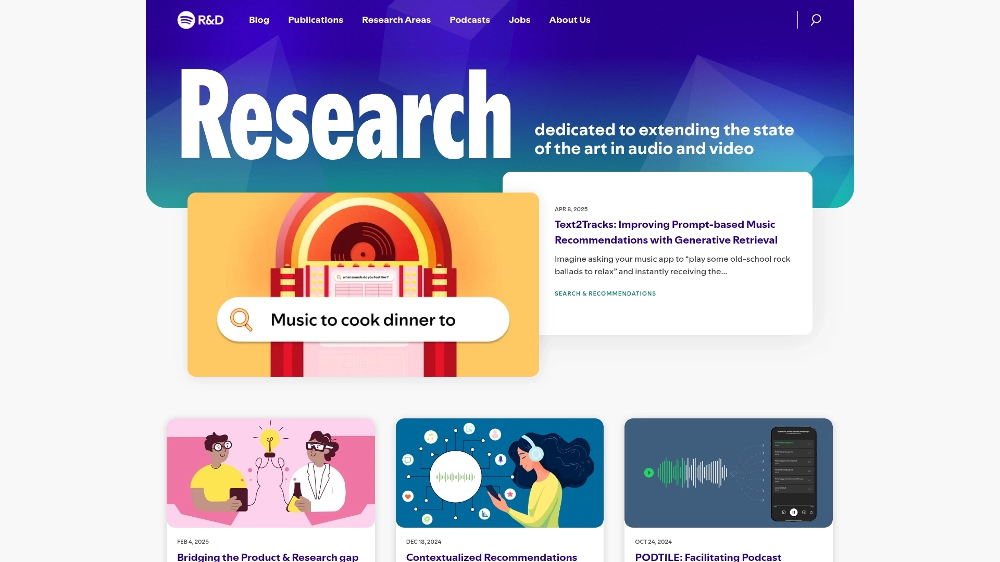

**Source:** [https://research.atspotify.com/](https://research.atspotify.com/)

**Type:** ArticleElement

**Tags:** website

---

## 5. The case against conversational interfaces

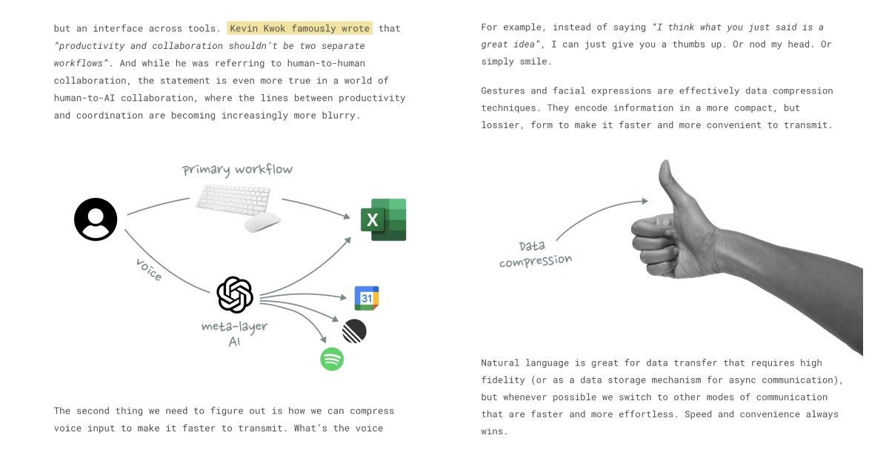

**Source:** [https://julian.digital/2025/03/27/the-case-against-conversational-interfaces/](https://julian.digital/2025/03/27/the-case-against-conversational-interfaces/)

**Type:** ArticleElement

**Caption:** Diagrams from <n>Julian Lehr</n>'s article '<n>The case against conversational interfaces</n>'.

**Tags:** diagram, conversational user interface

---

## 6. The Rise of Fractional Product Designers in 2025 (And Why Your Team Might Need One)

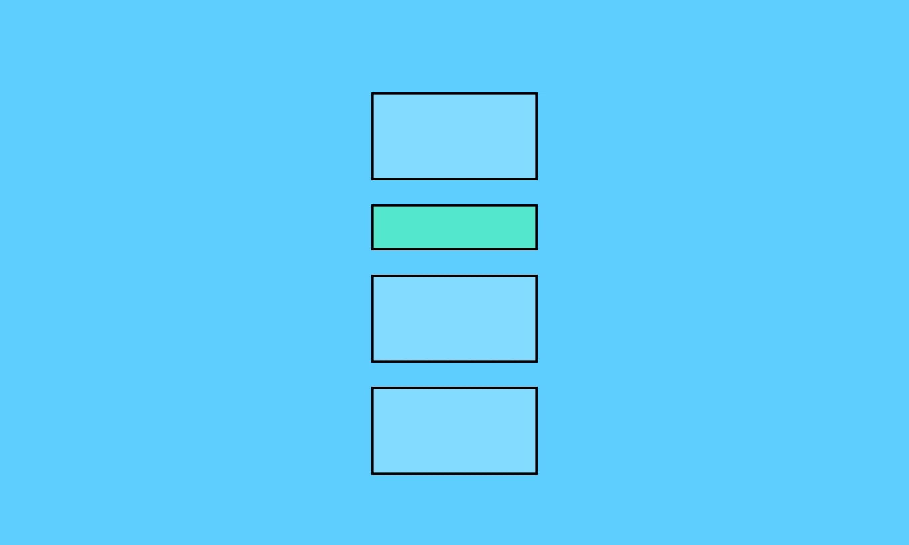

**Source:** [https://www.koistudios.io/articles/the-rise-of-fractional-product-designers-in-2025-and-why-your-team-might-need-one](https://www.koistudios.io/articles/the-rise-of-fractional-product-designers-in-2025-and-why-your-team-might-need-one)

**Type:** ArticleElement

**Tags:** symmetry

---

## 7. Maker’s Knowledge

**Source:** [https://ia.net/topics/makers-knowledge](https://ia.net/topics/makers-knowledge)

**Type:** ArticleElement

**Tags:** giambattista vico, age of enlightenment, the new science of giambattista vico, philosophy

---

## 8. Designers are using AI all wrong

**Source:** [https://uxplanet.org/designers-are-using-ai-all-wrong-3fca61c2c2ab](https://uxplanet.org/designers-are-using-ai-all-wrong-3fca61c2c2ab)

**Type:** ArticleElement

**Tags:** words matter, word, scrabble, language

---

## 9. Vibe Coding and Vibe Design

**Source:** [https://www.uxtigers.com/post/vibe-coding-vibe-design?ref=rogerwong.me](https://www.uxtigers.com/post/vibe-coding-vibe-design?ref=rogerwong.me)

**Type:** ArticleElement

**Caption:** Illustration for the article <n>Vibe Coding and Vibe Design</n>, created by <n>Midjourney</n>.

**Tags:** bentley, user experience, user experience design

---

## 10. From Craft to Curation: Design Leadership in the Age of AI

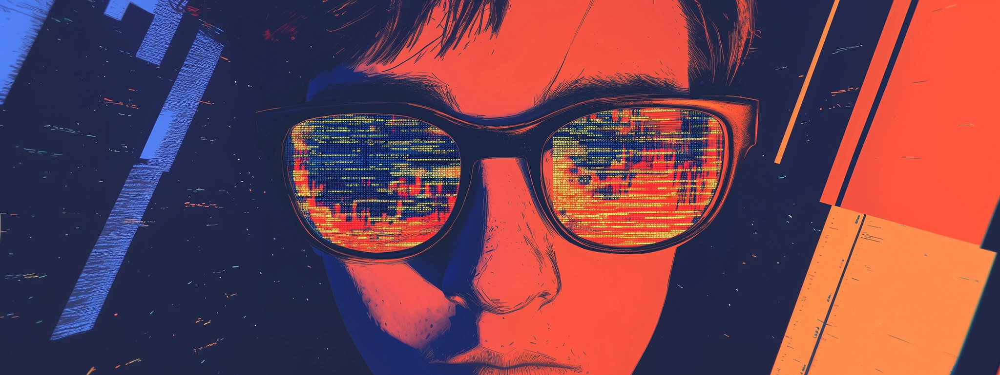

**Source:** [https://rogerwong.me/posts/from-craft-to-curation](https://rogerwong.me/posts/from-craft-to-curation)

**Type:** ArticleElement

**Tags:** visual arts

---

## 11. Experiments with Google

**Source:** [https://experiments.withgoogle.com/](https://experiments.withgoogle.com/)

**Type:** ArticleElement

---

## 12. LABS.GOOGLE

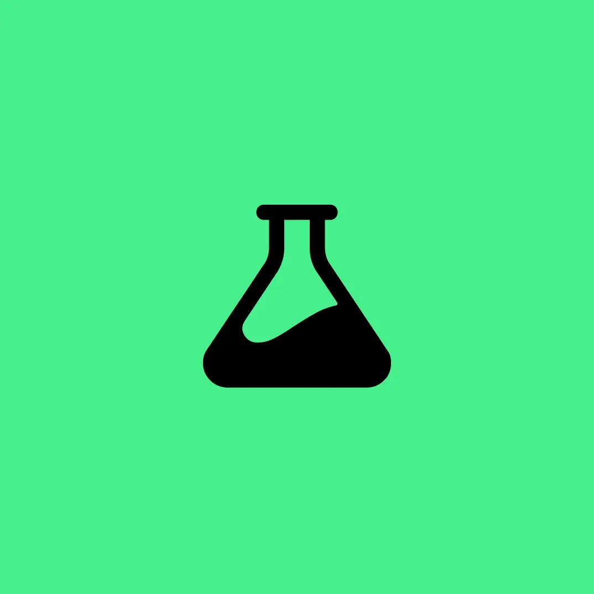

**Source:** [https://labs.google/](https://labs.google/)

**Type:** ArticleElement

**Caption:** The <n>Google Labs</n> logo, designed by <n>Tom~eswiki</n>.

**Tags:** green, font, drinkware, bottle, the museum of modern art

---

## 13. Shape Up: Stop Running in Circles and Ship Work that Matters

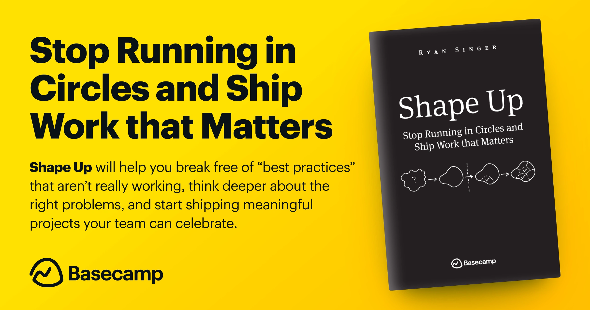

**Source:** [https://basecamp.com/shapeup](https://basecamp.com/shapeup)

**Type:** ArticleElement

**Tags:** shape up stop running in circles

---

## 14. Tools for better thinking

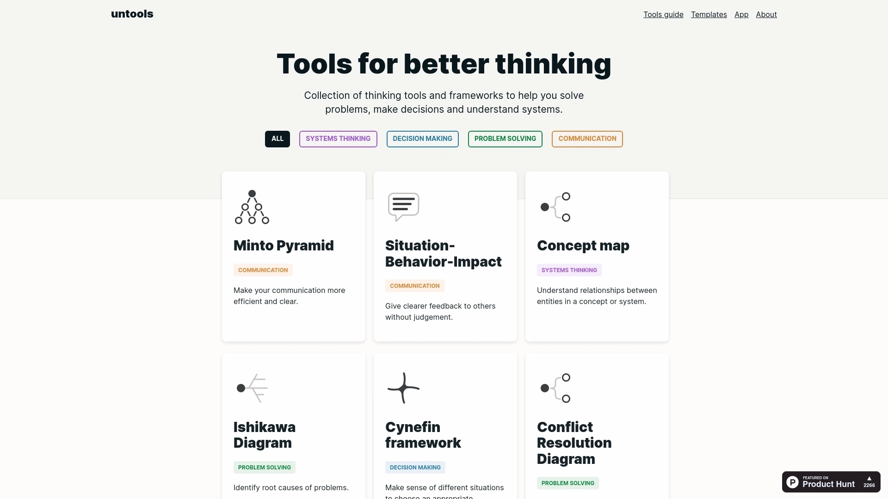

**Source:** [https://untools.co/](https://untools.co/)

**Type:** ArticleElement

---

## 15. font, parallel, slope, diagram

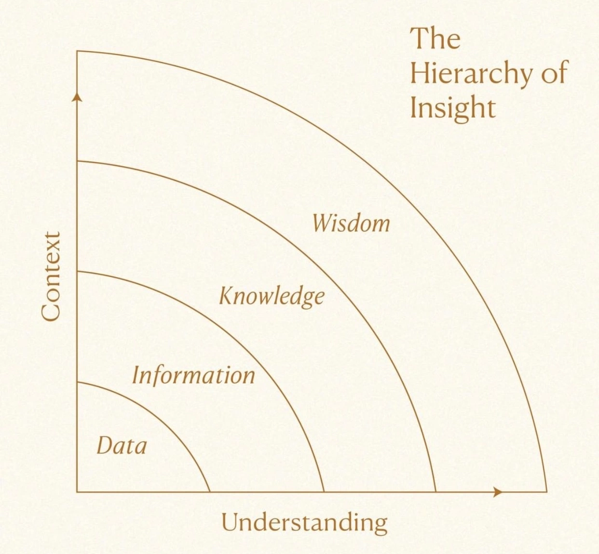

**Source:** [https://www.are.na/block/9940260](https://www.are.na/block/9940260)

**Type:** Element

**Tags:** font, parallel, slope, diagram

---

## 16. Guiding Principles for Product & Design

**Source:** [https://haphan.substack.com/p/guiding-principles-for-product-and?r=2hchry&utm_campaign=post&utm_medium=web&triedRedirect=true](https://haphan.substack.com/p/guiding-principles-for-product-and?r=2hchry&utm_campaign=post&utm_medium=web&triedRedirect=true)

**Type:** ArticleElement

**Caption:** Illustration from <n>Ha Phan</n>'s article, <n>Guiding Principles for Product & Design</n>.

**Tags:** sea

---

## 17. The World's Most Satisfying Checkbox | !Boring Software

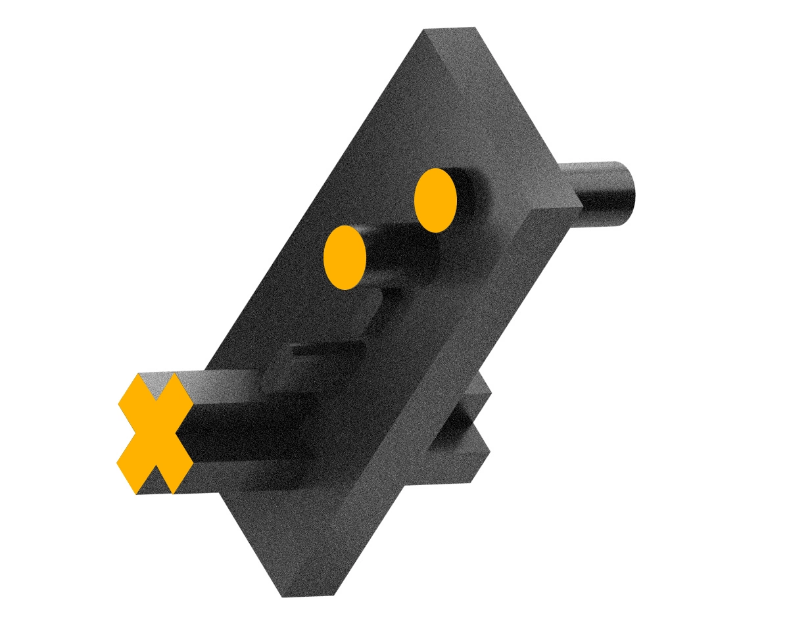

**Source:** [https://www.notboring.software/words/the-most-satisfying-checkbox](https://www.notboring.software/words/the-most-satisfying-checkbox)

**Type:** ArticleElement

**Caption:** Digital illustration by artist <n>Eran Hilleli</n> for <n>Not Boring Software</n>.

**Tags:** northrop grumman b-2 spirit, traffic light, rectangle, font

---

## 18. A Guide To Designing For Older Adults — Smashing Magazine

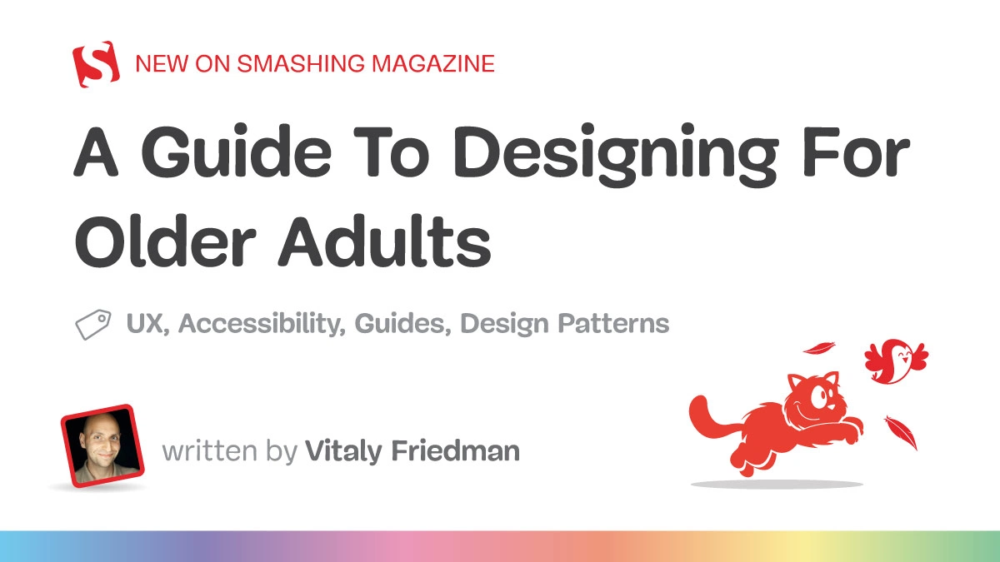

**Source:** [https://www.smashingmagazine.com/2024/02/guide-designing-older-adults/](https://www.smashingmagazine.com/2024/02/guide-designing-older-adults/)

**Type:** ArticleElement

**Tags:** crab, design, graphic design

---

## 19. A Dangerous Luxury

**Source:** [https://socialscienceinsights.com/2017/12/15/a-dangerous-luxury/](https://socialscienceinsights.com/2017/12/15/a-dangerous-luxury/)

**Type:** ArticleElement

**Tags:** bookshelves library, bookcase, library

---

## 20. Lessons of Design

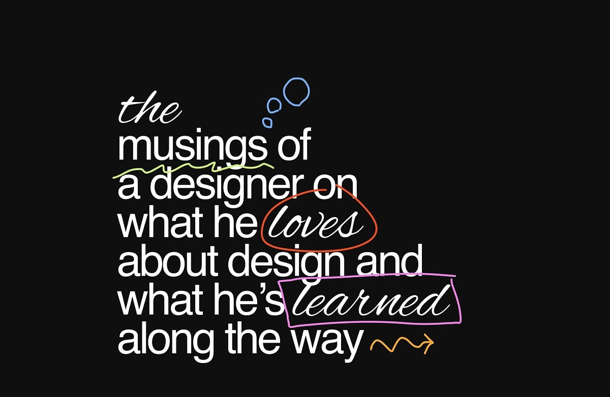

**Source:** [https://uxdesign.cc/lessons-of-design-75cc0731534](https://uxdesign.cc/lessons-of-design-75cc0731534)

**Type:** ArticleElement

**Tags:** graphic design, design

---

## 21. Craft Meets Code: Upgrading the JioCinema Carousel

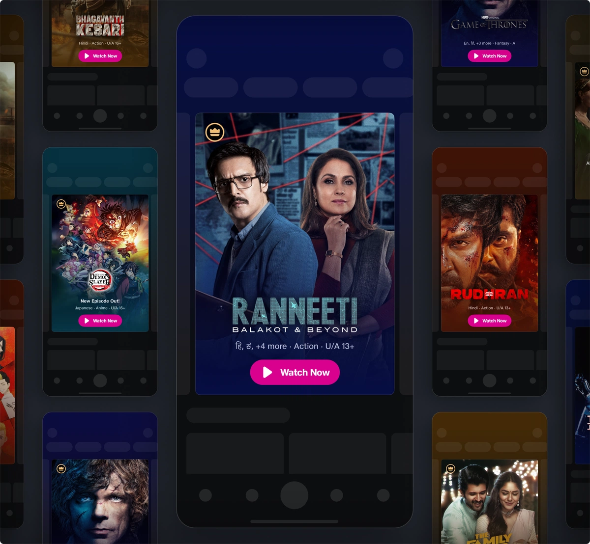

**Source:** [https://blog.jiocinema.com/upgrading-carousel-design/](https://blog.jiocinema.com/upgrading-carousel-design/)

**Type:** ArticleElement

**Tags:** pc game, jiocinema, viacom 18

---

## 22. Modeling UI State Using A Finite State Machine

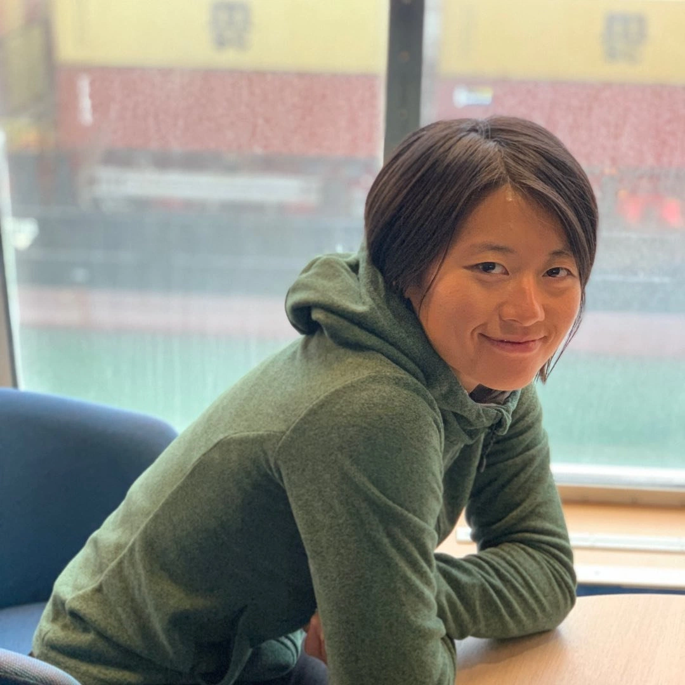

**Source:** [https://xiaoyunyang.github.io/post/modeling-ui-state-using-a-finite-state-machine/](https://xiaoyunyang.github.io/post/modeling-ui-state-using-a-finite-state-machine/)

**Type:** ArticleElement

**Tags:** girl

---

## 23. How Apple developed the world’s first end-to-end hearing health experience

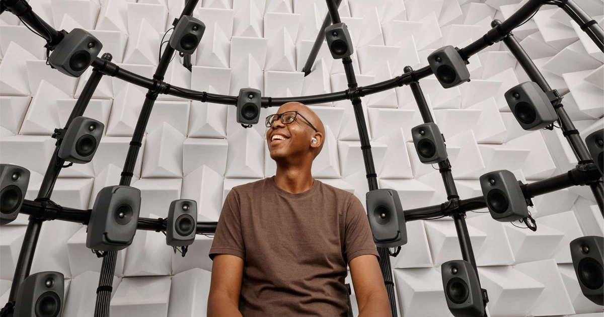

**Source:** [https://www.apple.com/newsroom/2024/10/how-apple-developed-the-worlds-first-end-to-end-hearing-health-experience/](https://www.apple.com/newsroom/2024/10/how-apple-developed-the-worlds-first-end-to-end-hearing-health-experience/)

**Type:** ArticleElement

**Tags:** apples hearing aid lab, airpods pro, apple, hearing

---

## 24. Mobile Screen Resolution Stats India | Statcounter Global Stats

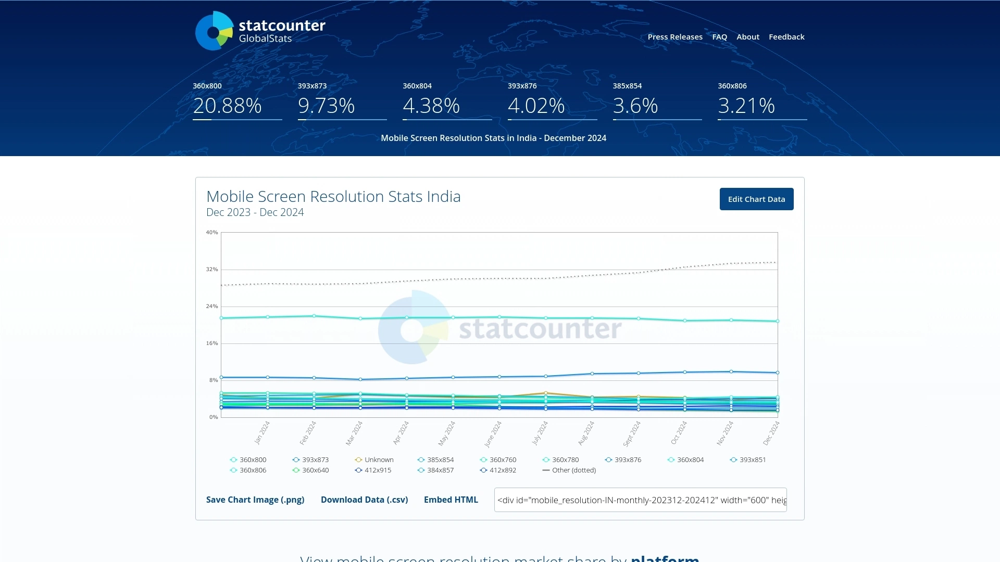

**Source:** [https://gs.statcounter.com/screen-resolution-stats/mobile/india?t&utm_source=perplexity](https://gs.statcounter.com/screen-resolution-stats/mobile/india?t&utm_source=perplexity)

**Type:** ArticleElement

**Tags:** screenshot, responsive web design

---

## 25. Desktop Screen Resolution Stats India | Statcounter Global Stats

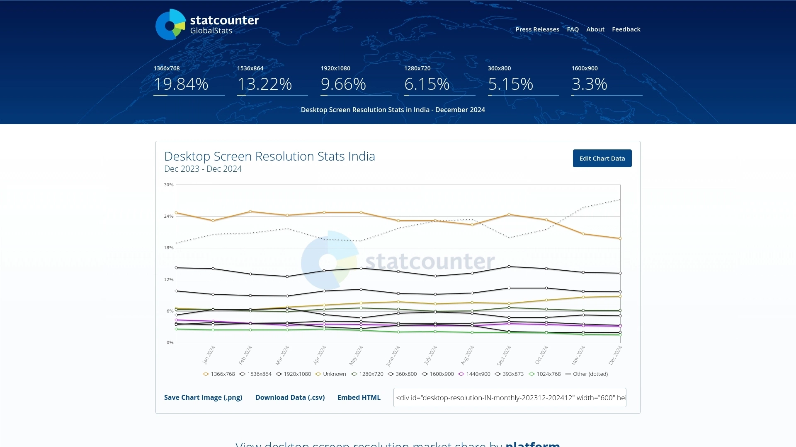

**Source:** [https://gs.statcounter.com/screen-resolution-stats/desktop/india?t&utm_source=perplexity](https://gs.statcounter.com/screen-resolution-stats/desktop/india?t&utm_source=perplexity)

**Type:** ArticleElement

**Tags:** screenshot

---

## 26. The death of craft

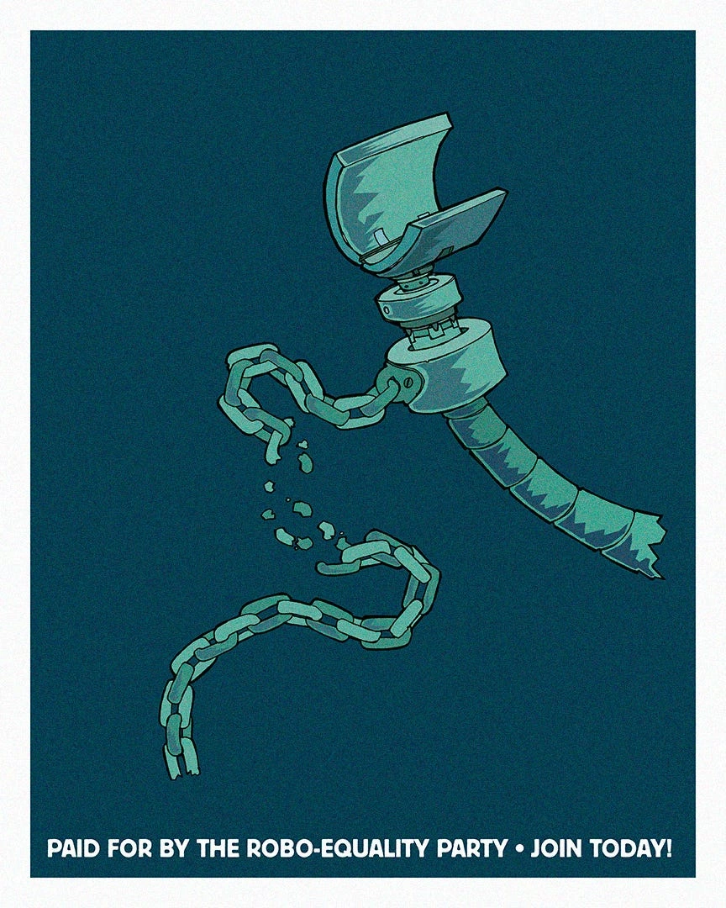

**Source:** [https://uxdesign.cc/the-death-of-craft-feec4cc5eb58](https://uxdesign.cc/the-death-of-craft-feec4cc5eb58)

**Type:** ArticleElement

**Caption:** An illustration by <n>Joe Alterio</n> for the fictional <n>Robo-Equality Party</n>.

**Tags:** visual arts, graphic design, design, sleeve, gesture, art, font

---

## 27. font, tattoo, quotes to crushes

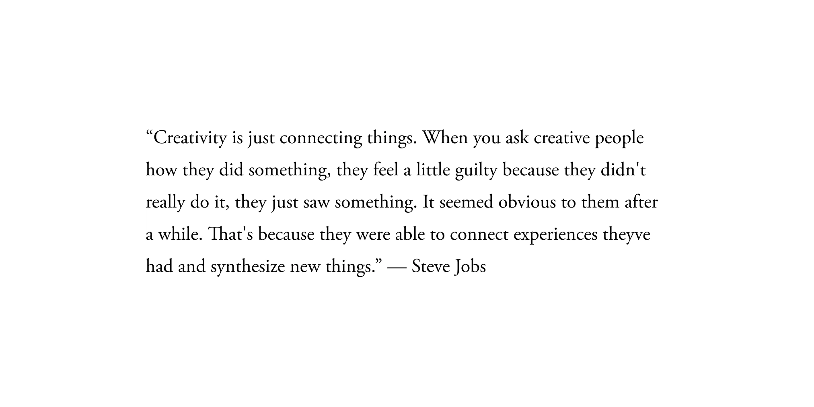

**Type:** Element

**Tags:** font, tattoo, quotes to crushes

---

## 28. Design Principles at Jupiter

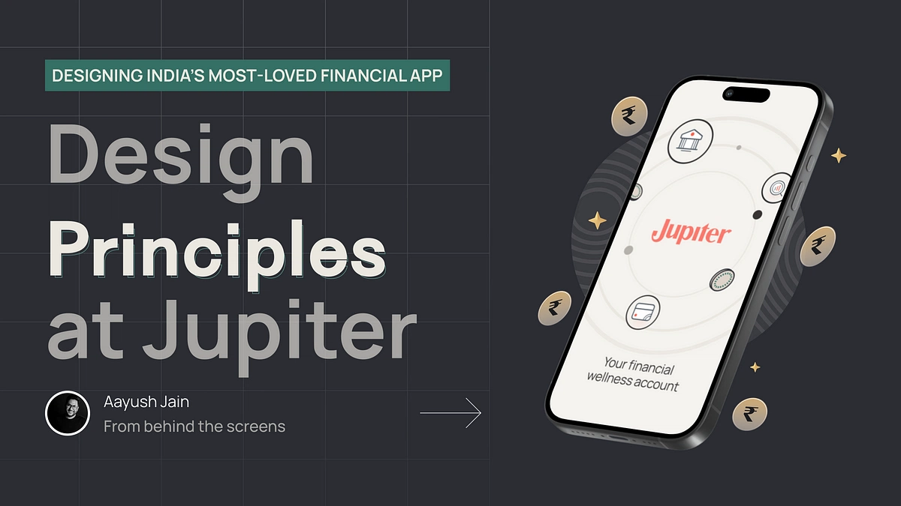

**Source:** [https://life.jupiter.money/design-principles-at-jupiter-f783457c976d](https://life.jupiter.money/design-principles-at-jupiter-f783457c976d)

**Type:** ArticleElement

**Tags:** iphone, mobile phone, telephone, telephony, communication device, portable communications device, font, payment card

---

## 29. New product strategy for collaboration SaaS — Dragan Babić

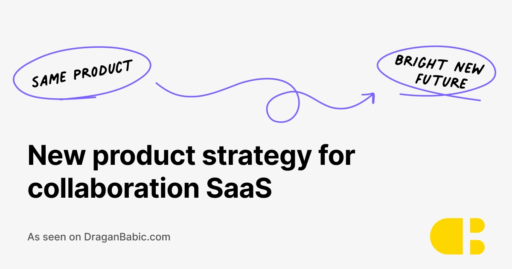

**Source:** [https://draganbabic.com/new-product-strategy-for-collaboration-saas/](https://draganbabic.com/new-product-strategy-for-collaboration-saas/)

**Type:** ArticleElement

**Tags:** style, slope, rectangle, font, circle, parallel

---

## 30. document, font

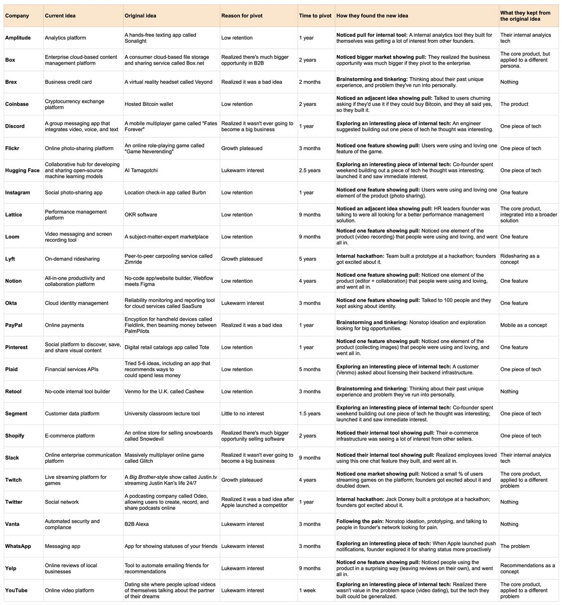

**Source:** [https://x.com/dtarasov/status/1793342616412528939?s=12&t=Kbl6Kd9qhuaRg9Z7iATEEw](https://x.com/dtarasov/status/1793342616412528939?s=12&t=Kbl6Kd9qhuaRg9Z7iATEEw)

**Type:** TwitterElement

**Tags:** document, font

---

## 31. x.com

**Source:** [https://x.com/jesseddy/status/1791003392061641047?s=12&t=Kbl6Kd9qhuaRg9Z7iATEEw](https://x.com/jesseddy/status/1791003392061641047?s=12&t=Kbl6Kd9qhuaRg9Z7iATEEw)

**Type:** TwitterElement

---

## 32. Can Pocket FM Build a Global Entertainment Brand? | The Hard Copy

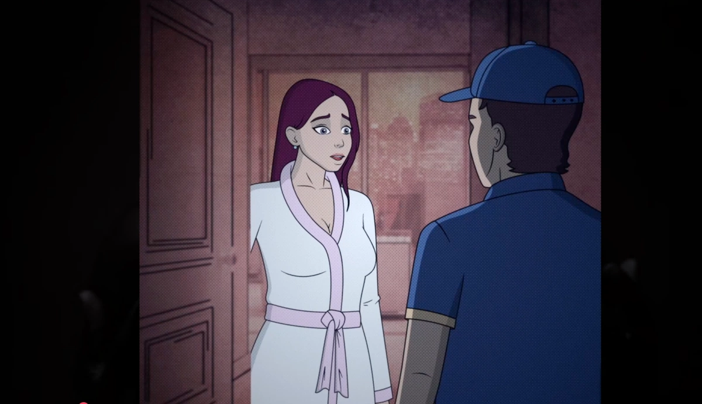

**Source:** [https://thehardcopy.co/pocket-fm-growthdesign-case-study/](https://thehardcopy.co/pocket-fm-growthdesign-case-study/)

**Type:** ArticleElement

**Tags:** visual arts, hairstyle, fashion, cartoon, standing, gesture, flash photography, cool, art

---

## 33. The Sound of Software | !Boring Software

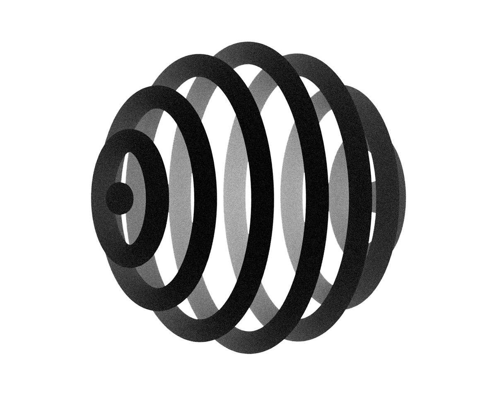

**Source:** [https://www.notboring.software/words/the-sound-of-software](https://www.notboring.software/words/the-sound-of-software)

**Type:** ArticleElement

**Caption:** Illustration by <n>Eran Hilleli</n> for <n>Not Boring Software</n>.

**Tags:** circle, font

---

## 34. What India can tell us about Netflix’s future

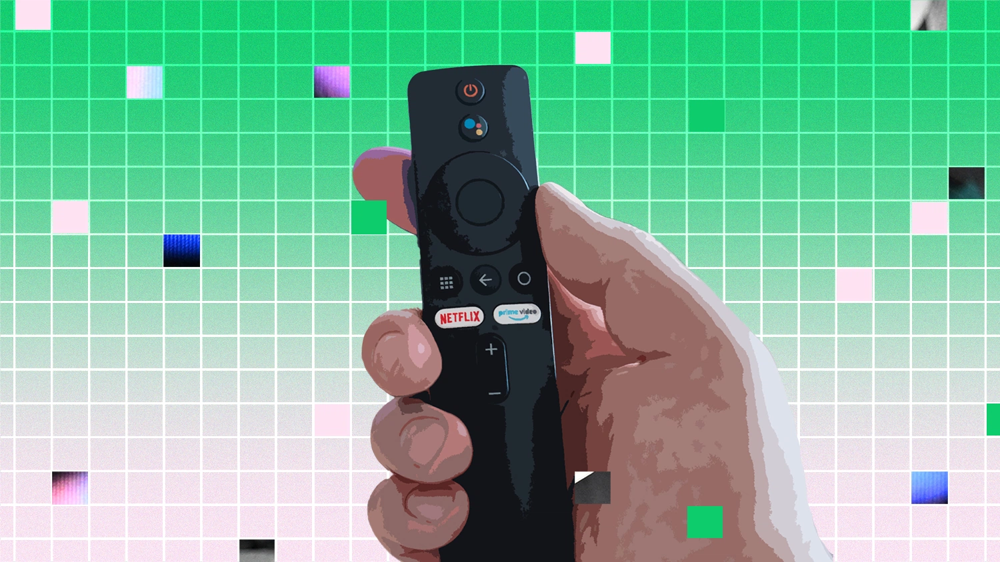

**Source:** [https://restofworld.org/2024/exporter-netflix-india-disney-hotstar-jiocinema/](https://restofworld.org/2024/exporter-netflix-india-disney-hotstar-jiocinema/)

**Type:** ArticleElement

**Tags:** google gemini issue, gemini, gadget, gesture, rectangle, font, audio equipment, pattern

---

## 35. Framing problem statements: The first step toward your users

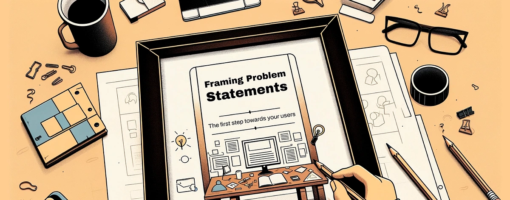

**Source:** [https://arpitadhir.medium.com/framing-problem-statements-the-first-step-toward-your-users-b6e833833e2f](https://arpitadhir.medium.com/framing-problem-statements-the-first-step-toward-your-users-b6e833833e2f)

**Type:** ArticleElement

**Tags:** illustration, font, line, technology, art

---

## 36. Flames - the most exclusive design community. Find the best designers

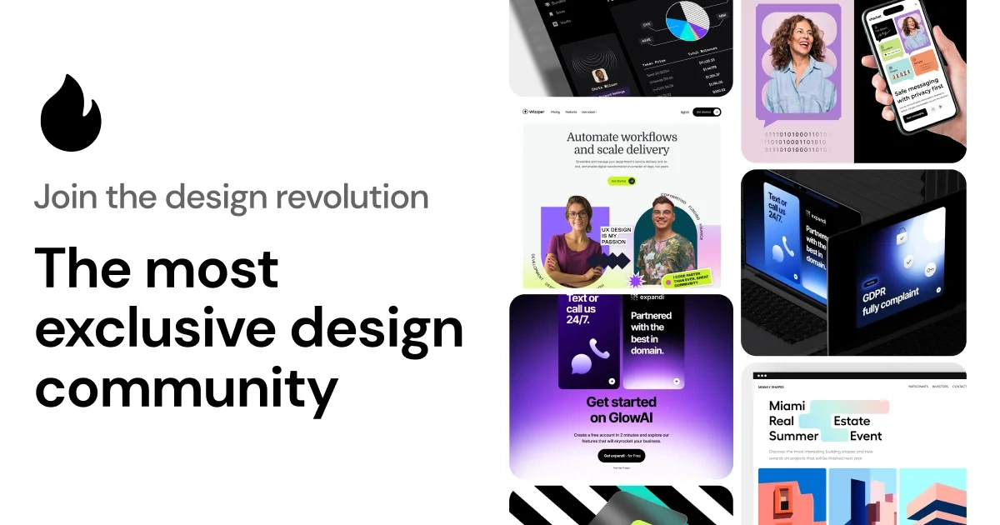

**Source:** [https://flames.design/](https://flames.design/)

**Type:** ArticleElement

**Tags:** font, gadget, product, purple, mobile device, multimedia, feature phone

---

## 37. spokesperson, karri saarinen, forehead, microphone, chin

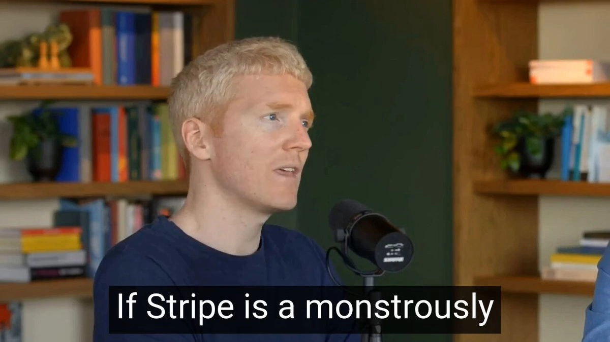

**Source:** [https://x.com/startuparchive_/status/1774403827548242333?s=12&t=Kbl6Kd9qhuaRg9Z7iATEEw](https://x.com/startuparchive_/status/1774403827548242333?s=12&t=Kbl6Kd9qhuaRg9Z7iATEEw)

**Type:** TwitterElement

**Tags:** spokesperson, karri saarinen, forehead, microphone, chin, public address system, shelf, bookcase, houseplant, audio equipment

---

## 38. Why is Spotify Wrapped so popular?

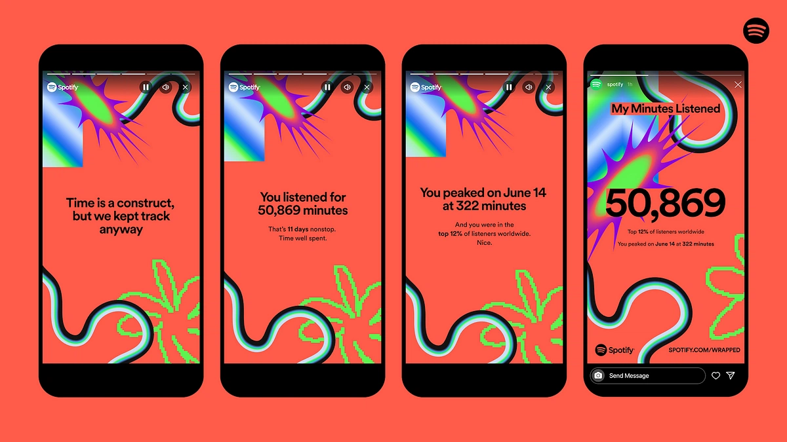

**Source:** [https://uxdesign.cc/why-is-spotify-wrapped-so-popular-5c503e79a3ee](https://uxdesign.cc/why-is-spotify-wrapped-so-popular-5c503e79a3ee)

**Type:** ArticleElement

**Caption:** Screenshots from the <n>Spotify Wrapped 2023</n> campaign by <n>Spotify</n>.

**Tags:** spotify wrapped 2023 minutes, spotify wrapped, spotify, font, communication device, magenta, rectangle

---

## 39. twitter.com

**Source:** [https://twitter.com/hpdailyrant/status/1773700828303364366](https://twitter.com/hpdailyrant/status/1773700828303364366)

**Type:** TwitterElement

---

## 40. How Prime Video failed so spectacularly in Africa

**Source:** [https://restofworld.org/2024/amazon-prime-video-africa-layoffs/](https://restofworld.org/2024/amazon-prime-video-africa-layoffs/)

**Type:** ArticleElement

**Tags:** jogging, anime's media mix, sleeve, gesture, font, electric blue

---

## 41. Why we crave healthier computing

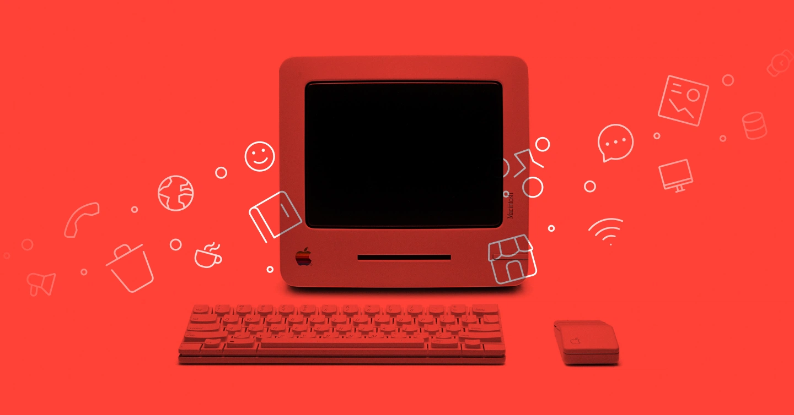

**Source:** [https://arun.is/blog/healthy-computing/](https://arun.is/blog/healthy-computing/)

**Type:** ArticleElement

**Caption:** <n>Modern Macintosh Concept</n> by <n>Arun Venkatesan</n> for his article, <n>Why we crave healthier computing</n>.

**Tags:** font, gadget, output device, line, product, computer keyboard, personal computer, computer, display device, netbook, peripheral, input device, laptop, space bar, computer hardware

---

## 42. parallel, rectangle, font

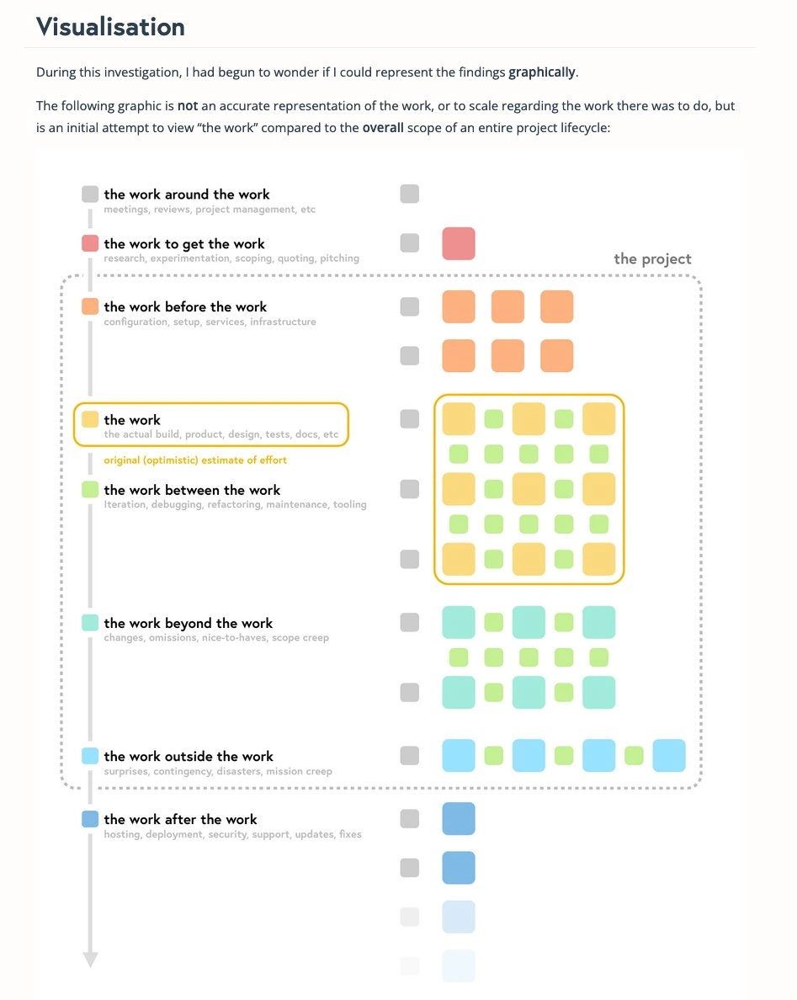

**Source:** [https://x.com/walterstephanie/status/1767536177928658944?s=12&t=Kbl6Kd9qhuaRg9Z7iATEEw](https://x.com/walterstephanie/status/1767536177928658944?s=12&t=Kbl6Kd9qhuaRg9Z7iATEEw)

**Type:** TwitterElement

**Tags:** parallel, rectangle, font

---

## 43. x.com

**Source:** [https://x.com/techcrunch/status/1767577919553933756?s=12&t=Kbl6Kd9qhuaRg9Z7iATEEw](https://x.com/techcrunch/status/1767577919553933756?s=12&t=Kbl6Kd9qhuaRg9Z7iATEEw)

**Type:** TwitterElement

---

## 44. human behavior, organism, font, happy, line

**Source:** [https://x.com/sachinrekhi/status/1767566275302363636?s=12](https://x.com/sachinrekhi/status/1767566275302363636?s=12)

**Type:** TwitterElement

**Tags:** human behavior, organism, font, happy, line, adaptation, tie

---

## 45. Learn UX Design for free

**Source:** [https://learnuiux.in/](https://learnuiux.in/)

**Type:** ArticleElement

**Tags:** flash photography, gesture, human, jaw, beard, font, smile, forehead, chin

---

## 46. Muse retrospective · Adam Wiggins

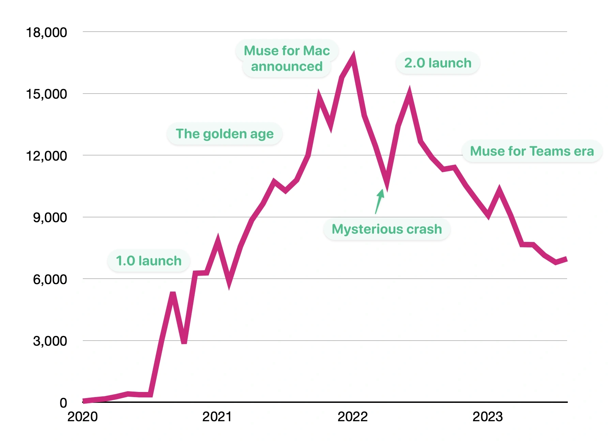

**Source:** [https://adamwiggins.com/muse-retrospective/#golden-age](https://adamwiggins.com/muse-retrospective/#golden-age)

**Type:** ArticleElement

**Caption:** A line graph of weekly active canvases from <n>Adam Wiggins</n>' <n>Muse retrospective</n>.

**Tags:** font, rectangle, parallel, slope, triangle, plot

---

## 47. x.com

**Source:** [https://x.com/hpdailyrant/status/1765787135280656595?s=20](https://x.com/hpdailyrant/status/1765787135280656595?s=20)

**Type:** TwitterElement

---

## 48. The Path to Senior Product Designer: A Growth Plan for a UX Design Career

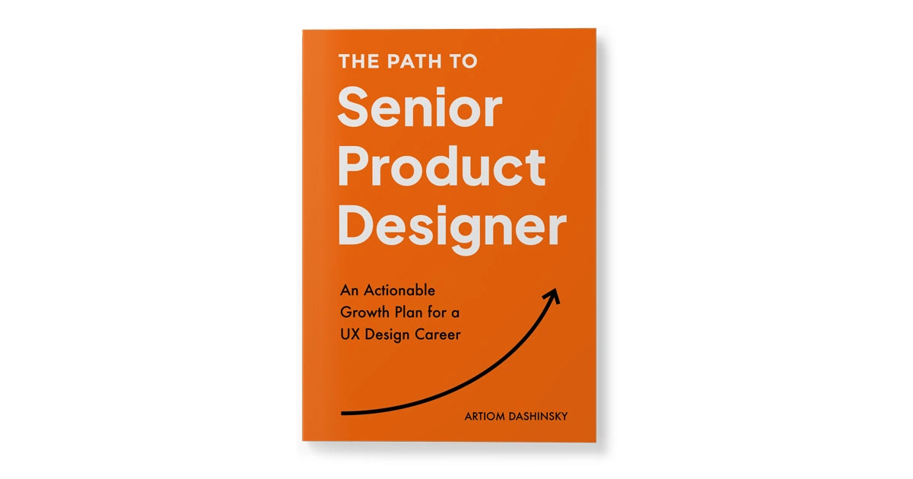

**Source:** [https://productdesigninterview.com/the-path-to-senior-product-designer?utm_medium=fb&utm_source=facebook&campaign_id=120206115139030414&ad_id=120206963305580414](https://productdesigninterview.com/the-path-to-senior-product-designer?utm_medium=fb&utm_source=facebook&campaign_id=120206115139030414&ad_id=120206963305580414)

**Type:** ArticleElement

**Tags:** font, rectangle, orange

---

## 49. Rethinking the startup MVP: Building a competitive product | Linear

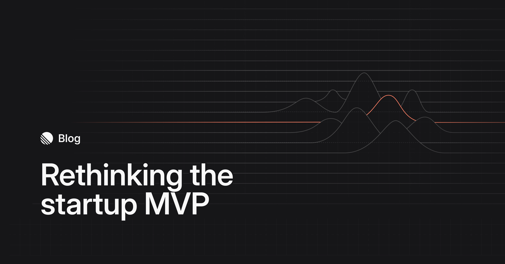

**Source:** [https://linear.app/blog/rethinking-the-startup-mvp-building-a-competitive-product](https://linear.app/blog/rethinking-the-startup-mvp-building-a-competitive-product)

**Type:** ArticleElement

**Tags:** font, computer wallpaper

---

## 50. x.com

**Source:** [https://x.com/karrisaarinen/status/1762980712863695118?s=12&t=Kbl6Kd9qhuaRg9Z7iATEEw](https://x.com/karrisaarinen/status/1762980712863695118?s=12&t=Kbl6Kd9qhuaRg9Z7iATEEw)

**Type:** TwitterElement

---

## 51. Multi-layered calendars

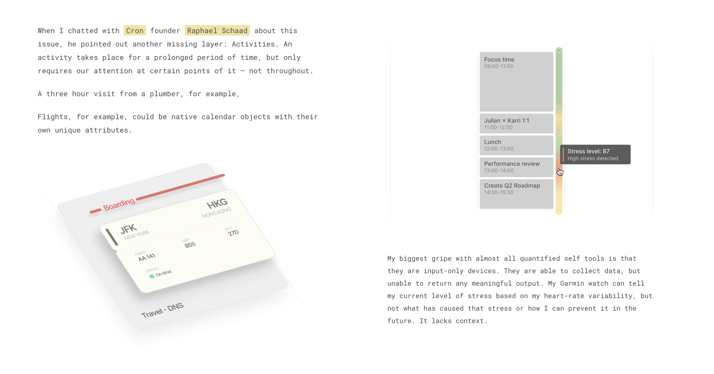

**Source:** [https://julian.digital/2023/07/06/multi-layered-calendars/](https://julian.digital/2023/07/06/multi-layered-calendars/)

**Type:** ArticleElement

**Caption:** UI concepts for multi-layered calendars by <n>Julian</n>, referencing <n>Cron</n> founder <n>Raphael Schaad</n>.

**Tags:** font, multimedia, university of ljubljana

---

## 52. How I Prototype to Communicate, Not Complicate, in Figma

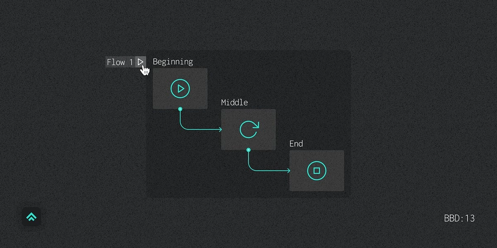

**Source:** [https://www.betterbydesign.cc/p/how-i-prototype-to-communicate-not?utm_medium=web](https://www.betterbydesign.cc/p/how-i-prototype-to-communicate-not?utm_medium=web)

**Type:** ArticleElement

**Caption:** A simple prototype flow in <n>Figma</n> by designer <n>Melissa Schmitz</n>.

**Tags:** font, screenshot, prototype

---

## 53. x.com

**Source:** [https://x.com/steveruizok/status/1379167197050900489?s=12&t=Kbl6Kd9qhuaRg9Z7iATEEw](https://x.com/steveruizok/status/1379167197050900489?s=12&t=Kbl6Kd9qhuaRg9Z7iATEEw)

**Type:** TwitterElement

---

## 54. The no-code interface for <n>Standard Bots</n>, designed by <n>Jeremy Goldberg</n> in 2022

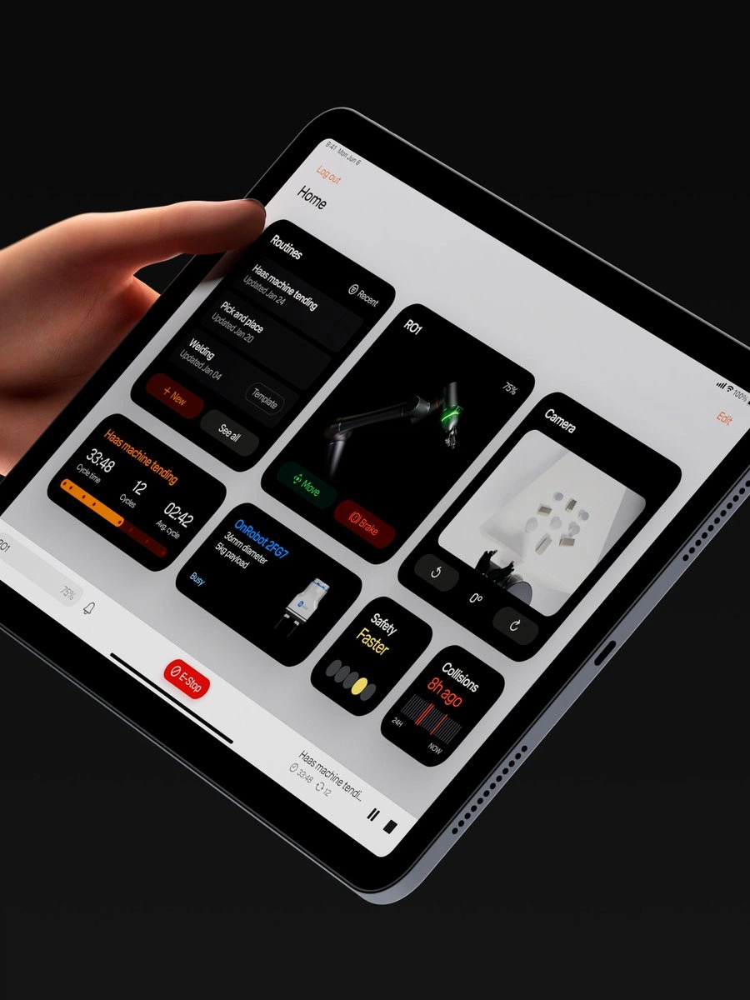

**Source:** [https://x.com/jeremygoldbrg/status/1762502851605987794?s=12&t=Kbl6Kd9qhuaRg9Z7iATEEw](https://x.com/jeremygoldbrg/status/1762502851605987794?s=12&t=Kbl6Kd9qhuaRg9Z7iATEEw)

**Type:** TwitterElement

**Caption:** The no-code interface for <n>Standard Bots</n>, designed by <n>Jeremy Goldberg</n> in 2022.

**Tags:** feature phone, special hobby, folland gnat, mobile device, communication device, font, gadget, portable communications device

---

## 55. twitter.com

**Source:** [https://twitter.com/hpdailyrant/status/1762510800860967214](https://twitter.com/hpdailyrant/status/1762510800860967214)

**Type:** TwitterElement

---

## 56. twitter.com

**Source:** [https://twitter.com/awilkinson/status/1762497921528807776](https://twitter.com/awilkinson/status/1762497921528807776)

**Type:** TwitterElement

---
