# HueGrid Collection

> Exported from [cosmos.so/arjunphlox/huegrid](https://www.cosmos.so/arjunphlox/huegrid)
> 43 items | Exported on 2026-03-30

---

## 1. <n>Where am I?</n>, an animated typeface by <n>Daniel Brokstad</n>, 2016

| Field | Value |
|-------|-------|
| **Type** | PinterestElement |
| **Source** | [es.pinterest.com](https://es.pinterest.com/pin/444237950760676809/) |
| **Caption** | <n>Where am I?</n>, an animated typeface by <n>Daniel Brokstad</n>, 2016. |
| **Tags** | graphics, animation, motion graphics, design |

CDN URL

`https://cdn.cosmos.so/7eec6e4d-bcf4-44b4-a1f7-48455c044c78`

---

## 2. genetic barcoding, dna barcoding, barcode, dna

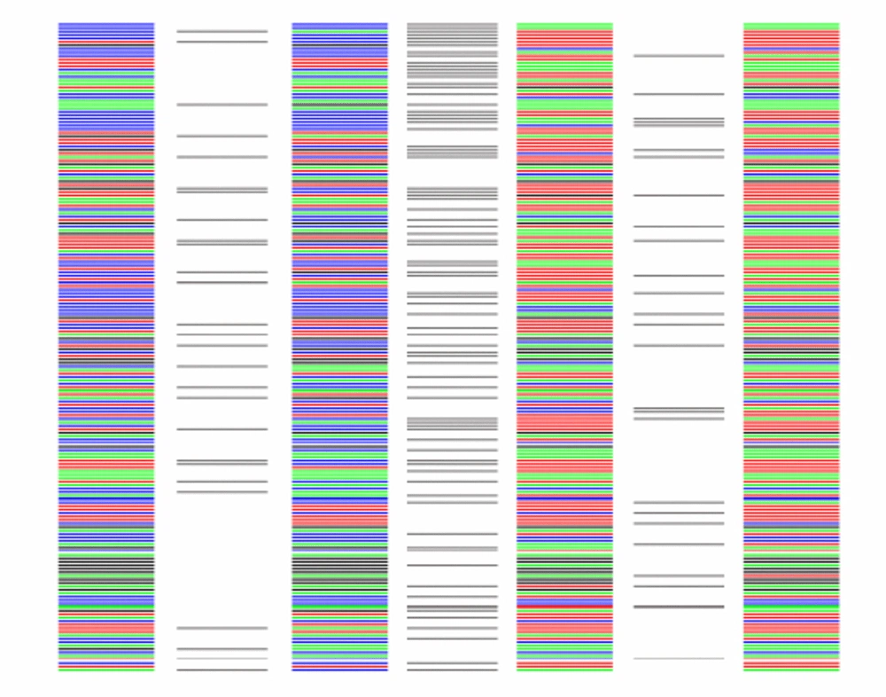

| Field | Value |
|-------|-------|
| **Type** | Element |
| **Source** | [www.nbcnews.com](https://www.nbcnews.com/id/wbna20778233) |
| **Tags** | genetic barcoding, dna barcoding, barcode, dna |

CDN URL

`https://cdn.cosmos.so/afa10e13-7331-49d7-8f69-6abf5510b649`

---

## 3. Digital artwork "Sequences" by <n>Peter Tarka</n>

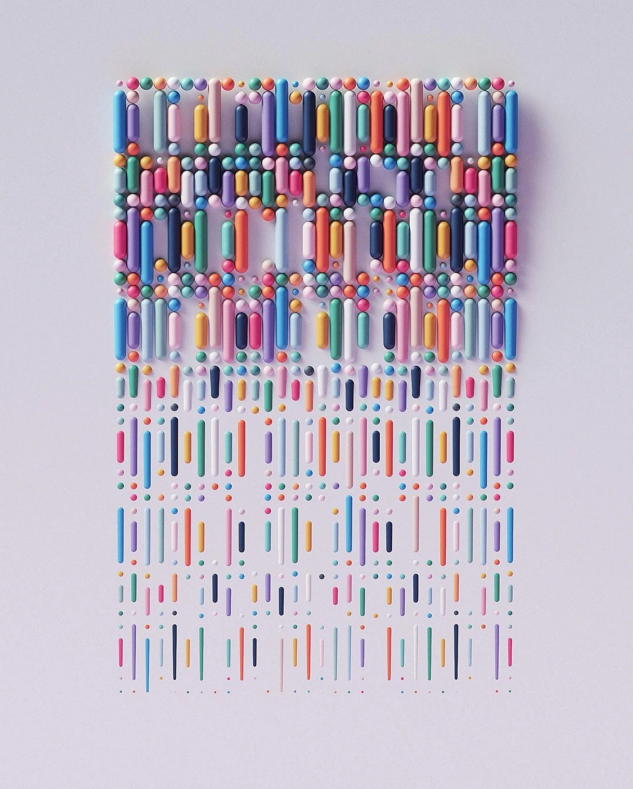

| Field | Value |
|-------|-------|
| **Type** | InstagramElement |
| **Source** | [www.instagram.com](https://www.instagram.com/p/Cq21TwYKdiL/) |
| **Caption** | Digital artwork "Sequences" by <n>Peter Tarka</n>. |
| **Tags** | pattern, r/art, art, colorfulness, rectangle, font |

CDN URL

`https://cdn.cosmos.so/b3a60018-d8c5-44c5-81ec-74a6f5161321`

---

## 4. graphic design, graphics, design, icon design

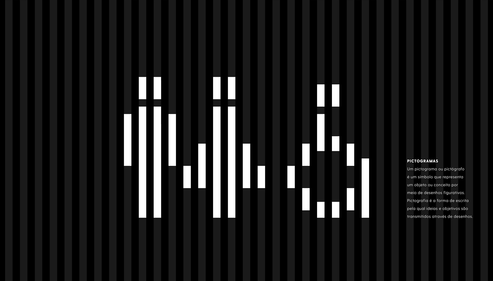

| Field | Value |
|-------|-------|
| **Type** | PinterestElement |
| **Source** | [www.behance.net](https://www.behance.net/gallery/133205863/Arena-MRV?tracking_source=for_you_logged_in_feed_recommended) |
| **Tags** | graphic design, graphics, design, icon design |

CDN URL

`https://cdn.cosmos.so/35521904-8a75-4c18-ab6b-76231097af44`

---

## 5. "®," a generative art collection

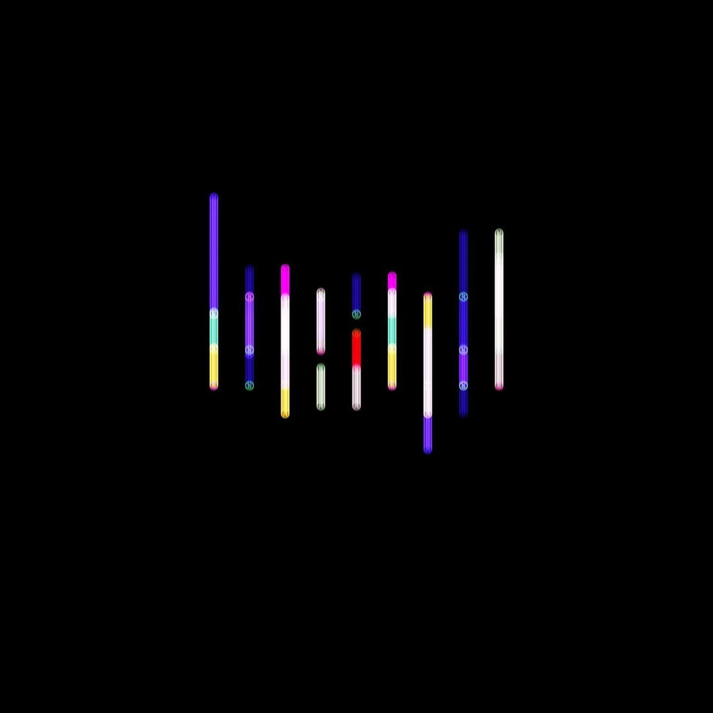

| Field | Value |
|-------|-------|
| **Type** | InstagramElement |
| **Source** | [www.instagram.com](https://www.instagram.com/p/Cz_wI8lrL3l/) |
| **Caption** | "®," a generative art collection. Photo by <n>Jack Butcher</n>. |
| **Tags** | darkness, photograph, gas, rectangle, visual effect lighting |

CDN URL

`https://cdn.cosmos.so/972eac91-8954-4507-9d93-c970c86dca2f`

---

## 6. A generative art portrait card created with a pen plotter for the <n>Tech'Inn Vitré</n> event

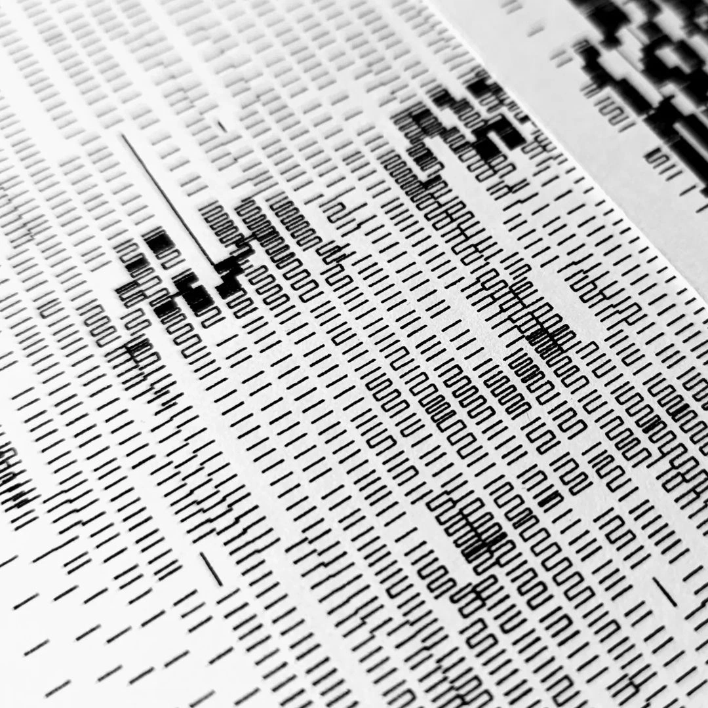

| Field | Value |
|-------|-------|
| **Type** | InstagramElement |
| **Source** | [www.instagram.com](https://www.instagram.com/p/C29iEOnN_W5/?igsh=MTR4b2N5YWM5NXA5YQ==) |
| **Caption** | A generative art portrait card created with a pen plotter for the <n>Tech'Inn Vitré</n> event. |
| **Tags** | document, black, font, style, line, material property, monochrome |

CDN URL

`https://cdn.cosmos.so/c03aa995-6559-4f19-83a9-cdb1832c7c67`

---

## 7. light, animation, motion graphics, image

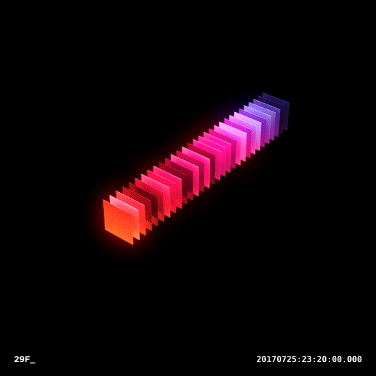

| Field | Value |
|-------|-------|
| **Type** | PinterestElement |
| **Source** | [www.pinterest.com](https://www.pinterest.com/pin/1092756297079947154/) |
| **Tags** | light, animation, motion graphics, image |

CDN URL

`https://cdn.cosmos.so/0238cda0-c387-4917-8610-91d774e7428b`

---

## 8. graphic design

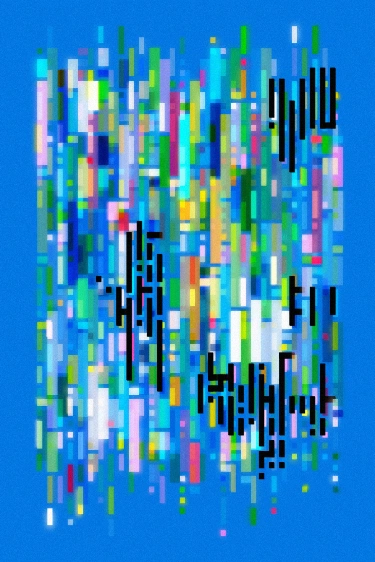

| Field | Value |
|-------|-------|
| **Type** | PinterestElement |
| **Source** | [www.gorillasun.de](https://www.gorillasun.de/) |
| **Tags** | graphic design |

CDN URL

`https://cdn.cosmos.so/12190880-1bbe-43a4-b417-04c99e5a304b`

---

## 9. Reimagined brand identity for <n>Kinsta</n>'s ecosystem of subbrands

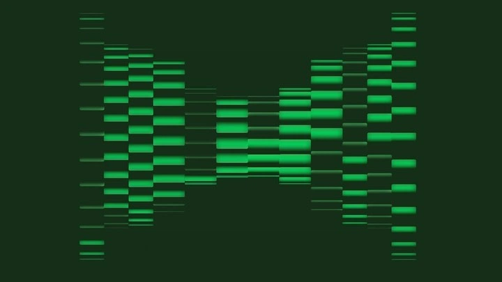

| Field | Value |
|-------|-------|
| **Type** | InstagramElement |
| **Source** | [www.instagram.com](https://www.instagram.com/p/C4a0l2UoZ_k/?igsh=MTUwaXN3ajYzYXRnYg==) |
| **Caption** | Reimagined brand identity for <n>Kinsta</n>'s ecosystem of subbrands. |
| **Tags** | graphic design, car, grille, seat león, bumper, rectangle, font, symmetry, technology |

CDN URL

`https://cdn.cosmos.so/3fa972e6-177e-4e6b-a560-4c59cb448b49`

---

## 10. tints and shades, colorfulness, purple, violet, rectangle

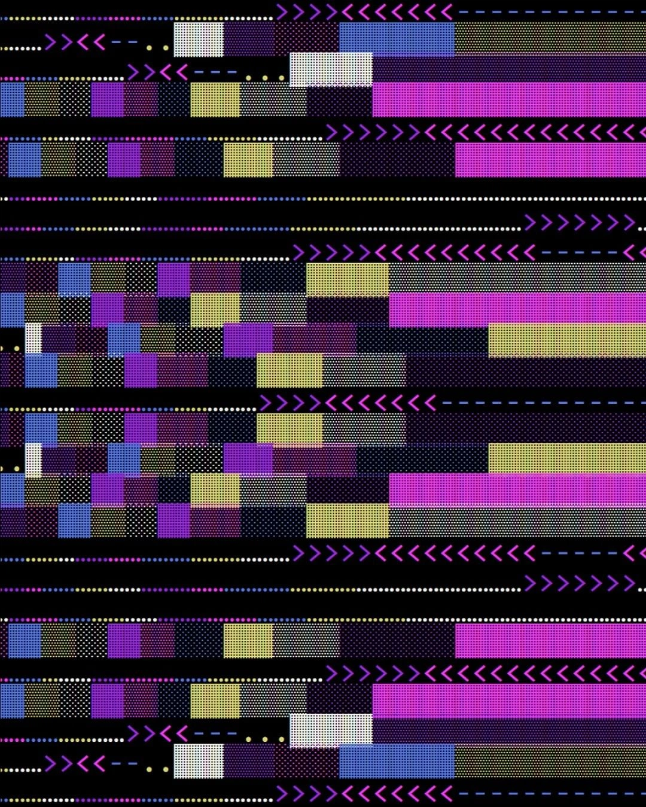

| Field | Value |
|-------|-------|
| **Type** | InstagramElement |
| **Source** | [www.instagram.com](https://www.instagram.com/p/C3S_sKhuVP2/) |
| **Tags** | tints and shades, colorfulness, purple, violet, rectangle, font, material property, magenta, pattern |

CDN URL

`https://cdn.cosmos.so/4a29be46-88bd-466e-9cc4-be0e9bee6f02`

---

## 11. Abstract glitch art by <n>Mydou</n>, 2013

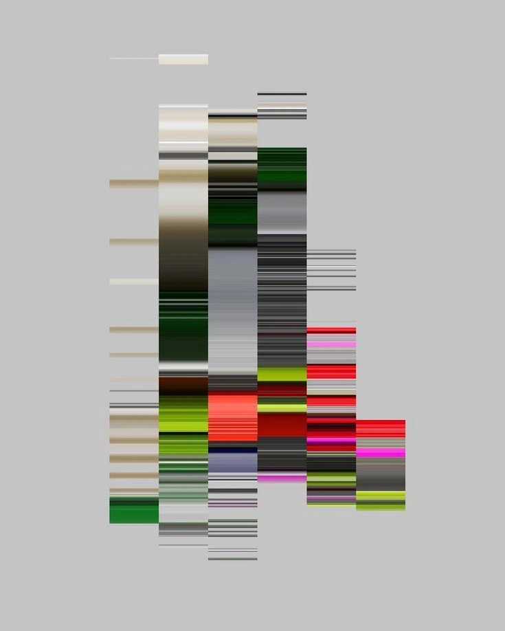

| Field | Value |
|-------|-------|
| **Type** | PinterestElement |
| **Source** | [www.pinterest.com](https://www.pinterest.com/pin/387168899237370621) |
| **Caption** | Abstract glitch art by <n>Mydou</n>, 2013. |
| **Tags** | graphic design, design, graphics, motion graphics |

CDN URL

`https://cdn.cosmos.so/ff584d2f-c8a4-4b40-8820-651c5f2db0c8`

---

## 12. architecture

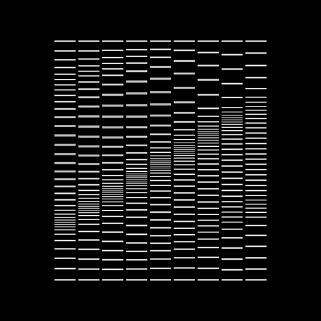

| Field | Value |
|-------|-------|
| **Type** | PinterestElement |
| **Source** | [giphy.com](https://giphy.com/gifs/daily-geometry-gif-art-wHLIaJOStmDqTcsVsS) |
| **Tags** | architecture |

CDN URL

`https://cdn.cosmos.so/93cbf13a-f833-45e4-a04f-433d53320ae5`

---

## 13. <n>Books of Cities</n>, an infographic visualizing the mention of major cities in books from 1800-2000

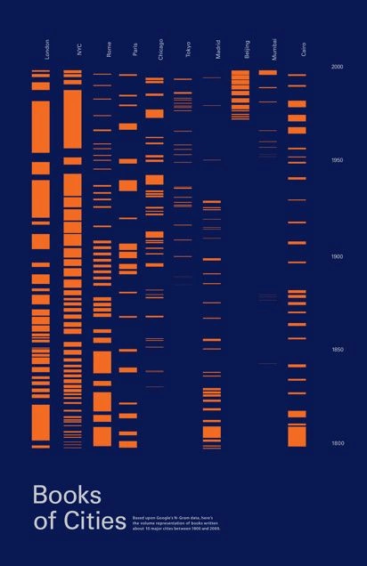

| Field | Value |
|-------|-------|
| **Type** | PinterestElement |
| **Source** | [designspiration.net](http://designspiration.net/image/3156210379380/) |
| **Caption** | <n>Books of Cities</n>, an infographic visualizing the mention of major cities in books from 1800-2000. |
| **Tags** | orange, graphic design, infographic, colorfulness, rectangle, font, parallel, electric blue |

CDN URL

`https://cdn.cosmos.so/9838fe01-4d73-4d22-a8f8-afbc00a01d51`

---

## 14. book cover

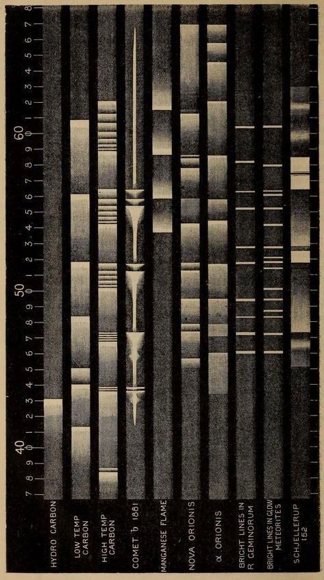

| Field | Value |
|-------|-------|
| **Type** | PinterestElement |
| **Source** | [www.pinterest.com](https://www.pinterest.com/pin/387168899237779166) |
| **Tags** | book cover |

CDN URL

`https://cdn.cosmos.so/e33deb41-8c8d-431a-af7a-4cb9547e7d9a`

---

## 15. Jaq Chartier | Pink/Orange (7 Lanes) (2018) | Artsy

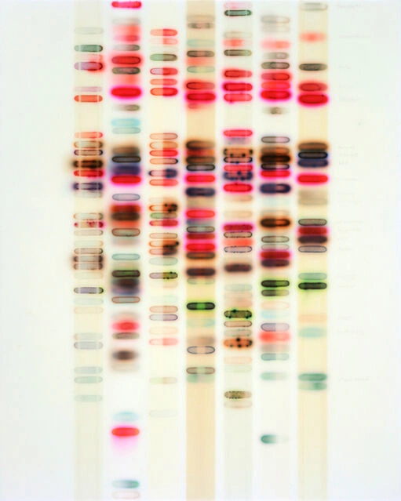

| Field | Value |
|-------|-------|
| **Type** | ArticleElement |
| **Source** | [www.artsy.net](https://www.artsy.net/artwork/jaq-chartier-pink-slash-orange-7-lanes) |
| **Caption** | <n>Survey 2 (red/green)</n>, a 2004 painting by artist <n>Jaq Chartier</n>. |
| **Tags** | tan, dolby chadwick gallery, art |

CDN URL

`https://cdn.cosmos.so/8b4f78fa-42a7-4393-a9cf-1398a7070b18`

---

## 16. <n>Testing</n> (2004) by artist <n>Jaq Chartier</n>

| Field | Value |
|-------|-------|
| **Type** | PinterestElement |
| **Source** | [jaqbox.com](https://jaqbox.com/portfolio/paintings-testing/) |
| **Caption** | <n>Testing</n> (2004) by artist <n>Jaq Chartier</n>. |
| **Tags** | jaq chartier, xavier hufkens, dolby chadwick gallery, art, painting, artwork |

CDN URL

`https://cdn.cosmos.so/7ae61dc5-1d3f-4eb5-b9cb-68227f18dff7`

---

## 17. New Year's card for <n>De Nijl Architecten</n> designed by <n>Karel Martens</n> in 1998

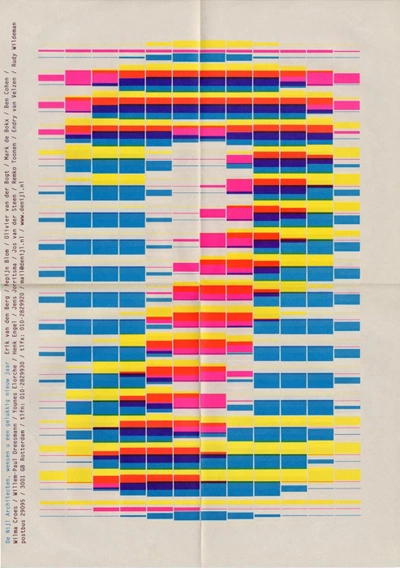

| Field | Value |
|-------|-------|
| **Type** | PinterestElement |
| **Source** | [www.printmag.com](https://www.printmag.com/image-of-the-day/image-of-the-day-archive-june-2010/) |
| **Caption** | New Year's card for <n>De Nijl Architecten</n> designed by <n>Karel Martens</n> in 1998. |
| **Tags** | karel martens graphic, graphic design, graphics, design, colorfulness, rectangle, art, creative arts, font, tints and shades, symmetry, pattern |

CDN URL

`https://cdn.cosmos.so/e75705b3-6bb9-4421-8e42-c92a61e41fe6`

---

## 18. <n>QQL #1</n> (2022), a generative artwork from the <n>QQL</n> project by artists <n>Tyler Hobbs</n> and <n>Dandelion Wi

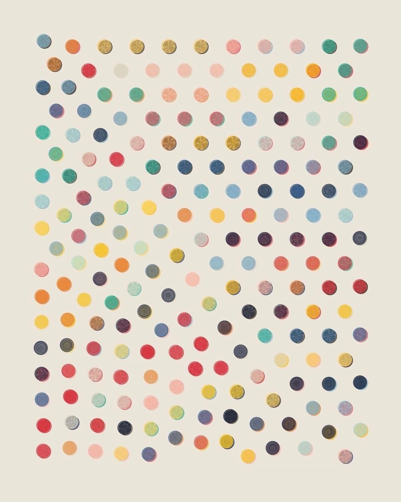

| Field | Value |
|-------|-------|
| **Type** | InstagramElement |
| **Source** | [www.instagram.com](https://www.instagram.com/p/CkGg_gMsr0E/?igsh=MTc4MmM1YmI2Ng==) |
| **Caption** | <n>QQL #1</n> (2022), a generative artwork from the <n>QQL</n> project by artists <n>Tyler Hobbs</n> and <n>Dandelion Wist</n>. |
| **Tags** | ib laursen quilt, dress, rectangle, art, font, pattern |

CDN URL

`https://cdn.cosmos.so/375bddd8-0fa3-4df6-adf6-747daa9e61cc`

---

## 19. <n>Risograph Colour Chart</n> by <n>Peacock Visual Arts</n>

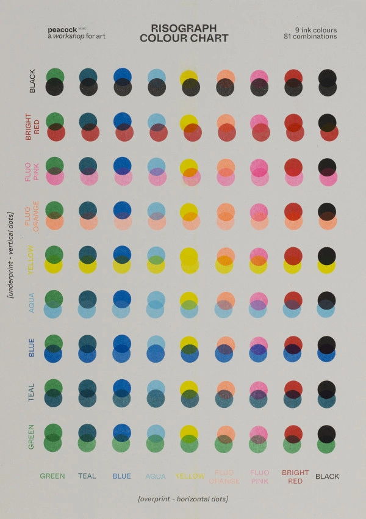

| Field | Value |
|-------|-------|
| **Type** | PinterestElement |
| **Source** | [peacock.studio](https://peacock.studio/shopping/products/risograph-colour-chart-a3) |
| **Caption** | <n>Risograph Colour Chart</n> by <n>Peacock Visual Arts</n>. |
| **Tags** | risograph color chart, risograph, color, color chart |

CDN URL

`https://cdn.cosmos.so/872dfb56-f640-44e6-a337-0eee5e0fcbf0`

---

## 20. An abstract digital illustration by artist <n>Jerry-Lee Bosmans</n> from 2021

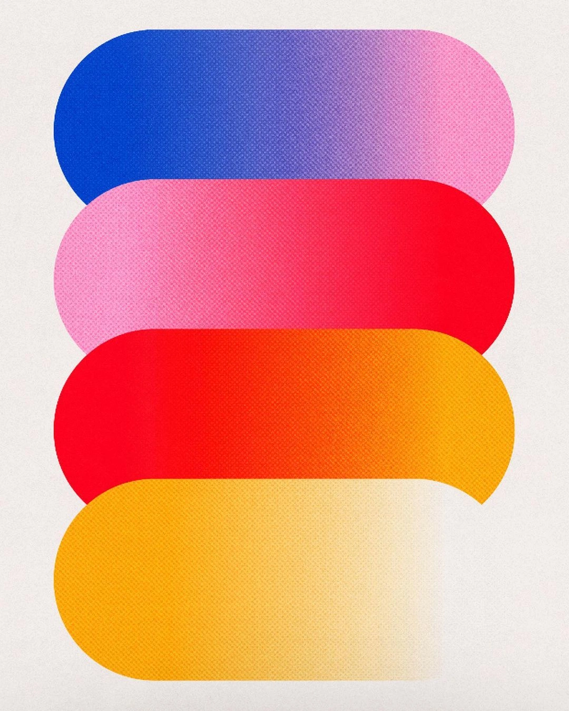

| Field | Value |
|-------|-------|
| **Type** | InstagramElement |
| **Source** | [www.instagram.com](https://www.instagram.com/p/Cgt7i6Xsofi/) |
| **Caption** | An abstract digital illustration by artist <n>Jerry-Lee Bosmans</n> from 2021. |
| **Tags** | orange, art, material property, font, tints and shades, circle, magenta, pattern |

CDN URL

`https://cdn.cosmos.so/4b9377cb-9547-46cc-8704-7edd7f86229c`

---

## 21. graphic design, graphics, design, dither

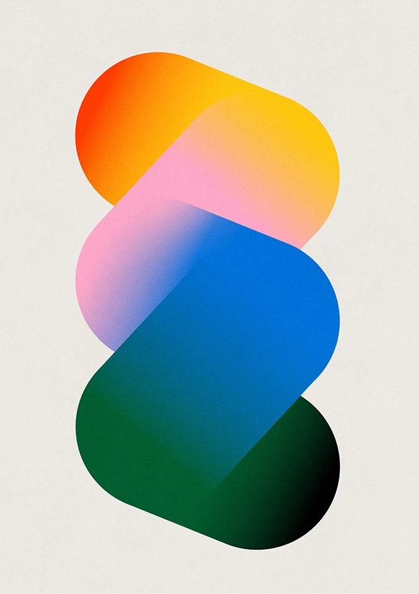

| Field | Value |
|-------|-------|
| **Type** | PinterestElement |
| **Source** | [www.behance.net](https://www.behance.net/gallery/124459669/Printmaking-Challenge-V9) |
| **Tags** | graphic design, graphics, design, dither |

CDN URL

`https://cdn.cosmos.so/ef2692ca-18af-4788-8956-ef148c58fae0`

---

## 22. Graphical abstraction by graphic designer <n>Jerry-Lee Bosmans</n>

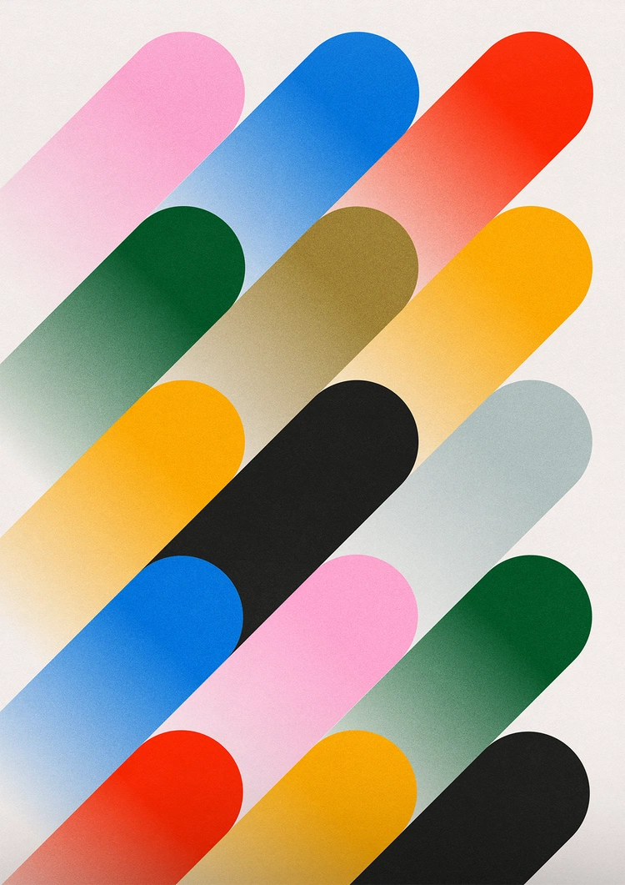

| Field | Value |
|-------|-------|
| **Type** | Element |
| **Source** | [images.squarespace-cdn.com](https://images.squarespace-cdn.com/content/v1/62e17c136363780c54b90660/a6f75482-05de-4a54-b588-19b32c6baf71/TEXTUUR-m.png?format=750w) |
| **Caption** | Graphical abstraction by graphic designer <n>Jerry-Lee Bosmans</n>. |
| **Tags** | graphic design, poster, design, graphics, art |

CDN URL

`https://cdn.cosmos.so/621d0296-8fb3-4911-b0f1-cb0b9ba64a52`

---

## 23. <n>Printmaking Challenge V19</n> by <n>Jerry-Lee Bosmans</n>

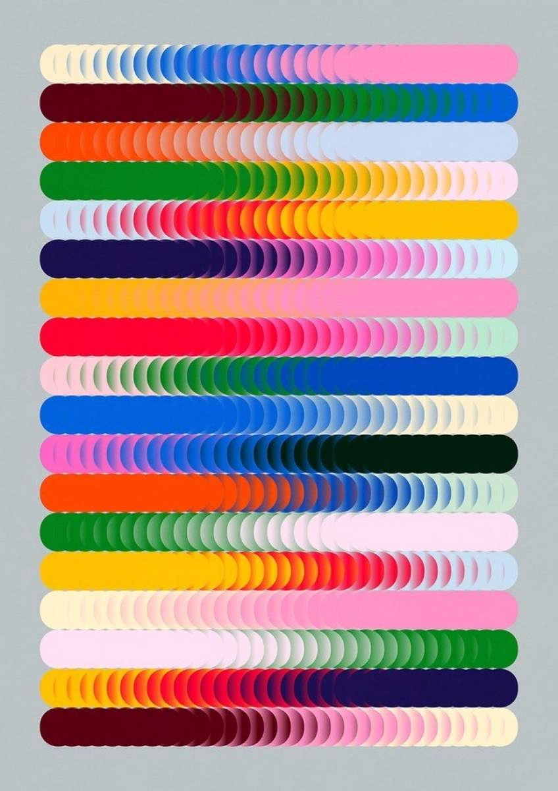

| Field | Value |
|-------|-------|
| **Type** | Element |
| **Source** | [www.are.na](https://www.are.na/block/22664369) |
| **Caption** | <n>Printmaking Challenge V19</n> by <n>Jerry-Lee Bosmans</n>. |
| **Tags** | plastic, vesuvius soul records, rectangle, parallel |

CDN URL

`https://cdn.cosmos.so/5cac8802-a251-4c5f-bf41-2487156f1c2c`

---

## 24. <n>Motion explorations</n>

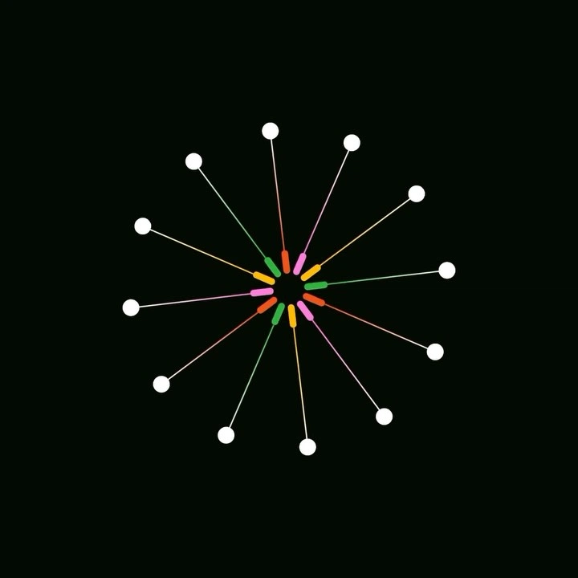

| Field | Value |
|-------|-------|
| **Type** | InstagramElement |
| **Source** | [www.instagram.com](https://www.instagram.com/p/DKcTYIJR3y3/?igsh=dHRoanVyYTN6M2Ex) |
| **Caption** | <n>Motion explorations</n>. |
| **Tags** | graphic design |

CDN URL

`https://cdn.cosmos.so/34103db7-965f-4e3c-ab3a-890fe0c80166`

---

## 25. monochrome photography, gesture, sleeve, collar, font

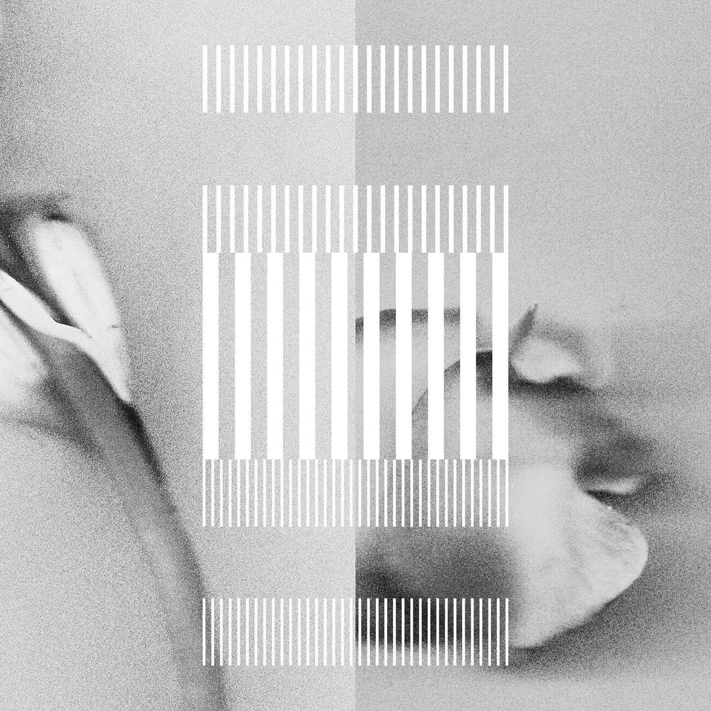

| Field | Value |
|-------|-------|
| **Type** | InstagramElement |
| **Source** | [www.instagram.com](https://www.instagram.com/p/B42E4p_KJsK/) |
| **Tags** | monochrome photography, gesture, sleeve, collar, font |

CDN URL

`https://cdn.cosmos.so/3601ee91-137c-4050-af83-0236790c0748`

---

## 26. <n>Cinema Redux</n>, a data visualization by artist <n>Brendan Dawes</n>

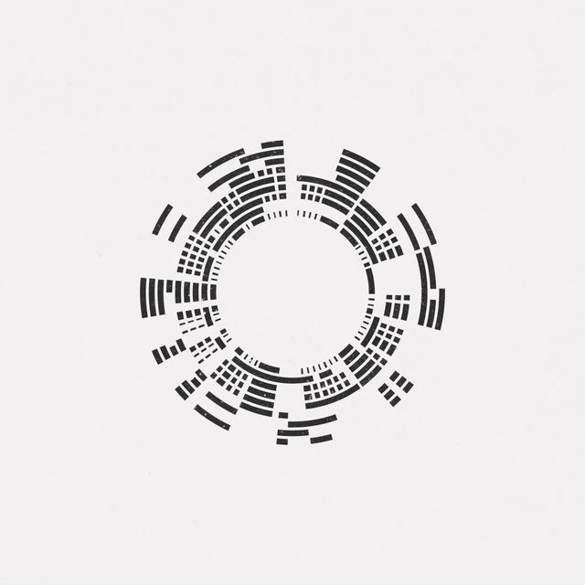

| Field | Value |
|-------|-------|
| **Type** | PinterestElement |
| **Source** | [www.pinterest.com](https://www.pinterest.com/pin/387168899238019888) |
| **Caption** | <n>Cinema Redux</n>, a data visualization by artist <n>Brendan Dawes</n>. |
| **Tags** | behance music, graphic design, design, graphics |

CDN URL

`https://cdn.cosmos.so/7985188c-1990-46db-9fe6-cdbad1fc8607`

---

## 27. 40 second, timer, illustration

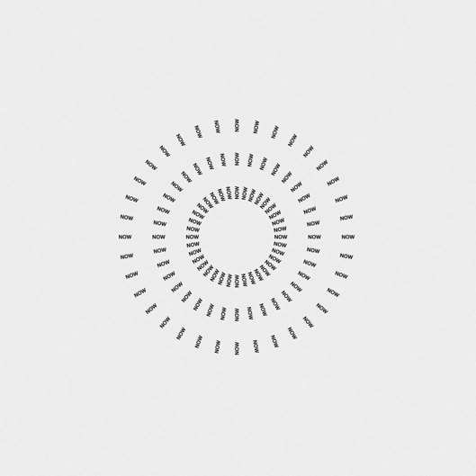

| Field | Value |
|-------|-------|
| **Type** | Element |
| **Tags** | 40 second, timer, illustration |

CDN URL

`https://cdn.cosmos.so/7be8ed4a-f983-4f1e-9cc6-d7554aff992d`

---

## 28. art, font, pattern, symmetry, circle

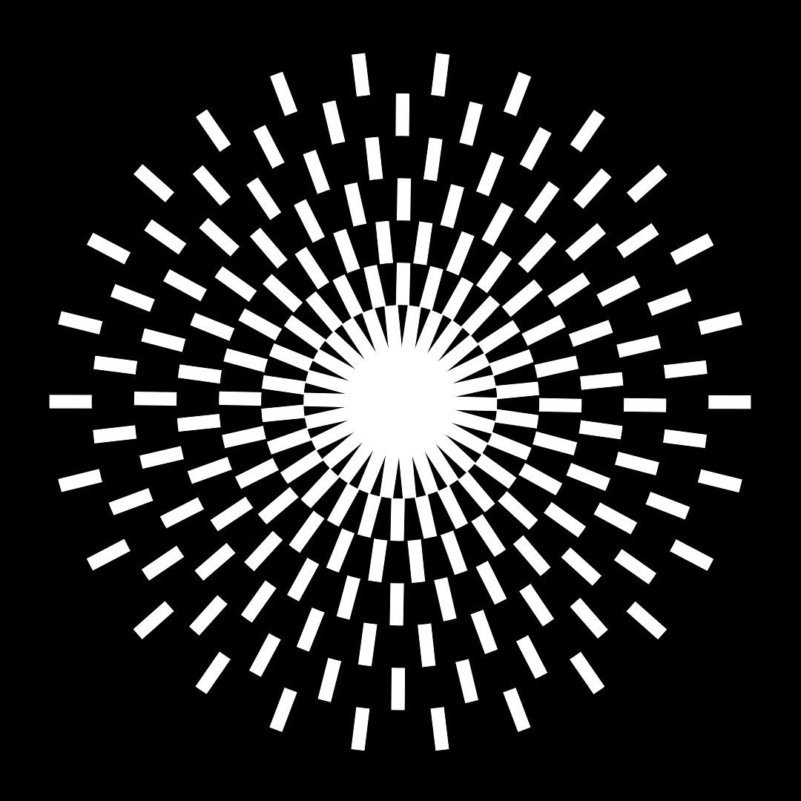

| Field | Value |
|-------|-------|
| **Type** | Element |
| **Source** | [savee.it](https://savee.it/i/_R3Kmxc/) |
| **Tags** | art, font, pattern, symmetry, circle, stock photography, song of the forest |

CDN URL

`https://cdn.cosmos.so/6ea1065a-4410-4280-87b8-0528eb1a9325`

---

## 29. monochrome photography, art, symmetry

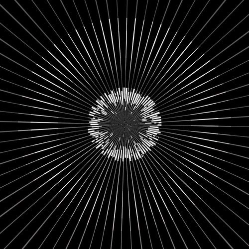

| Field | Value |
|-------|-------|
| **Type** | PinterestElement |
| **Source** | [planetaryfolklore.tumblr.com](http://planetaryfolklore.tumblr.com/page/153) |
| **Tags** | monochrome photography, art, symmetry |

CDN URL

`https://cdn.cosmos.so/486480cc-3ac4-4aca-bee7-6893e212facb`

---

## 30. architecture

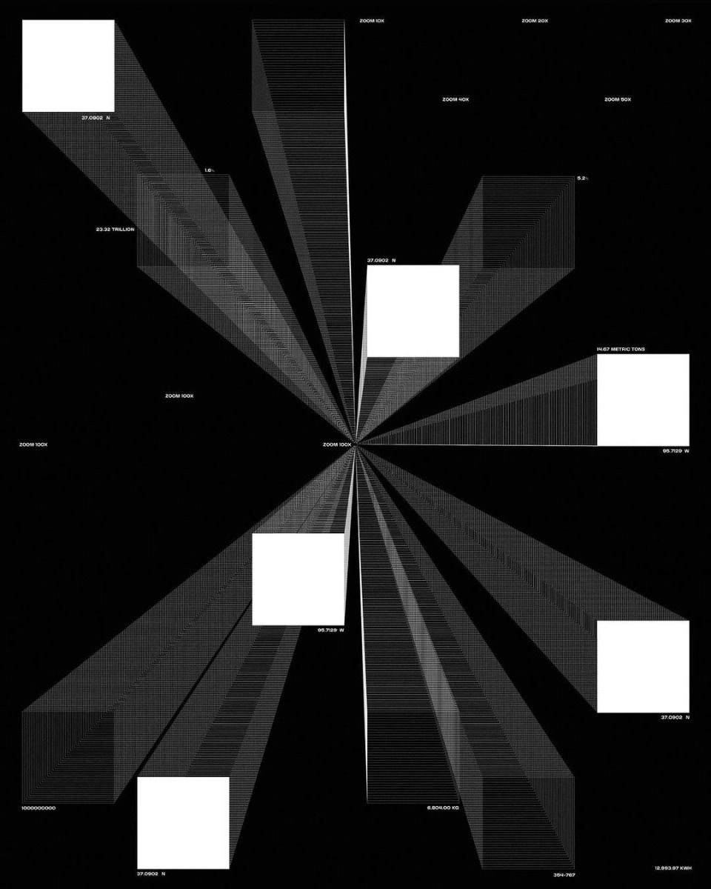

| Field | Value |
|-------|-------|
| **Type** | PinterestElement |
| **Source** | [www.instagram.com](https://www.instagram.com/lifeofmansoor/) |
| **Tags** | architecture |

CDN URL

`https://cdn.cosmos.so/5ea9b749-782a-4c29-a79d-4b4ce786e915`

---

## 31. Endless Cubes, an animated GIF by <n>davidope</n>

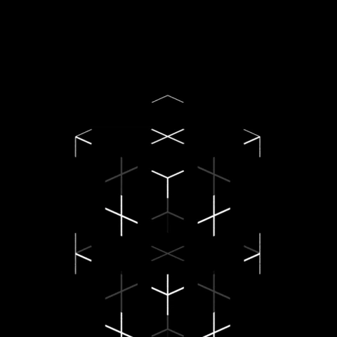

| Field | Value |
|-------|-------|
| **Type** | Element |
| **Caption** | Endless Cubes, an animated GIF by <n>davidope</n>. |
| **Tags** | font, rectangle, parallel, monochrome photography, gif, animation |

CDN URL

`https://cdn.cosmos.so/8415c1c5-7328-481e-98bb-8341113a5b56`

---

## 32. Generative artwork by <n>seohyowork</n>, 2024

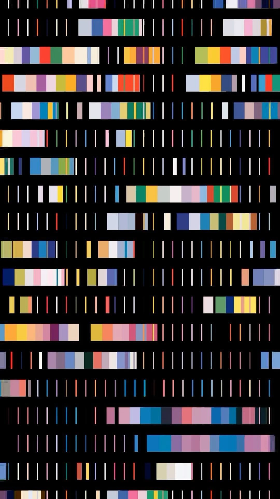

| Field | Value |
|-------|-------|
| **Type** | InstagramElement |
| **Source** | [www.instagram.com](https://www.instagram.com/reel/C79iVUhyIPx/?igsh=MW53ZnY4NTJkdzlpdw==) |
| **Caption** | Generative artwork by <n>seohyowork</n>, 2024. |
| **Tags** | graphic design |

CDN URL

`https://cdn.cosmos.so/dafd1021-5977-4f12-8e32-324669bb653e`

---

## 33. graphic design

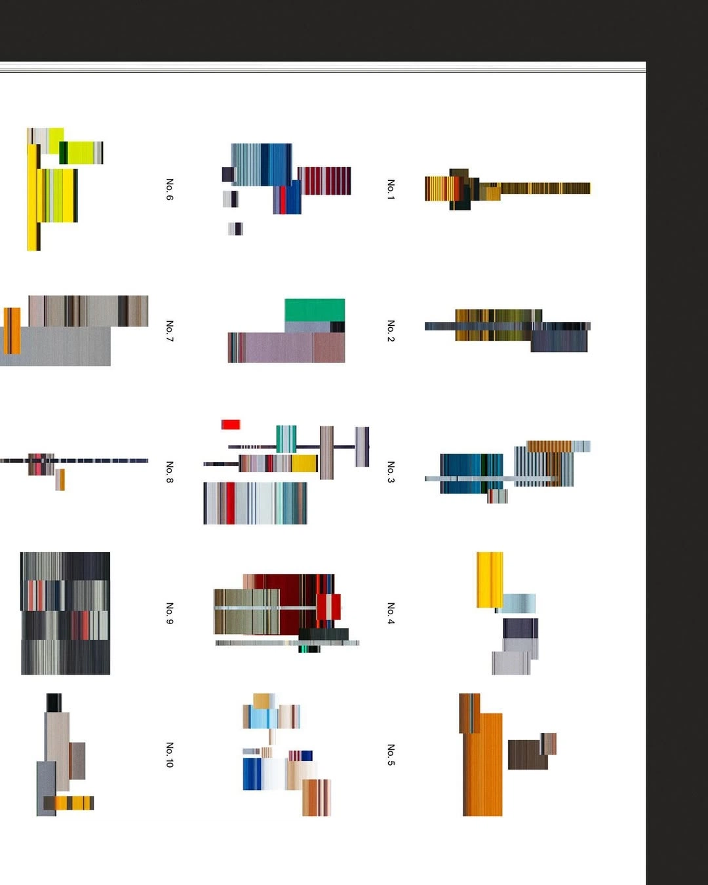

| Field | Value |
|-------|-------|
| **Type** | InstagramElement |
| **Source** | [www.instagram.com](https://www.instagram.com/p/DDmro37uAbk/) |
| **Tags** | graphic design |

CDN URL

`https://cdn.cosmos.so/eaf33e04-ea80-4b47-892e-f426dbc6cb6f`

---

## 34. <n>High Tide</n>, a digital illustration

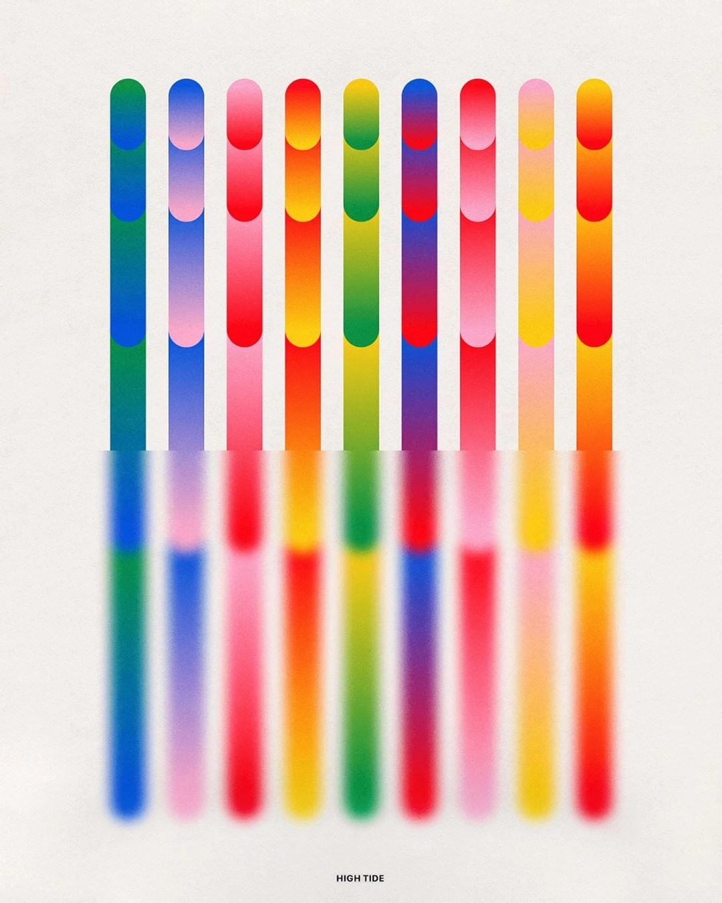

| Field | Value |
|-------|-------|
| **Type** | InstagramElement |
| **Source** | [www.instagram.com](https://www.instagram.com/p/CVkozCWKDpF/) |
| **Caption** | <n>High Tide</n>, a digital illustration. |
| **Tags** | graphic design, design, poster |

CDN URL

`https://cdn.cosmos.so/7682f598-7cd0-4fa8-b1df-9ee86c98e46c`

---

## 35. orange, colorfulness, rectangle, art, material property

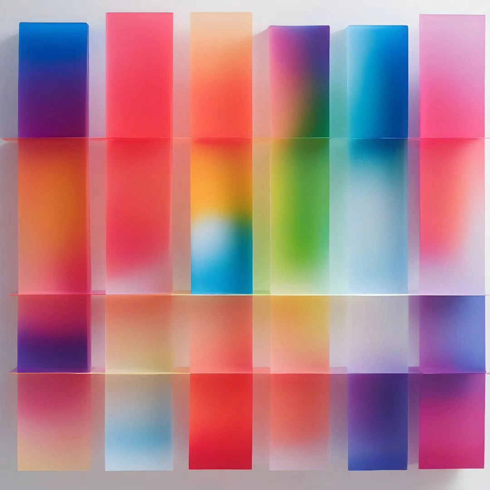

| Field | Value |
|-------|-------|
| **Type** | InstagramElement |
| **Source** | [www.instagram.com](https://www.instagram.com/p/C1cXKNcIOKI/) |
| **Tags** | orange, colorfulness, rectangle, art, material property, magenta, pattern, tints and shades |

CDN URL

`https://cdn.cosmos.so/60108761-17d7-4e91-8afd-70fa337cb48d`

---

## 36. graphic design

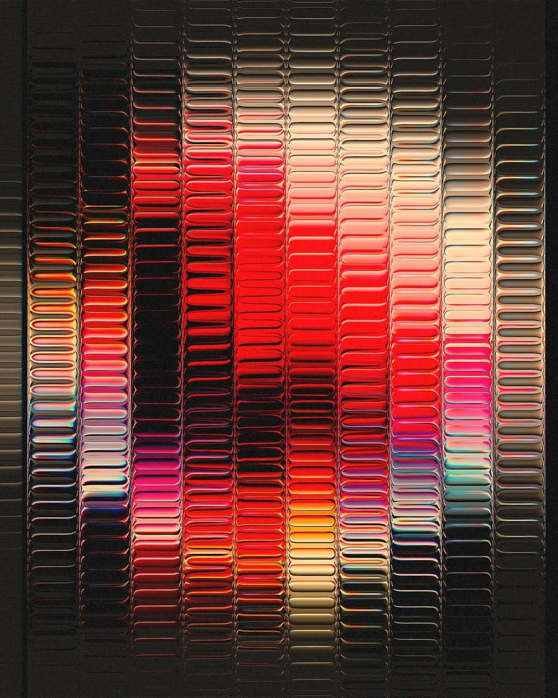

| Field | Value |
|-------|-------|
| **Type** | InstagramElement |
| **Source** | [www.instagram.com](https://www.instagram.com/p/DDnAy7jOoLS/?igsh=dTJ4bzR0b24wN3Fn) |
| **Tags** | graphic design |

CDN URL

`https://cdn.cosmos.so/a5cd2037-3bd4-4559-806c-7309220a78cd`

---

## 37. <n>Musica Viva</n> concert poster designed by <n>Josef Müller-Brockmann</n> in 1959

| Field | Value |
|-------|-------|
| **Type** | PinterestElement |
| **Source** | [it.pinterest.com](https://it.pinterest.com/pin/2885187238176846/) |
| **Caption** | <n>Musica Viva</n> concert poster designed by <n>Josef Müller-Brockmann</n> in 1959. |
| **Tags** | document, design, international typographic style, bauhaus, graphic design |

CDN URL

`https://cdn.cosmos.so/70d15295-d623-4b09-8e10-42093f0f4407`

---

## 38. angle, font

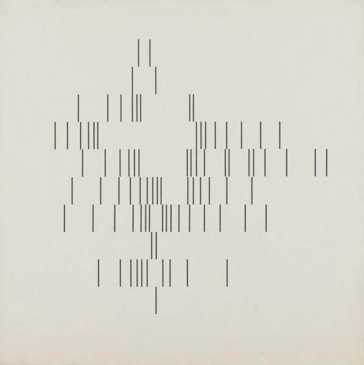

| Field | Value |
|-------|-------|
| **Type** | PinterestElement |
| **Source** | [sammlungen-archive.zhdk.ch](http://sammlungen-archive.zhdk.ch/view/objects/asitem/People@17084/29/title-asc) |
| **Tags** | angle, font |

CDN URL

`https://cdn.cosmos.so/89576bcd-9325-4260-bdb5-4b692b035859`

---

## 39. <n>Front Page Fingerprint</n> by <n>Derek Chan</n>, a 2011 data visualization of <n>The New York Times</n>’ front page c

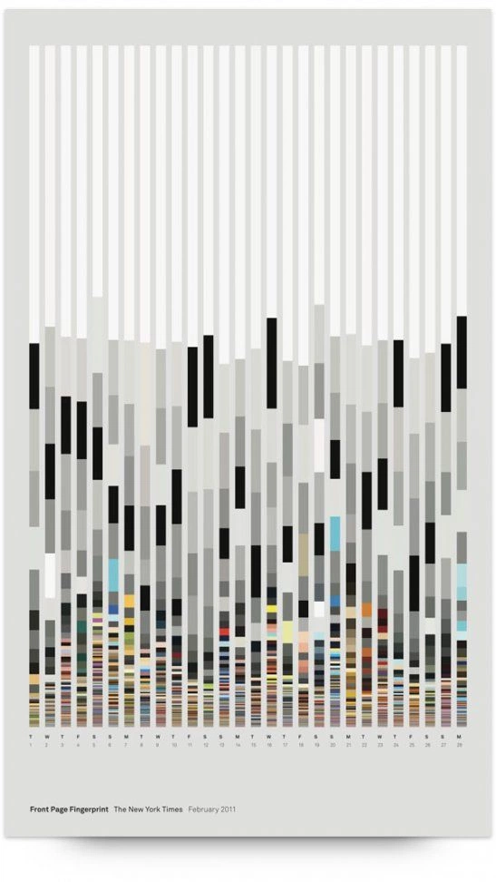

| Field | Value |
|-------|-------|
| **Type** | PinterestElement |
| **Source** | [www.businessinsider.com](http://www.businessinsider.com/this-is-the-coolest-visualization-of-the-new-york-times-front-page-weve-seen-2011-6) |
| **Caption** | <n>Front Page Fingerprint</n> by <n>Derek Chan</n>, a 2011 data visualization of <n>The New York Times</n>’ front page colors. |
| **Tags** | new york times data vis design, graphic design, design, data and information visualization, visualization, infographic, rectangle, font |

CDN URL

`https://cdn.cosmos.so/165651f1-a38a-4788-9f06-245e34d10064`

---

## 40. graphic design

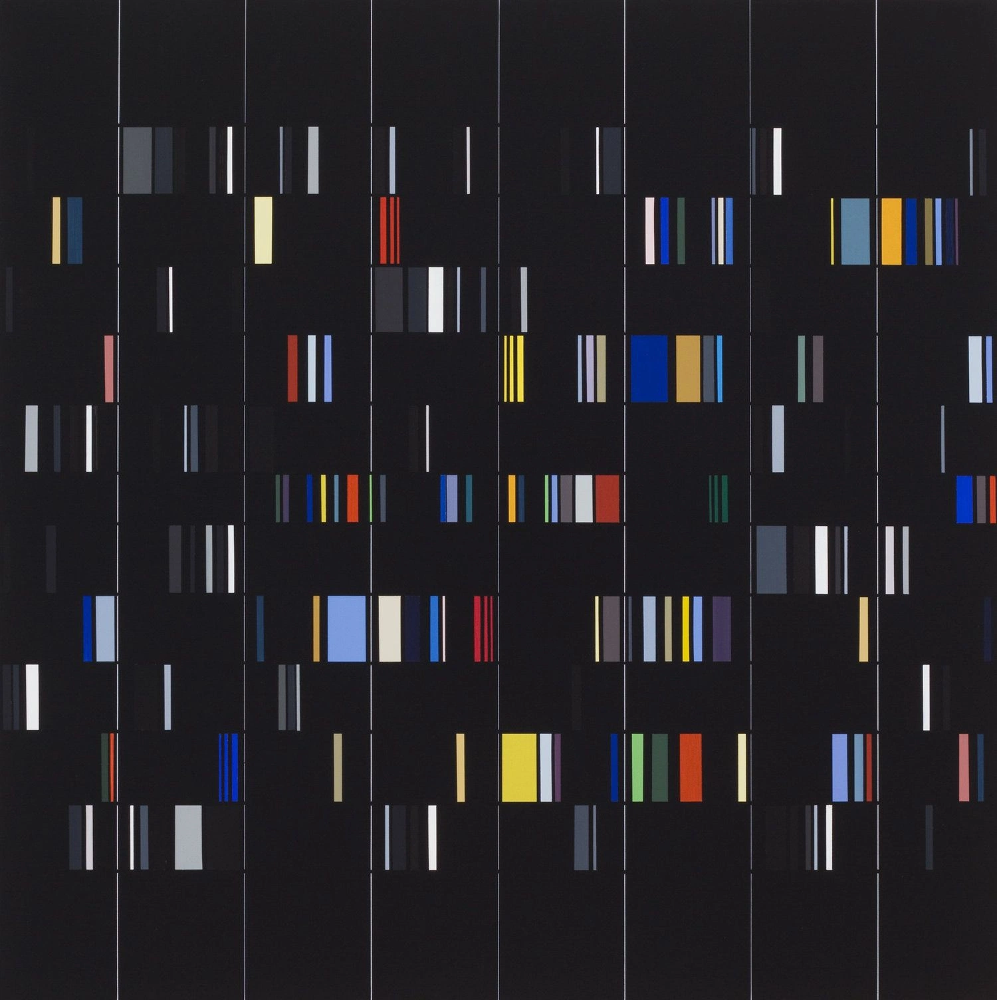

| Field | Value |
|-------|-------|
| **Type** | PinterestElement |
| **Source** | [www.otto-painting.com](http://www.otto-painting.com/) |
| **Tags** | graphic design |

CDN URL

`https://cdn.cosmos.so/6120f8ee-f2d8-4a7c-9ba1-f6874b63ff93`

---

## 41. publication, font, book, rectangle

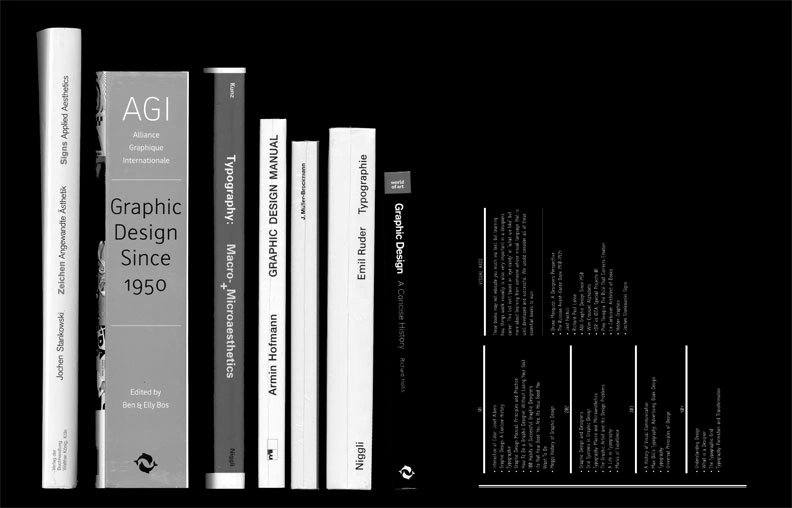

| Field | Value |
|-------|-------|
| **Type** | Element |
| **Tags** | publication, font, book, rectangle |

CDN URL

`https://cdn.cosmos.so/df8c3926-a86e-4429-89bc-8fdc4aae6889`

---

## 42. monochrome

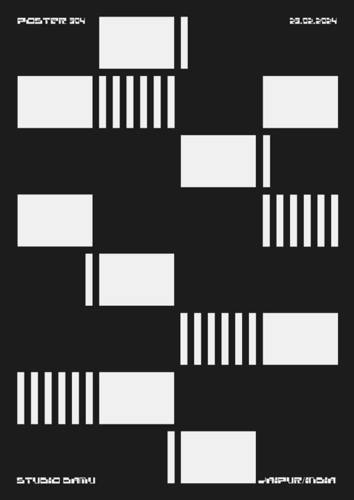

| Field | Value |
|-------|-------|
| **Type** | PinterestElement |
| **Source** | [www.instagram.com](https://www.instagram.com/studiodamu) |
| **Tags** | monochrome |

CDN URL

`https://cdn.cosmos.so/a977bf2e-2892-418b-a947-e2fd150952e9`

---

## 43. pattern, john deere, rectangle, font, tints and shades

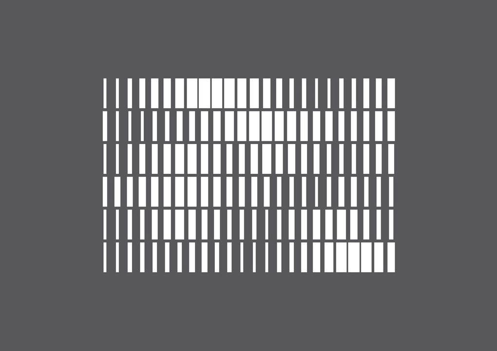

| Field | Value |
|-------|-------|
| **Type** | PinterestElement |
| **Source** | [northbankdesign.co.uk](https://northbankdesign.co.uk/project/identities/) |
| **Tags** | pattern, john deere, rectangle, font, tints and shades |

CDN URL

`https://cdn.cosmos.so/d6238c2d-ced2-4d57-9eef-657358348ff2`

---
