# Illustration

*Collection from [Cosmos.so](https://www.cosmos.so/arjunphlox/illustration) -- 85 items*

---

### 1. Reach (2020) by artist Helvetica Blanc.

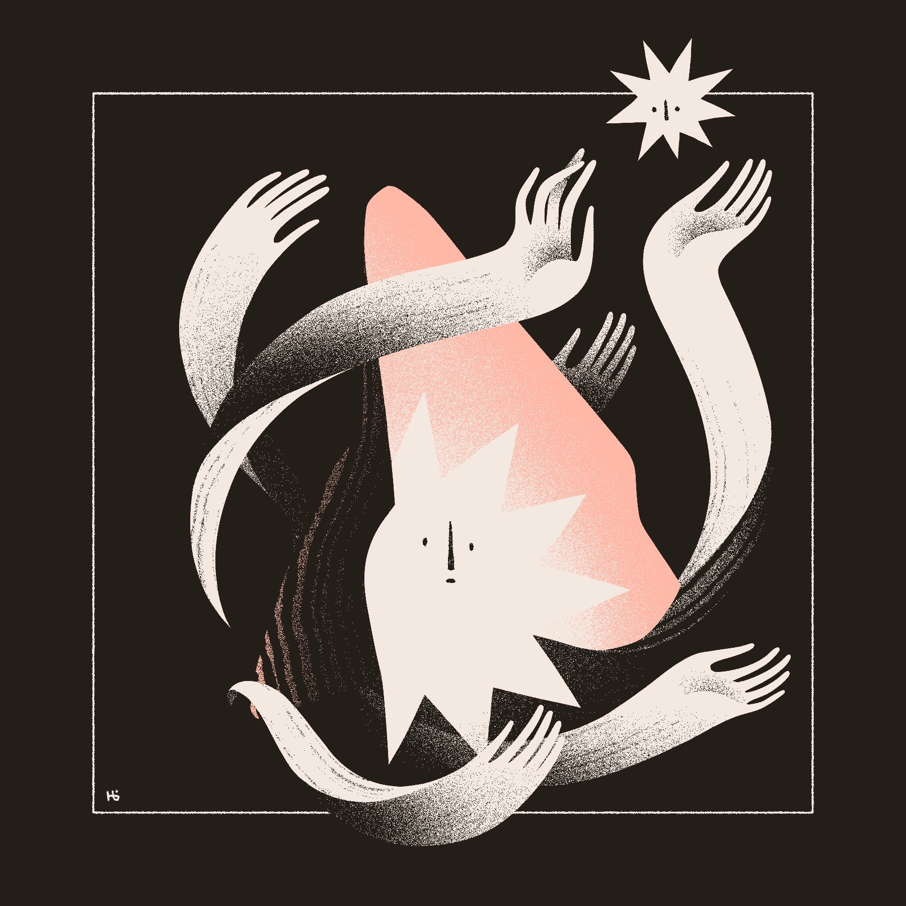

**Source:** [https://helveticablanc.com/artwork.html](https://helveticablanc.com/artwork.html)
**Tags:** `illustration`, `graphic design`

---

### 2. Afternoon (2018) by illustrator Rebecca Shieh.

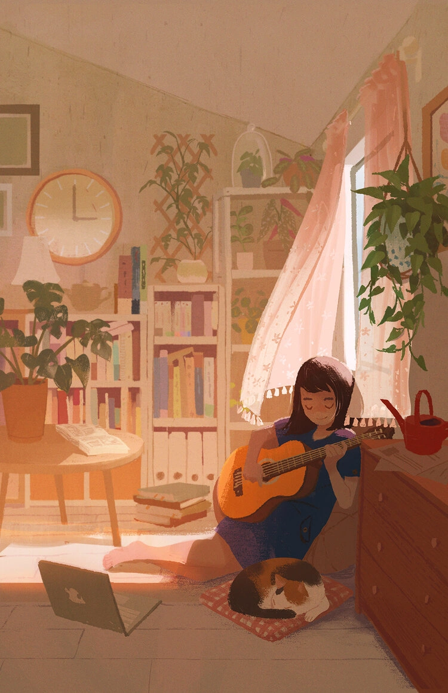

**Source:** [https://rebeccashieh.com/illustrations](https://rebeccashieh.com/illustrations)
**Tags:** `ảnh guitar buồn anime`, `guitar`, `animation`, `image`

---

### 3. Digital illustration by Philip Sue Art.

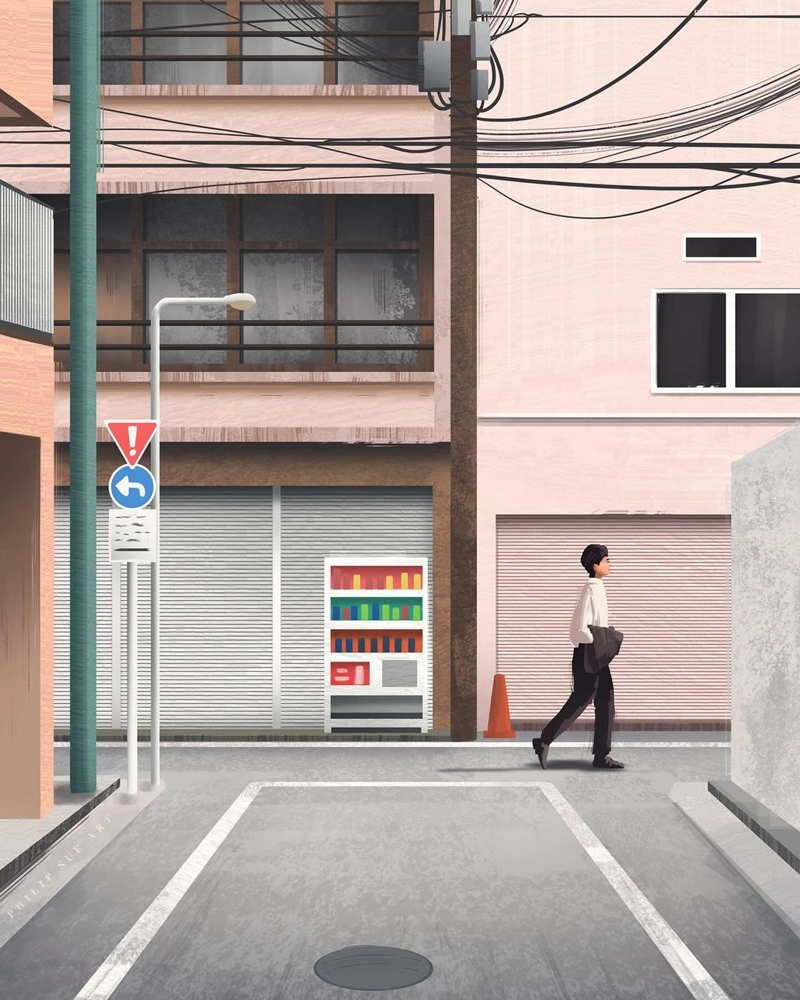

**Source:** [https://www.instagram.com/p/DCCE_idTOIG/?igsh=c2F1aWw3dmszcX...](https://www.instagram.com/p/DCCE_idTOIG/?igsh=c2F1aWw3dmszcXN3)
**Type:** Instagram
**Tags:** `intersection`, `art`

---

### 4. Get illustrations for Websites and applications

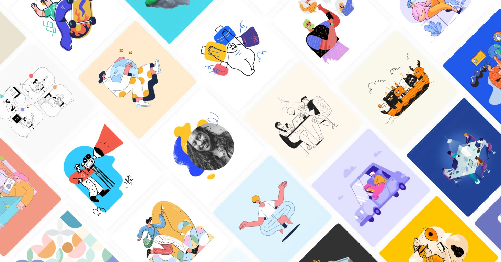

**Source:** [https://www.getillustrations.com/illustration-packs](https://www.getillustrations.com/illustration-packs)
**Type:** Article
**Caption:** A collection of customizable illustrations from Blush, a tool created by Pablo Stanley.
**Tags:** `cartoon`

---

### 5. Item 5

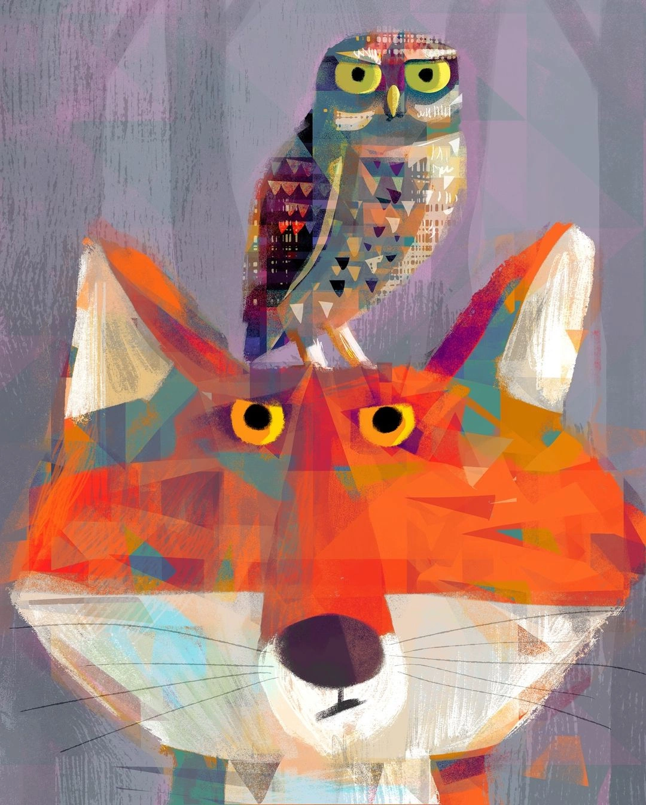

**Source:** [https://www.instagram.com/p/C_SrhIUqQz4/?igsh=MWZuYmtzNXUwbH...](https://www.instagram.com/p/C_SrhIUqQz4/?igsh=MWZuYmtzNXUwbHZqMA==)
**Type:** Instagram
**Tags:** `origami`

---

### 6. Illustration by sofia buti and Anya Derevyanko for creative studio illotv.

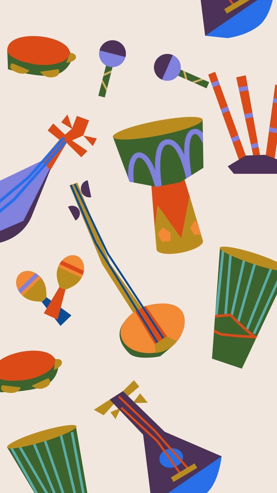

**Source:** [https://www.instagram.com/reel/C-ksHZEIdJl/?igsh=bnI1eHdoNjZ...](https://www.instagram.com/reel/C-ksHZEIdJl/?igsh=bnI1eHdoNjZueXd4)
**Type:** Instagram
**Tags:** `clip art`

---

### 7. Typography X Living spaces, an illustration of a cityscape in Vellore, Tamil Nadu.

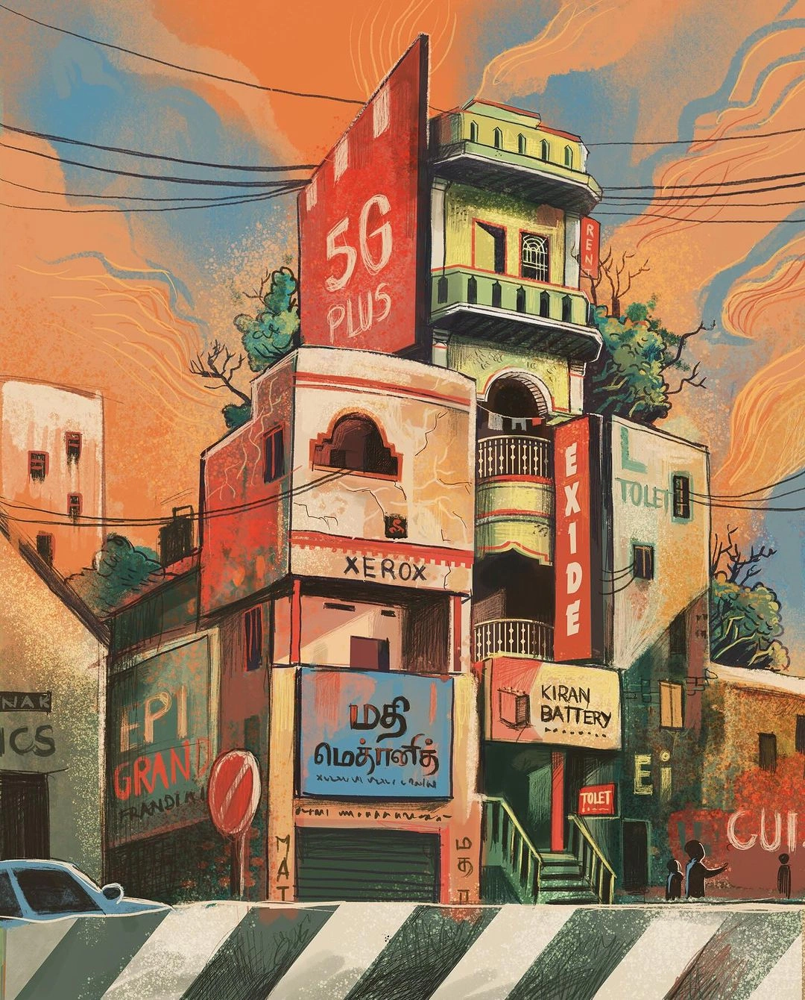

**Source:** [https://www.instagram.com/p/C7N3mdpxULu/?igsh=MWN2NGtudWtybD...](https://www.instagram.com/p/C7N3mdpxULu/?igsh=MWN2NGtudWtybDRiNQ==)
**Type:** Instagram
**Tags:** `facade`, `property`, `building`, `window`, `font`, `art`, `residential area`, `sky`

---

### 8. Whalescape digital illustration, reworked from an original piece created for Inktober.

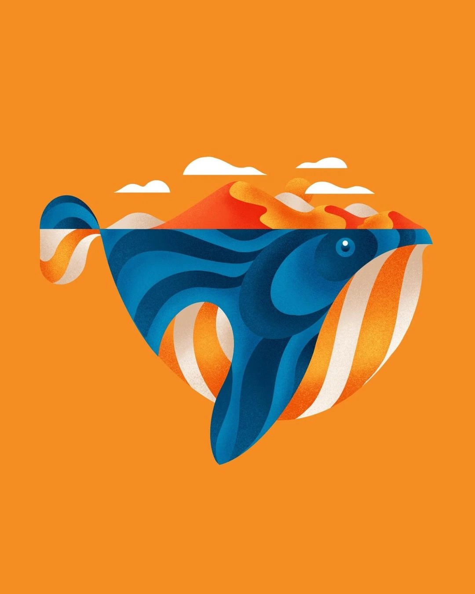

**Source:** [https://www.instagram.com/p/C6dzFcpARqc/?igsh=Y3oyeGFzeHVucz...](https://www.instagram.com/p/C6dzFcpARqc/?igsh=Y3oyeGFzeHVuczZr)
**Type:** Instagram
**Tags:** `illustration`, `fin`, `sleeve`, `font`, `electric blue`

---

### 9. Item 9

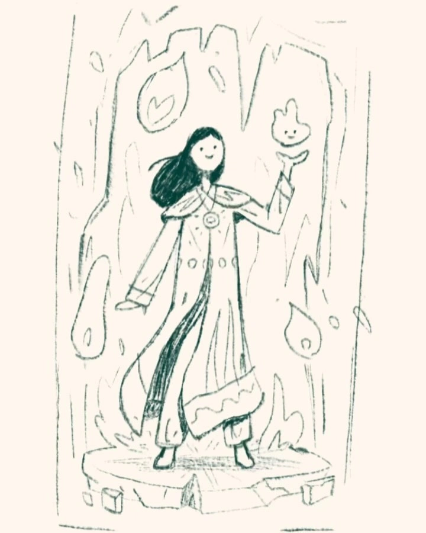

**Source:** [https://www.instagram.com/p/C6beVWsyjJG/?igsh=cGpqODQxdXV1Zm...](https://www.instagram.com/p/C6beVWsyjJG/?igsh=cGpqODQxdXV1ZmIy)
**Type:** Instagram
**Tags:** `illustration`, `sleeve`, `gesture`, `art`, `handwriting`, `rectangle`

---

### 10. Digital painting Verão Litorâneo by Exnihilo Creations.

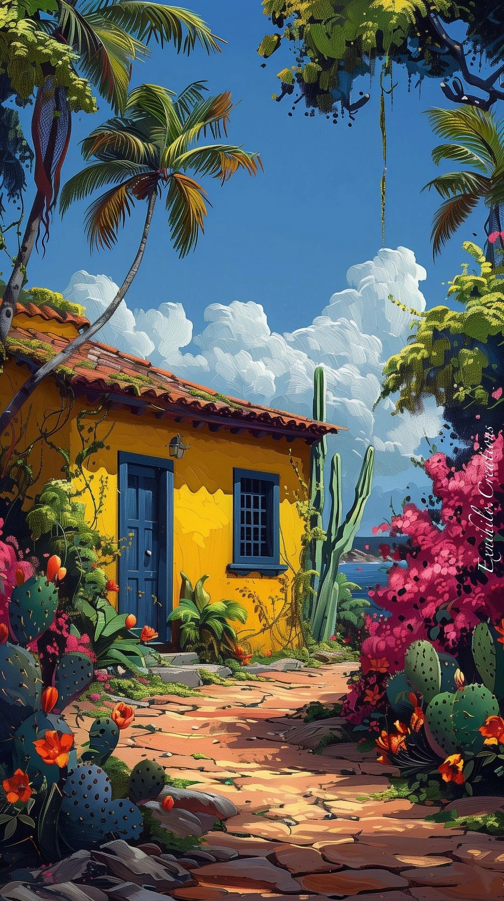

**Source:** [https://www.instagram.com/p/C6BeS6Qsl6i/?igsh=MWhuNHI4djB6Mj...](https://www.instagram.com/p/C6BeS6Qsl6i/?igsh=MWhuNHI4djB6MjE2aA==)
**Type:** Instagram
**Tags:** `house`, `2024`, `flower`, `sky`, `plant`, `cloud`, `building`, `property`, `window`, `botany`

---

### 11. Item 11

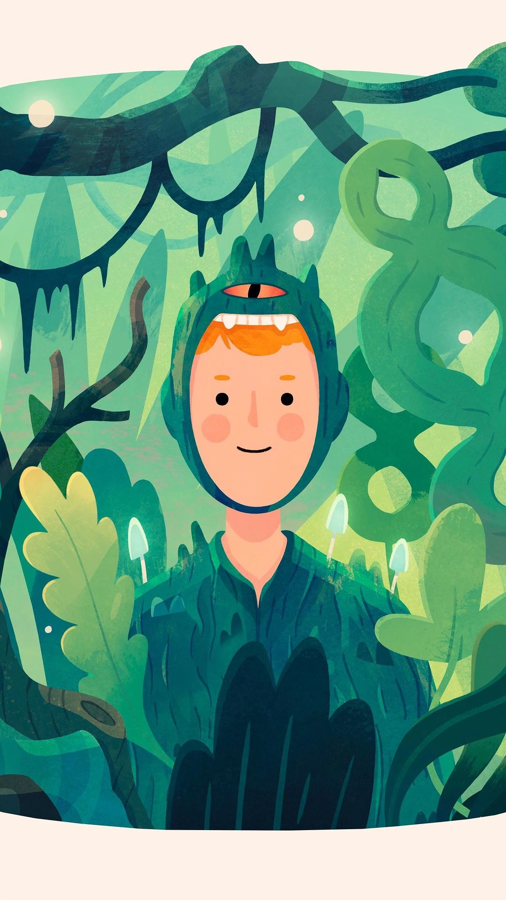

**Source:** [https://www.instagram.com/reel/C5BRUaRvUlF/?igsh=bXAxbnEwNjM...](https://www.instagram.com/reel/C5BRUaRvUlF/?igsh=bXAxbnEwNjM1c2h1)
**Type:** Instagram
**Tags:** `painting`, `green`, `people in nature`, `smile`, `leaf`, `azure`, `textile`, `botany`, `organism`

---

### 12. minimator

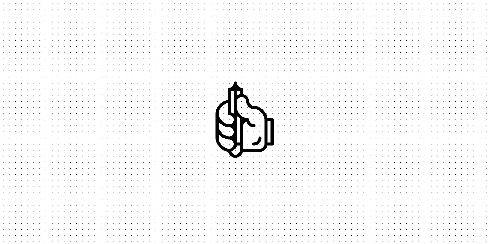

**Source:** [https://minimator.app/?utm_source=densediscovery&utm_medium=...](https://minimator.app/?utm_source=densediscovery&utm_medium=email&utm_campaign=newsletter-issue-171)
**Type:** Article
**Tags:** `gesture`, `art`, `font`, `rectangle`, `circle`, `design`

---

### 13. Item 13

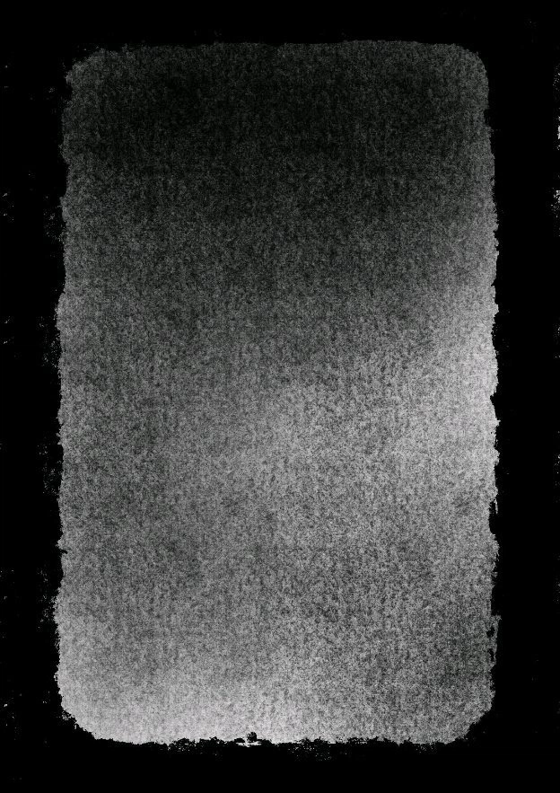

**Source:** [https://www.instagram.com/reel/C4k8i_DPmYP/?igsh=MXN2cjVvdTJ...](https://www.instagram.com/reel/C4k8i_DPmYP/?igsh=MXN2cjVvdTJweThhcQ==)
**Type:** Instagram
**Tags:** `photograph`, `rectangle`, `textile`, `grey`, `font`, `tints and shades`, `symmetry`, `pattern`

---

### 14. Item 14

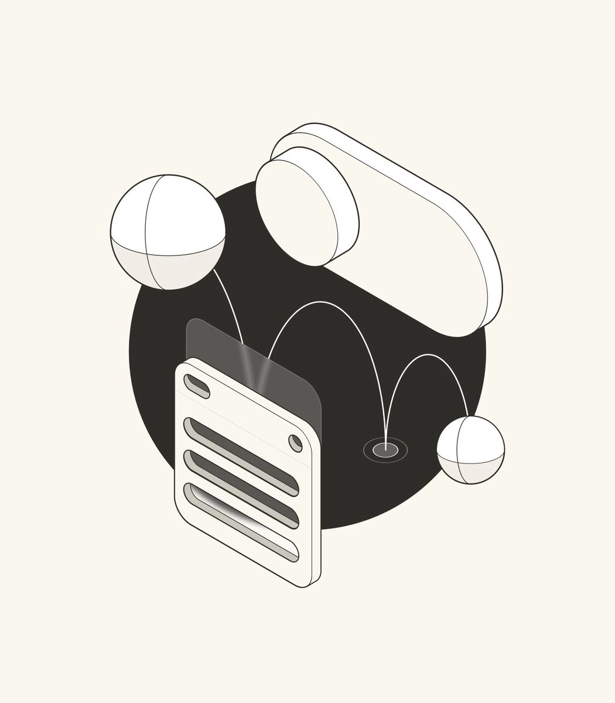

**Source:** [https://twitter.com/NevFlynn/status/1770105034702729726](https://twitter.com/NevFlynn/status/1770105034702729726)
**Type:** Twitter
**Tags:** `illustration`, `automotive lighting`, `automotive design`, `automotive exterior`, `motor vehicle`, `personal protective equipment`, `auto part`, `font`

---

### 15. Blossoming Discovery (2021) by Philip Sue.

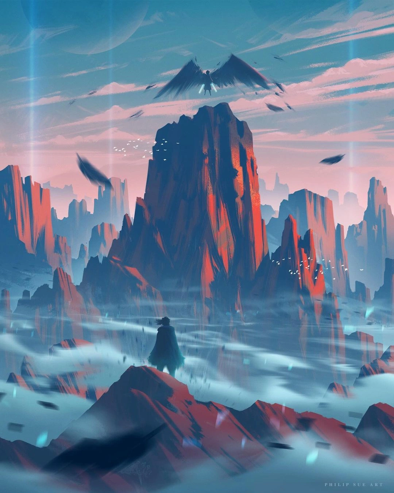

**Source:** [https://www.instagram.com/p/C4iY-BpxixW/?igsh=ZGp1MjY1d3pubz...](https://www.instagram.com/p/C4iY-BpxixW/?igsh=ZGp1MjY1d3pubzVx)
**Type:** Instagram
**Tags:** `painting`, `art`, `sky`, `ecoregion`, `world`, `nature`, `natural landscape`, `mountain`, `snow`, `natural environment`

---

### 16. Item 16

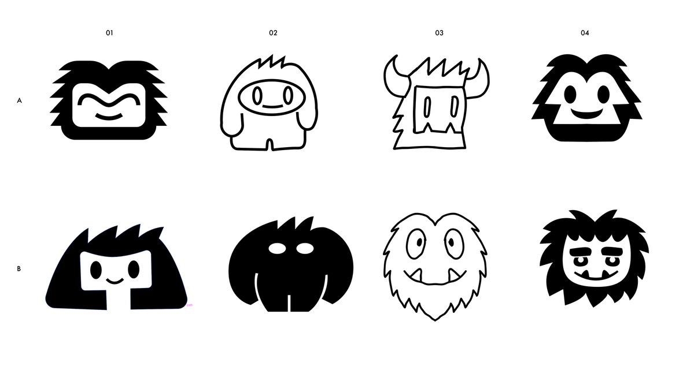

**Source:** [https://x.com/mihaidolganiuc/status/1765681800406286622?s=12...](https://x.com/mihaidolganiuc/status/1765681800406286622?s=12&t=Kbl6Kd9qhuaRg9Z7iATEEw)
**Type:** Twitter
**Tags:** `head`, `nose`, `hair`, `hairstyle`, `eye`, `facial expression`, `vertebrate`, `mouth`

---

### 17. Item 17

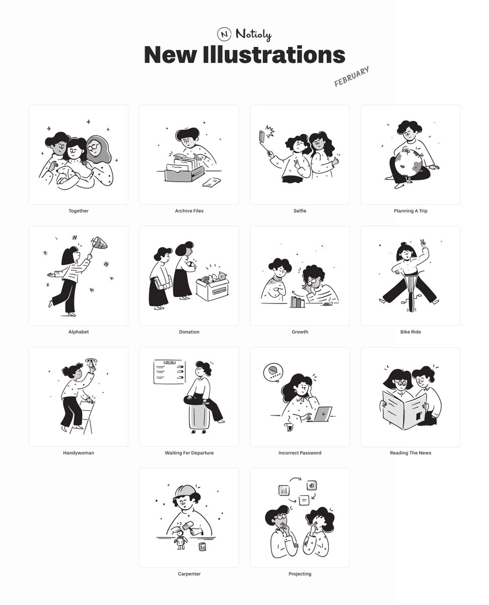

**Source:** [https://x.com/maryamato88/status/1765361699048374414?s=12&t=...](https://x.com/maryamato88/status/1765361699048374414?s=12&t=Kbl6Kd9qhuaRg9Z7iATEEw)
**Type:** Twitter
**Tags:** `design`, `font`

---

### 18. Digital illustration of the Bauhaus Dessau building by artist Bo Lundberg.

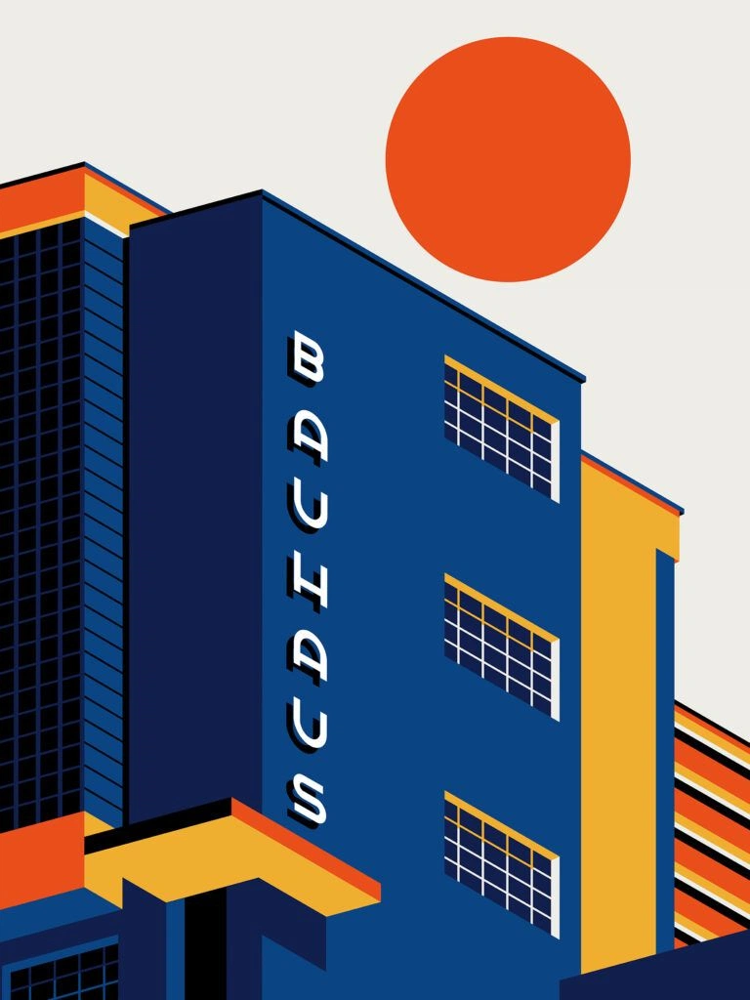

**Source:** [http://www.bolundberg.com/portfolio/bauhaus-inspired-prints/](http://www.bolundberg.com/portfolio/bauhaus-inspired-prints/)
**Type:** Pinterest
**Tags:** `bauhaus poster`, `bauhaus`, `poster`, `posterlounge`, `juniqe`, `design`, `art`, `bauhaus dessau`, `azure`, `rectangle`, `building`, `font`, `line`, `material property`, `tower block`

---

### 19. Illustration of Tokyo's Nakagin Capsule Tower by artist Nick Coupland. The building was designed by Kisho Kurokawa.

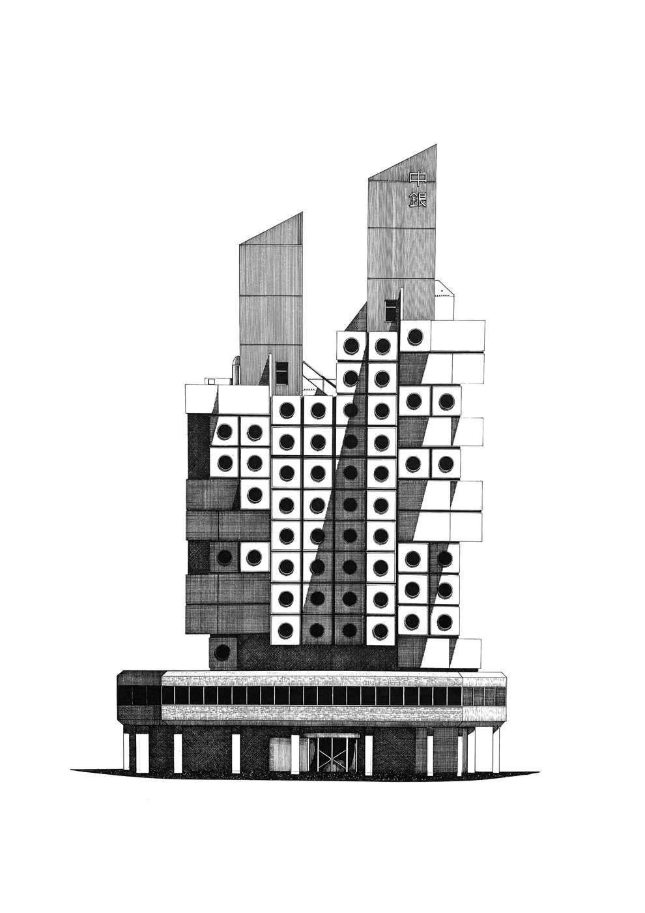

**Source:** [https://centralillustration.com/illustration/nick-coupland](https://centralillustration.com/illustration/nick-coupland)
**Type:** Pinterest
**Tags:** `nakagin capsule tower`, `building`, `rectangle`, `art`, `font`

---

### 20. Item 20

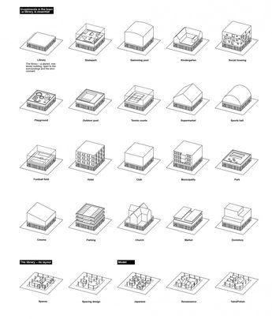

**Source:** [http://www.archdaily.com/340857/culture-island-public-librar...](http://www.archdaily.com/340857/culture-island-public-library-proposal-ugo-architecture/5137cec5b3fc4b9ff100004c_culture-island-public-library-proposal-ugo-architecture-_ugo-l14-jpg/)
**Type:** Pinterest
**Tags:** `diagram architecture typology`, `architectural diagrams`, `architecture`, `diagram`, `design`, `white`, `rectangle`, `product`, `font`, `material property`, `pattern`, `silver`, `technology`

---

### 21. Item 21

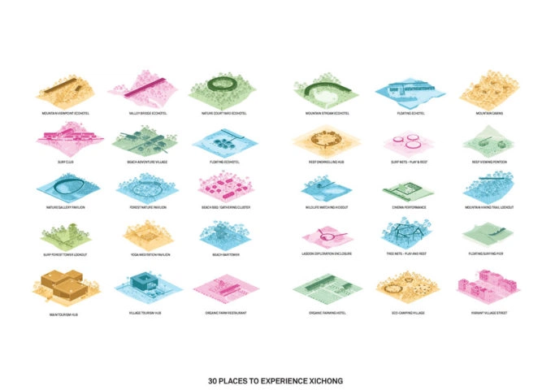

**Source:** [https://worldlandscapearchitect.com/xichong-coast-recovery-p...](https://worldlandscapearchitect.com/xichong-coast-recovery-plan-shenzhen-china-hassell/#.YduTmWhByHs)
**Type:** Pinterest
**Tags:** `petal`, `xichong no.4 sand beach`, `product`, `font`, `aqua`, `magenta`

---

### 22. Illustrations from the Research Dutch Dikes project by LOLA Landscape Architects, 2014.

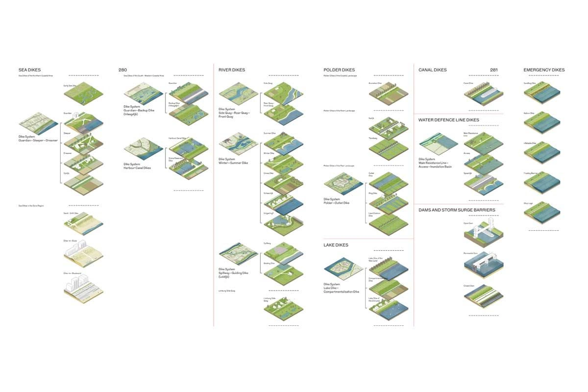

**Source:** [http://www.landezine.com/index.php/2017/04/dijken-van-nederl...](http://www.landezine.com/index.php/2017/04/dijken-van-nederland-dutch-dikes-by-lola-landscape-architects/)
**Type:** Pinterest
**Tags:** `typology landscape architecture`, `design`, `landscape architecture`, `lola landscape architects`, `architecture`, `rectangle`, `font`, `symmetry`, `triangle`, `pattern`

---

### 23. Item 23

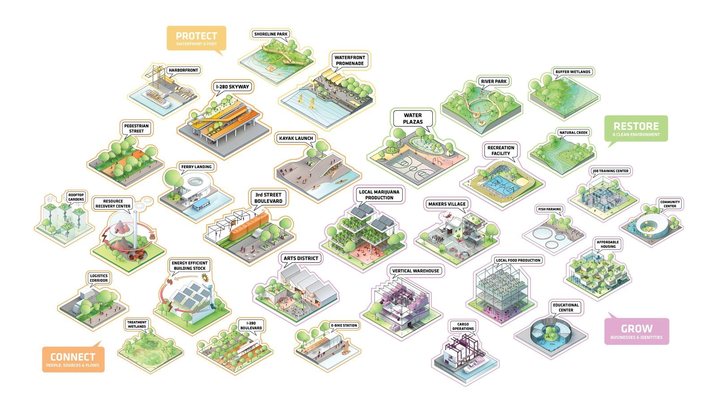

**Source:** [https://www.archdaily.com/894882/final-winning-design-concep...](https://www.archdaily.com/894882/final-winning-design-concepts-released-for-resilience-by-designs-bay-area-challenge/5b033420f197ccd3ab0001c6-final-winning-design-concepts-released-for-resilience-by-designs-bay-area-challenge-image)
**Type:** Pinterest
**Tags:** `islais creek`, `font`

---

### 24. Program diagram for Pershing Square by Agence Ter.

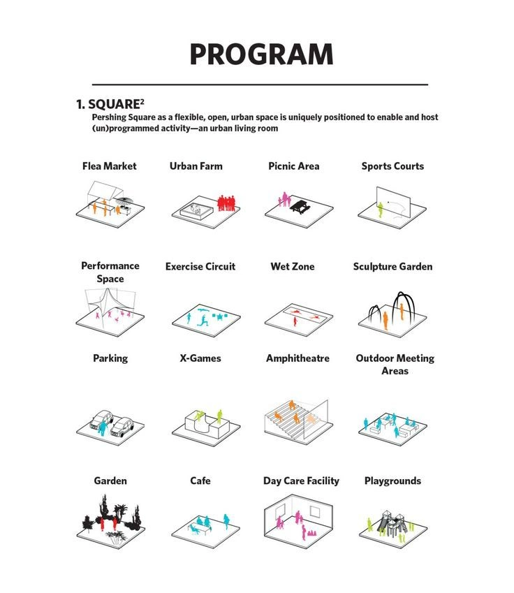

**Source:** [https://www.pinterest.com/pin/101260691615282657/](https://www.pinterest.com/pin/101260691615282657/)
**Type:** Pinterest
**Tags:** `public square concept diagram`, `diagram`, `architecture`, `concept map`, `font`, `slope`

---

### 25. Item 25

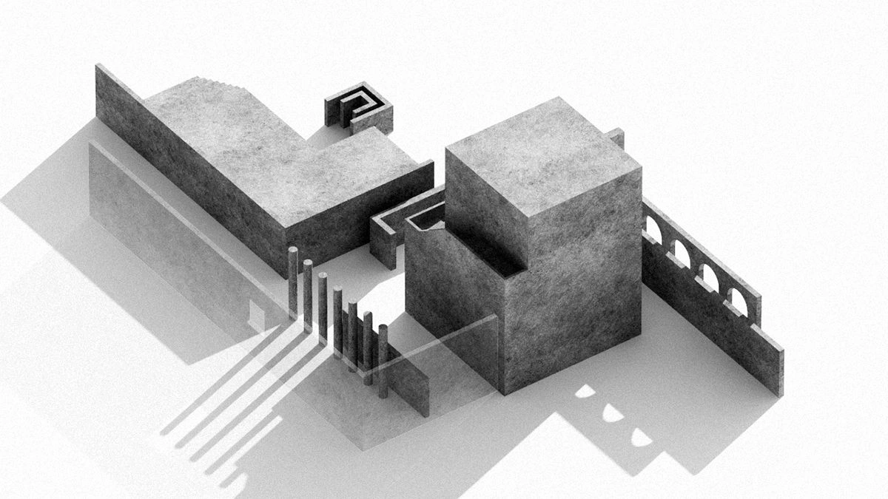

**Source:** [https://www.behance.net/gallery/27842661/Architecture-From-a...](https://www.behance.net/gallery/27842661/Architecture-From-a-Dream)
**Type:** Pinterest
**Tags:** `monochrome photography`, `building`, `rectangle`, `house`, `font`, `art`

---

### 26. Architecture From a Dream, a 2015 digital rendering by the studio ADCO ..

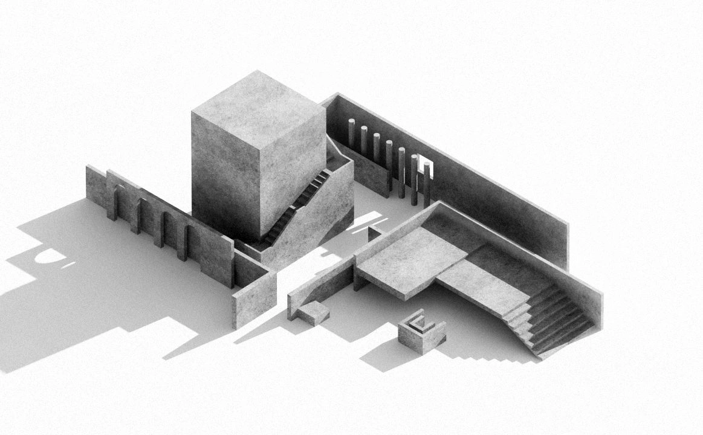

**Source:** [https://www.behance.net/gallery/27842661/Architecture-From-a...](https://www.behance.net/gallery/27842661/Architecture-From-a-Dream)
**Type:** Pinterest
**Tags:** `douglas ramos architecture from a dream`, `architecture`, `rectangle`, `grey`

---

### 27. On the move by bluefoamit, a 2nd-prize winning entry for Europan 12 in Rouen, France.

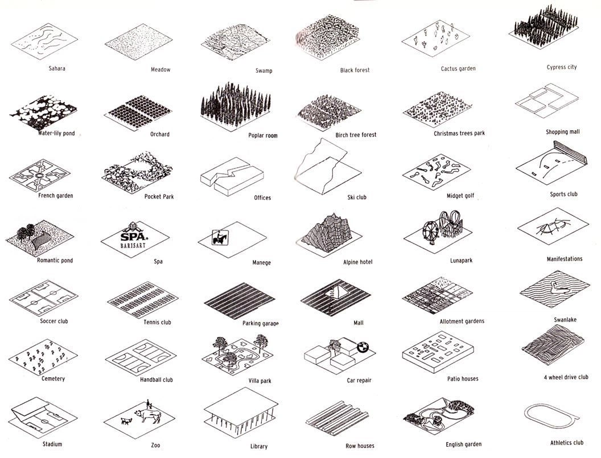

**Source:** [https://i.pinimg.com/originals/ec/ad/06/ecad06eaf528c8e6883d...](https://i.pinimg.com/originals/ec/ad/06/ecad06eaf528c8e6883d816a74639bd4.jpg)
**Type:** Pinterest
**Tags:** `pattern`, `architecture`, `photograph`, `vertebrate`, `white`, `black`, `textile`, `mammal`, `black-and-white`, `organism`

---

### 28. Item 28

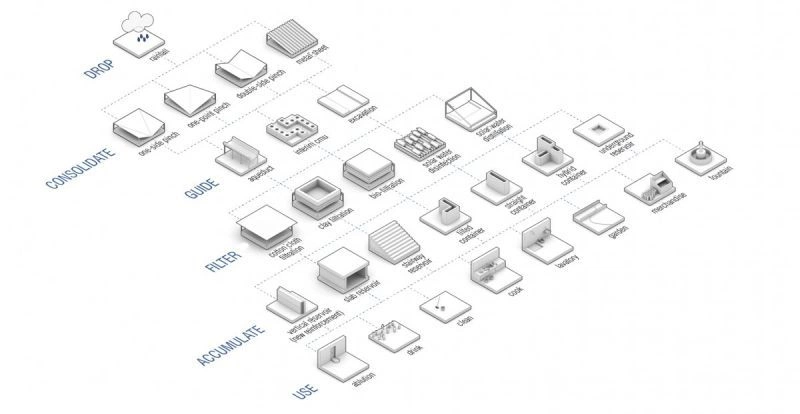

**Source:** [https://nextcity.org/daily/entry/dencity-contest-winners?utm...](https://nextcity.org/daily/entry/dencity-contest-winners?utm_source=Next+City+Newsletter&utm_campaign=0e6ee7ab98-Daily_741&utm_medium=email&utm_term=0_fcee5bf7a0-0e6ee7ab98-43990293)
**Type:** Pinterest
**Tags:** `diagram`, `rectangle`, `font`

---

### 29. A collection of architectural models by Faizan Gohar Sculpture Studio.

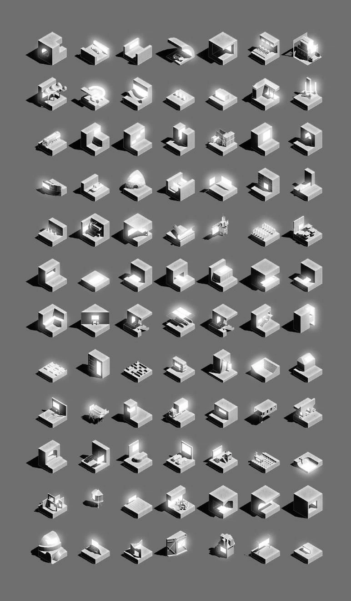

**Source:** [http://issuu.com/geoffeberle/docs/a4_portfolio_optimized/c/s...](http://issuu.com/geoffeberle/docs/a4_portfolio_optimized/c/sc8xyob)
**Type:** Pinterest
**Tags:** `pattern`, `architecture`, `design`, `photograph`, `white`, `black`, `font`, `line`

---

### 30. An architectural drawing titled Typologies by the studio fala.

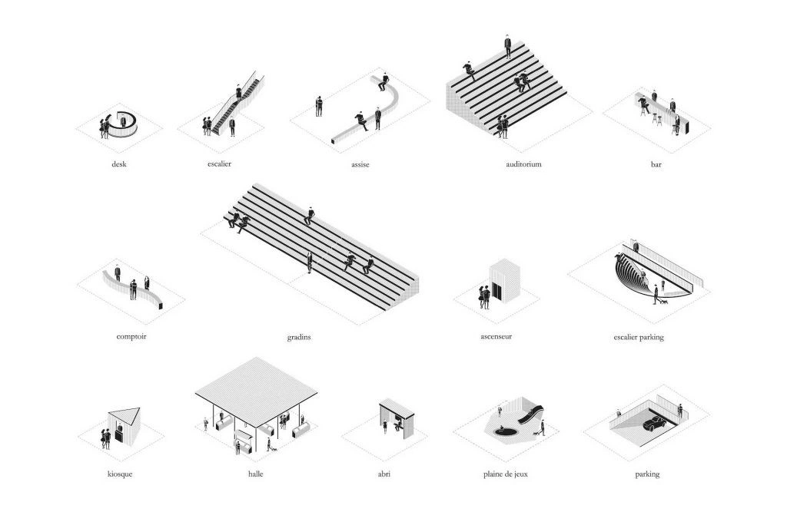

**Source:** [http://www.koozarch.com/interviews/exploring-the-radicality-...](http://www.koozarch.com/interviews/exploring-the-radicality-and-clarity-of-the-one-point-perspective/)
**Type:** Pinterest
**Tags:** `diagram`, `design`, `architecture`, `circuit component`, `passive circuit component`, `font`, `rectangle`, `auto part`

---

### 31. Item 31

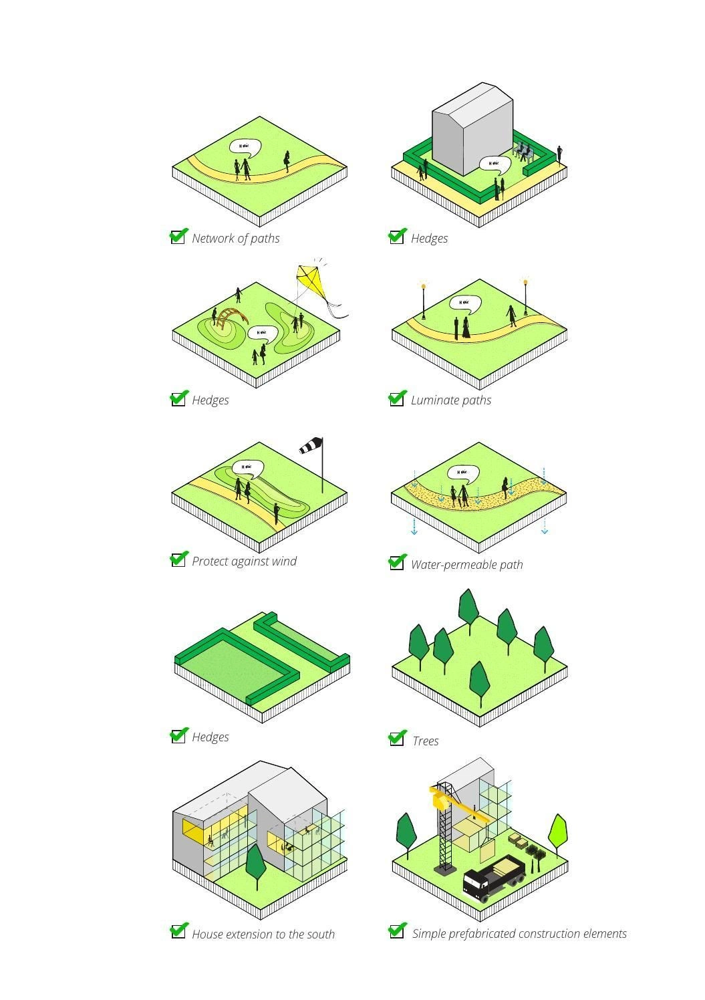

**Source:** [http://issuu.com/felixx.design/docs/150907_a5_booklet_hr/c/s...](http://issuu.com/felixx.design/docs/150907_a5_booklet_hr/c/scfuiws)
**Type:** Pinterest
**Tags:** `diagram`, `architecture`, `triangle`, `rectangle`, `font`, `parallel`

---

### 32. Item 32

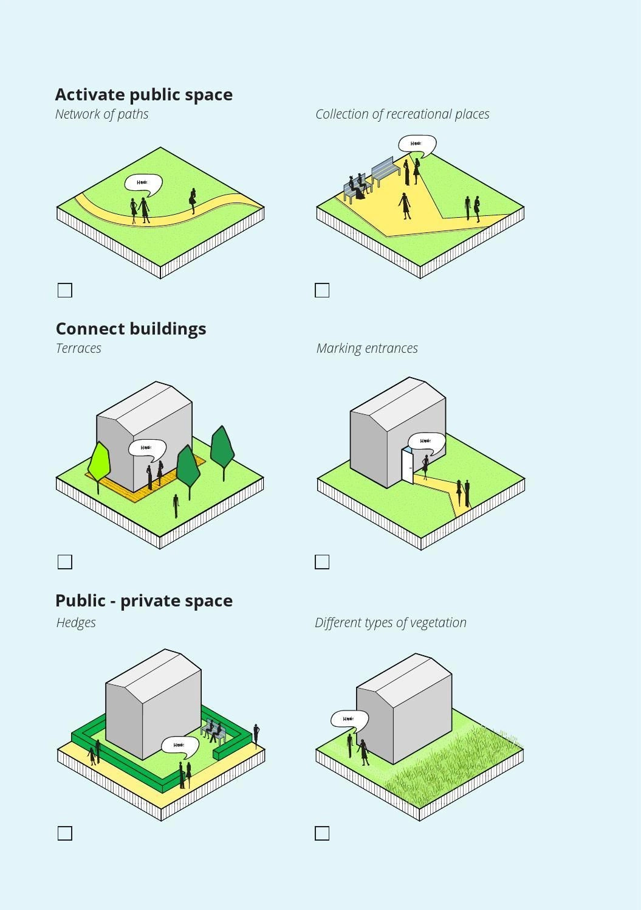

**Source:** [http://issuu.com/felixx.design/docs/150907_a5_booklet_hr/c/s...](http://issuu.com/felixx.design/docs/150907_a5_booklet_hr/c/scfu0eh)
**Type:** Pinterest
**Tags:** `angle`, `green`, `rectangle`, `land lot`, `house`, `slope`, `triangle`, `line`, `grass`

---

### 33. Item 33

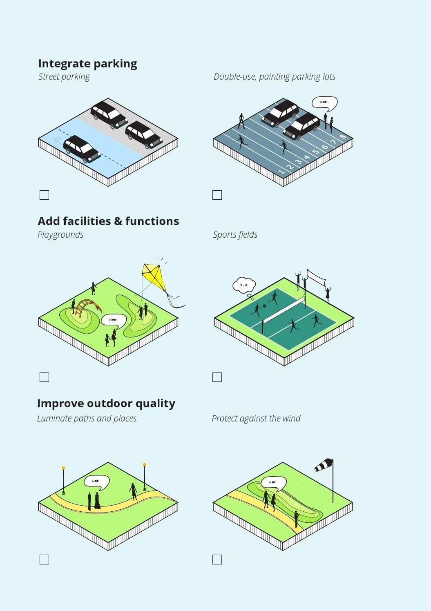

**Source:** [http://issuu.com/felixx.design/docs/150907_a5_booklet_hr/c/s...](http://issuu.com/felixx.design/docs/150907_a5_booklet_hr/c/scfu0xv)
**Type:** Pinterest
**Tags:** `diagram`, `triangle`, `rectangle`, `line`, `parallel`, `art`

---

### 34. Toolbox of public space elements for the Weezenlanden Noord project by Karres en Brands and Barcode Architects.

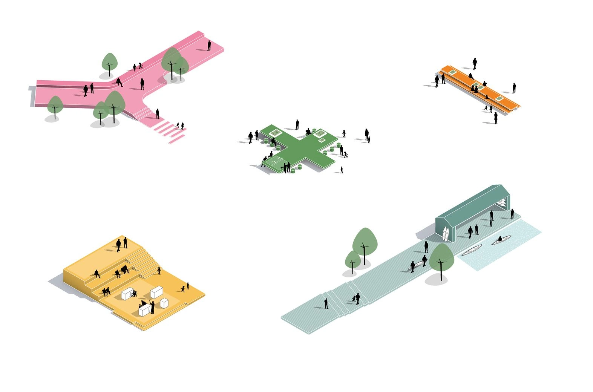

**Source:** [https://www.karresenbrands.com/news/team-barcode-architects-...](https://www.karresenbrands.com/news/team-barcode-architects-karres-en-brands-wint-prijsvraag-om-een-inclusieve-wijk-te-ontwerpen)
**Type:** Pinterest
**Tags:** `angle`, `aircraft`

---

### 35. Item 35

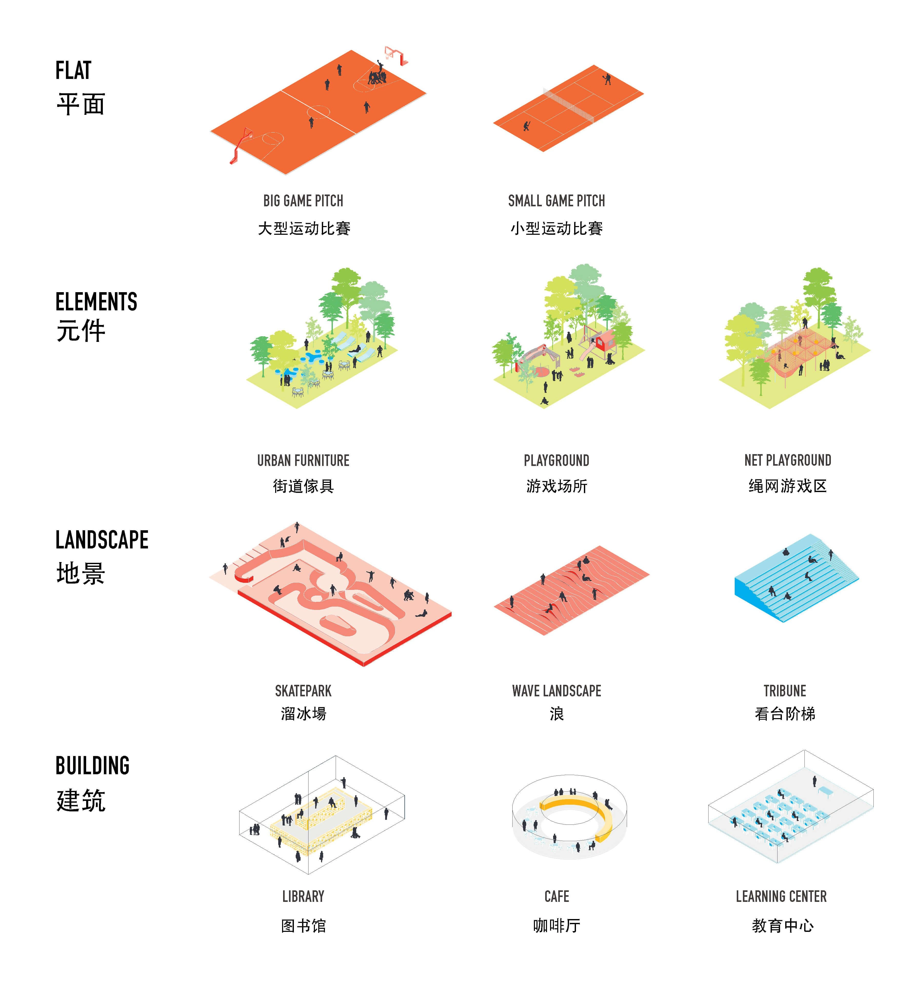

**Source:** [https://www.pinterest.com/pin/101260691615282588/](https://www.pinterest.com/pin/101260691615282588/)
**Type:** Pinterest
**Tags:** `diagram`, `infographic`, `product`, `rectangle`, `font`

---

### 36. Item 36

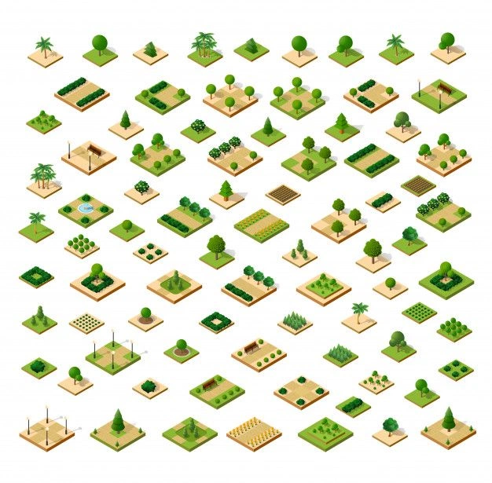

**Source:** [https://www.freepik.com/premium-vector/isometric-3d-set-park...](https://www.freepik.com/premium-vector/isometric-3d-set-park_3787149.htm)
**Type:** Pinterest
**Tags:** `pattern`, `illustration`, `vector graphics`, `rectangle`, `font`, `grass`, `line`, `terrestrial plant`, `symmetry`

---

### 37. Item 37

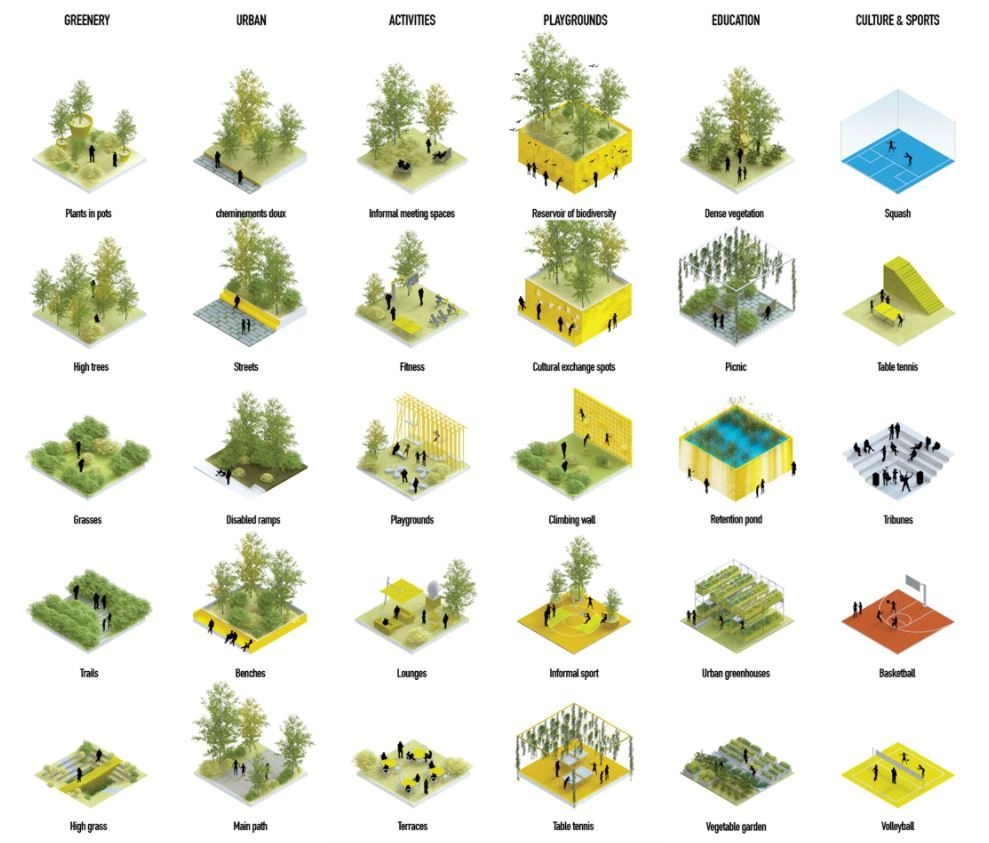

**Source:** [https://www.pinterest.com/pin/101260691615282582/](https://www.pinterest.com/pin/101260691615282582/)
**Type:** Pinterest
**Tags:** `tree`, `architecture`, `urban design`, `design`, `landscape architecture`, `product`, `organism`, `font`

---

### 38. Programa de actividades for the Corredor Ambiental Urbano Río Cali proposal by Colectivo 720, 2015.

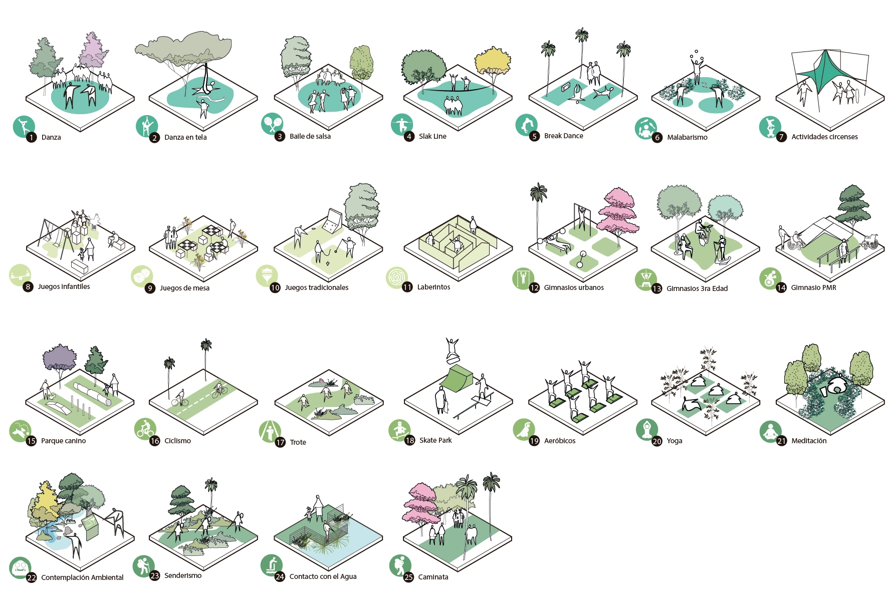

**Source:** [https://www.entreestilos.com/propuesta-para-el-diseno-ambien...](https://www.entreestilos.com/propuesta-para-el-diseno-ambiental-paisajistico-y-urbanistico-del-corredor-ambiental-urbano-rio-cali-cauce-arquitectura-colectivo-720/)
**Type:** Pinterest
**Tags:** `design`, `green`, `rectangle`, `font`, `symmetry`, `pattern`, `art`

---

### 39. Item 39

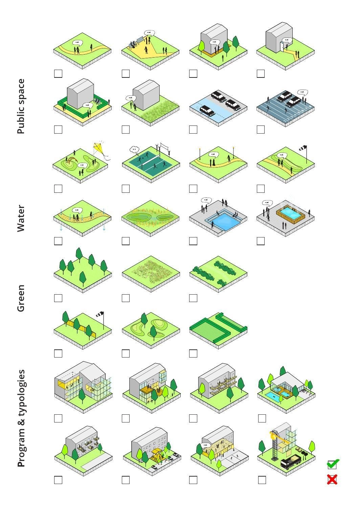

**Source:** [http://issuu.com/felixx.design/docs/150907_a5_booklet_hr/c/s...](http://issuu.com/felixx.design/docs/150907_a5_booklet_hr/c/scfux8w)
**Type:** Pinterest
**Tags:** `leaf`, `rectangle`, `font`, `parallel`

---

### 40. A 'kit of parts' diagram for the new Sydney Fish Market, designed for disassembly by 3XN and GXN.

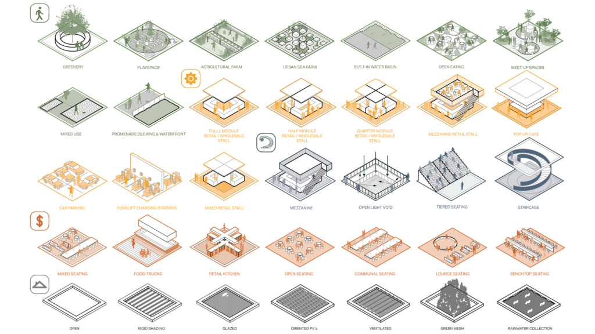

**Source:** [https://parametric-architecture.com/sydney-fish-market-by-3x...](https://parametric-architecture.com/sydney-fish-market-by-3xn-architects/)
**Type:** Pinterest
**Tags:** `pattern`, `sydney fish market`, `white`, `black`, `textile`, `line`, `font`, `triangle`, `symmetry`, `rectangle`

---

### 41. De Stamcellen, an urban redevelopment project for the Grote Markt in Groningen by LOLA Landscape Architects, Piet Oud...

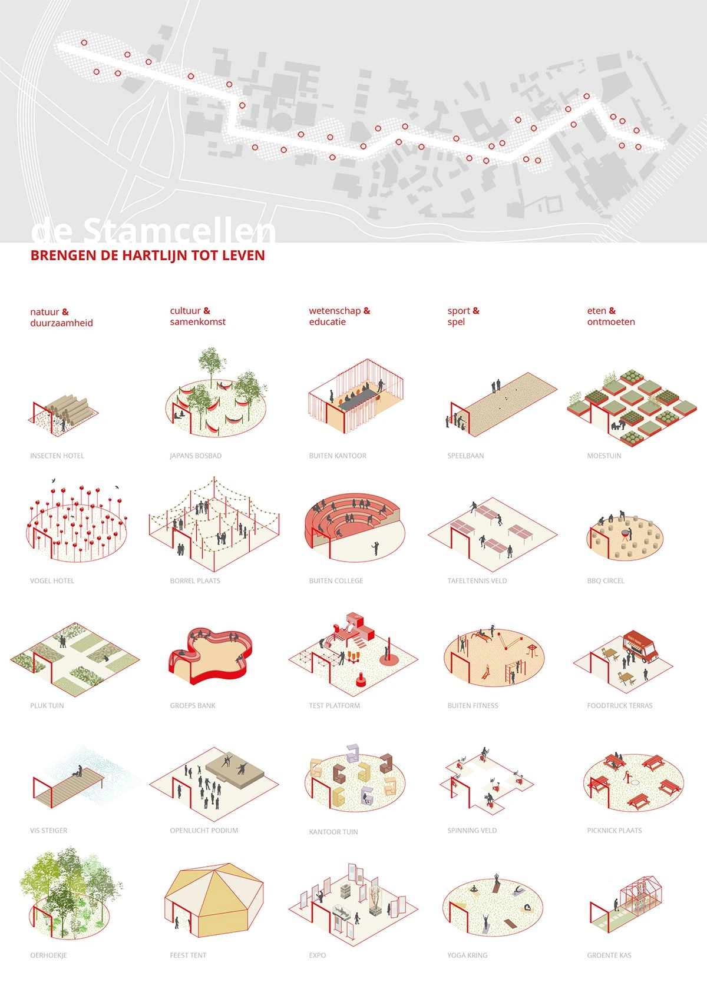

**Source:** [http://www.gaaga.nl/projecten/de-hartlijn](http://www.gaaga.nl/projecten/de-hartlijn)
**Type:** Pinterest
**Caption:** De Stamcellen, an urban redevelopment project for the Grote Markt in Groningen by LOLA Landscape Architects, Piet Oudolf, and DELVA.
**Tags:** `小 场景 空间 模块`, `architecture`, `design`, `landscape architecture`, `urban design`, `font`, `line`, `automotive lighting`

---

### 42. Item 42

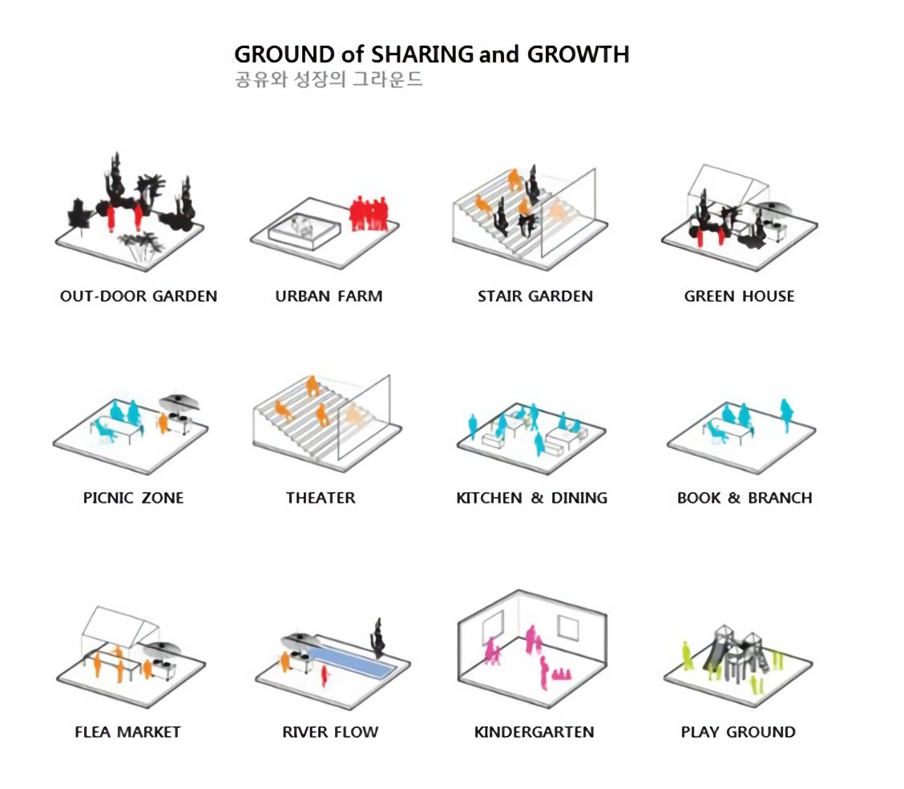

**Source:** [https://www.pinterest.com/pin/101260691615282541/](https://www.pinterest.com/pin/101260691615282541/)
**Type:** Pinterest
**Tags:** `diagram`, `architecture`, `product`, `rectangle`, `triangle`, `font`, `line`, `parallel`

---

### 43. Item 43

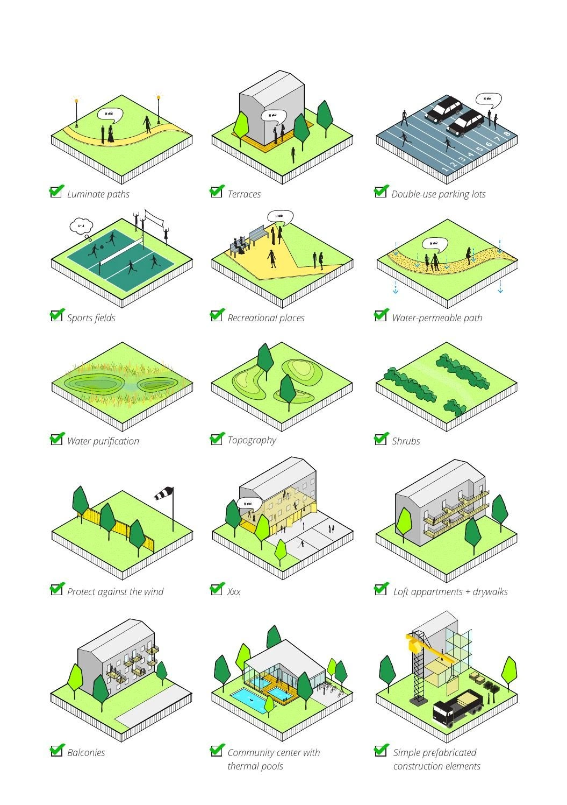

**Source:** [https://issuu.com/felixx.design/docs/150907_a5_booklet_hr/52](https://issuu.com/felixx.design/docs/150907_a5_booklet_hr/52)
**Type:** Pinterest
**Tags:** `diagram`, `architecture`, `urban design`, `rectangle`, `font`, `line`, `parallel`

---

### 44. Diagrams from the A Liesing Genetic Algorithm project. © MA L.

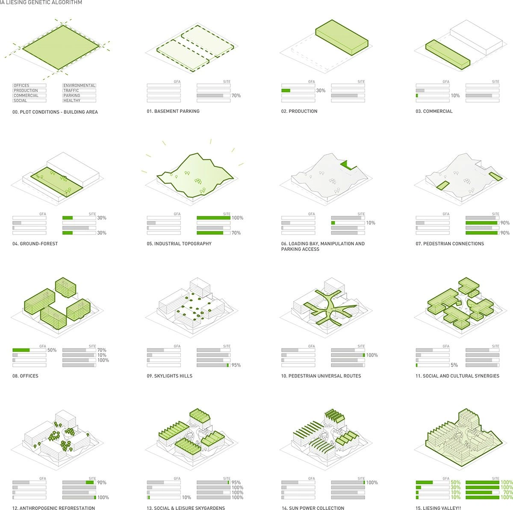

**Source:** [https://www.behance.net/gallery/66633293/Liesing-Valley-Euro...](https://www.behance.net/gallery/66633293/Liesing-Valley-Europan-2017)
**Type:** Pinterest
**Tags:** `leaf`, `white`, `light`, `product`, `font`, `line`, `rectangle`, `pattern`, `symmetry`

---

### 45. Item 45

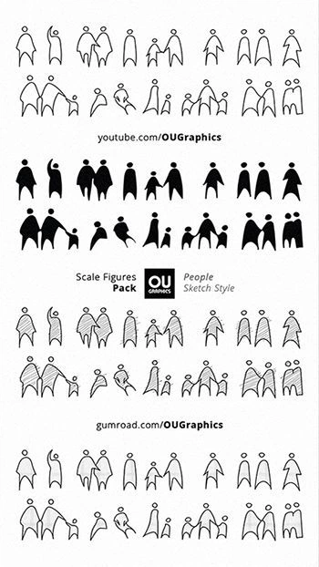

**Source:** [http://www.sketchite.com/scale-figures-pack-by-ou-graphics-s...](http://www.sketchite.com/scale-figures-pack-by-ou-graphics-sketches-of-people/aSpwaW5pbWcqY29tfG9yaWdpbmFsc3w5YXxmMHw0M3w5YWYwNDNjYTQwNjA1MTY2ZjNjNTIwN2Y2NmYzNjk0NCpqcGc_YnIqcGludGVyZXN0KmNvbXxwaW58MjU2MjEyNjY2Mjg3MTcyNTkyfA/)
**Type:** Pinterest
**Tags:** `ou graphics figure scale`, `architecture`, `drawing`, `sketch`, `architectural drawing`, `graphics`, `white`, `vertebrate`, `black`, `bird`, `organism`, `mammal`, `gesture`, `font`

---

### 46. Item 46

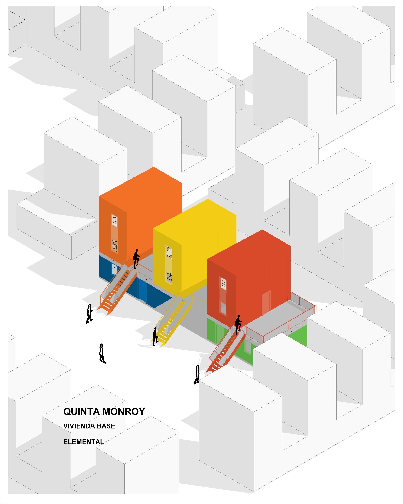

**Source:** [https://www.youtube.com/watch?v=TGwwmMa6eUo&t=178s](https://www.youtube.com/watch?v=TGwwmMa6eUo&t=178s)
**Type:** Pinterest
**Tags:** `quinta monroy esquemas`, `diagram`, `architecture`, `quinta monroy`, `rectangle`, `font`, `line`, `parallel`

---

### 47. An axonometric illustration of the Vivienda AM project, 2018.

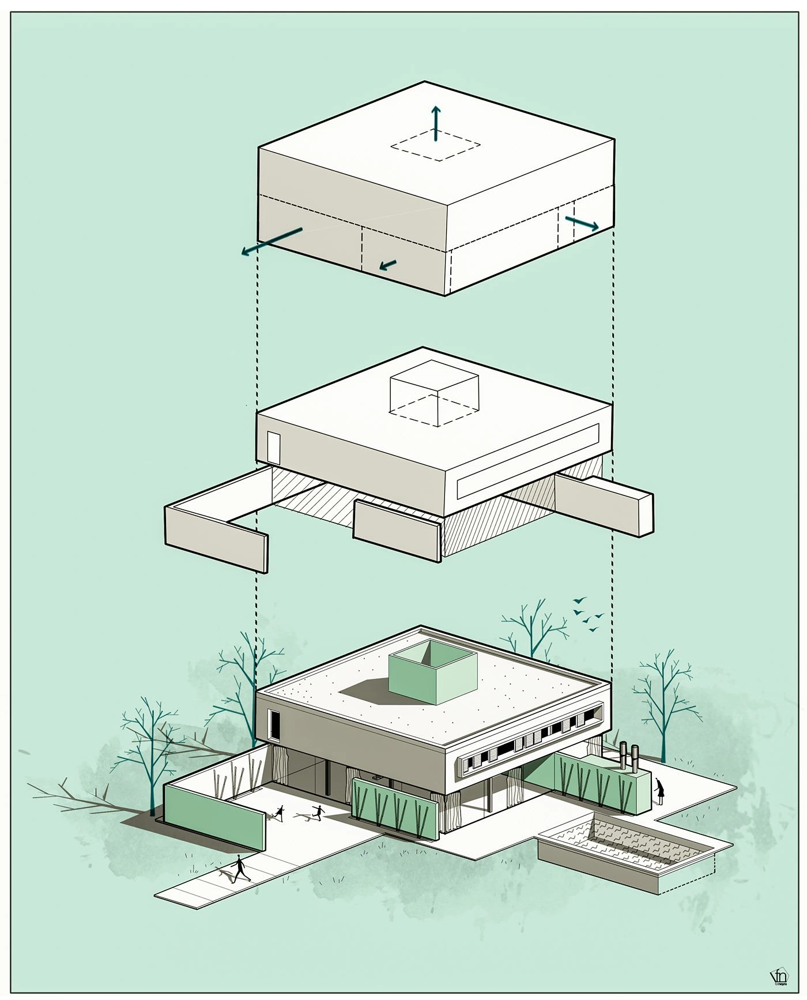

**Source:** [https://www.behance.net/gallery/52402099/kubica-house](https://www.behance.net/gallery/52402099/kubica-house)
**Type:** Pinterest
**Tags:** `kubica house plans`, `architecture`, `design`, `rectangle`, `line`, `parallel`

---

### 48. Illustrations of SANAA People, stylized figures used for architectural entourage.

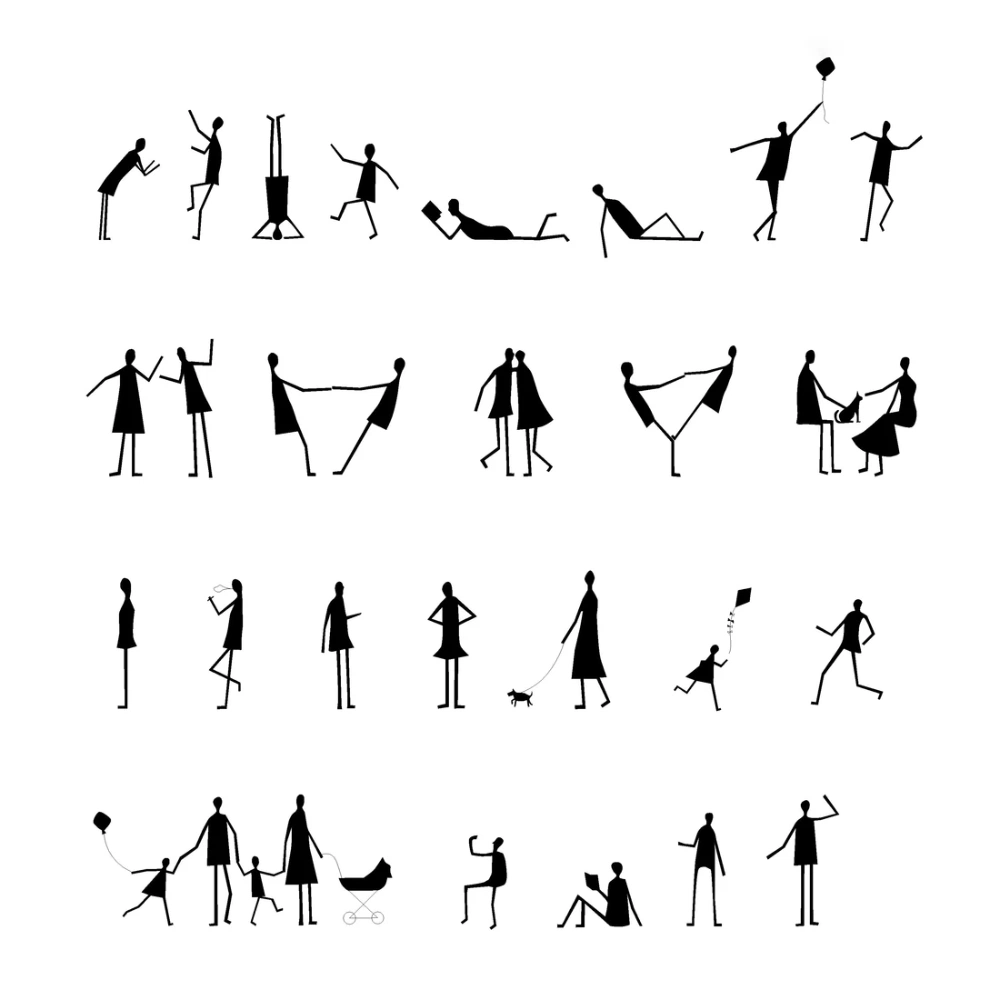

**Source:** [https://studioalternativi.com/](https://studioalternativi.com/)
**Type:** Pinterest
**Tags:** `ps 人`, `autodesk revit`, `architecture`, `human body`, `font`, `organism`, `gesture`, `people in nature`, `happy`, `art`

---

### 49. Digital collage "He Left at Least One Sentence Standing Whole" (2011) by Cristiana Couceiro.

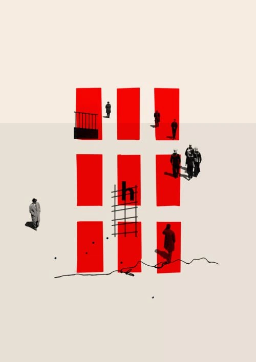

**Source:** [http://hueandsaturation.tumblr.com/page/7](http://hueandsaturation.tumblr.com/page/7)
**Type:** Pinterest
**Tags:** `graphic design`, `design`, `graphics`, `rectangle`, `house`, `font`, `art`

---

### 50. 'Painters' Lives,' a 2013 infographic poster series by information designer Giorgia Lupi.

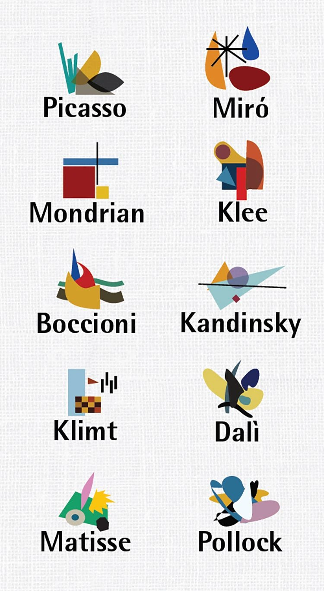

**Source:** [http://layersmagazine.com/13-artists-with-a-beautiful-and-un...](http://layersmagazine.com/13-artists-with-a-beautiful-and-unique-approach-to-minimalist-design.html)
**Type:** Pinterest
**Tags:** `famous minimalist art`, `art`, `abstract art`, `minimalism`, `artist`, `painter`, `painting`, `artwork`, `modern art`, `white`, `line`, `font`, `rectangle`

---

### 51. Illustration by Federico Babina from the ARCHIST series, inspired by the work of Josef Albers.

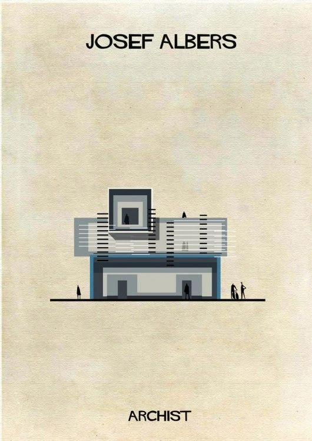

**Source:** [http://www.archdaily.com/482982/archist-illustrations-of-fam...](http://www.archdaily.com/482982/archist-illustrations-of-famous-art-reimagined-as-architecture/)
**Type:** Pinterest
**Tags:** `vishnupriya gardens`, `archist: if artists were architects`, `architecture`, `artist`, `art`, `artwork`, `design`, `rectangle`, `font`

---

### 52. An illustration from the ARCHIST series by Federico Babina inspired by the work of Pablo Picasso.

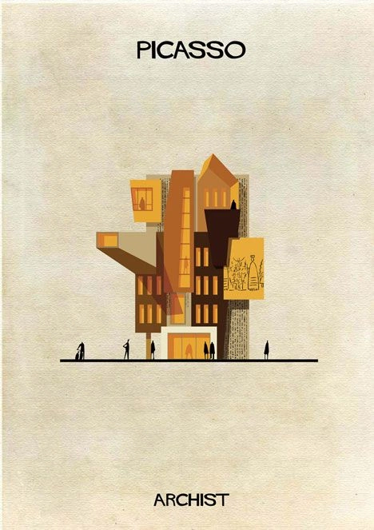

**Source:** [http://www.dezeen.com/2014/03/05/famous-artworks-transformed...](http://www.dezeen.com/2014/03/05/famous-artworks-transformed-into-buildings-archist-federico-babina/?fb_action_ids=660925477301421&fb_action_types=og.likes&fb_source=other_multiline&action_object_map=[1450596235172173]&action_type_map=[%22og.likes%22]&action_ref_map=[])
**Type:** Pinterest
**Tags:** `federico babina archist`, `archist: if artists were architects`, `archibet: from aalto to zaha hadid`, `artist`, `architect`, `architecture`, `rectangle`, `font`

---

### 53. Illustration by Federico Babina from the Archist series, inspired by artist Gerhard Richter.

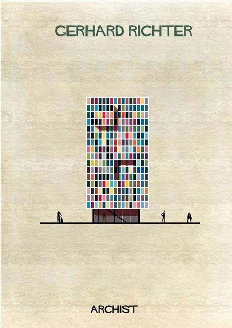

**Source:** [http://www.dezeen.com/2014/03/05/famous-artworks-transformed...](http://www.dezeen.com/2014/03/05/famous-artworks-transformed-into-buildings-archist-federico-babina/?fb_action_ids=10201435238592809&fb_action_types=og.likes&fb_source=other_multiline&action_object_map=[1450596235172173]&action_type_map=[%22og.likes%22]&action_ref_map=[])
**Type:** Pinterest
**Tags:** `federico babina archist`, `archist: if artists were architects`, `artwork`, `artist`, `art`, `rectangle`, `font`, `parallel`

---

### 54. An illustration from the ARCHIST series by Federico Babina, imagining a building in the style of Andy Warhol.

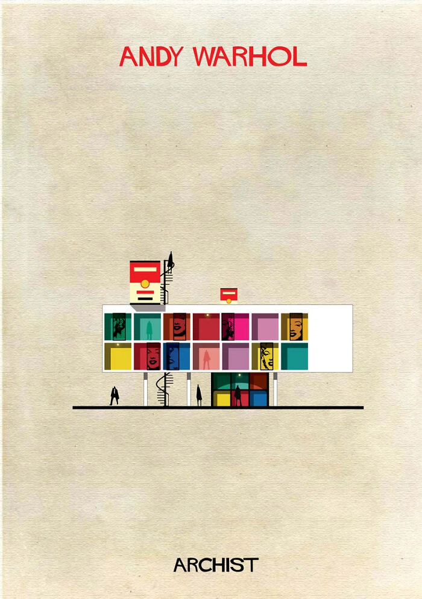

**Source:** [https://www.boredpanda.com/artists-architects-archist-federi...](https://www.boredpanda.com/artists-architects-archist-federico-babina/)
**Type:** Pinterest
**Tags:** `federico babina art`, `archist: if artists were architects`, `artist`, `artwork`, `art`, `architect`, `architecture`, `rectangle`, `house`, `font`

---

### 55. An illustration from the ARCHIST series by Federico Babina, inspired by artist James Turrell.

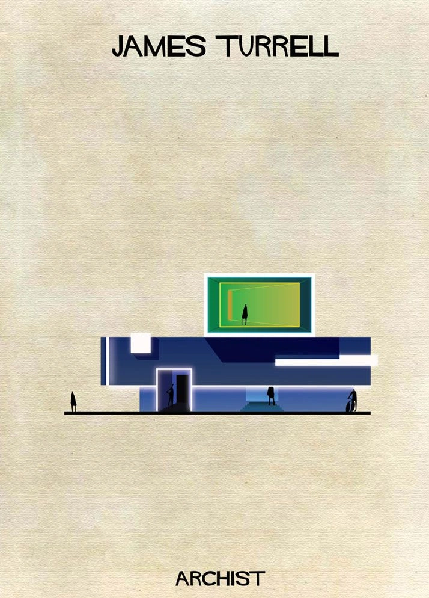

**Source:** [https://catview.wordpress.com/2014/03/18/como-seria-uma-casa...](https://catview.wordpress.com/2014/03/18/como-seria-uma-casa-projetada-por-mondrian-ou-anish-kapoor/amp/)
**Type:** Pinterest
**Tags:** `angle`, `archist: if artists were architects`, `art`, `architecture`, `artwork`, `rectangle`, `font`

---

### 56. A building in the style of Joan Miró from the ARCHIST series by Federico Babina.

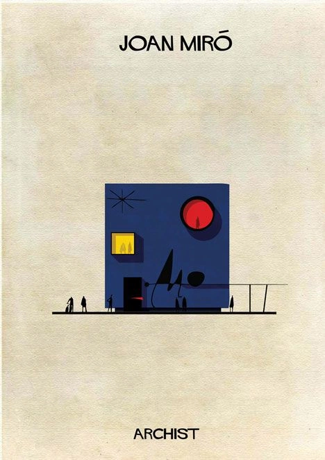

**Source:** [https://www.dezeen.com/2014/03/05/famous-artworks-transforme...](https://www.dezeen.com/2014/03/05/famous-artworks-transformed-into-buildings-archist-federico-babina/amp/)
**Type:** Pinterest
**Tags:** `federico babina archist`, `archist: if artists were architects`, `archibet: from aalto to zaha hadid`, `artist`, `architecture`, `art`, `design`, `architect`, `rectangle`, `window`, `font`, `poster`, `parallel`

---

### 57. Federico Babina's architectural interpretation of Wassily Kandinsky from the Archist series.

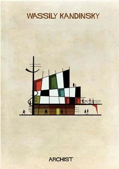

**Source:** [https://www.boredpanda.com/artists-architects-archist-federi...](https://www.boredpanda.com/artists-architects-archist-federico-babina/?utm_source=com&utm_medium=referral&utm_campaign=organic)
**Type:** Pinterest
**Tags:** `federico babina kandinsky`, `archist: if artists were architects`, `bauhaus`, `merry structure`, `architect`, `architecture`, `art`, `rectangle`, `font`, `painting`, `house`

---

### 58. Illustration by Federico Babina from the Archist series, inspired by artist Kazimir Malevich.

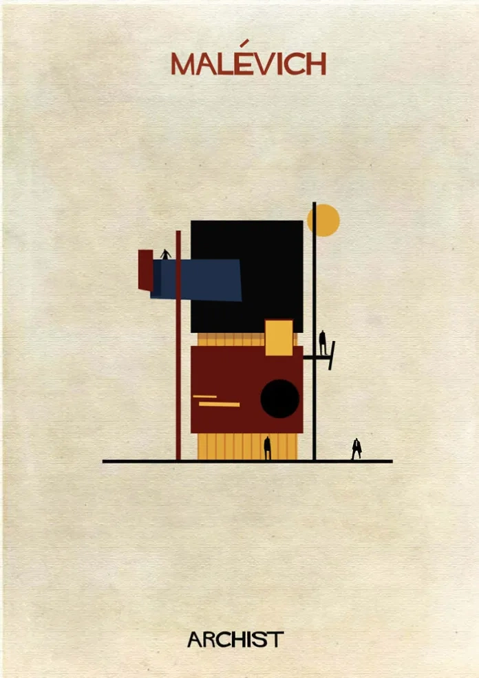

**Source:** [https://auxx.me/this-architect-imagined-famous-artists-homes...](https://auxx.me/this-architect-imagined-famous-artists-homes/)
**Type:** Pinterest
**Tags:** `famous architecture artist`, `archist: if artists were architects`, `architecture`, `artist`, `architect`, `art`, `rectangle`, `font`, `parallel`

---

### 59. Mondrian from the ARCHIST series by artist Federico Babina, inspired by Piet Mondrian.

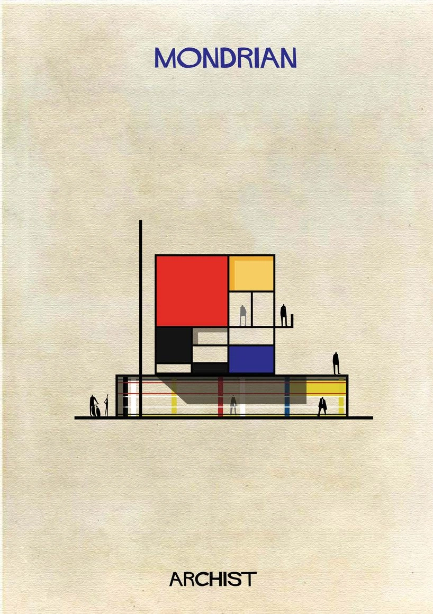

**Source:** [https://www.archdaily.com/482982/archist-illustrations-of-fa...](https://www.archdaily.com/482982/archist-illustrations-of-famous-art-reimagined-as-architecture/5317614ec07a802c2700002a-archist-illustrations-of-famous-art-reimagined-as-architecture-image)
**Type:** Pinterest
**Tags:** `federico babina archist`, `archist: if artists were architects`, `artist`, `art`, `illustration`, `rectangle`, `house`, `font`, `parallel`

---

### 60. Item 60

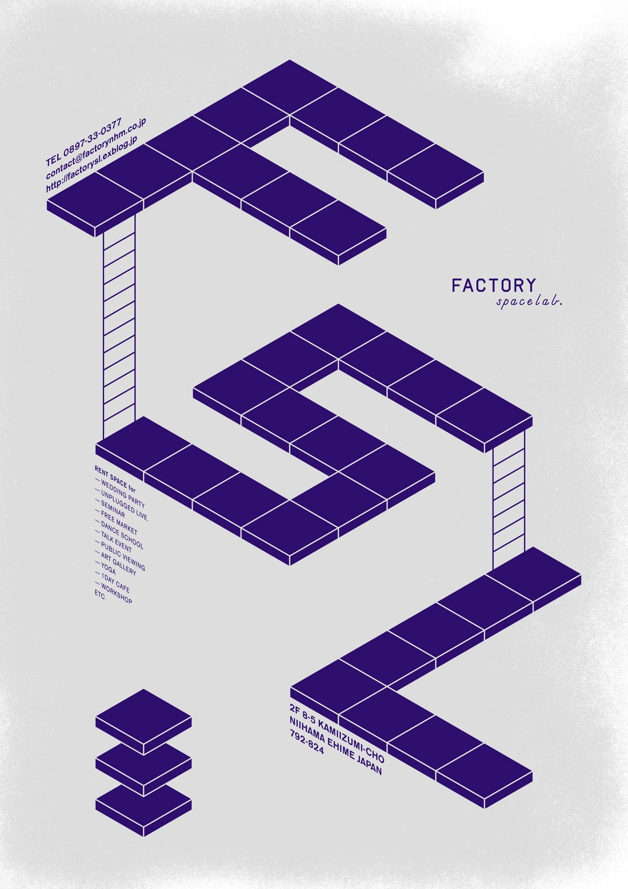

**Source:** [http://keisukemaekawa.com/](http://keisukemaekawa.com/)
**Type:** Pinterest
**Tags:** `design`, `graphics`, `graphic design`, `poster`, `illustration`, `font`, `electric blue`

---

### 61. Motion graphics by Joe Posner for the PBS Digital Studios episode The Art of Illustration.

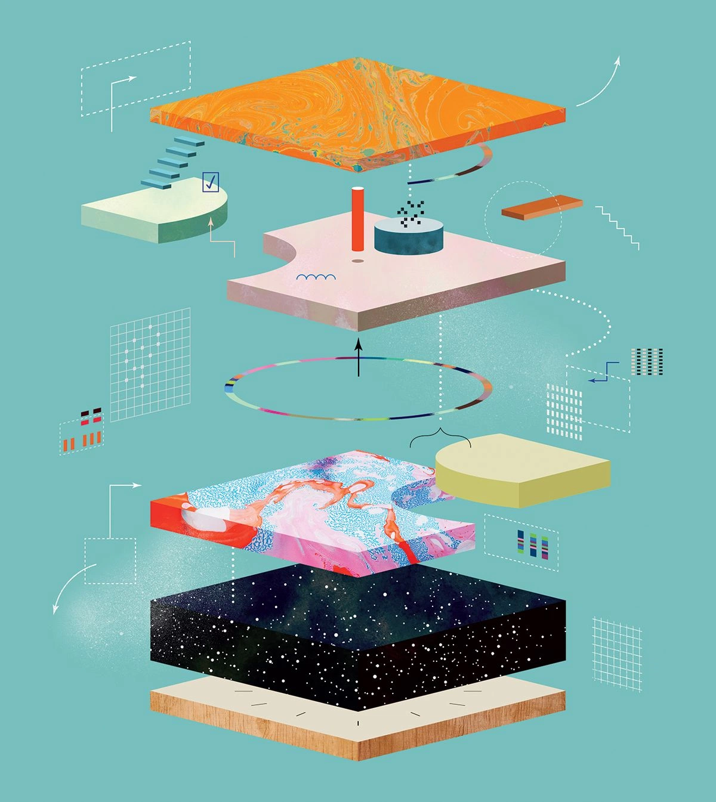

**Source:** [https://www.inc.com/magazine/201802/leigh-buchanan-kate-rock...](https://www.inc.com/magazine/201802/leigh-buchanan-kate-rockwood/productivity-resolutions-apps.html?cid=sf01002&sr_share=facebook)
**Type:** Pinterest
**Tags:** `table`, `product`, `naval architecture`, `font`, `line`

---

### 62. An illustration by Ham Young-joon for articles in Chosun Ilbo and Mindgil.

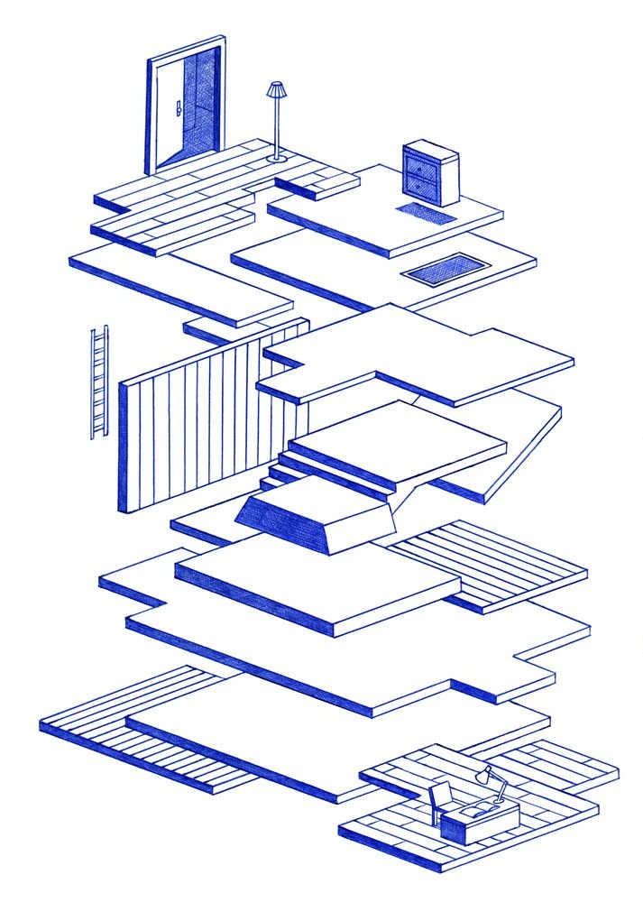

**Source:** [https://www.flickr.com/photos/102823049@N03/42870159852](https://www.flickr.com/photos/102823049@N03/42870159852)
**Type:** Pinterest
**Tags:** `diagram`, `drawing`, `architecture`, `faculty of architecture and urbanism - ucv`, `font`, `parallel`

---

### 63. Architectural diagram Camera con Vista by Michele Brena for Politecnico di Milano.

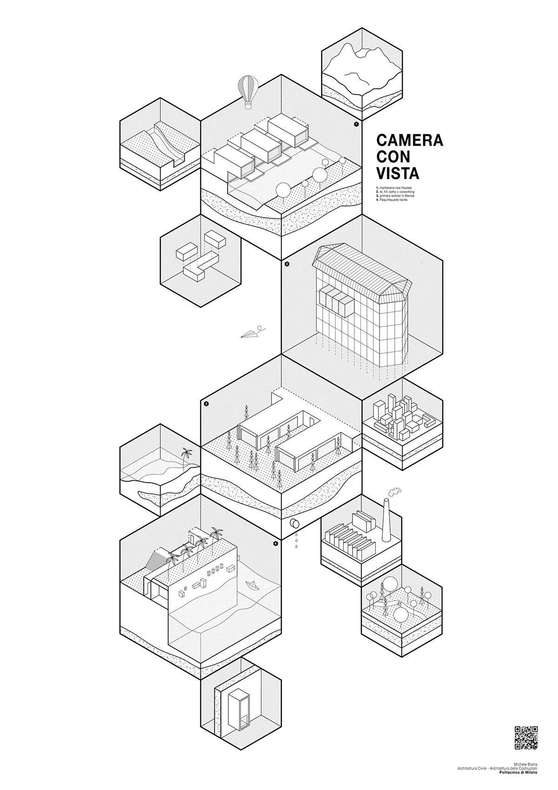

**Source:** [https://www.behance.net/gallery/42783423/Camera-con-vista](https://www.behance.net/gallery/42783423/Camera-con-vista)
**Type:** Pinterest
**Tags:** `diagram`, `architecture`, `design`, `rectangle`, `font`, `parallel`

---

### 64. Item 64

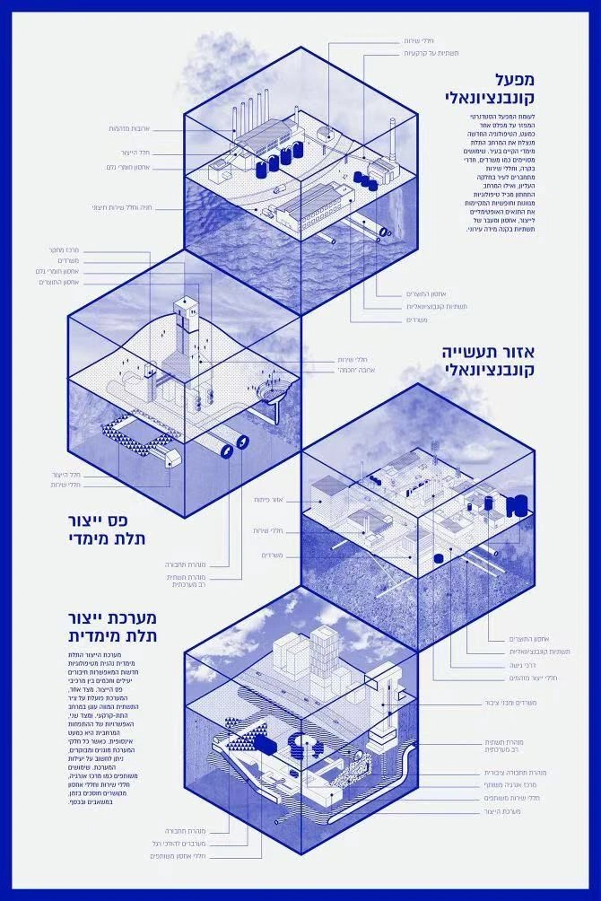

**Source:** [https://www.pinterest.com/pin/101260691615279286/](https://www.pinterest.com/pin/101260691615279286/)
**Type:** Pinterest
**Tags:** `diagram`, `blue`, `product`, `rectangle`, `font`, `parallel`, `engineering`

---

### 65. Item 65

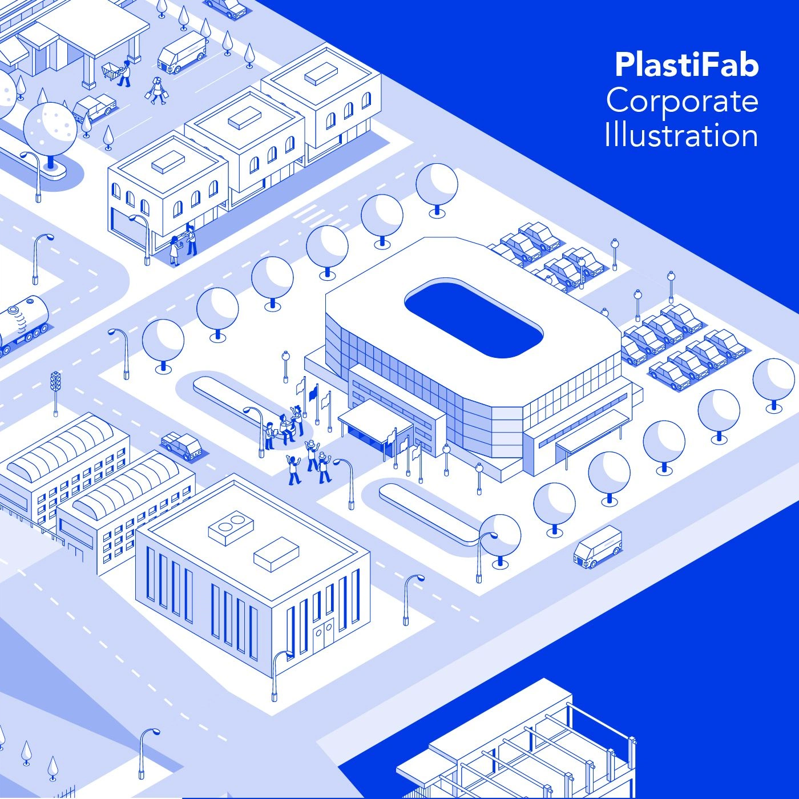

**Source:** [https://www.behance.net/gallery/118412853/Plasti-Fab-Isometr...](https://www.behance.net/gallery/118412853/Plasti-Fab-Isometric-Illustration)
**Type:** Pinterest
**Tags:** `electronic component`, `product design`, `illustration`, `dribbble`, `design`, `behance`, `font`, `circuit component`, `engineering`, `technology`, `electric blue`

---

### 66. Item 66

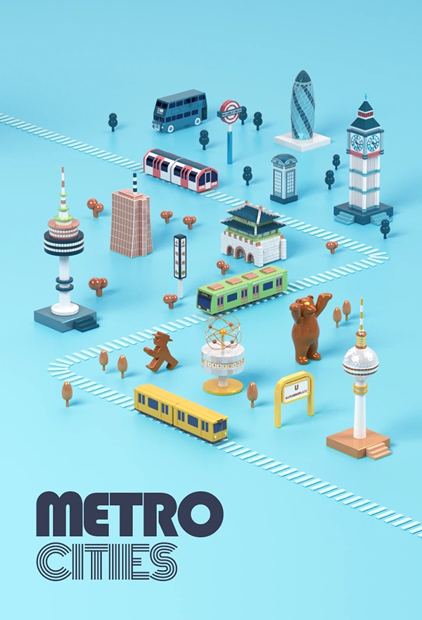

**Source:** [https://www.behance.net/gallery/71815487/Metro-Cities](https://www.behance.net/gallery/71815487/Metro-Cities)
**Type:** Pinterest
**Tags:** `water`, `illustration`, `design`, `font`, `motor vehicle`, `line`, `parallel`, `technology`

---

### 67. Commercial illustration for the ELEJAFE 4G Smartwatch for Kids.

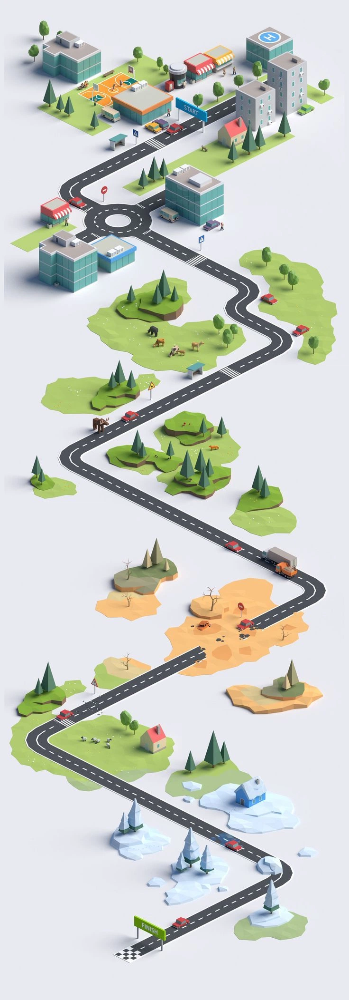

**Source:** [https://www.behance.net/gallery/78564073/loupoli-illjustraci...](https://www.behance.net/gallery/78564073/loupoli-illjustracija-dlja-testa-na-vozhdenie-rbk)
**Type:** Pinterest
**Tags:** `watercraft`, `design`, `green`, `motor vehicle`, `line`, `urban design`

---

### 68. Item 68

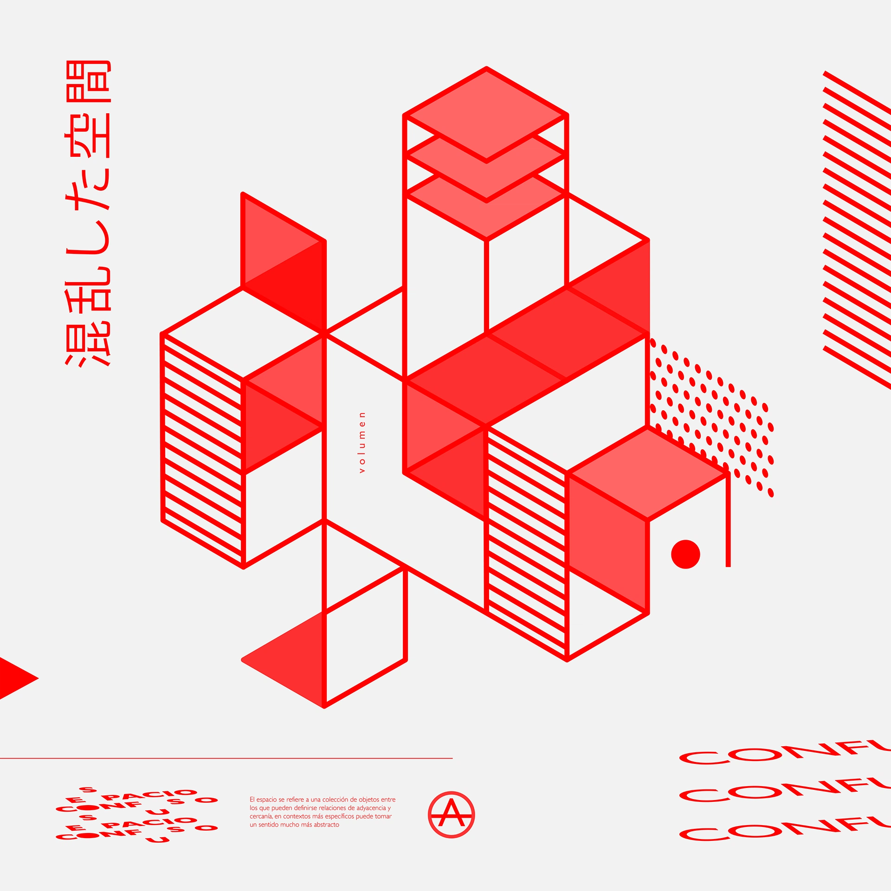

**Source:** [https://www.pinterest.com/pin/101260691614927913/](https://www.pinterest.com/pin/101260691614927913/)
**Type:** Pinterest
**Tags:** `design`, `graphics`, `graphic design`, `poster`, `architecture`, `art`, `rectangle`, `font`, `material property`, `parallel`

---

### 69. Digital illustration of the 14-bis aircraft by 14 BIS.

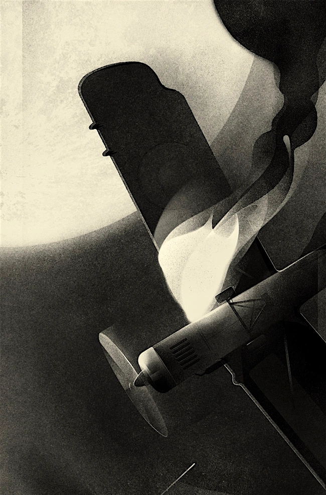

**Source:** [https://thisisnthappiness.com/post/189720684754/ive-had-drea...](https://thisisnthappiness.com/post/189720684754/ive-had-dreams-like-that-karolis-strautniekas)
**Type:** Pinterest
**Tags:** `photograph`, `textile`, `grey`, `comfort`, `black-and-white`, `tints and shades`

---

### 70. An illustration by Karolis Strautniekas.

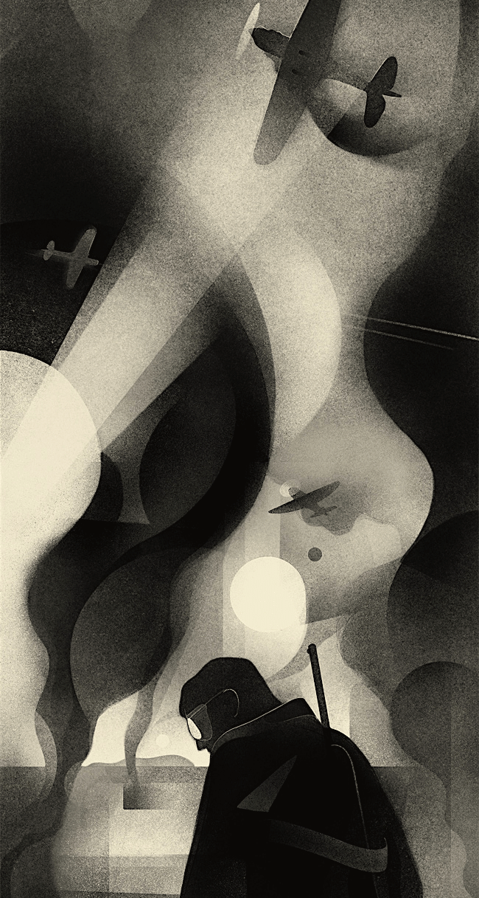

**Source:** [https://theartofanimation.tumblr.com/post/131907720338/karol...](https://theartofanimation.tumblr.com/post/131907720338/karolis-strautniekas/amp)
**Type:** Pinterest
**Tags:** `karolis strautniekas`, `illustration`, `art`, `drawing`, `black`, `organism`, `gesture`, `eyelash`, `style`, `black-and-white`, `flash photography`

---

### 71. Item 71

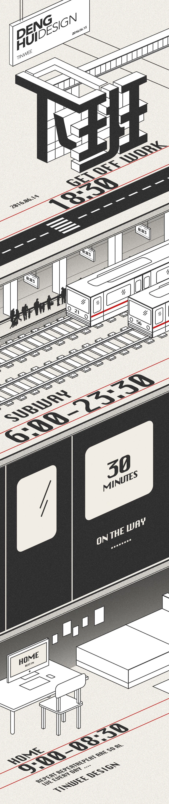

**Source:** [https://www.behance.net/gallery/38586171/Get-off-work](https://www.behance.net/gallery/38586171/Get-off-work)
**Type:** Pinterest
**Tags:** `design`, `poster`, `graphic design`, `product design`, `font`, `parallel`

---

### 72. Item 72

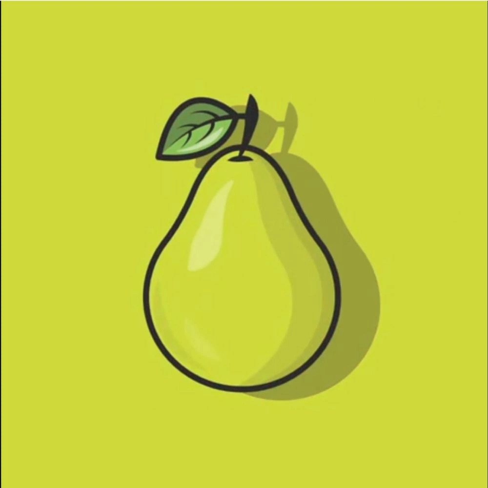

**Source:** [https://dailygrafix.com/2019/04/29/fruit-video-illustration/](https://dailygrafix.com/2019/04/29/fruit-video-illustration/)
**Type:** Pinterest
**Tags:** `pear`, `plant`, `art`, `fruit`

---

### 73. Item 73

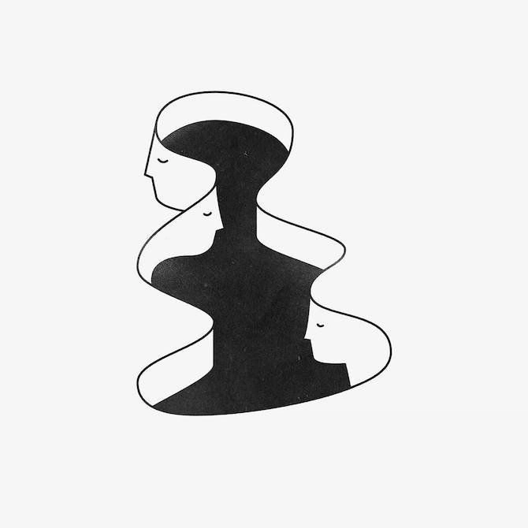

**Source:** [https://www.ignant.com/2017/04/17/timo-kuilders-geometric-il...](https://www.ignant.com/2017/04/17/timo-kuilders-geometric-illustrations/)
**Type:** Pinterest
**Tags:** `silhouette`, `design`, `illustration`, `gesture`, `art`, `font`

---

### 74. Item 74

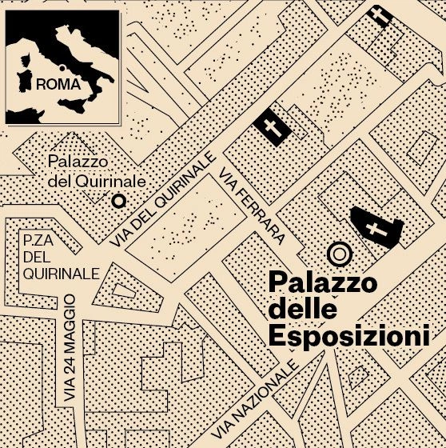

**Source:** [http://www.behance.net/gallery/MAPS/2622299](http://www.behance.net/gallery/MAPS/2622299)
**Type:** Pinterest
**Tags:** `pattern`, `design`, `graphic design`, `font`, `material property`, `parallel`, `urban design`

---

### 75. Illustration by Anna Parini for The New Yorker, used as the cover for Emily Chang's book Brotopia.

**Source:** [https://www.newyorker.com/magazine/2017/11/20/the-tech-indus...](https://www.newyorker.com/magazine/2017/11/20/the-tech-industrys-gender-discrimination-problem)
**Type:** Pinterest
**Tags:** `women progress`, `women, business and the law`, `gender equality`, `women's history month`, `hairstyle`, `facial expression`, `white`, `black`, `human`, `organism`, `gesture`, `font`

---

### 76. Item 76

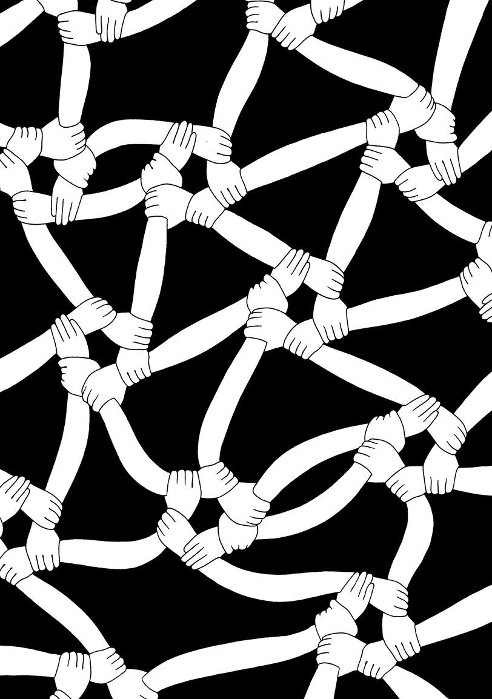

**Source:** [http://thetentaclesoflife.tumblr.com/post/103872676901](http://thetentaclesoflife.tumblr.com/post/103872676901)
**Type:** Pinterest
**Tags:** `mrzyk & moriceau hands`, `art`, `design`, `illustration`, `graphic design`, `white`, `black`, `organism`, `black-and-white`, `gesture`, `style`, `line`, `font`

---

### 77. Item 77

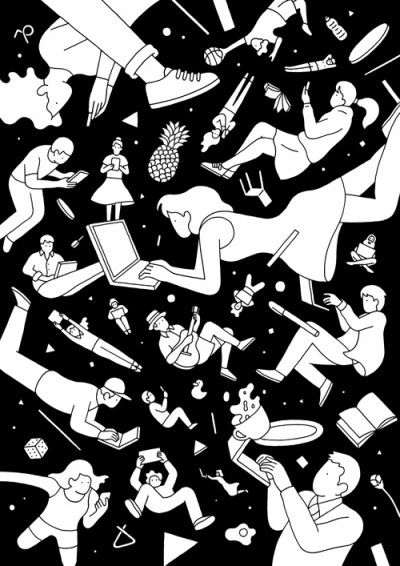

**Source:** [http://www.maracas.cool/wp-content/uploads/2016/01/tumblr_nu...](http://www.maracas.cool/wp-content/uploads/2016/01/tumblr_nuzregb41f1qi7unpo2_500-e1451690242309.jpg)
**Type:** Pinterest
**Tags:** `cartoon`, `illustration`, `design`, `drawing`, `white`, `black`, `organism`, `gesture`, `style`, `font`, `black-and-white`, `art`

---

### 78. Item 78

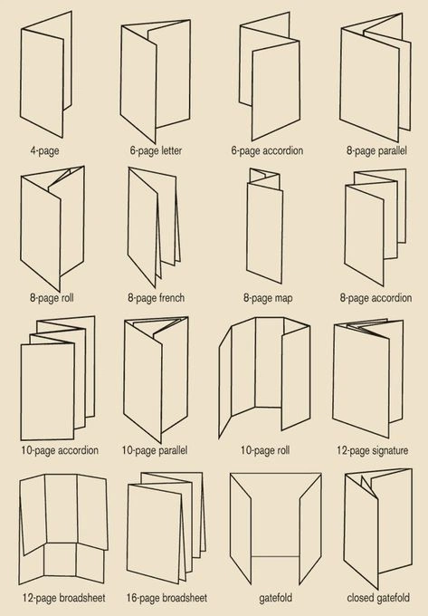

**Source:** [https://twitter.com/presentcorrect/status/472356662201053184](https://twitter.com/presentcorrect/status/472356662201053184)
**Type:** Pinterest
**Tags:** `standard folds`, `brochure printing`, `brochure`, `printing`, `rectangle`, `product`, `font`, `material property`, `beige`, `parallel`

---

### 79. Poster for the 28th Tokyo International Film Festival in 2015.

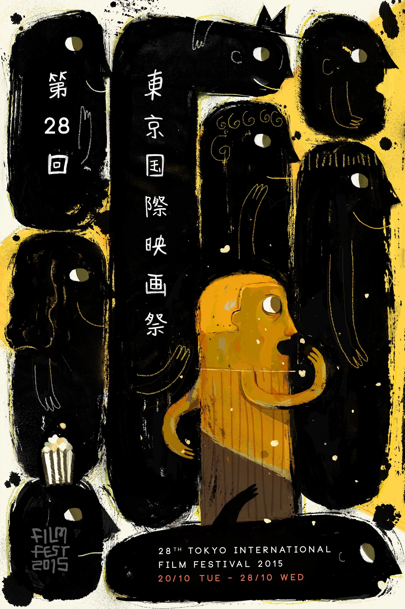

**Source:** [https://www.pinterest.com/pin/101260691607144577/](https://www.pinterest.com/pin/101260691607144577/)
**Type:** Pinterest
**Tags:** `japanese art graphic designer`, `graphic design`, `poster`, `design`, `graphics`, `art`, `illustration`, `black`, `font`, `rectangle`

---

### 80. Item 80

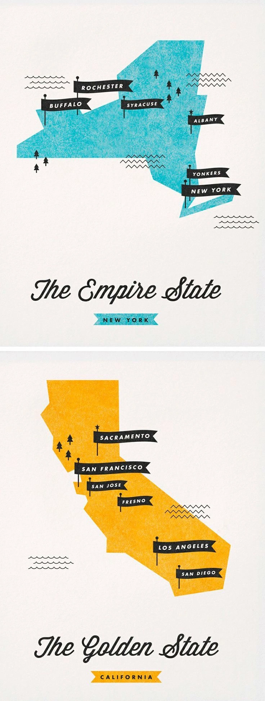

**Source:** [http://blogroom.stfi.re/117/iuuq;00nfejb.dbdif.bl1/qjojnh/dp...](http://blogroom.stfi.re/117/iuuq;00nfejb.dbdif.bl1/qjojnh/dpn0347y0g70e80e40g7e8e47:6176d9658dc5g545b76feg:8/kqh?sf=goypobl)
**Type:** Pinterest
**Tags:** `wing`, `illustration`, `graphic design`, `font`

---

### 81. Item 81

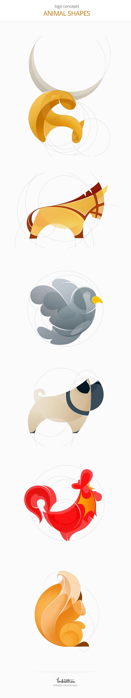

**Source:** [http://www.inspirationde.com/image/16820/](http://www.inspirationde.com/image/16820/)
**Type:** Pinterest
**Tags:** `orange`, `design`, `graphic design`, `logo`, `illustration`, `vector graphics`, `bird`, `font`

---

### 82. Fan art of Mike Wazowski and Sulley from Monsters, Inc. in a watercolor style.

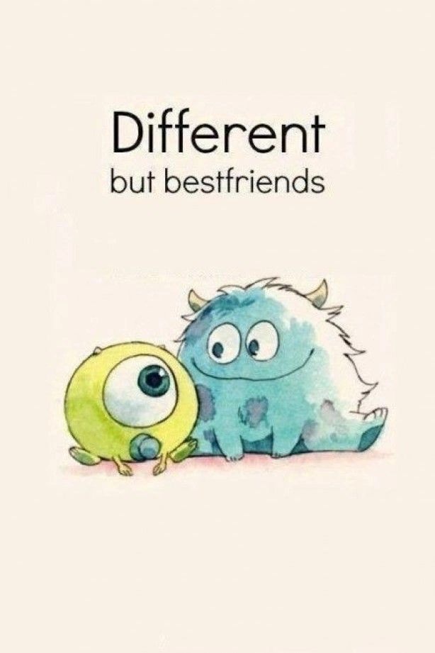

**Source:** [http://www.welke.nl/photo/Fioontje1981/Heel-cute-Mike-Sulley...](http://www.welke.nl/photo/Fioontje1981/Heel-cute-Mike-Sulley-van-Monsters-Inc.1384521888)
**Type:** Pinterest
**Tags:** `best friend motivational quotes`, `friendship`, `quotation`, `inspirational quote`, `font`, `happy`

---

### 83. A 2011 drawing of Wall-E and EVE by artist Oli.

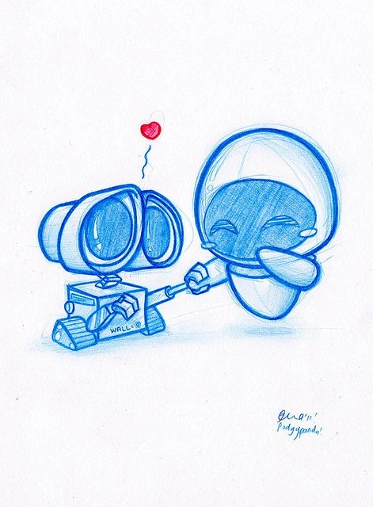

**Source:** [http://www.flickr.com/photos/podgypanda/6141592937/in/photos...](http://www.flickr.com/photos/podgypanda/6141592937/in/photostream)
**Type:** Pinterest
**Tags:** `wall e doodle`, `drawing`, `doodle`, `image`, `font`, `art`

---

### 84. Item 84

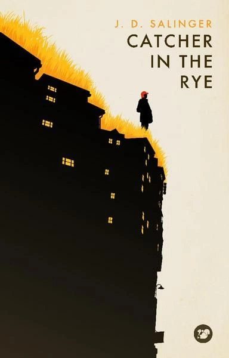

**Source:** [http://www.goodillustration.com/portfolio/Levente-Szabo-178/](http://www.goodillustration.com/portfolio/Levente-Szabo-178/)
**Type:** Pinterest
**Tags:** `catcher in the rye design`, `the catcher in the rye`, `book design`, `book cover`, `font`, `tints and shades`

---

### 85. illustrations universe

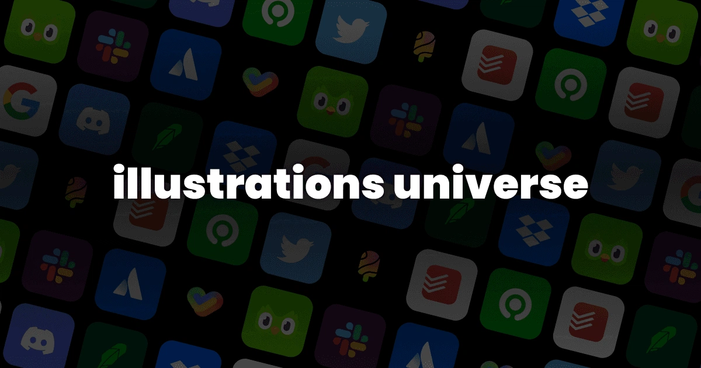

**Source:** [https://illustrationsuniverse.com/](https://illustrationsuniverse.com/)
**Type:** Article
**Tags:** `tints and shades`, `black`, `human body`, `font`, `gadget`, `material property`, `line`, `pattern`, `eye`, `purple`, `light`, `computer keyboard`, `electronic device`, `organ`, `office equipment`

---
