# Scapia - Cosmos.so Collection

**Source:** [cosmos.so/arjunphlox/scapia](https://www.cosmos.so/arjunphlox/scapia)
**Total items:** 113

---

## Overview

| Type | Count |
|------|-------|
| Element | 45 |
| InstagramElement | 31 |
| PinterestElement | 24 |
| ArticleElement | 10 |
| VideoElement | 3 |

---

## Items

### 1. sensa | strategy + craft

- **Type:** ArticleElement
- **Source:** [https://sensa.co/](https://sensa.co/)
- **ID:** `1875849860`

**Tags:** `circle`, `computer wallpaper`

---

### 2. Item 2

- **Type:** InstagramElement
- **Source:** [https://www.instagram.com/p/Crq-VYNL8xO/?igshid=YjgzMjc4YjcwZQ==](https://www.instagram.com/p/Crq-VYNL8xO/?igshid=YjgzMjc4YjcwZQ==)
- **ID:** `368598094`

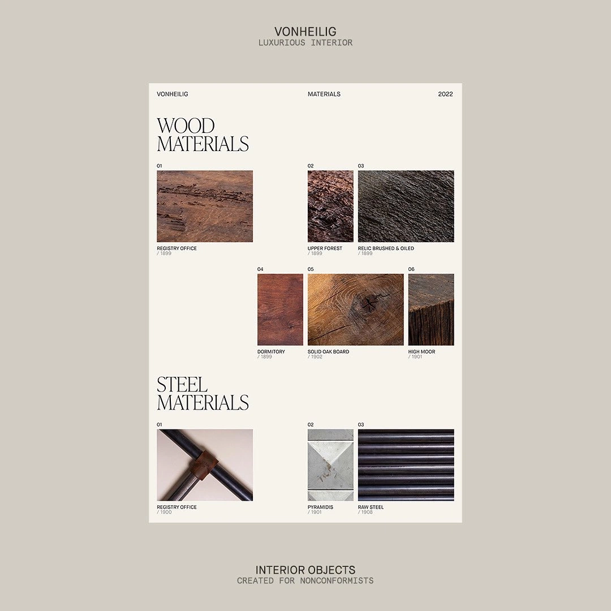

> Website design for luxury interior brand <n>Vonheilig</n> by <n>Mikołaj Żądło</n>.

**Tags:** `website`, `wood`, `rectangle`, `slope`, `font`, `flooring`

---

### 3. Item 3

- **Type:** Element
- **ID:** `204199874`

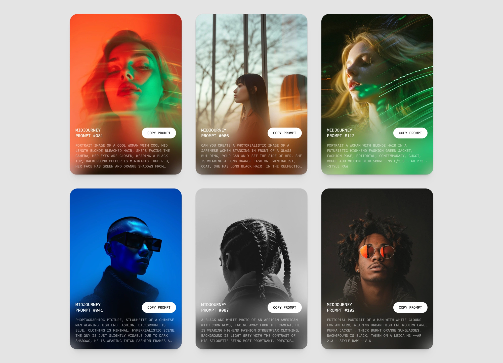

**Tags:** `green`, `font`, `terrestrial plant`, `product`, `headgear`, `flyer`

---

### 4. Item 4

- **Type:** Element
- **Source:** [x.com/abduzeedo/status/1812853147075035467](x.com/abduzeedo/status/1812853147075035467)
- **ID:** `1374680037`

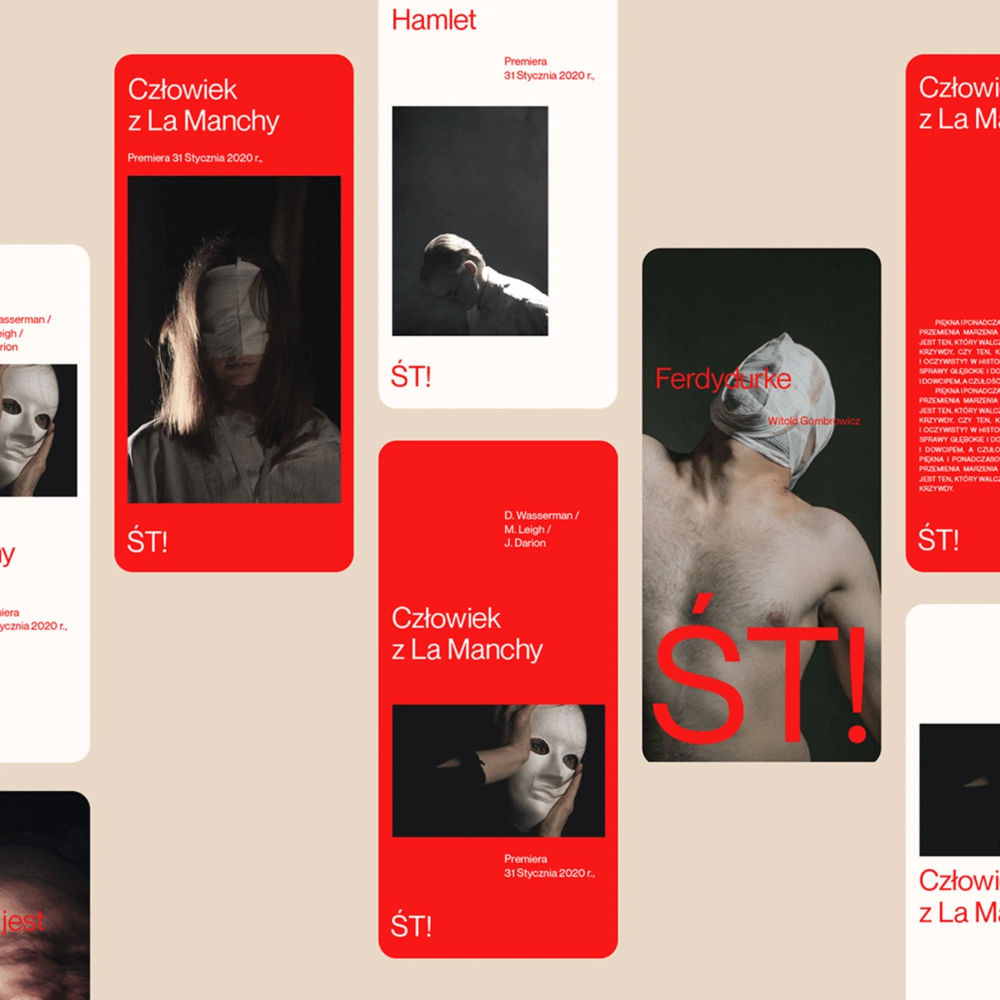

**Tags:** `flyer`

---

### 5. Item 5

- **Type:** Element
- **ID:** `505388231`

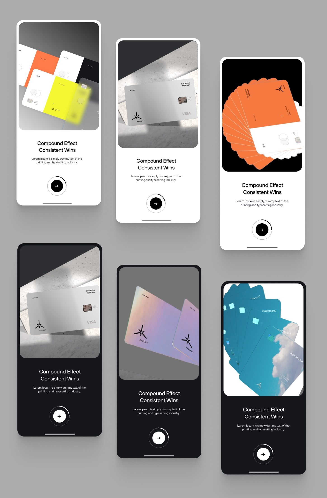

**Tags:** `iphone`, `product`, `gadget`, `font`, `material property`, `technology`

---

### 6. Juxtapose

- **Type:** ArticleElement
- **Source:** [https://www.juxtapose.com/](https://www.juxtapose.com/)
- **ID:** `1973287346`

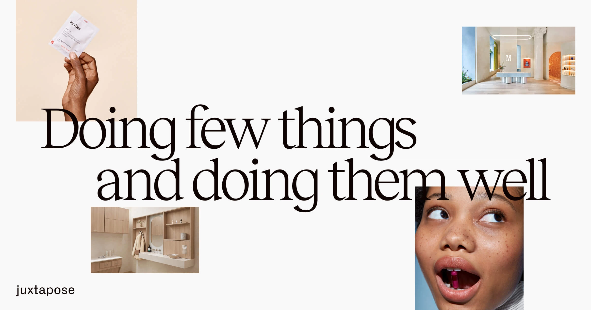

**Tags:** `baby`, `product`, `eyelash`, `gesture`, `font`, `happy`, `smile`, `wood`, `lipstick`

---

### 7. Item 7

- **Type:** Element
- **Source:** [https://x.com/remonleijtens/status/1685229810832871424/photo/1](https://x.com/remonleijtens/status/1685229810832871424/photo/1)
- **ID:** `998491472`

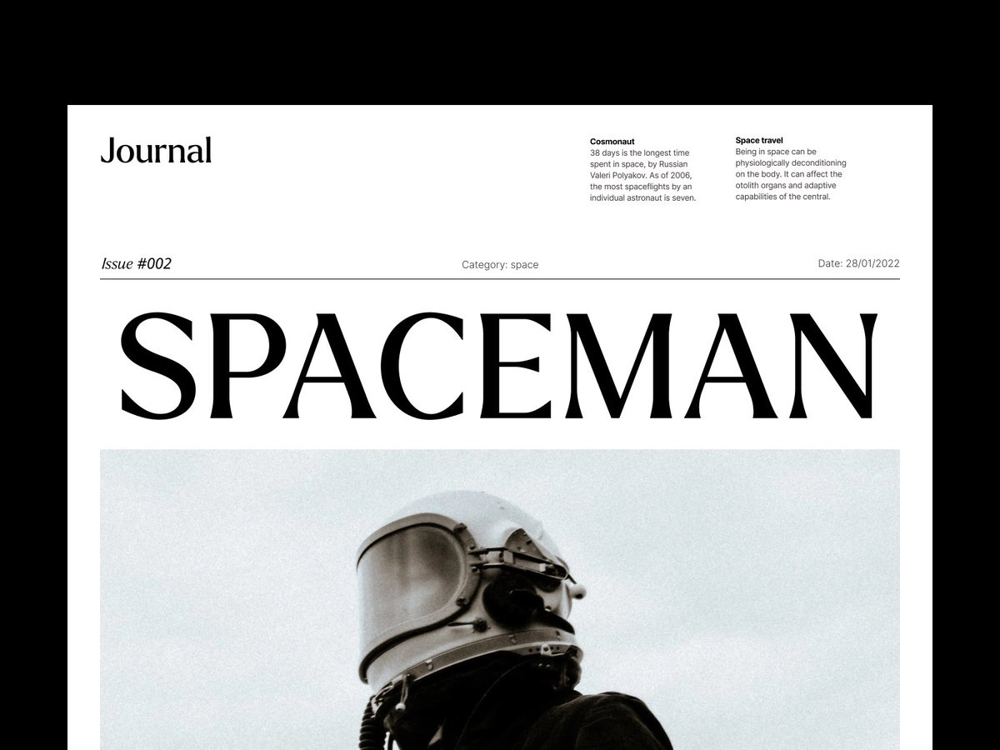

**Tags:** `monochrome`, `shoe`, `black`, `font`

---

### 8. Item 8

- **Type:** Element
- **Source:** [https://dribbble.com/shots/14080997-Makeup-portfolio](https://dribbble.com/shots/14080997-Makeup-portfolio)
- **ID:** `954210087`

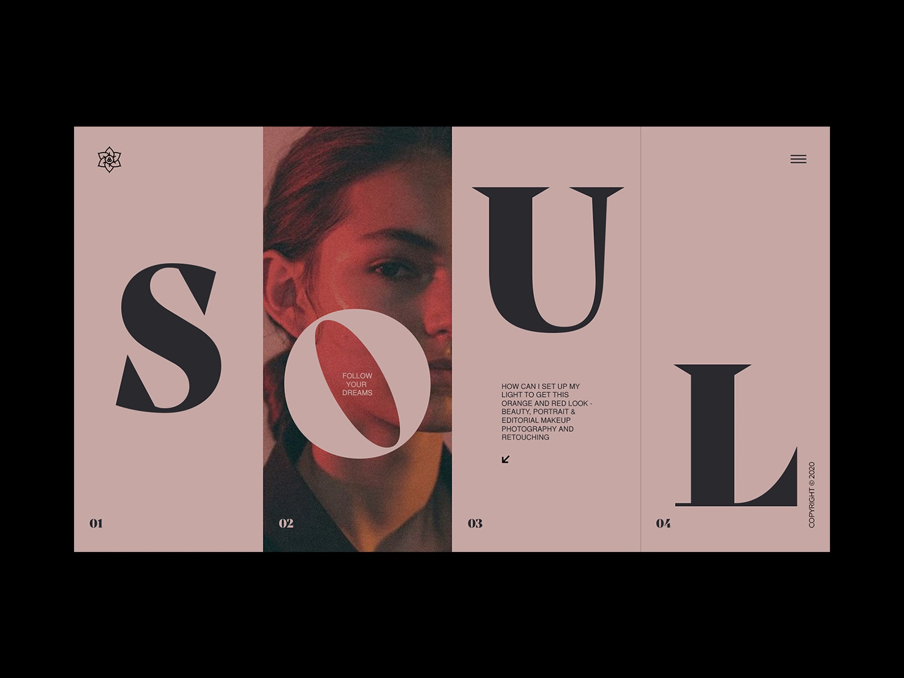

> Website design concept <n>SOUL - Makeup Artist Portfolio</n> by designer <n>Helena Stretovych</n>, 2020.

**Tags:** `font`, `eyelash`, `design`, `artist's portfolio`, `design portfolio beauty`

---

### 9. Item 9

- **Type:** PinterestElement
- **Source:** [https://www.pinterest.de/pin/610237818285904308/](https://www.pinterest.de/pin/610237818285904308/)
- **ID:** `2086050513`

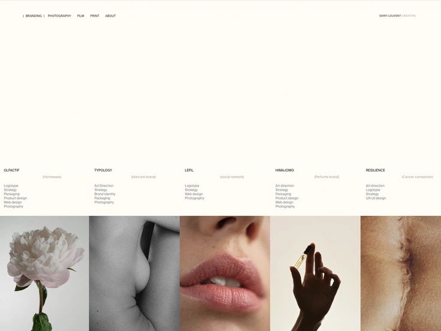

> Website for <n>Saint Louvent Creation</n>, a creative studio founded by <n>Morgane Vantorre</n>.

**Tags:** `gesture`, `happy`, `neck`, `jaw`, `chest`, `petal`, `finger`, `font`, `material property`, `nail`, `eyelash`, `mouth`, `website`

---

### 10. Item 10

- **Type:** Element
- **ID:** `2105592180`

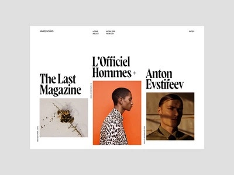

**Tags:** `font`, `t-shirt`, `design`, `dribbble`, `web design`, `typography`

---

### 11. Item 11

- **Type:** PinterestElement
- **Source:** [https://www.pinterest.com/pin/883620389375498558/](https://www.pinterest.com/pin/883620389375498558/)
- **ID:** `1513800039`

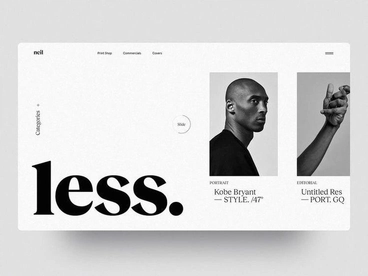

> Minimalist portfolio website concept by designer <n>Neil Bedford</n>.

**Tags:** `gesture`, `sleeve`, `font`, `tie`, `collar`, `design`, `graphic design`, `web design`, `rron berisha`

---

### 12. Item 12

- **Type:** PinterestElement
- **Source:** [https://www.designspiration.com/save/58722453069/](https://www.designspiration.com/save/58722453069/)
- **ID:** `5475948`

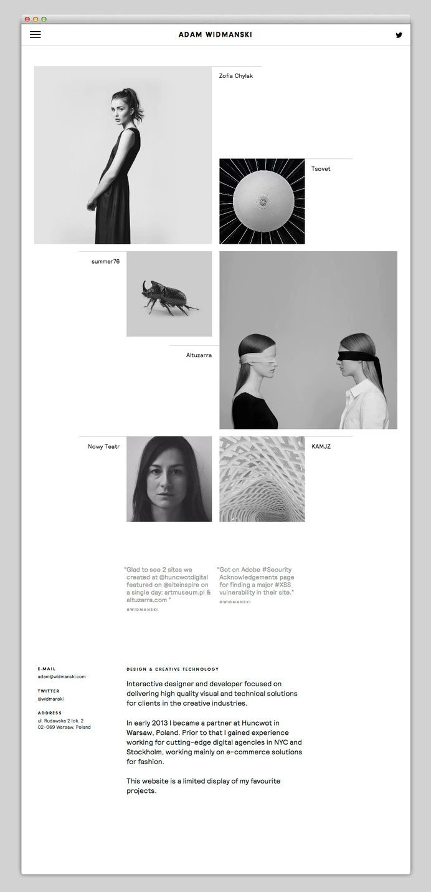

> The minimalist portfolio website for interactive designer <n>Adam Widmanski</n>, partner at <n>Huncwot</n>.

**Tags:** `sleeve`, `font`, `t-shirt`, `hat`, `design`, `graphic design`, `website`, `web design`, `black and white layout`

---

### 13. Item 13

- **Type:** InstagramElement
- **Source:** [https://www.instagram.com/p/C0JarVwsC3r/](https://www.instagram.com/p/C0JarVwsC3r/)
- **ID:** `570259517`

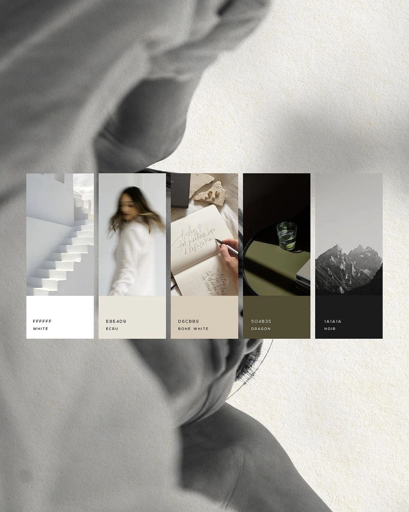

**Tags:** `collage`, `product`, `human body`, `neck`, `sleeve`, `gesture`, `flash photography`, `font`, `elbow`

---

### 14. Item 14

- **Type:** PinterestElement
- **Source:** [https://www.lapa.ninja/post/zhenyary/](https://www.lapa.ninja/post/zhenyary/)
- **ID:** `2076295931`

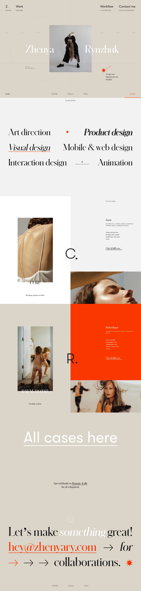

**Tags:** `website`

---

### 15. Item 15

- **Type:** Element
- **Source:** [https://savee.it/i/MBTX8I0/](https://savee.it/i/MBTX8I0/)
- **ID:** `104548585`

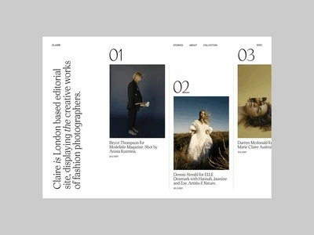

**Tags:** `font`, `screenshot`, `design`, `dribbble`, `editorial web design`

---

### 16. Item 16

- **Type:** InstagramElement
- **Source:** [https://www.instagram.com/p/ChiFINLreL0/](https://www.instagram.com/p/ChiFINLreL0/)
- **ID:** `2134258046`

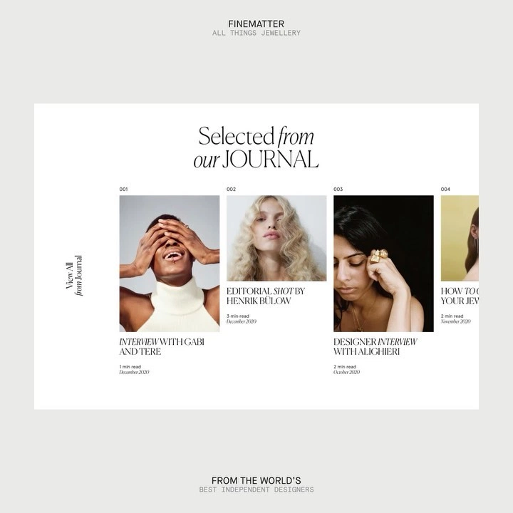

> Website design for <n>Finematter</n>'s journal, featuring an editorial by <n>Henrik Bülow</n> and an interview with <n>Alighieri</n>.

**Tags:** `shoulder`, `rron berisha`, `human body`, `jaw`, `eyelash`, `font`

---

### 17. Item 17

- **Type:** PinterestElement
- **Source:** [https://tonicsiteshop.com/shop/showit-website-templates/negroni/](https://tonicsiteshop.com/shop/showit-website-templates/negroni/)
- **ID:** `39024194`

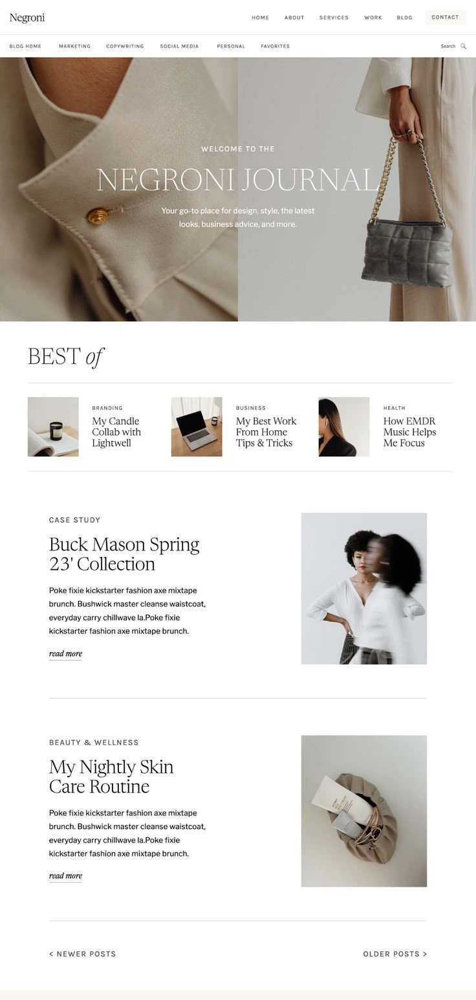

**Tags:** `sleeve`, `font`, `product`, `website`

---

### 18. Item 18

- **Type:** Element
- **Source:** [https://www.are.na/block/2445829](https://www.are.na/block/2445829)
- **ID:** `698302854`

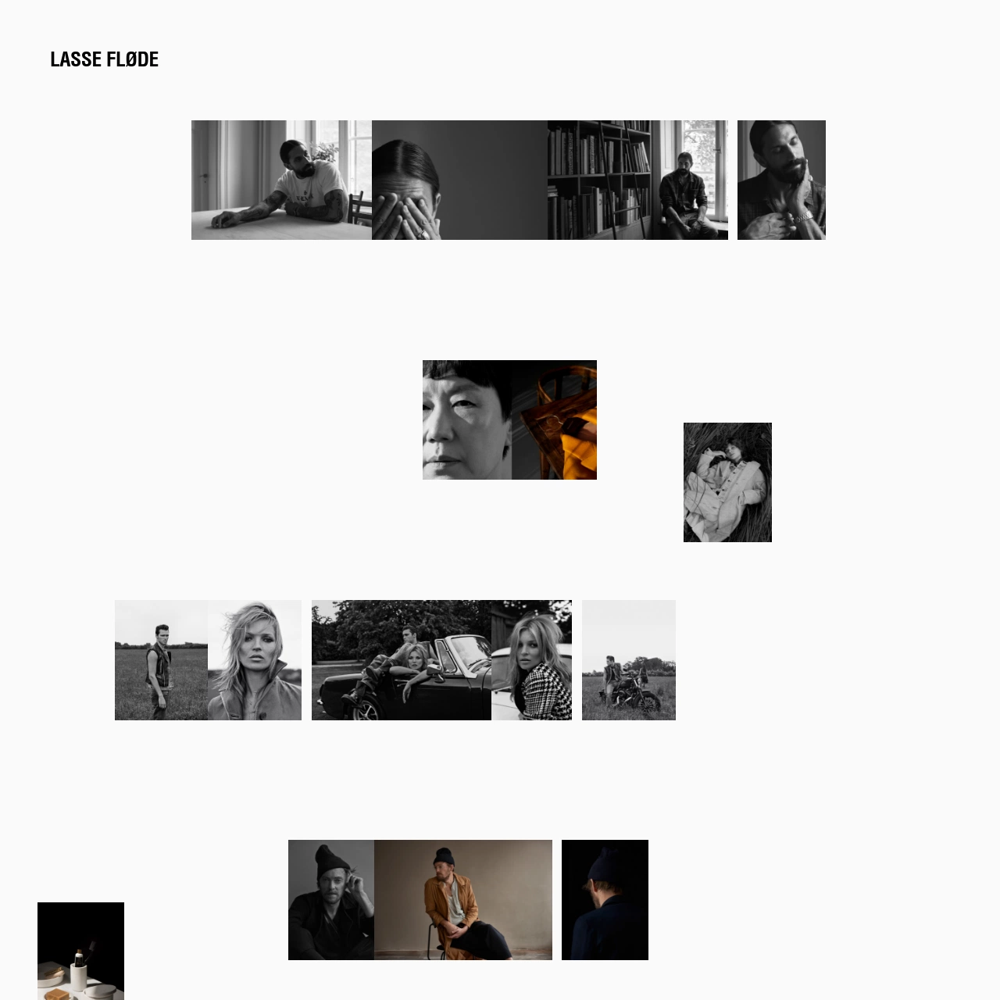

> Photography by <n>Lasse Fløde</n>.

**Tags:** `font`

---

### 19. Item 19

- **Type:** Element
- **ID:** `603255210`

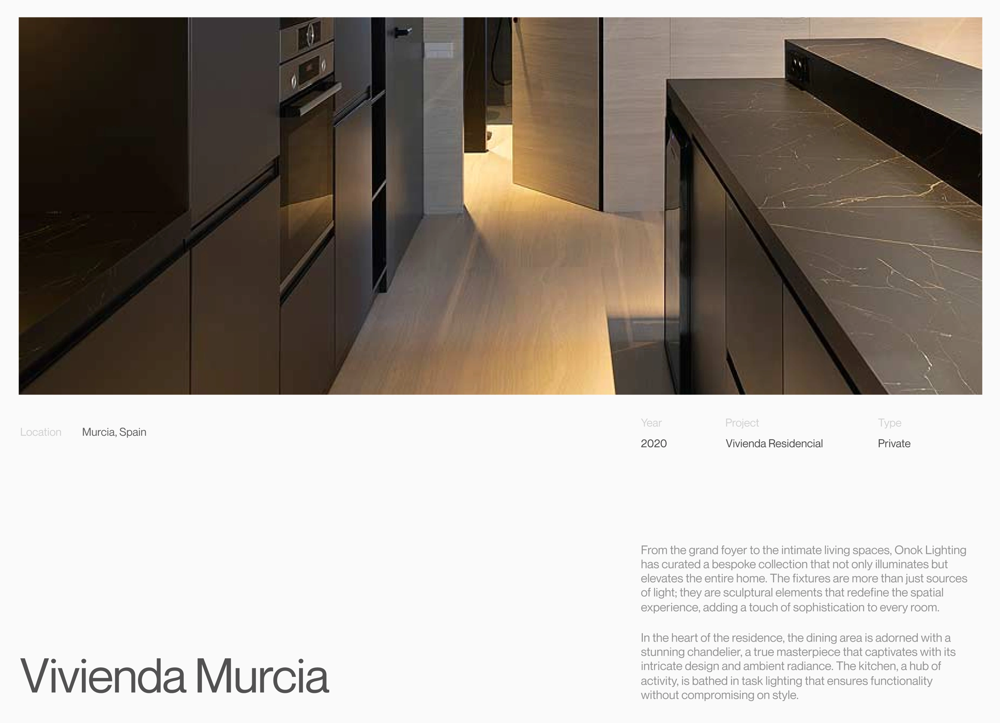

> A view of the <n>Vivienda Murcia</n> residential project (2020) with lighting by <n>Onok Lighting</n>.

**Tags:** `wood`, `font`, `output device`, `rectangle`, `floor`, `cabinetry`

---

### 20. Item 20

- **Type:** InstagramElement
- **Source:** [https://www.instagram.com/p/Bfv2JKSB007/](https://www.instagram.com/p/Bfv2JKSB007/)
- **ID:** `1663568083`

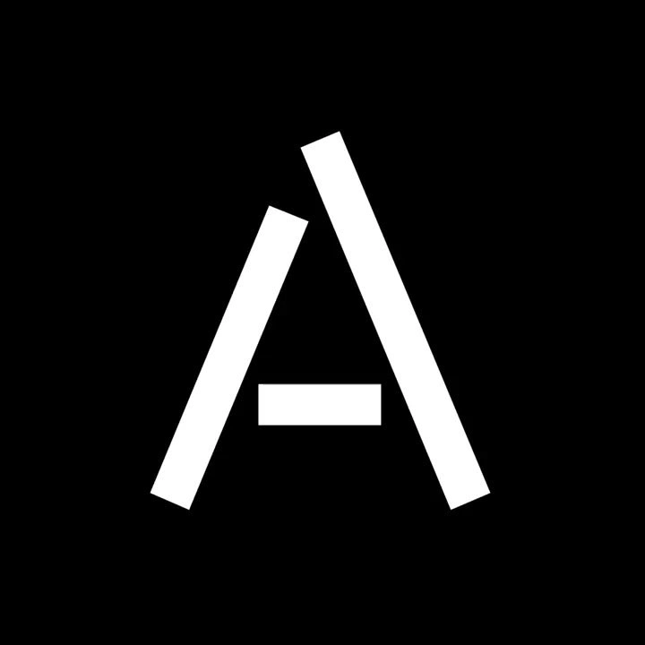

> Custom typeface for the <n>Chus X Chus</n> jewelry line by <n>Chus Burés</n>. Design by <n>Natasha Jen</n>.

**Tags:** `monochrome`, `font`, `symbol`

---

### 21. Item 21

- **Type:** Element
- **ID:** `1662541018`

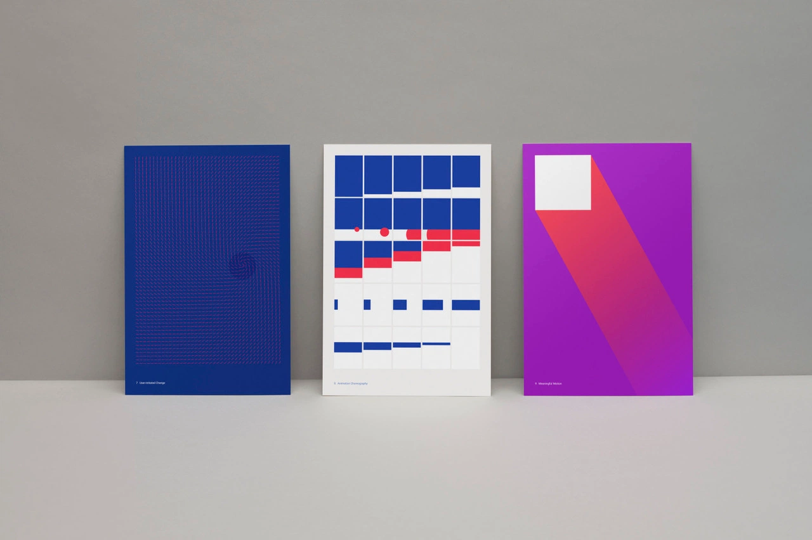

> Prints from the <n>Manual: Google Material Design</n> project by <n>Sgustok Studio</n>, 2015.

**Tags:** `art`, `font`, `rectangle`, `electric blue`, `paint`, `design`, `graphic design`

---

### 22. Item 22

- **Type:** Element
- **Source:** [https://www.creativeboom.com/inspiration/pentagrams-identity-for-the-moholy-nagy-foundation/](https://www.creativeboom.com/inspiration/pentagrams-identity-for-the-moholy-nagy-foundation/)
- **ID:** `702141506`

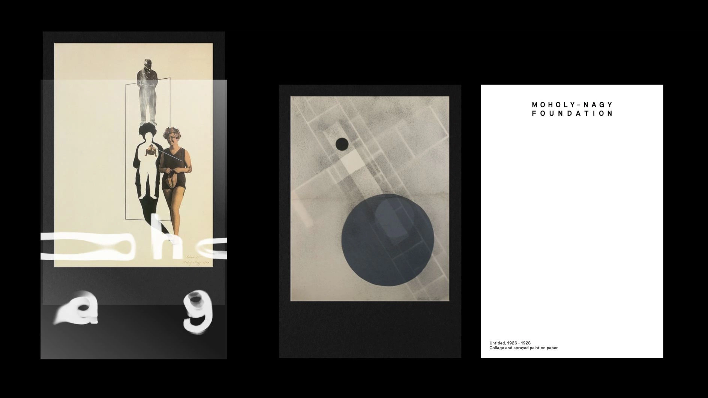

> Visual identity for the <n>Moholy-Nagy Foundation</n> by <n>Pentagram</n>, featuring art by <n>László Moholy-Nagy</n>.

**Tags:** `sleeve`, `art`, `font`, `rectangle`, `communication device`, `illustration`, `design`, `graphic design`, `lászló moholy-nagy`

---

### 23. Item 23

- **Type:** Element
- **ID:** `43602659`

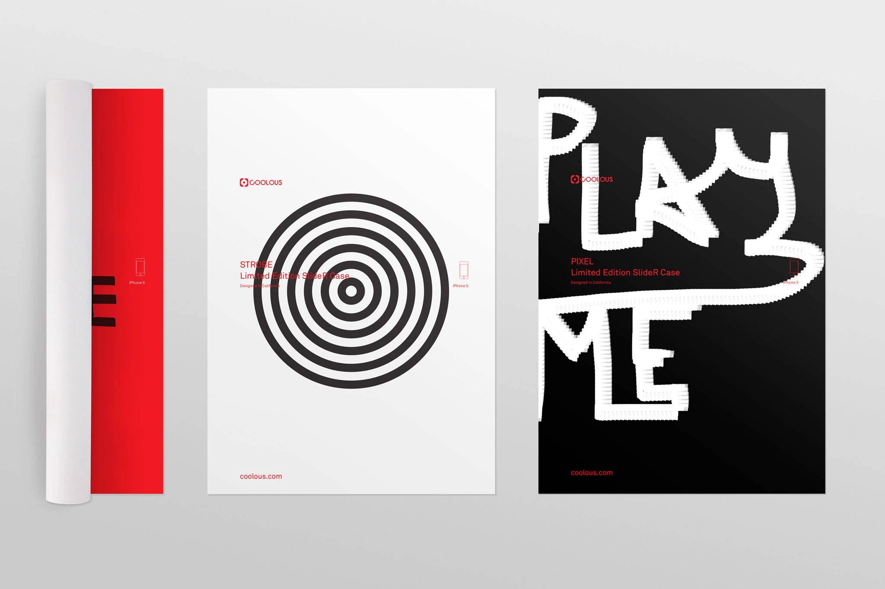

**Tags:** `font`, `rectangle`, `graphic design`

---

### 24. Item 24

- **Type:** PinterestElement
- **Source:** [https://nl.pinterest.com/pin/704602304222676653/](https://nl.pinterest.com/pin/704602304222676653/)
- **ID:** `168038722`

**Tags:** `vehicle`, `shoe`, `dress`, `tire`, `wheel`, `mode of transport`, `bicycle`, `bicycle tire`, `bicycles--equipment and supplies`, `bicycle handlebar`, `bicycle wheel`, `bicycle fork`, `bicycle frame`, `crankset`, `road bike`, `bicycle accessory`

---

### 25. Item 25

- **Type:** Element
- **Source:** [https://savee.it/i/JQVYi9K/](https://savee.it/i/JQVYi9K/)
- **ID:** `1395892630`

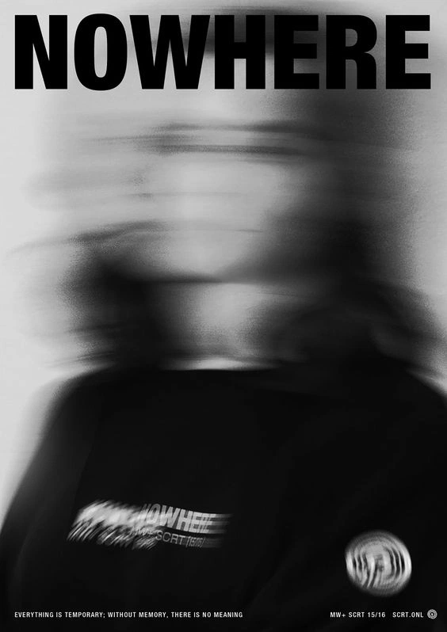

**Tags:** `flash photography`, `poster`, `font`, `automotive lighting`, `automotive tire`

---

### 26. Item 26

- **Type:** PinterestElement
- **Source:** [https://www.pinterest.com/pin/986006912167974774/](https://www.pinterest.com/pin/986006912167974774/)
- **ID:** `1839654966`

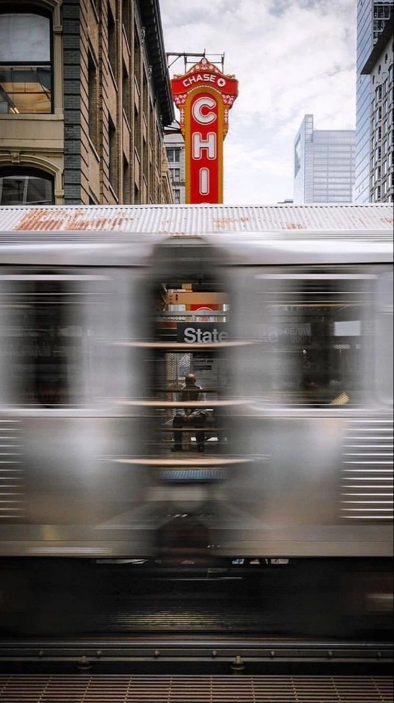

**Tags:** `photography`, `portrait`, `photograph`

---

### 27. Item 27

- **Type:** InstagramElement
- **Source:** [https://www.instagram.com/p/C2gQq7uOYAi/?igsh=MWoyeTI1ejZtcjU1ZQ==](https://www.instagram.com/p/C2gQq7uOYAi/?igsh=MWoyeTI1ejZtcjU1ZQ==)
- **ID:** `101317724`

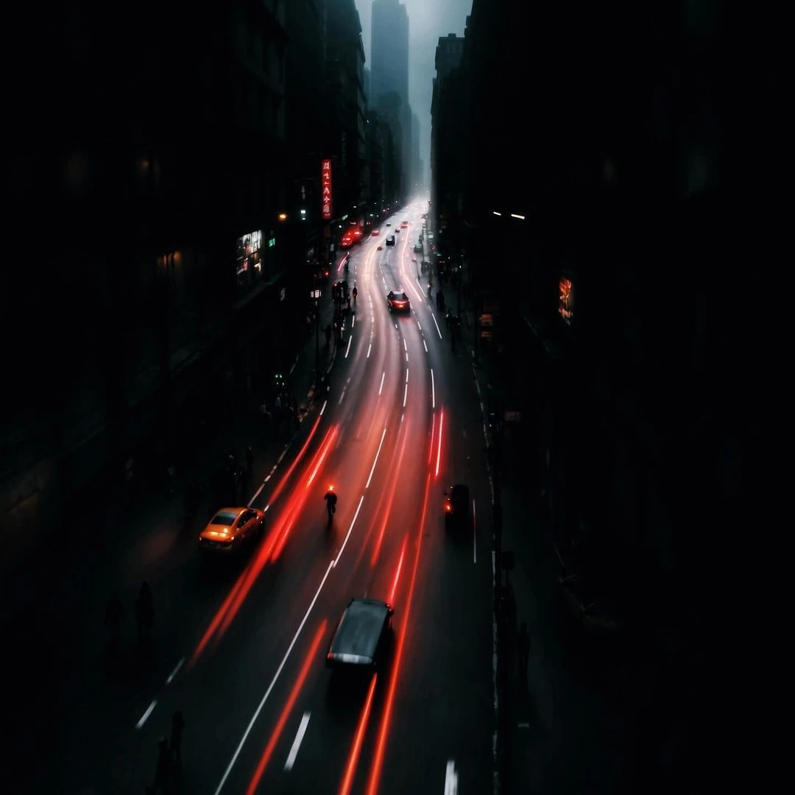

**Tags:** `night`, `automotive lighting`, `sky`, `car`, `vehicle`, `headlamp`, `road surface`, `asphalt`, `plant`

---

### 28. Item 28

- **Type:** PinterestElement
- **Source:** [https://www.colesclassroom.com/tricks-to-master-panning-photography/](https://www.colesclassroom.com/tricks-to-master-panning-photography/)
- **ID:** `1695556594`

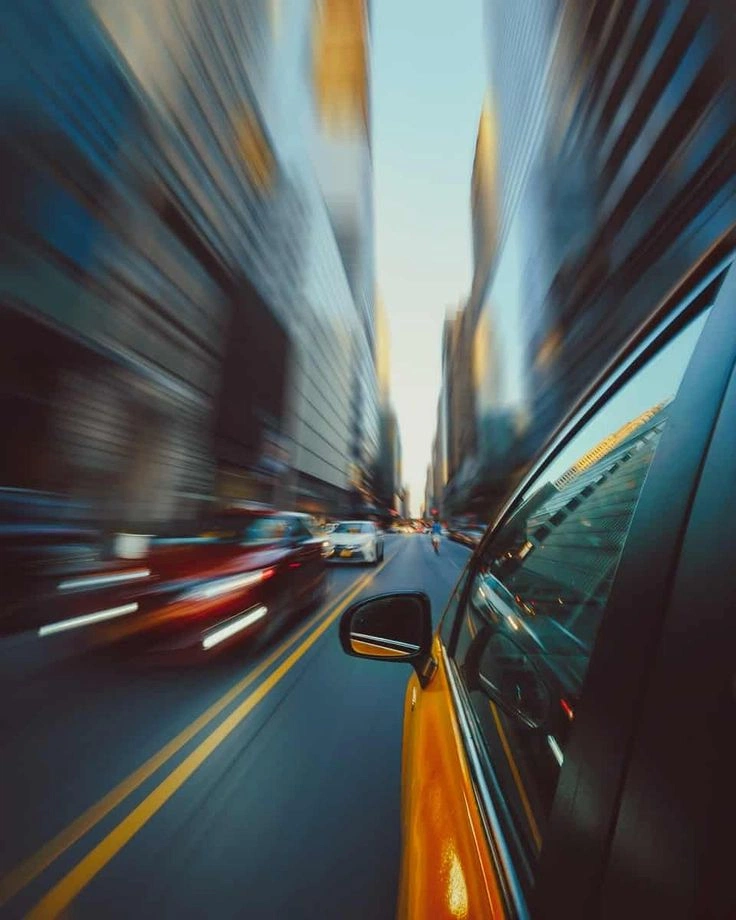

**Tags:** `tints and shades`, `sky`, `vehicle`, `automotive design`, `motor vehicle`, `car`, `hood`, `automotive lighting`, `road surface`, `asphalt`, `city`, `symmetry`, `photograph`, `mode of transport`, `headlamp`, `thoroughfare`, `image`, `photography`, `panned photography`, `panning`

---

### 29. Item 29

- **Type:** InstagramElement
- **Source:** [https://www.instagram.com/p/C5gI2Jxy3MV/?igsh=ajVtODE4a2Vrc3c=](https://www.instagram.com/p/C5gI2Jxy3MV/?igsh=ajVtODE4a2Vrc3c=)
- **ID:** `605410832`

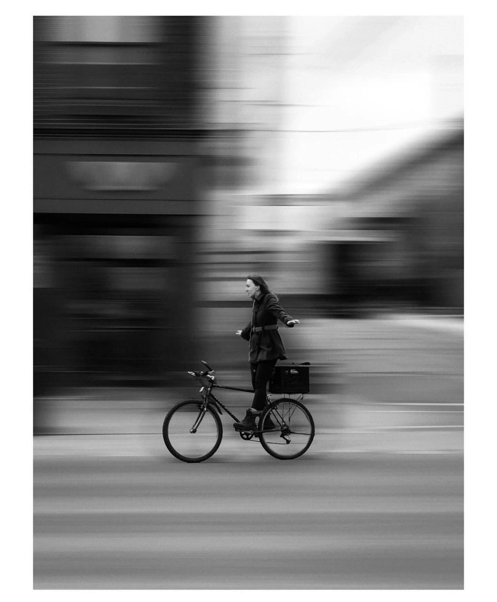

> Photo by <n>Oliver</n>.

**Tags:** `photograph`, `black-and-white`, `image`, `photography`, `bicycle`, `wheel`, `tire`, `bicycle wheel`, `bicycle wheel rim`, `bicycle tire`, `white`, `bicycles--equipment and supplies`

---

### 30. Item 30

- **Type:** Element
- **ID:** `64841808`

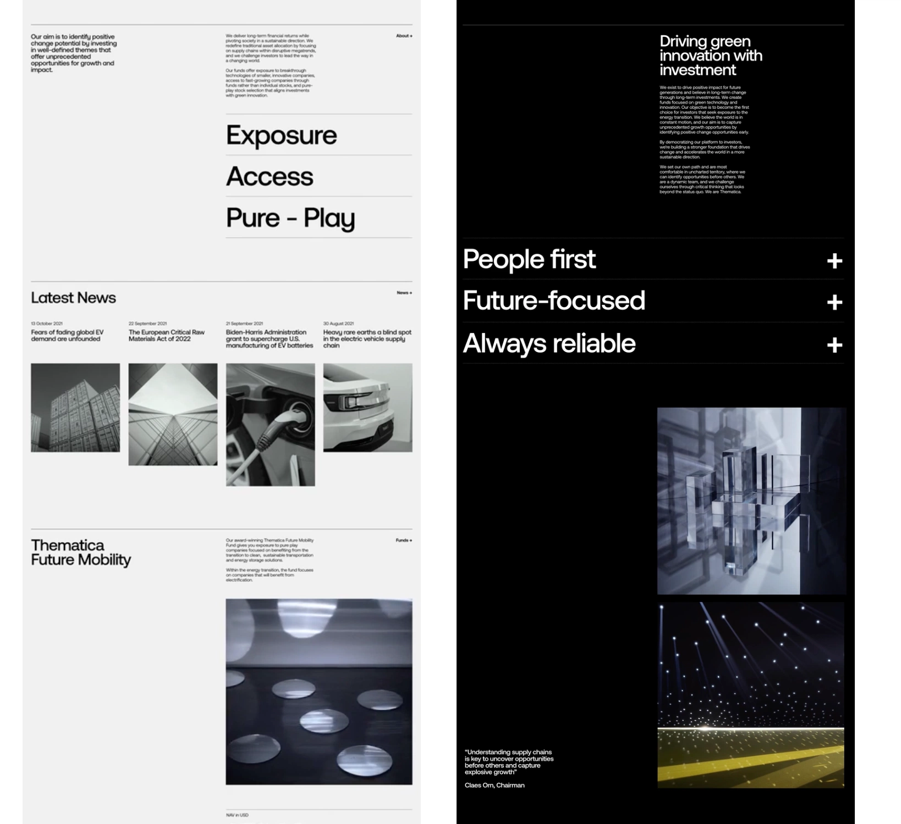

**Tags:** `black`, `font`, `screenshot`, `technology`, `multimedia`

---

### 31. Item 31

- **Type:** Element
- **Source:** [https://www.are.na/block/6949987](https://www.are.na/block/6949987)
- **ID:** `1106368694`

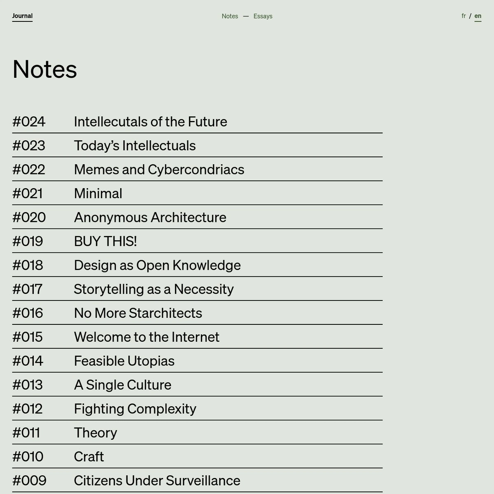

**Tags:** `document`

---

### 32. Item 32

- **Type:** Element
- **ID:** `2144560028`

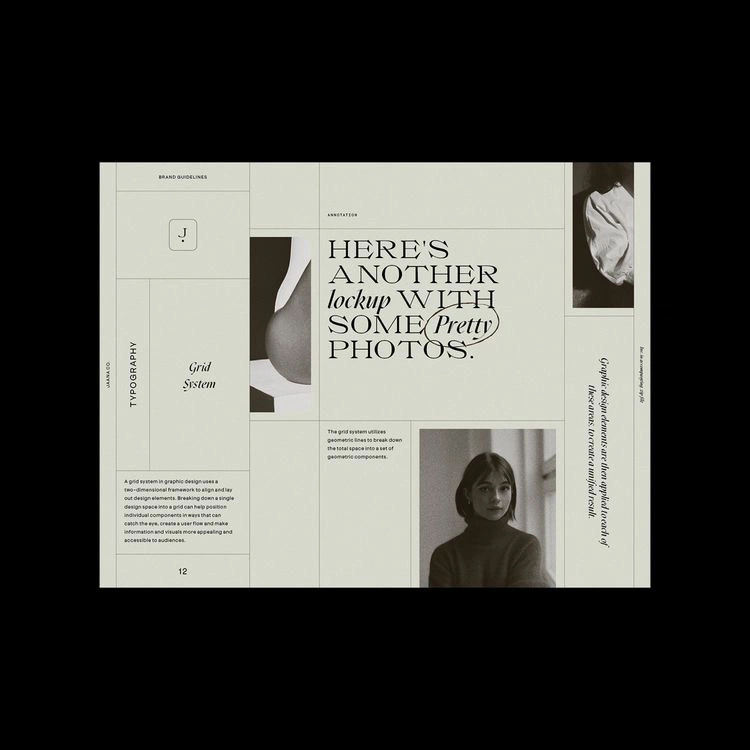

**Tags:** `sleeve`, `font`, `design`, `graphic design`, `page layout`, `平面版式設計`

---

### 33. Item 33

- **Type:** InstagramElement
- **Source:** [https://www.instagram.com/p/CzWRhy8I7Gc/?igshid=MWtxamhqZGZ6ZWZjbw==](https://www.instagram.com/p/CzWRhy8I7Gc/?igshid=MWtxamhqZGZ6ZWZjbw==)
- **ID:** `1561308057`

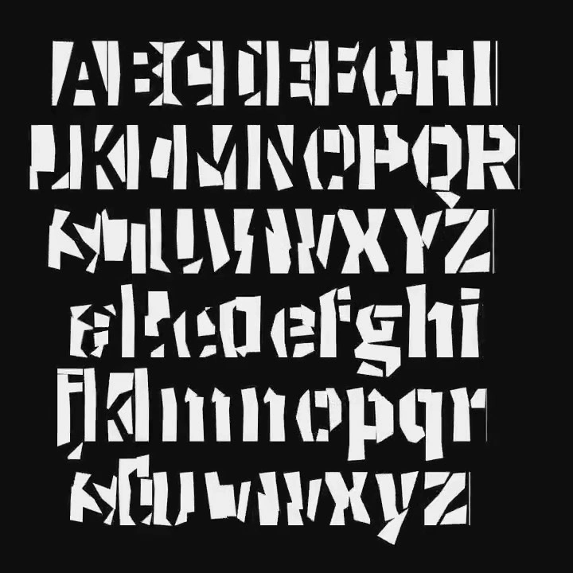

> <n>Invert</n>, an experimental variable font by <n>Anna Khorash</n> released through <n>Future Fonts</n>.

**Tags:** `monochrome`, `font`, `rectangle`

---

### 34. Item 34

- **Type:** Element
- **ID:** `1022720628`

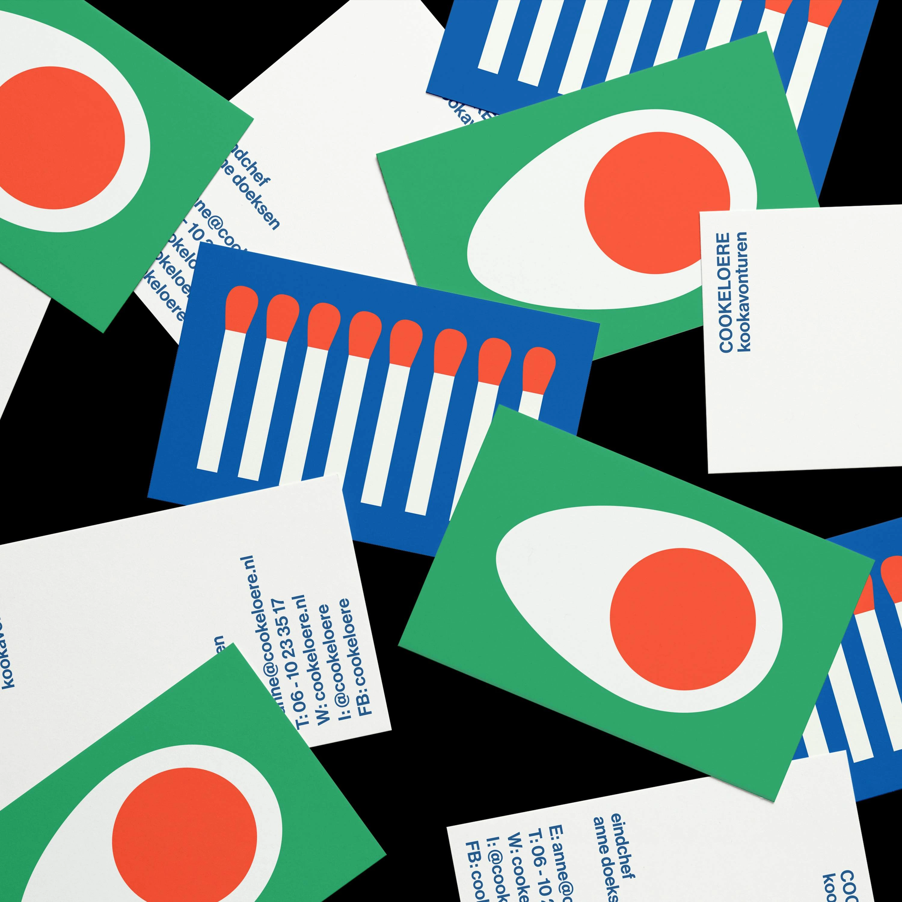

**Tags:** `poster`, `font`, `material property`, `line`, `product`, `red`, `design`, `graphic design`, `graphics`

---

### 35. Item 35

- **Type:** InstagramElement
- **Source:** [https://www.instagram.com/p/Ct9UgS3hmv0/](https://www.instagram.com/p/Ct9UgS3hmv0/)
- **ID:** `116225225`

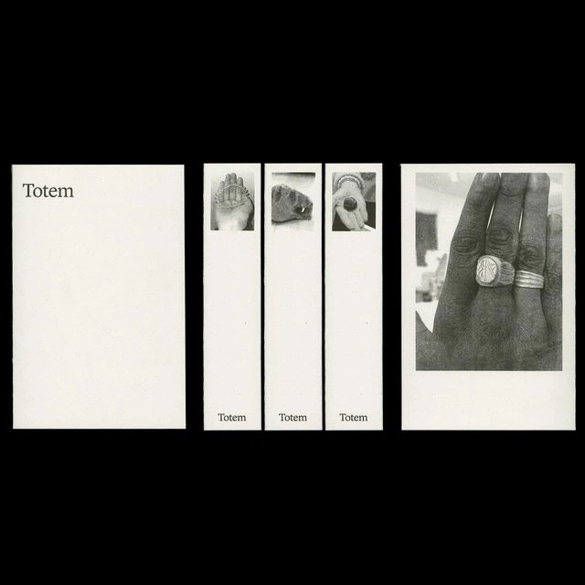

> <n>Totem</n> by artist <n>Yang Hyein</n>.

**Tags:** `monochrome photography`, `rectangle`, `font`, `tints and shades`

---

### 36. Item 36

- **Type:** PinterestElement
- **Source:** [https://www.instagram.com/p/Beiz4q8H0HN/](https://www.instagram.com/p/Beiz4q8H0HN/)
- **ID:** `256587499`

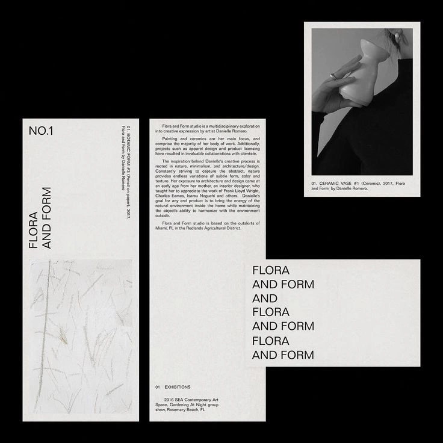

**Tags:** `font`, `material property`, `rectangle`, `parallel`, `design`

---

### 37. Item 37

- **Type:** InstagramElement
- **Source:** [https://www.instagram.com/p/C71HLIcrWLI/](https://www.instagram.com/p/C71HLIcrWLI/)
- **ID:** `696464911`

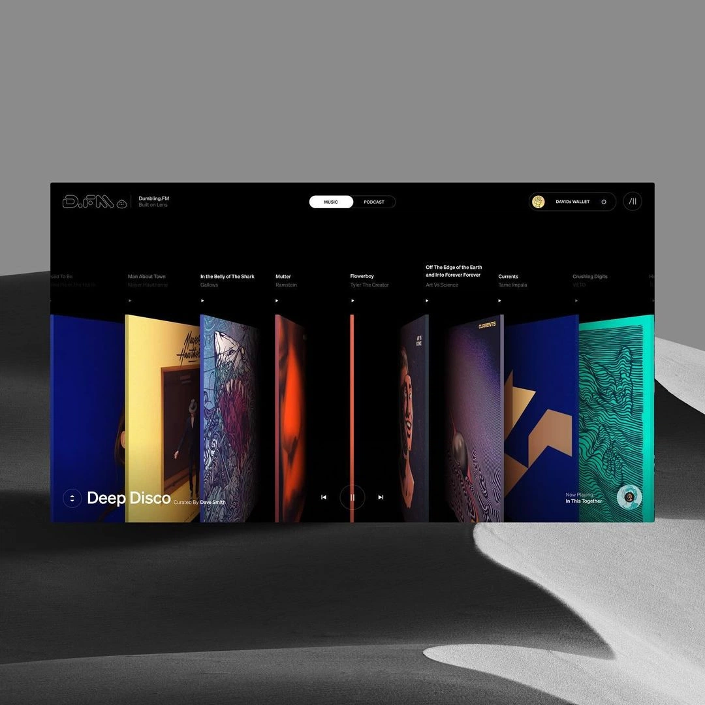

> A 2022 UI concept for the music platform <n>Dumplings.FM</n>, created by <n>tenten</n> for <n>Aave</n>.

**Tags:** `graphic design`, `gadget`, `computer`, `material property`, `automotive design`, `font`, `multimedia`, `display device`, `electronic device`

---

### 38. Item 38

- **Type:** Element
- **Source:** [https://www.are.na/block/25729328](https://www.are.na/block/25729328)
- **ID:** `1384993393`

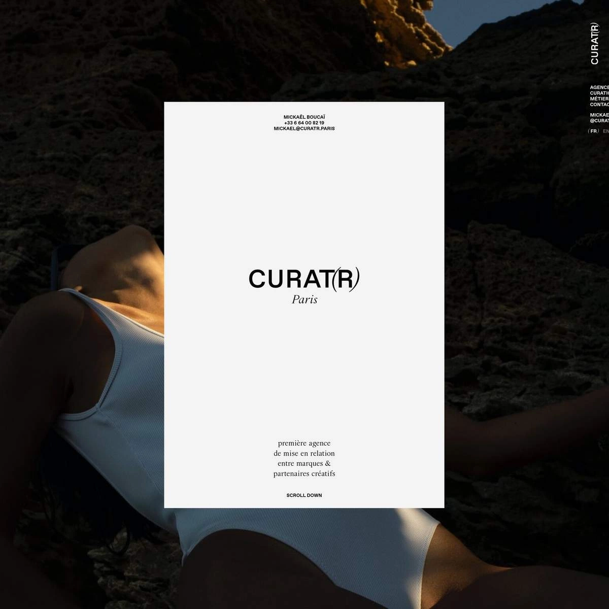

**Tags:** `sleeve`, `thigh`, `travel`, `font`, `screenshot`

---

### 39. Item 39

- **Type:** Element
- **Source:** [https://mail.google.com/mail/u/0/#inbox/FMfcgzGtwDCPslXmtsNJBfxgQDqBqzlc](https://mail.google.com/mail/u/0/#inbox/FMfcgzGtwDCPslXmtsNJBfxgQDqBqzlc)
- **ID:** `1004260111`

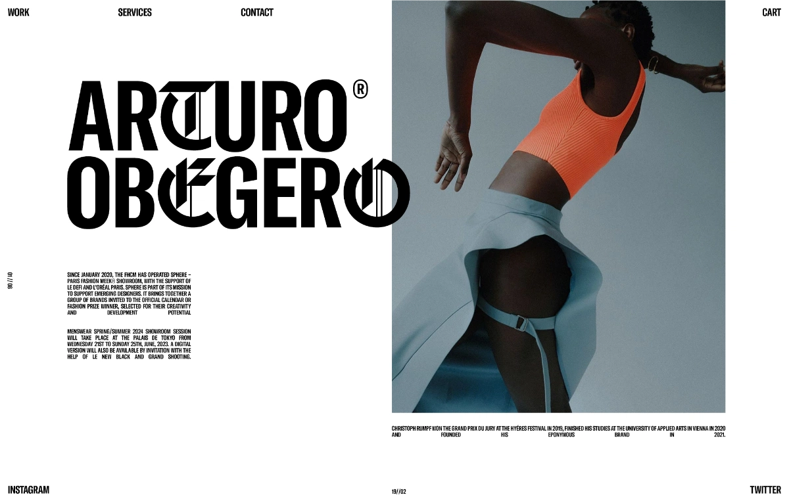

**Tags:** `elbow`, `joint`, `sleeve`, `thigh`, `font`, `sportswear`, `shorts`, `knee`, `waist`, `abdomen`, `undergarment`, `lingerie`, `underpants`

---

### 40. Item 40

- **Type:** InstagramElement
- **Source:** [https://www.instagram.com/p/C95BBxGMhsB/?igsh=d3doY2pzNjlxdW0x](https://www.instagram.com/p/C95BBxGMhsB/?igsh=d3doY2pzNjlxdW0x)
- **ID:** `1433540454`

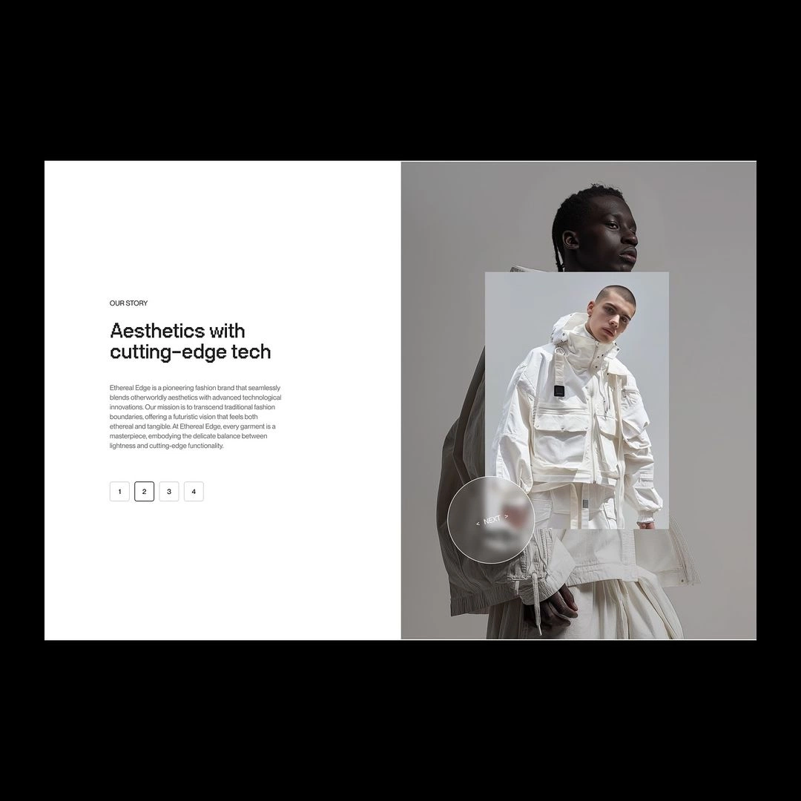

> <n>Ethereal Edge</n>, a conceptual e-commerce project by <n>Andrea Jelic</n> with UI animation by <n>Alex Tkachev</n>.

**Tags:** `gown`

---

### 41. Item 41

- **Type:** PinterestElement
- **Source:** [http://www.underconsideration.com/brandnew/archives/new_logo_and_identity_for_opera_australia_by_interbrand_sydney.php#.V7Nq4ZMrIUF](http://www.underconsideration.com/brandnew/archives/new_logo_and_identity_for_opera_australia_by_interbrand_sydney.php#.V7Nq4ZMrIUF)
- **ID:** `1084132440`

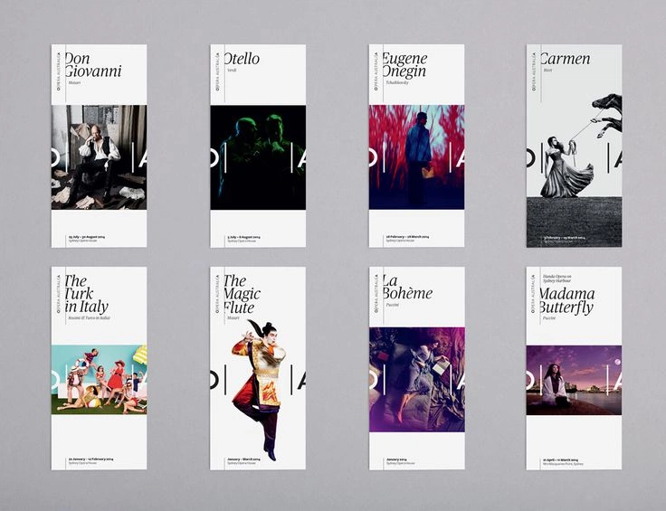

> Branding for the <n>Opera Australia</n> 2014 season, designed by <n>Interbrand</n>.

**Tags:** `sleeve`, `art`, `font`, `design`, `graphic design`, `sydney opera house`, `bookmark inspiration design`, `opera australia`

---

### 42. Item 42

- **Type:** Element
- **Source:** [https://www.are.na/block/1207298](https://www.are.na/block/1207298)
- **ID:** `1931783512`

> Layout from the book <n>Fotografisk utbildning Göteborg 50 år</n>, designed by <n>Julius Åsling</n>.

**Tags:** `font`, `material property`, `rectangle`, `line`, `photograph`, `design`, `graphic design`, `graphics`, `black`, `art`, `poster`

---

### 43. Item 43

- **Type:** InstagramElement
- **Source:** [https://www.instagram.com/p/C8B_cd7tMpE/?igsh=azc2NHYxM2trYmtm](https://www.instagram.com/p/C8B_cd7tMpE/?igsh=azc2NHYxM2trYmtm)
- **ID:** `806014220`

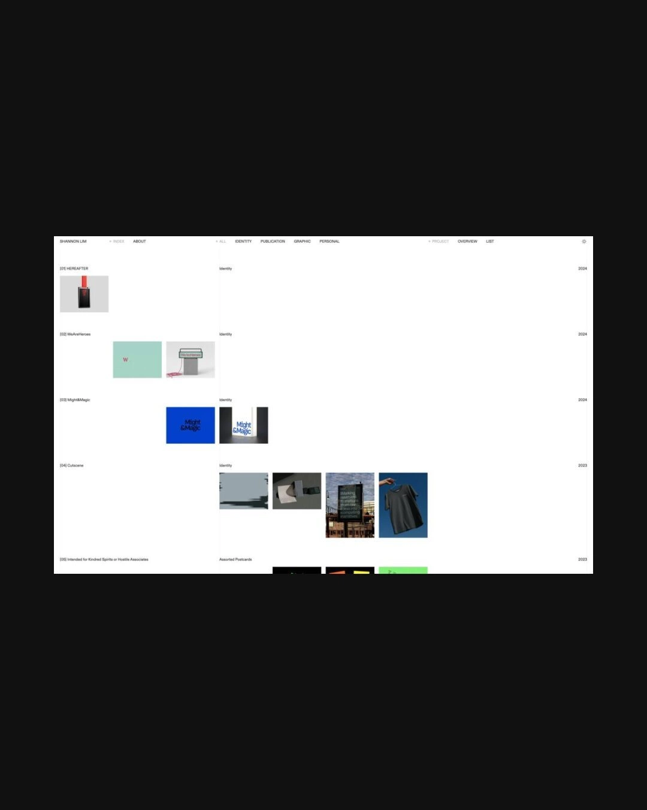

> Website for graphic designer <n>Shannon Lim</n>, designed and developed by <n>okok services</n>.

**Tags:** `screenshot`, `rectangle`, `font`

---

### 44. Item 44

- **Type:** InstagramElement
- **Source:** [https://www.instagram.com/p/CnwHqwMM6cF/](https://www.instagram.com/p/CnwHqwMM6cF/)
- **ID:** `288372681`

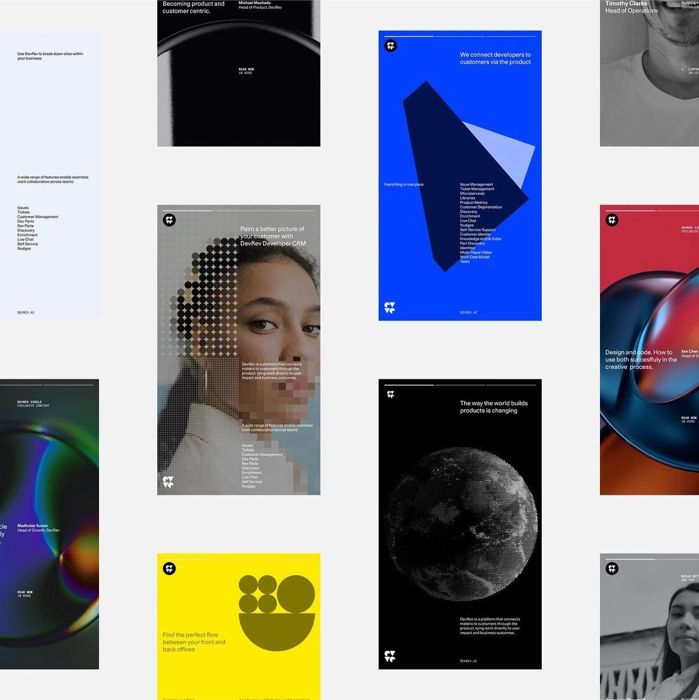

> <n>DevRev</n> brand identity by <n>Standard Projects</n>.

**Tags:** `devrev standard projects brand`, `photograph`, `light`, `product`, `black`, `font`

---

### 45. Item 45

- **Type:** InstagramElement
- **Source:** [https://www.instagram.com/p/C2_vvR8RU7L/?igsh=eHN5cDl5cDlkNWJs](https://www.instagram.com/p/C2_vvR8RU7L/?igsh=eHN5cDl5cDlkNWJs)
- **ID:** `201103168`

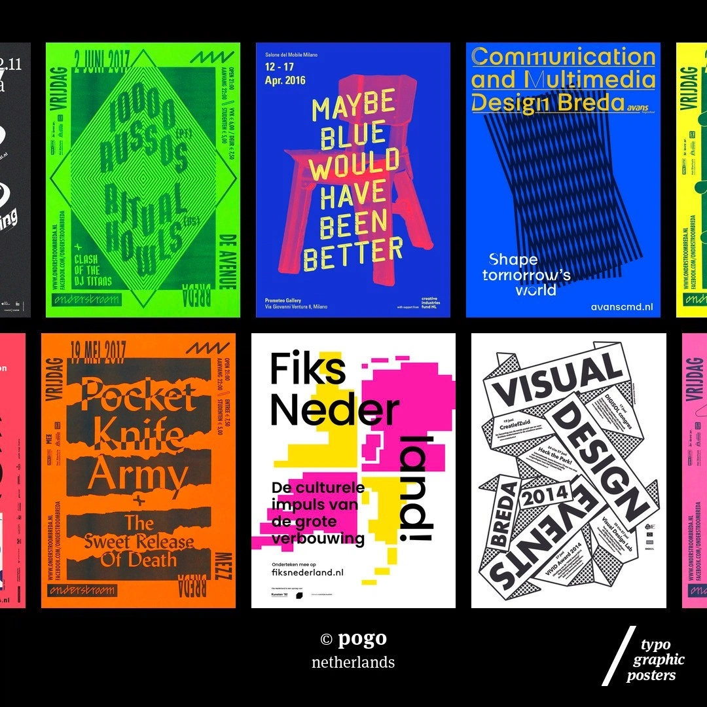

> A collection of posters by design studio <n>Pogo</n> for <n>Typographic Posters</n>.

**Tags:** `graphic design`, `rectangle`, `font`, `magenta`, `parallel`, `technology`

---

### 46. Item 46

- **Type:** Element
- **ID:** `1481009846`

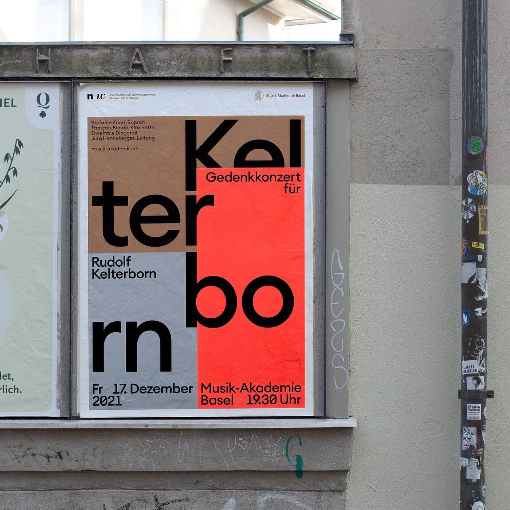

> Poster for a memorial concert for composer <n>Rudolf Kelterborn</n>, part of the <n>Sonic Space Basel</n> identity designed by <n>Martin Naumann</n>.

**Tags:** `window`, `poster`, `font`, `gas`, `rectangle`, `facade`, `fixture`, `typography`, `type directors club`

---

### 47. Item 47

- **Type:** PinterestElement
- **Source:** [http://www.andrewharris.tv/pinterest2/Graphic-Design-Posters/juliebayard2.jpg](http://www.andrewharris.tv/pinterest2/Graphic-Design-Posters/juliebayard2.jpg)
- **ID:** `1342257141`

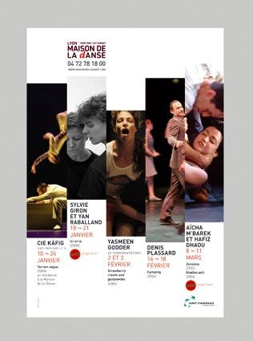

**Tags:** `gesture`, `sleeve`, `poster`, `font`, `product`, `design`, `graphic design`

---

### 48. Item 48

- **Type:** Element
- **ID:** `1528785280`

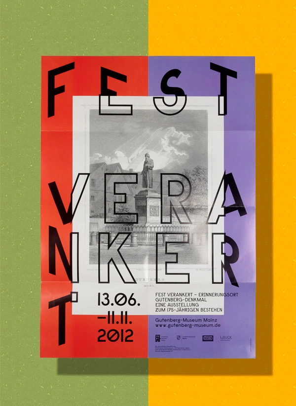

> Poster for the <n>Fest verankert</n> exhibition at the <n>Gutenberg-Museum Mainz</n> in 2012. Design by <n>Lauck</n>.

**Tags:** `poster`, `font`, `rectangle`

---

### 49. Item 49

- **Type:** InstagramElement
- **Source:** [https://www.instagram.com/p/Cs3WT5DARpp/](https://www.instagram.com/p/Cs3WT5DARpp/)
- **ID:** `1309981281`

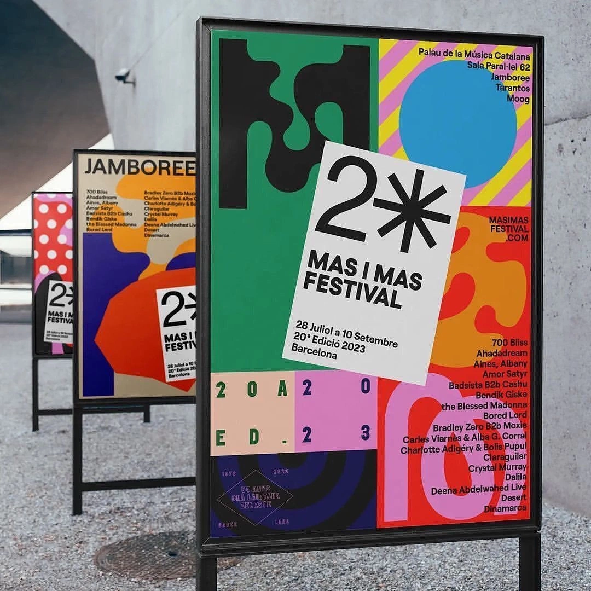

> Visual identity for the 2023 <n>Mas i Mas Festival</n> in Barcelona, designed by <n>Quim Marin</n>.

**Tags:** `poster`, `font`, `gas`, `signage`

---

### 50. Item 50

- **Type:** Element
- **Source:** [https://scontent.cdninstagram.com/v/t39.30808-6/408791229_18397670824031217_3124360356766187846_n.jpg?stp=dst-jpg_e35&efg=eyJ2ZW5jb2RlX3RhZyI6ImltYWdlX3VybGdlbi4xNDQweDE4MDAuc2RyIn0&_nc_ht=scontent.cdninstagram.com&_nc_cat=109&_nc_ohc=BuY54mQhdswAX8-Odln&edm=APs17CUAAAAA&ccb=7-5&ig_cache_key=MzI1NDQ3NDQ0MzczODc2MDM4OA==.2-ccb7-5&oh=00_AfCSdIW-RfnDyt0oqQl65EcUY0PzCu8qDYfzauXDwIKgxQ&oe=66069B13&_nc_sid=10d13b](https://scontent.cdninstagram.com/v/t39.30808-6/408791229_18397670824031217_3124360356766187846_n.jpg?stp=dst-jpg_e35&efg=eyJ2ZW5jb2RlX3RhZyI6ImltYWdlX3VybGdlbi4xNDQweDE4MDAuc2RyIn0&_nc_ht=scontent.cdninstagram.com&_nc_cat=109&_nc_ohc=BuY54mQhdswAX8-Odln&edm=APs17CUAAAAA&ccb=7-5&ig_cache_key=MzI1NDQ3NDQ0MzczODc2MDM4OA==.2-ccb7-5&oh=00_AfCSdIW-RfnDyt0oqQl65EcUY0PzCu8qDYfzauXDwIKgxQ&oe=66069B13&_nc_sid=10d13b)
- **ID:** `1001017971`

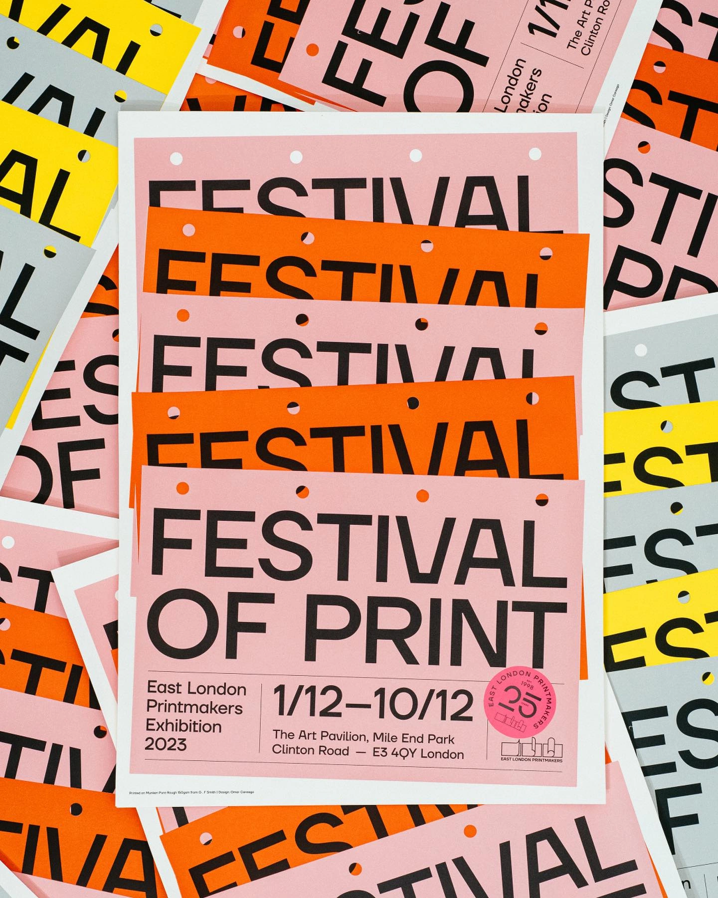

**Tags:** `poster`, `publication`, `font`, `material property`

---

### 51. Item 51

- **Type:** Element
- **ID:** `1922394677`

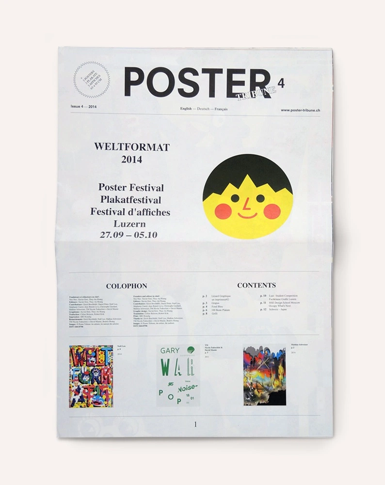

**Tags:** `poster`, `font`, `paper`, `true print`

---

### 52. Item 52

- **Type:** InstagramElement
- **Source:** [https://www.instagram.com/p/C3iDdgtO6vK/?igsh=MTlxOTB4amc2NjlwNQ==](https://www.instagram.com/p/C3iDdgtO6vK/?igsh=MTlxOTB4amc2NjlwNQ==)
- **ID:** `1460595588`

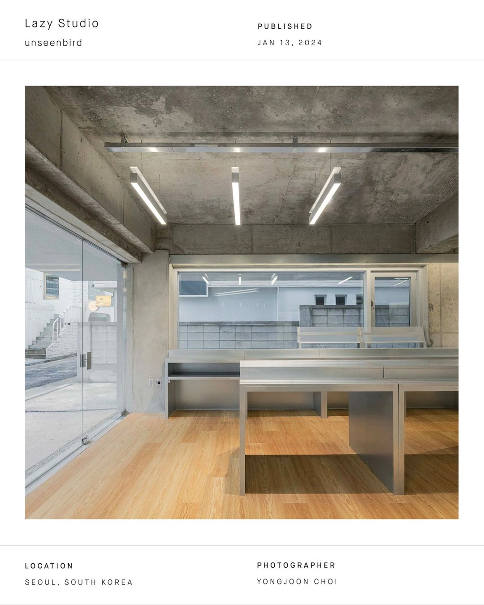

> <n>Lazy Studio</n> in Seoul, designed by <n>unseenbird</n>. Photo by <n>Yongjoon Choi</n>.

**Tags:** `floor`, `leibal`, `interior design`, `building`, `countertop`, `rectangle`, `wood`, `flooring`, `ceiling`

---

### 53. Item 53

- **Type:** Element
- **ID:** `685727915`

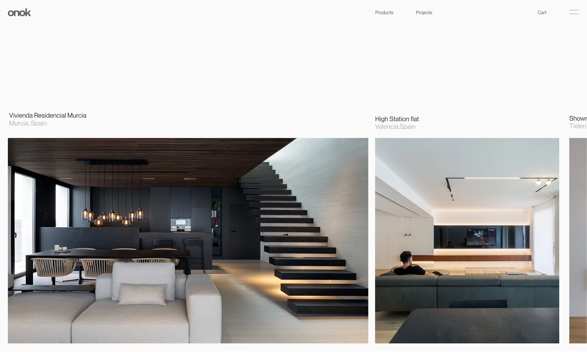

> The <n>House in Murcia</n> designed by <n>Manuel García Asociados</n>, photographed by <n>Diego Opazo</n>.

**Tags:** `building`, `architecture`, `wood`, `line`, `interior design`, `floor`, `flooring`, `furniture`, `fixture`, `stairs`, `residential building`

---

### 54. Item 54

- **Type:** Element
- **Source:** [https://dribbble.com/shots/21027240-Fashion-Layout-Exploration](https://dribbble.com/shots/21027240-Fashion-Layout-Exploration)
- **ID:** `187178754`

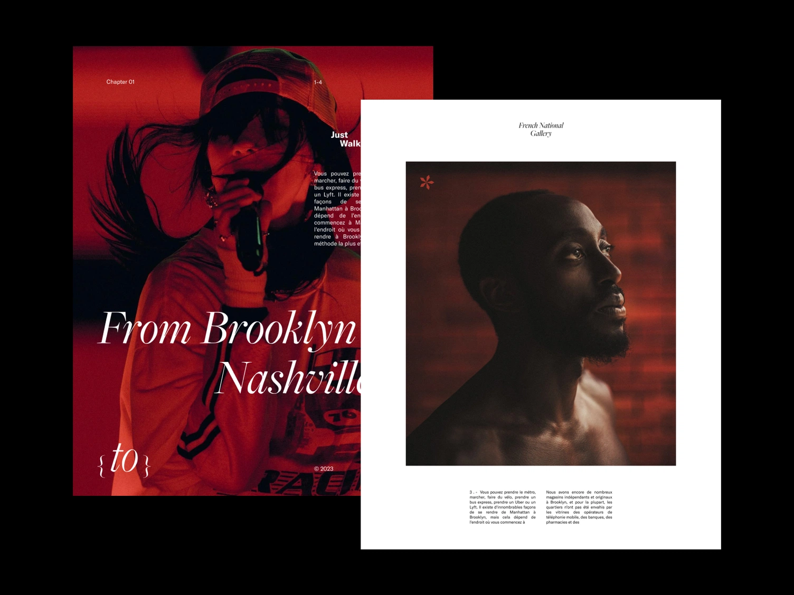

**Tags:** `fashion`, `art`, `poster`, `font`

---

### 55. Item 55

- **Type:** Element
- **ID:** `1132557521`

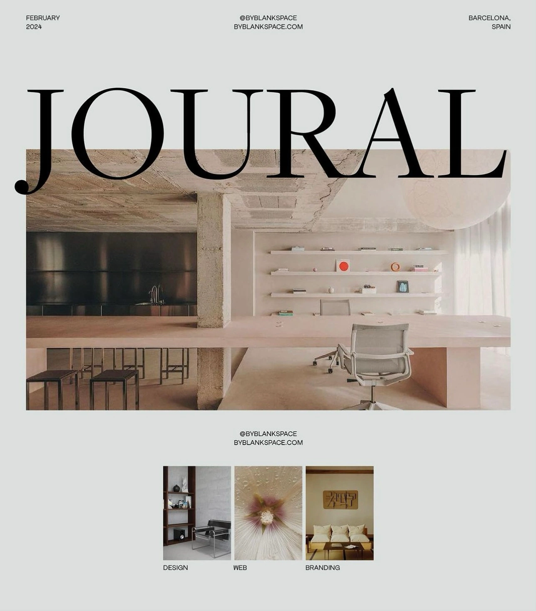

**Tags:** `table`, `building`, `house`, `wood`, `font`, `material property`, `product`, `interior design`, `floor`, `chair`, `furniture`

---

### 56. Item 56

- **Type:** Element
- **Source:** [https://www.pinterest.de/pin/979321881455634447/](https://www.pinterest.de/pin/979321881455634447/)
- **ID:** `821901599`

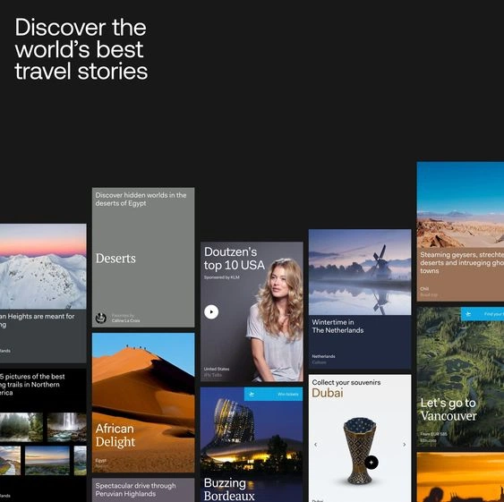

**Tags:** `font`, `product`, `screenshot`, `technology`, `display advertising`

---

### 57. Item 57

- **Type:** Element
- **Source:** [wozber.com/en-us/services](wozber.com/en-us/services)
- **ID:** `727438627`

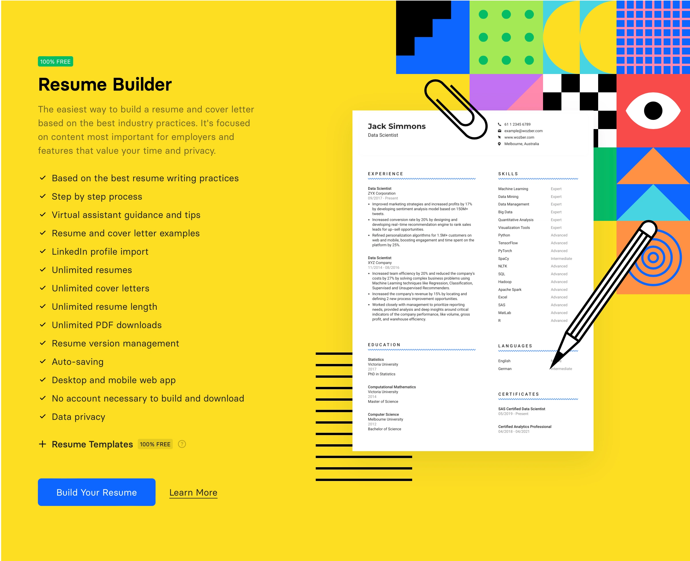

**Tags:** `font`, `parallel`, `brochure`

---

### 58. Item 58

- **Type:** PinterestElement
- **Source:** [https://www.pinterest.com/pin/883620389381032862/](https://www.pinterest.com/pin/883620389381032862/)
- **ID:** `423931649`

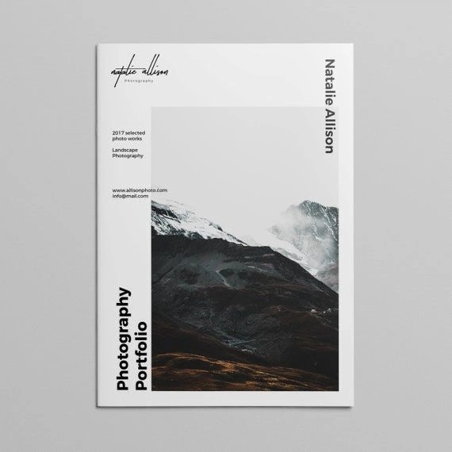

> A <n>Minimalist Photography Portfolio Template</n> designed by the studio <n>Egotype</n>.

**Tags:** `font`, `mountain`, `slope`, `design`, `photography`, `artist's portfolio`, `photography portfolio cover`

---

### 59. Item 59

- **Type:** PinterestElement
- **Source:** [https://www.pinterest.com/pin/883620389379944655/](https://www.pinterest.com/pin/883620389379944655/)
- **ID:** `485693004`

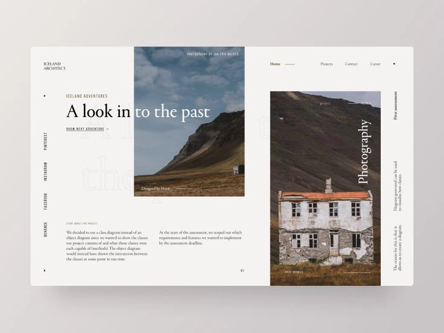

**Tags:** `building`, `landscape`, `architecture`, `font`, `landmark`, `slope`, `design`, `website`, `web design`

---

### 60. Item 60

- **Type:** PinterestElement
- **Source:** [https://dribbble.com/shots/5020857-Photography-Pageload](https://dribbble.com/shots/5020857-Photography-Pageload)
- **ID:** `553631107`

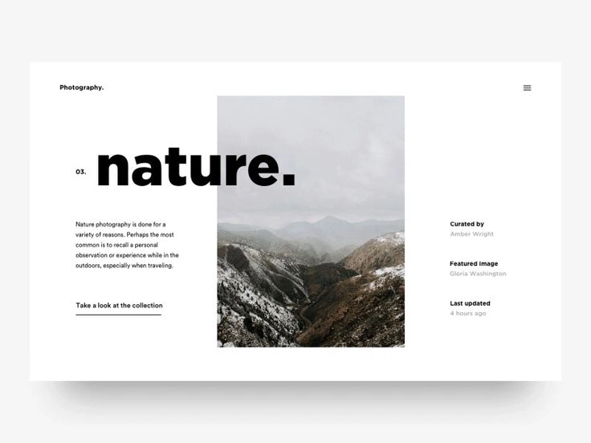

> UI concept for a nature photography page curated by <n>Amber Wright</n> with a photo by <n>Gloria Washington</n>.

**Tags:** `natural landscape`, `font`, `slope`, `design`, `brochure`

---

### 61. Item 61

- **Type:** Element
- **Source:** [https://savee.it/i/dqn_wZ-/](https://savee.it/i/dqn_wZ-/)
- **ID:** `1114249186`

> UI design for the <n>By Two Creatives Platform</n> by <n>Zhenya Rynzhuk</n>, featuring stylist <n>Martina Almquist</n>.

**Tags:** `flash photography`, `sleeve`, `font`, `eyelash`, `makeover`, `website`

---

### 62. Item 62

- **Type:** PinterestElement
- **Source:** [https://dribbble.com/shots/6861839-Realtor-s-Profile](https://dribbble.com/shots/6861839-Realtor-s-Profile)
- **ID:** `1808975130`

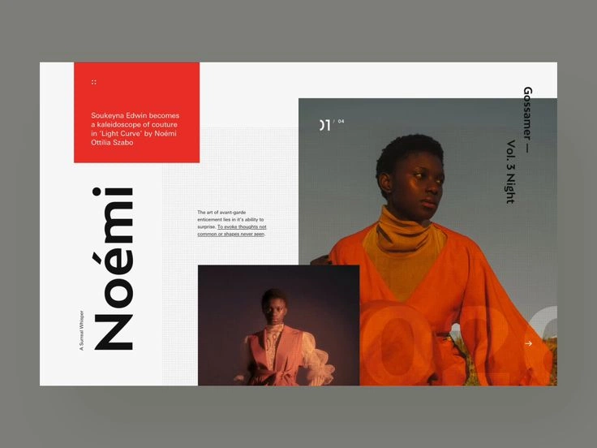

> A layout from <n>Gossamer Vol. 3 Night</n> by <n>Noémi Ottilia Szabo</n>.

**Tags:** `sleeve`, `font`, `design`

---

### 63. Item 63

- **Type:** Element
- **Source:** [https://www.are.na/block/4530422](https://www.are.na/block/4530422)
- **ID:** `2107870530`

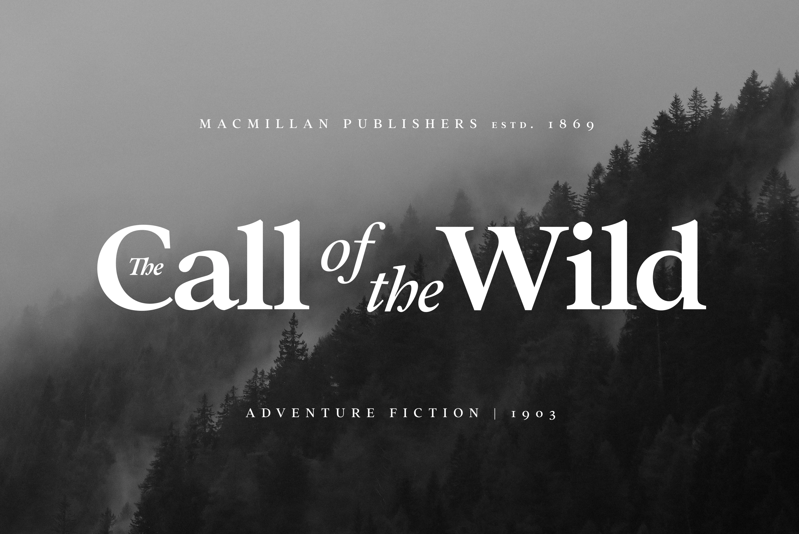

**Tags:** `happy`, `natural landscape`, `tree`, `landscape`, `font`, `terrestrial plant`, `monochrome photography`

---

### 64. Item 64

- **Type:** Element
- **ID:** `663112973`

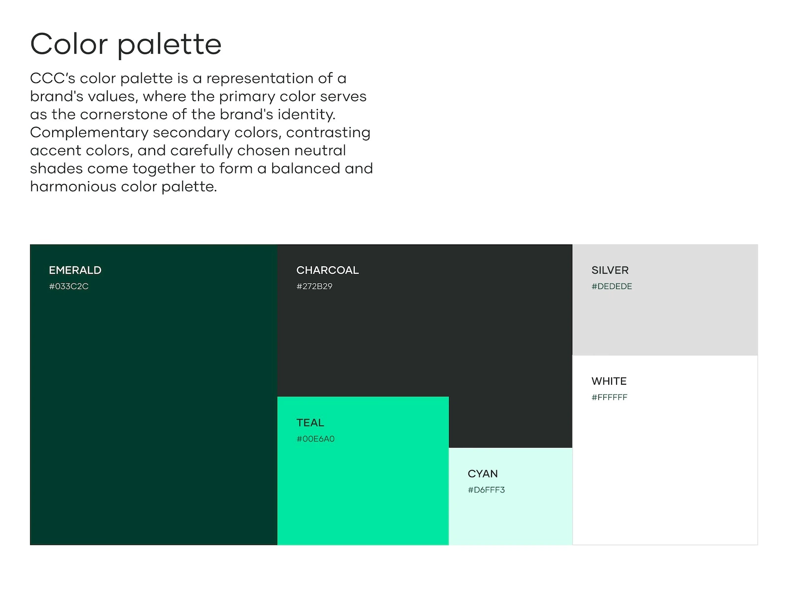

**Tags:** `font`, `rectangle`, `slope`, `diagram`

---

### 65. Item 65

- **Type:** VideoElement
- **ID:** `unknown-65`

---

### 66. Item 66

- **Type:** VideoElement
- **ID:** `unknown-66`

---

### 67. Item 67

- **Type:** InstagramElement
- **Source:** [https://www.instagram.com/p/C5EXi10K-ey/?igsh=MWt4MnUxdG52dnJnMA==](https://www.instagram.com/p/C5EXi10K-ey/?igsh=MWt4MnUxdG52dnJnMA==)
- **ID:** `1099805651`

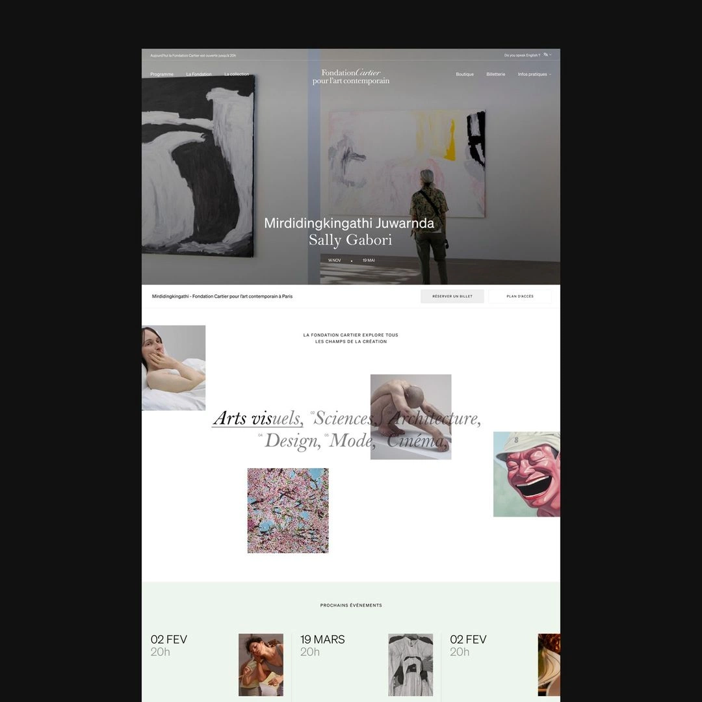

> Website design exploration for <n>Fondation Cartier pour l'art contemporain</n> by <n>Index</n>.

**Tags:** `screenshot`, `product`, `sleeve`, `font`, `material property`

---

### 68. Item 68

- **Type:** Element
- **ID:** `1105784899`

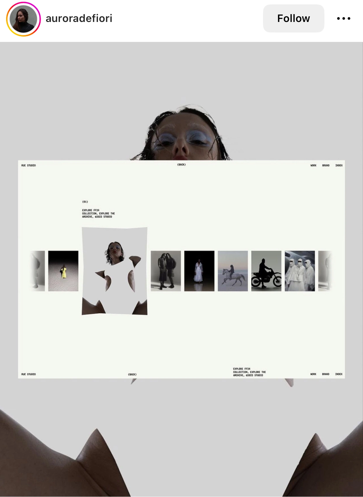

**Tags:** `screenshot`, `product`, `font`, `material property`

---

### 69. Item 69

- **Type:** Element
- **Source:** [https://savee.it/i/U_oWOZ4/](https://savee.it/i/U_oWOZ4/)
- **ID:** `1639145692`

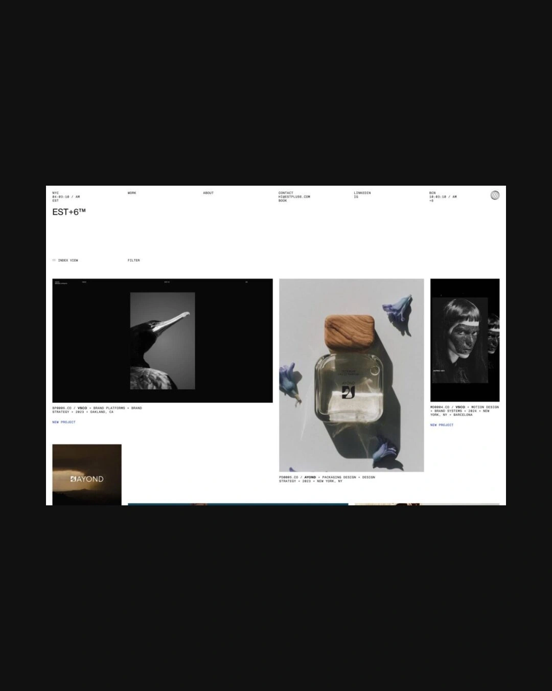

**Tags:** `screenshot`, `font`, `gadget`, `multimedia`, `electronic device`

---

### 70. Item 70

- **Type:** InstagramElement
- **Source:** [https://www.instagram.com/p/C27uRu8Rw9Y/?igsh=MW9lM2JmbW1hanB1cg==](https://www.instagram.com/p/C27uRu8Rw9Y/?igsh=MW9lM2JmbW1hanB1cg==)
- **ID:** `1487430100`

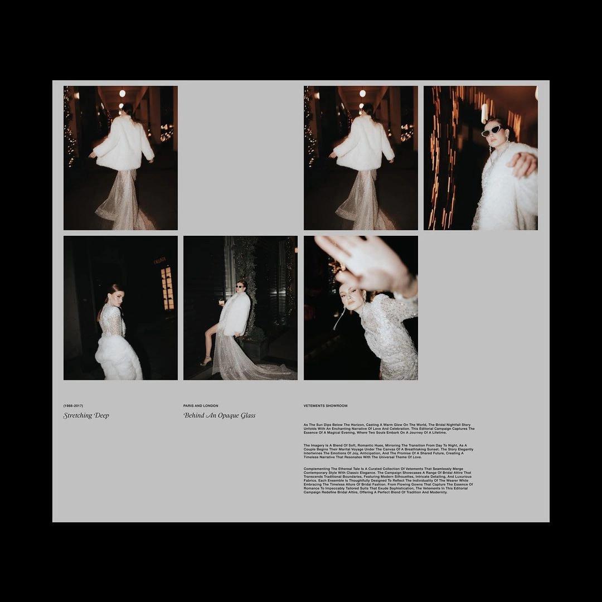

> Editorial layout for a <n>Vetements</n> bridal collection. Graphic by <n>Ellwed</n>.

**Tags:** `photograph`, `hand`, `arm`, `white`, `human body`, `flash photography`, `neck`, `textile`, `sleeve`

---

### 71. Miranda — Paper Portfolio

- **Type:** ArticleElement
- **Source:** [https://www.niccolomiranda.com/](https://www.niccolomiranda.com/)
- **ID:** `1711230311`

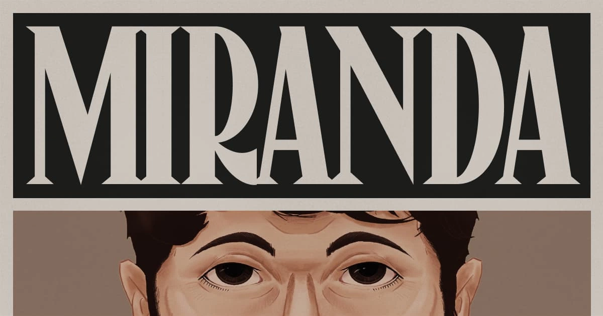

**Tags:** `wood`, `font`, `eyelash`, `eye`, `cartoon`, `human behavior`

---

### 72. CHECK IN : 7800 MILES AWAY

- **Type:** ArticleElement
- **Source:** [https://timecapsule.co.in/articlepage/check-in-7800-miles-away](https://timecapsule.co.in/articlepage/check-in-7800-miles-away)
- **ID:** `329841850`

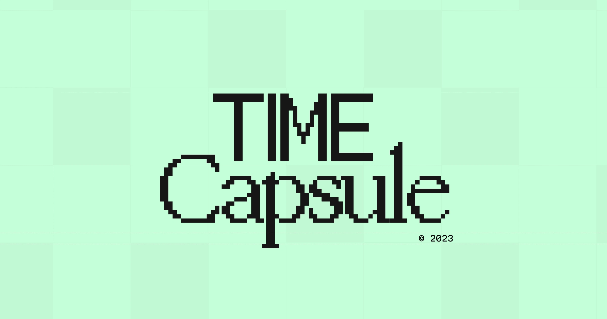

**Tags:** `diagram`

---

### 73. Netflix Queue | Official Site

- **Type:** ArticleElement
- **Source:** [https://netflixqueue.com/](https://netflixqueue.com/)
- **ID:** `193690459`

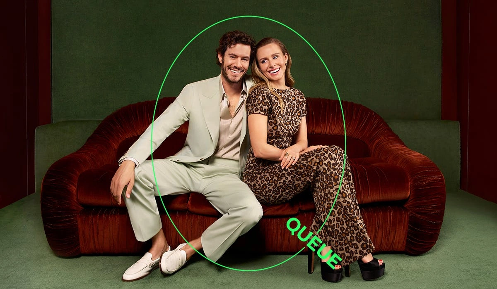

**Tags:** `studio couch`, `azazel jacobs`, `kitty menendez`, `his three daughters`

---

### 74. Zachary Hamed - Building Clay, Previously Goldman Sachs Marquee | Forbes 30 Under 30 | Harvard

- **Type:** ArticleElement
- **Source:** [https://zmh.org/](https://zmh.org/)
- **ID:** `879772513`

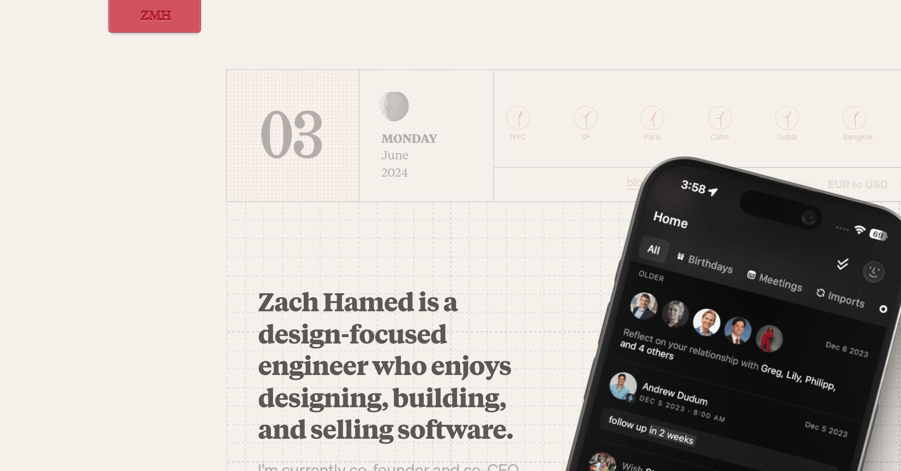

**Tags:** `smartphone`, `communication device`, `mobile phone`, `portable communications device`, `gesture`, `mobile device`, `gadget`, `font`

---

### 75. Visions - A Literary Science Fiction Magazine

- **Type:** ArticleElement
- **Source:** [https://www.readvisions.com/](https://www.readvisions.com/)
- **ID:** `2127981698`

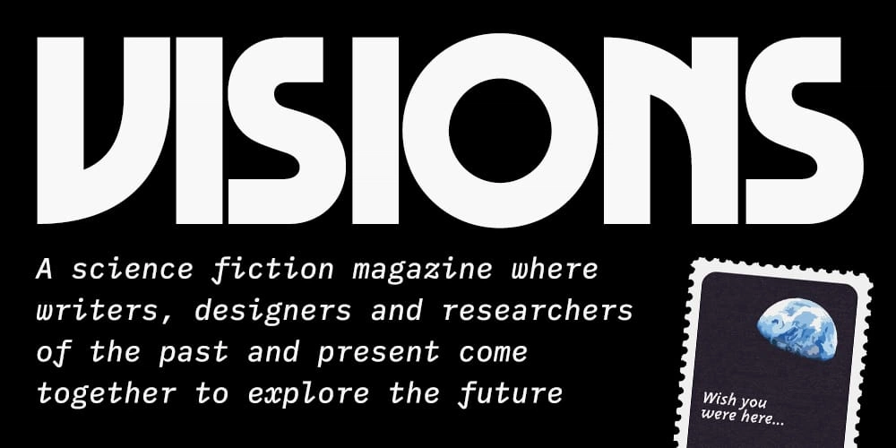

**Tags:** `font`, `graphic design`

---

### 76. Home

- **Type:** ArticleElement
- **Source:** [https://www.handwrytten.com/](https://www.handwrytten.com/)
- **ID:** `887056900`

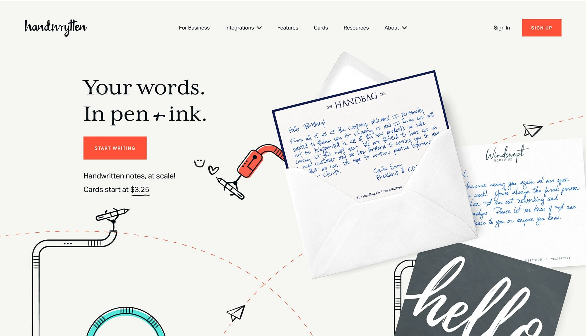

> The homepage for <n>Handwrytten</n>, a handwritten notes service.

**Tags:** `handwritten website`, `handwriting`, `product`, `font`, `line`, `parallel`, `slope`

---

### 77. Item 77

- **Type:** Element
- **ID:** `1282978297`

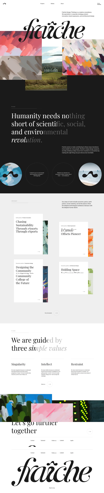

**Tags:** `font`, `material property`, `product`, `lighting`, `light`, `screenshot`, `technology`, `graphic design`

---

### 78. Item 78

- **Type:** Element
- **Source:** [https://savee.it/i/NPA2ttn/](https://savee.it/i/NPA2ttn/)
- **ID:** `1024054767`

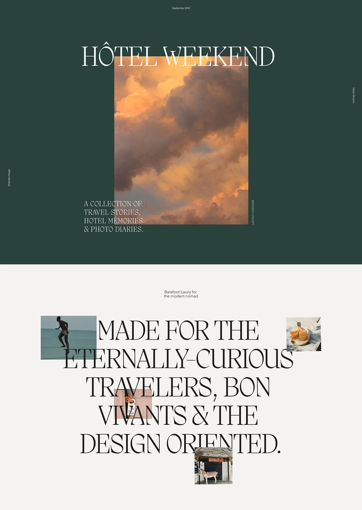

**Tags:** `cloud`, `sky`, `font`

---

### 79. Item 79

- **Type:** Element
- **ID:** `2039751201`

> <n>Sideboard 2020</n>, a compilation of graphic design projects by the studio <n>Sidebay</n>.

**Tags:** `property`, `poster`, `publication`, `font`, `material property`, `product`

---

### 80. Found on Cosmos

- **Type:** ArticleElement
- **Source:** [http://www.cosmos.so/e/1037969119](http://www.cosmos.so/e/1037969119)
- **ID:** `698909213`

**Tags:** `neck`, `head`, `jaw`, `art`, `poster`, `lip`, `forehead`, `cheek`, `chin`, `eyebrow`, `eyelash`, `eye`, `headgear`, `nose`

---

### 81. Item 81

- **Type:** PinterestElement
- **Source:** [https://www.behance.net/gallery/16861787/Spare-Change-News](https://www.behance.net/gallery/16861787/Spare-Change-News)
- **ID:** `731784652`

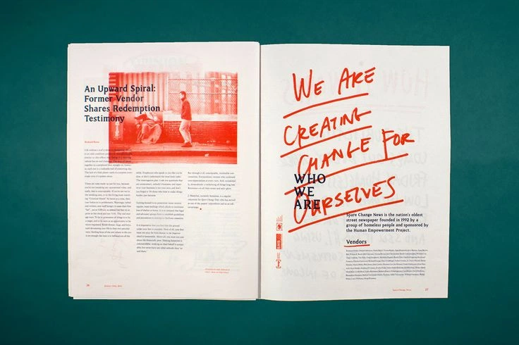

**Tags:** `publication`, `font`, `book`, `graphic design`

---

### 82. Item 82

- **Type:** PinterestElement
- **Source:** [https://www.behance.net/gallery/84749885/Mulher-do-Fim-do-Mundo-Matria-Editorial](https://www.behance.net/gallery/84749885/Mulher-do-Fim-do-Mundo-Matria-Editorial)
- **ID:** `1283934425`

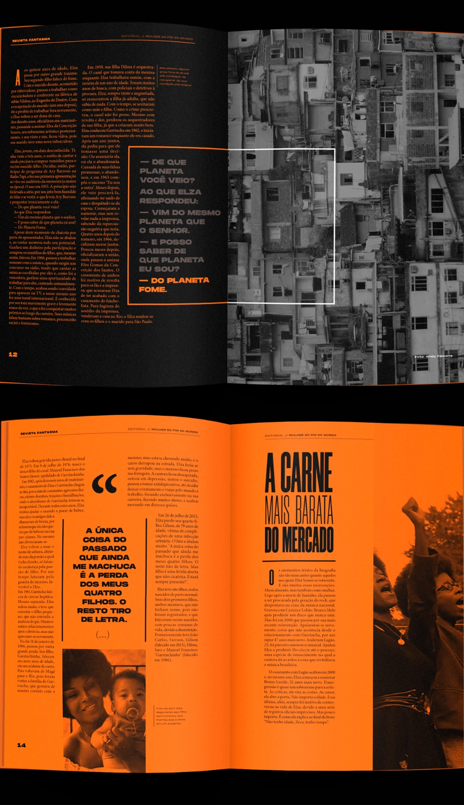

**Tags:** `flyer`, `design`, `magazine`, `news design`

---

### 83. Item 83

- **Type:** Element
- **Source:** [https://savee.it/i/CFupslb/](https://savee.it/i/CFupslb/)
- **ID:** `1271963991`

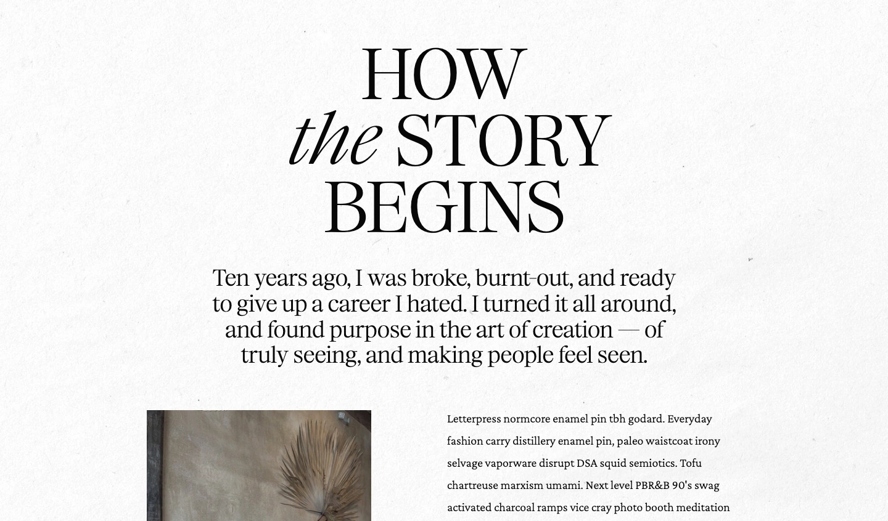

**Tags:** `font`, `video insight`

---

### 84. Item 84

- **Type:** PinterestElement
- **Source:** [https://creativemarket.com/blog/recreate-the-look-80s-editorial](https://creativemarket.com/blog/recreate-the-look-80s-editorial)
- **ID:** `302326942`

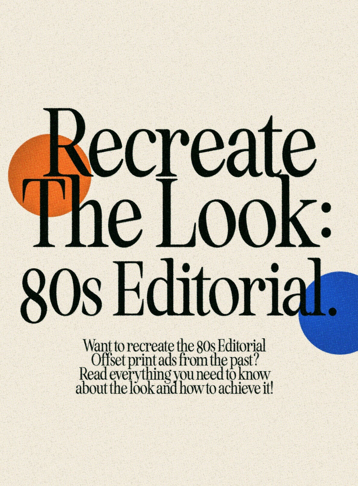

**Tags:** `poster`, `font`

---

### 85. Item 85

- **Type:** PinterestElement
- **Source:** [https://www.behance.net/gallery/43029905/Editorial-illustrations](https://www.behance.net/gallery/43029905/Editorial-illustrations)
- **ID:** `244949861`

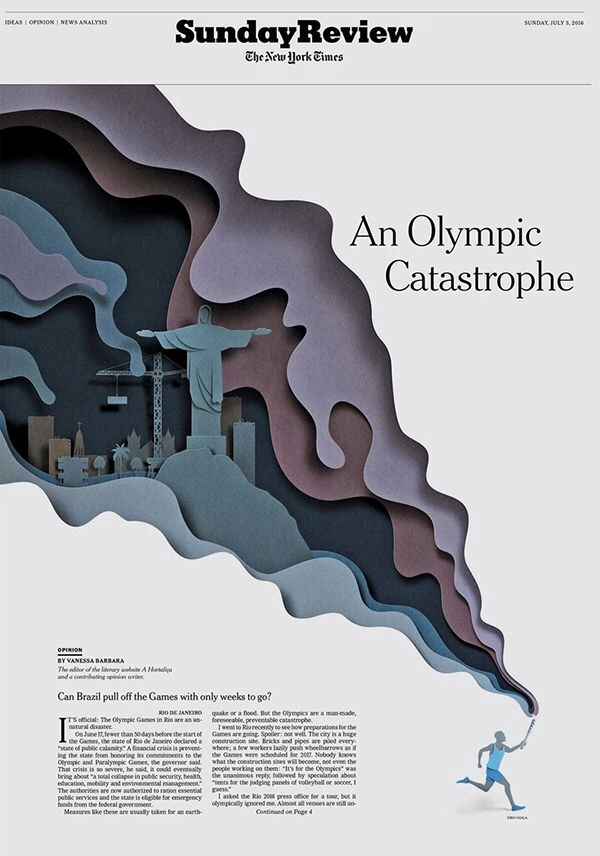

> Illustration by <n>Eiko Ojala</n> for <n>The New York Times</n> cover story '<n>An Olympic Catastrophe</n>', published in 2016.

**Tags:** `magazine editorial illustration`, `illustration`, `font`, `slope`

---

### 86. Item 86

- **Type:** Element
- **ID:** `482670808`

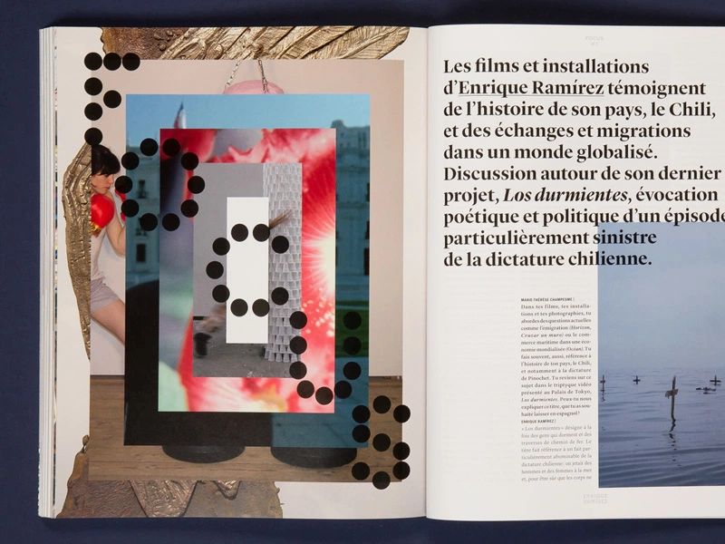

> Spread from <n>Palais de Tokyo, magazine n°20</n> on <n>Enrique Ramírez</n>'s project <n>Los durmientes</n>. Design by <n>Helmo</n>.

**Tags:** `art`, `publication`, `font`, `book`, `rectangle`, `design`, `palais de tokyo`

---

### 87. Item 87

- **Type:** PinterestElement
- **Source:** [https://www.pinterest.com/pin/673991900499457931](https://www.pinterest.com/pin/673991900499457931)
- **ID:** `442279039`

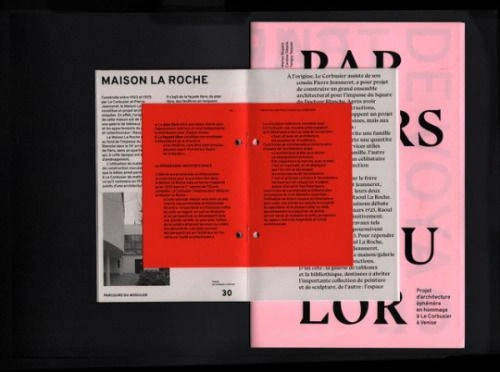

**Tags:** `publication`, `font`, `material property`, `design`, `graphic design`, `book design`, `editorial`, `objet editorial`

---

### 88. Item 88

- **Type:** InstagramElement
- **Source:** [https://www.instagram.com/p/C8y0iHStKyQ/?igsh=MWNncXhxdGZyZG1sZQ==](https://www.instagram.com/p/C8y0iHStKyQ/?igsh=MWNncXhxdGZyZG1sZQ==)
- **ID:** `289851623`

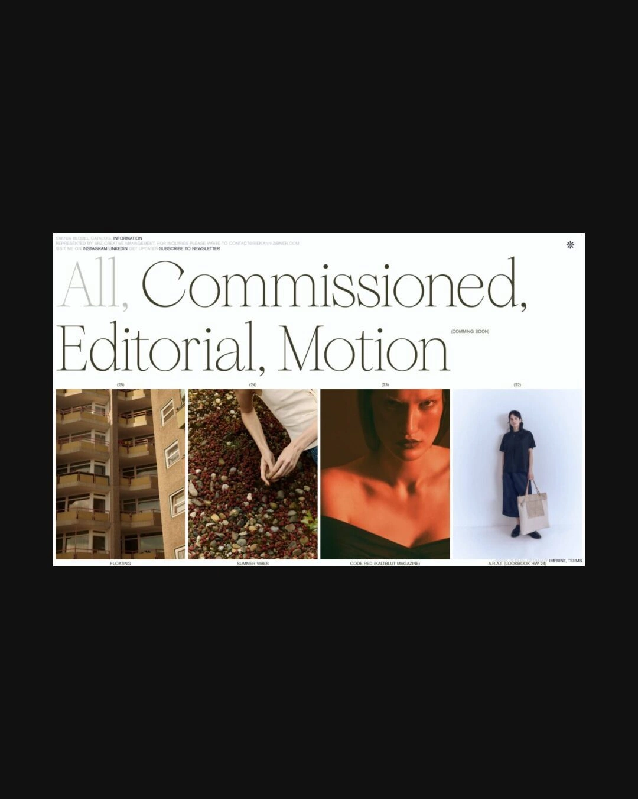

> Website for photographer <n>Svenja Blobel</n>, designed by <n>Daniel Janßen</n> and developed by <n>Gestalter Haus</n>.

**Tags:** `girl`, `world`, `font`

---

### 89. Aesthetic Summer Travel Presentation - Templates by Canva

- **Type:** ArticleElement
- **Source:** [https://www.canva.com/templates/EAGHReVdVNk-aesthetic-summer-travel-presentation/](https://www.canva.com/templates/EAGHReVdVNk-aesthetic-summer-travel-presentation/)
- **ID:** `85034291`

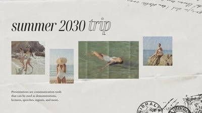

**Tags:** `paper`

---

### 90. Item 90

- **Type:** InstagramElement
- **Source:** [https://www.instagram.com/p/B0_gRPGCGLg/?igsh=a3NpN2gzYjR2cWxl](https://www.instagram.com/p/B0_gRPGCGLg/?igsh=a3NpN2gzYjR2cWxl)
- **ID:** `193937048`

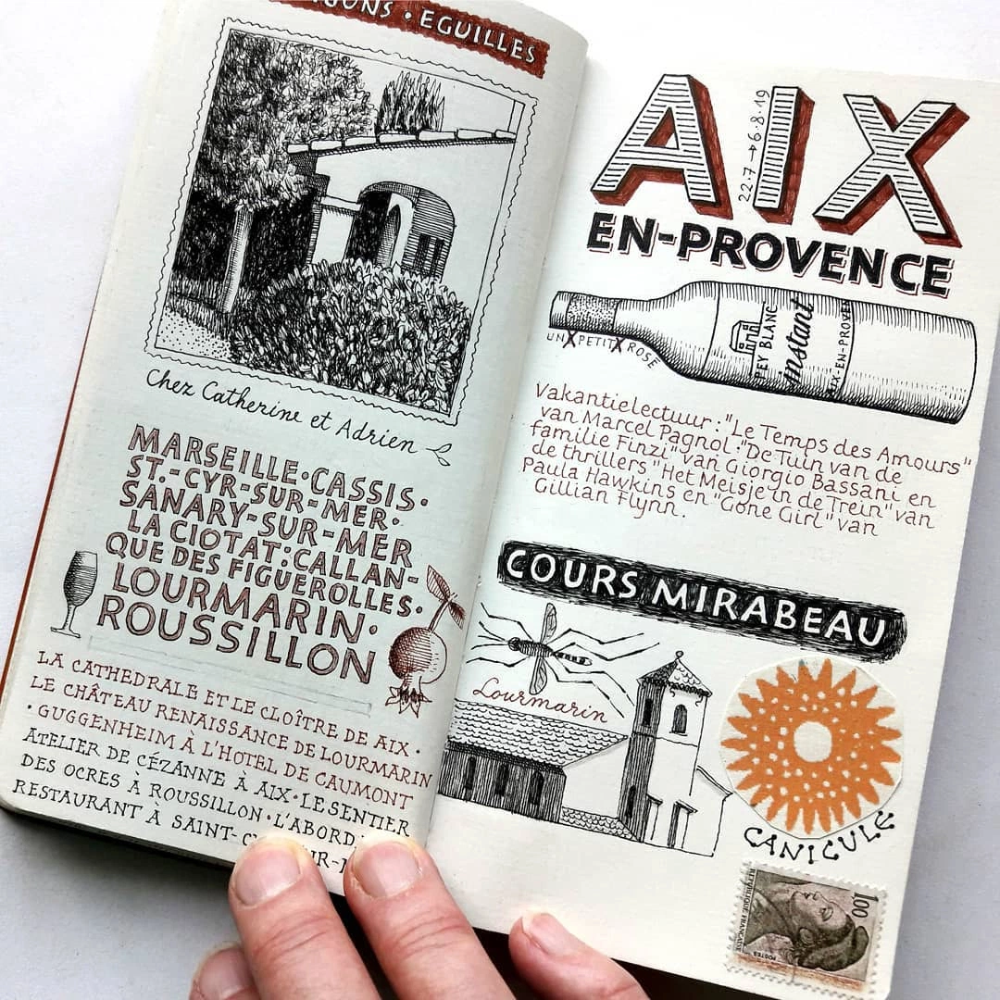

> An illustrated travel diary page detailing a trip to <n>Aix-en-Provence</n> and <n>Cours Mirabeau</n> in France.

**Tags:** `document`

---

### 91. Item 91

- **Type:** InstagramElement
- **Source:** [https://www.instagram.com/p/C8KJRYUJOG7/?igsh=dm1iNTRic3VoZnJj](https://www.instagram.com/p/C8KJRYUJOG7/?igsh=dm1iNTRic3VoZnJj)
- **ID:** `2068192718`

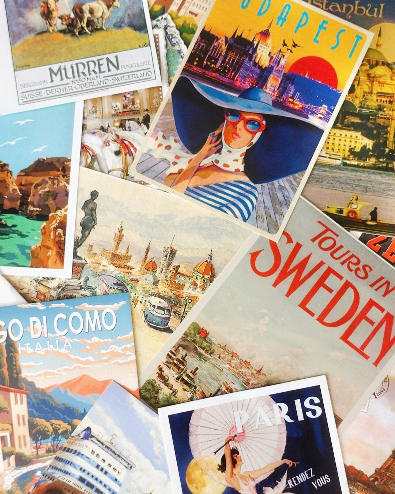

> A collection of European <n>travel notes</n> by <n>Aimee</n>.

**Tags:** `flyer`

---

### 92. Item 92

- **Type:** InstagramElement
- **Source:** [https://www.instagram.com/p/DAil6Z1iL74/?igsh=c3lvNWk2YTdjeWIz](https://www.instagram.com/p/DAil6Z1iL74/?igsh=c3lvNWk2YTdjeWIz)
- **ID:** `1725745786`

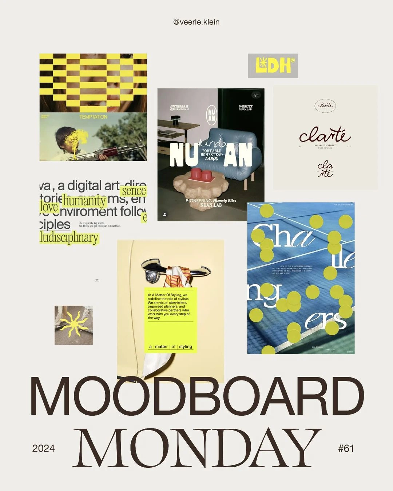

**Tags:** `flyer`

---

### 93. Item 93

- **Type:** InstagramElement
- **Source:** [https://www.instagram.com/p/CpxOxuVom1d/?igsh=NXU5cDQwbHZ3NnE4](https://www.instagram.com/p/CpxOxuVom1d/?igsh=NXU5cDQwbHZ3NnE4)
- **ID:** `737353034`

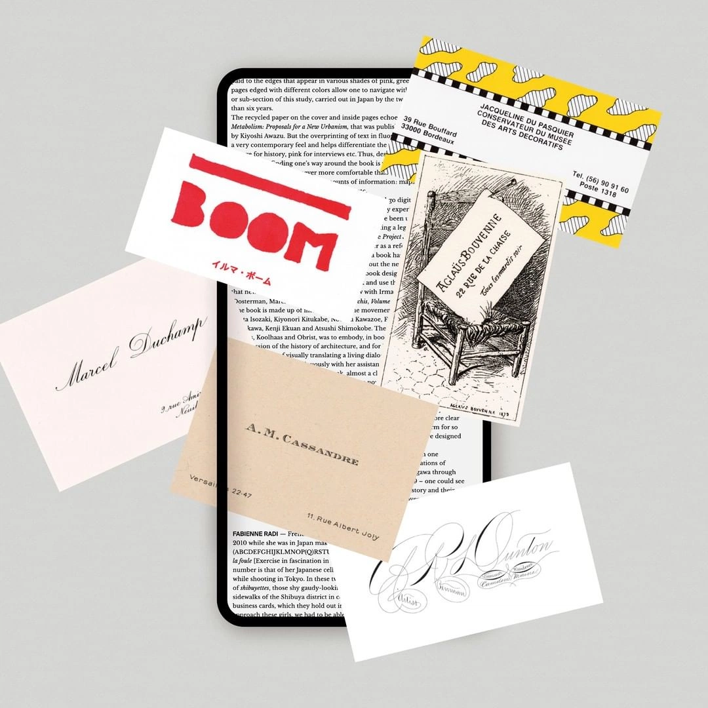

**Tags:** `document`

---

### 94. Item 94

- **Type:** InstagramElement
- **Source:** [https://www.instagram.com/p/C2dMwv4ofIq/?igsh=YjNmOWFlOHVlaDA0](https://www.instagram.com/p/C2dMwv4ofIq/?igsh=YjNmOWFlOHVlaDA0)
- **ID:** `837281883`

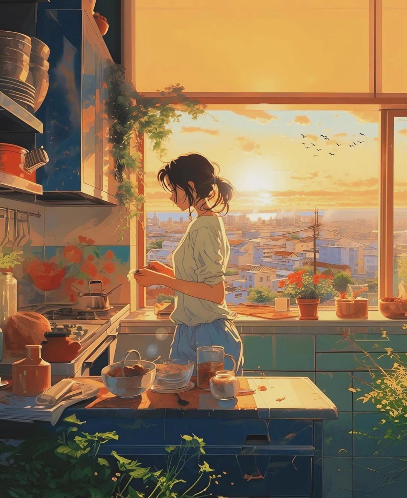

> Digital illustration by <n>Steve Schütz</n>.

**Tags:** `painting`, `plant`, `orange`, `flowerpot`, `table`, `art`, `tints and shades`, `paint`, `leisure`

---

### 95. Item 95

- **Type:** InstagramElement
- **Source:** [https://www.instagram.com/p/C0UgCjuIDf1/](https://www.instagram.com/p/C0UgCjuIDf1/)
- **ID:** `1947283289`

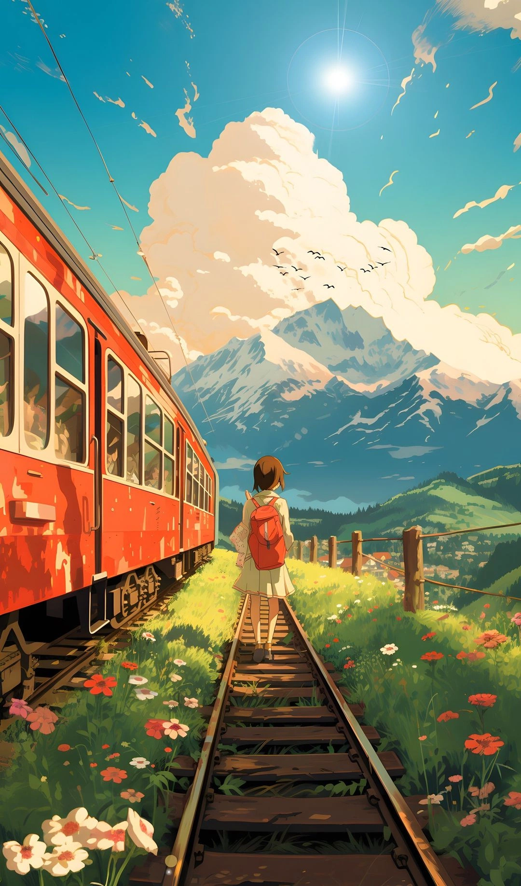

**Tags:** `sky`, `train`, `plant`, `cloud`, `vehicle`, `mountain`, `world`, `nature`

---

### 96. Item 96

- **Type:** InstagramElement
- **Source:** [https://www.instagram.com/p/CZHubPEuA5a/?utm_medium=copy_link](https://www.instagram.com/p/CZHubPEuA5a/?utm_medium=copy_link)
- **ID:** `1903857666`

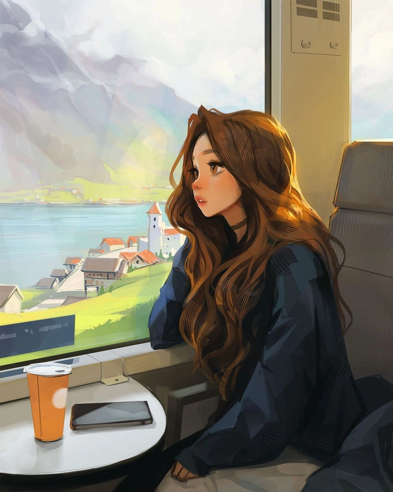

> Digital illustration <n>Travelling</n> by artist <n>Sam Yang</n>.

**Tags:** `table`, `travel`, `art`, `automotive design`, `comfort`, `painting`, `paint`, `tableware`, `illustration`, `sketch`

---

### 97. Item 97

- **Type:** PinterestElement
- **Source:** [https://www.behance.net/gallery/82854063/Molodist-Kyiv-International-Film-Festival](https://www.behance.net/gallery/82854063/Molodist-Kyiv-International-Film-Festival)
- **ID:** `1468754451`

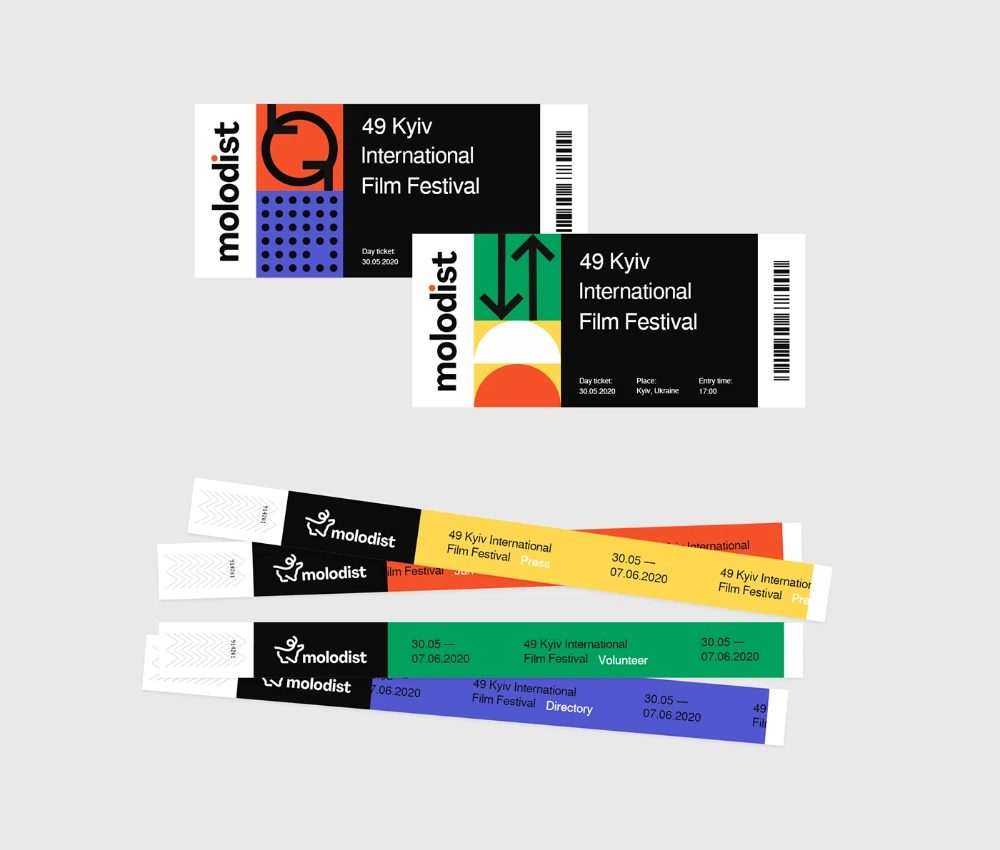

**Tags:** `graphic design`, `design`, `graphics`, `behance`, `festival`

---

### 98. Item 98

- **Type:** VideoElement
- **ID:** `unknown-98`

---

### 99. Item 99

- **Type:** InstagramElement
- **Source:** [https://www.instagram.com/p/CEYketrhqds/?img_index=3&igshid=M2M3YTNlMTQ4MA==](https://www.instagram.com/p/CEYketrhqds/?img_index=3&igshid=M2M3YTNlMTQ4MA==)
- **ID:** `2078147793`

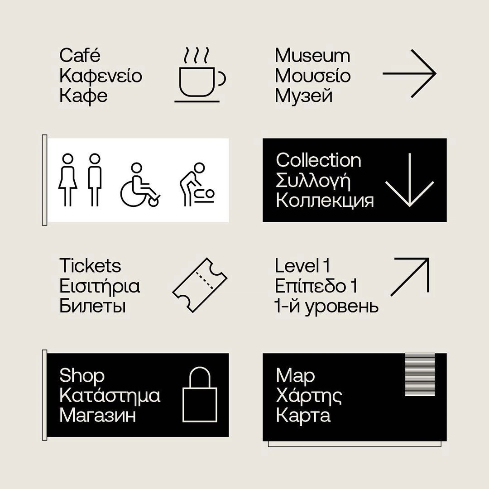

> A demonstration of the <n>Aeonik Pro</n> typeface by <n>Co-Type Foundry</n>.

**Tags:** `diagram`, `font`, `rectangle`, `parallel`

---

### 100. Item 100

- **Type:** PinterestElement
- **Source:** [https://www.pinterest.it/pin/351912464409153/](https://www.pinterest.it/pin/351912464409153/)
- **ID:** `289369261`

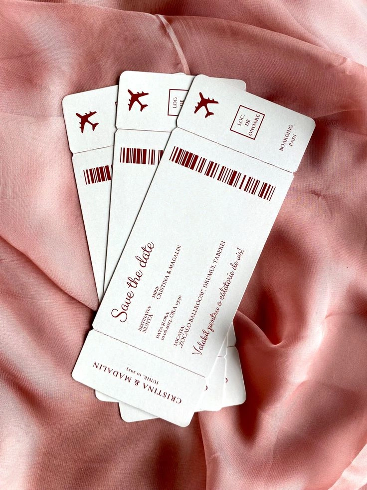

**Tags:** `hand`, `finger`, `thumb`, `font`, `material property`, `nail`, `product`

---

### 101. Item 101

- **Type:** Element
- **ID:** `534820572`

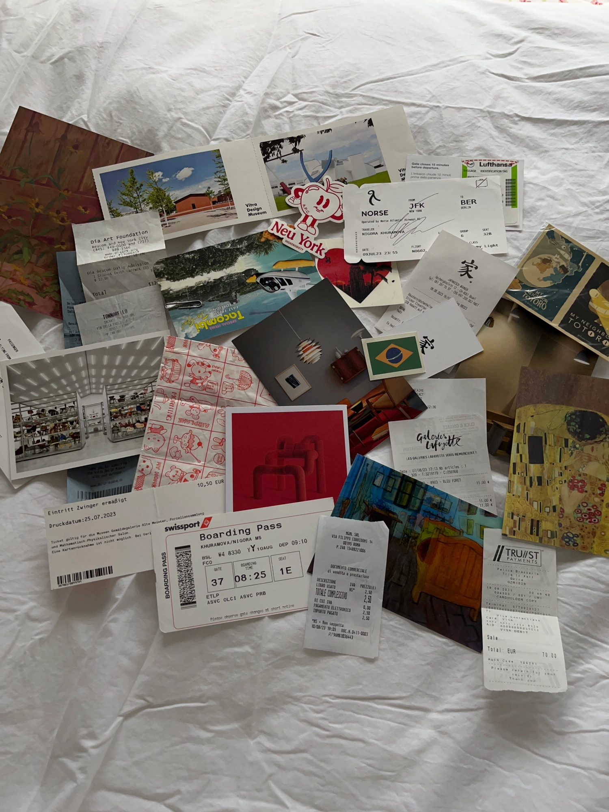

**Tags:** `textile`, `world`, `font`, `material property`, `handwriting`, `product`, `pattern`, `design`

---

### 102. Item 102

- **Type:** InstagramElement
- **Source:** [https://www.instagram.com/p/C1Kb4tlPmqF/?ref=designerdailyreport.com](https://www.instagram.com/p/C1Kb4tlPmqF/?ref=designerdailyreport.com)
- **ID:** `673424305`

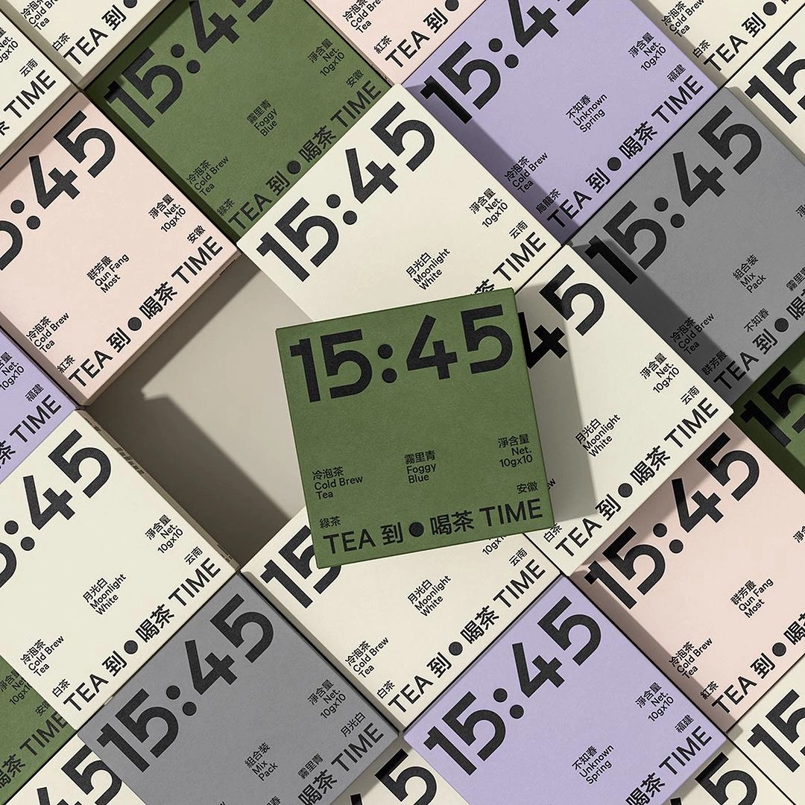

> Branding for <n>15:45 tea</n> by <n>CB DESIGN</n>. Art direction by <n>Jackie Price</n>, lead design by <n>neekow</n>.

**Tags:** `ticket`, `product`, `font`, `material property`, `technology`

---

### 103. Item 103

- **Type:** Element
- **ID:** `281709627`

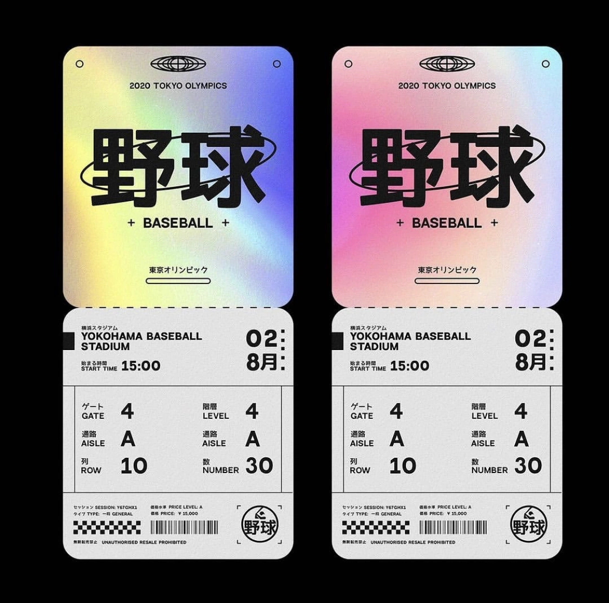

**Tags:** `font`, `gadget`, `material property`, `technology`, `communication device`

---

### 104. Item 104

- **Type:** PinterestElement
- **Source:** [https://www.pinterest.com/pin/1125968650676952/](https://www.pinterest.com/pin/1125968650676952/)
- **ID:** `547881804`

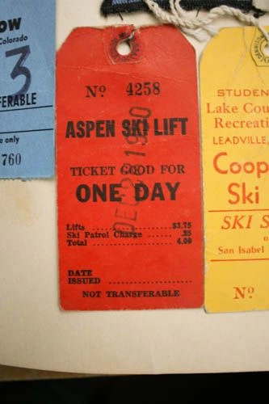

**Tags:** `font`, `gas`, `rectangle`, `orange`

---

### 105. Item 105

- **Type:** InstagramElement
- **Source:** [https://www.instagram.com/p/C3nG7L_oM_U/?igsh=MTR6aDhueDZ5ejU2eA==](https://www.instagram.com/p/C3nG7L_oM_U/?igsh=MTR6aDhueDZ5ejU2eA==)
- **ID:** `1420312382`

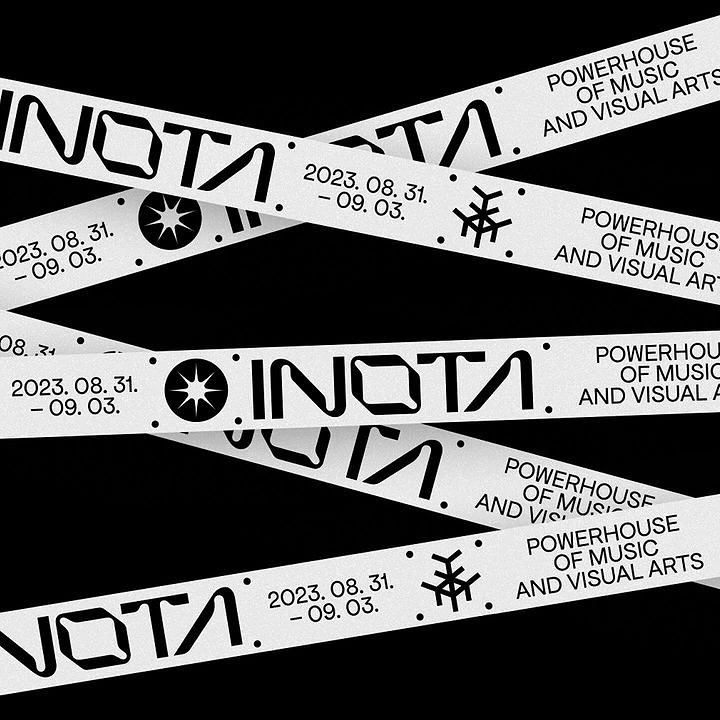

> Branding for the 2023 <n>INOTA Festival</n> by design studio <n>DE_FORM</n>.

**Tags:** `monochrome`, `font`, `poster`, `material property`

---

### 106. Item 106

- **Type:** Element
- **ID:** `1054722718`

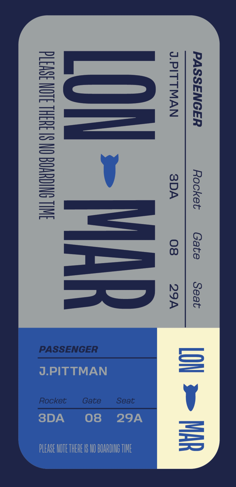

**Tags:** `poster`, `font`

---

### 107. Item 107

- **Type:** InstagramElement
- **Source:** [https://www.instagram.com/p/C21rnX3PbWg/?igsh=ZDg4aGx2N201Y29v](https://www.instagram.com/p/C21rnX3PbWg/?igsh=ZDg4aGx2N201Y29v)
- **ID:** `1239281979`

> <n>Space Jazz Universal Tour</n> poster and ticket by <n>Chen Chungyang</n> of <n>Slow Fire Design</n> for <n>Fujifilm BI Taiwan</n>, 2023.

**Tags:** `multimedia`, `font`, `rectangle`

---

### 108. Item 108

- **Type:** InstagramElement
- **Source:** [https://www.instagram.com/p/C4xFD7pPmef/?igsh=bnE4dTdvY3U4YXB5](https://www.instagram.com/p/C4xFD7pPmef/?igsh=bnE4dTdvY3U4YXB5)
- **ID:** `234539699`

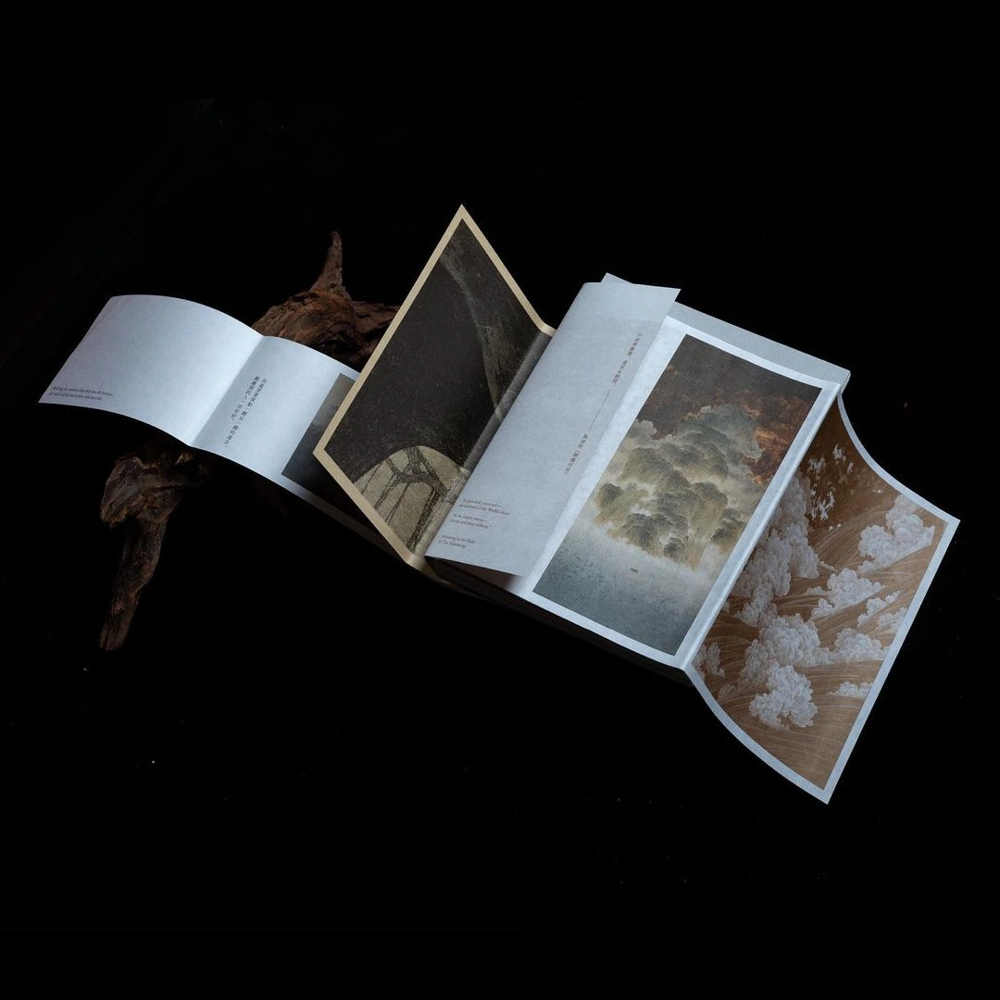

> The artist portfolio <n>Dust and Cicada Chirping</n> for painter <n>Shum Kwan Yi</n>, designed by <n>for&st</n>.

**Tags:** `quartz`, `book`, `publication`, `font`

---

### 109. Item 109

- **Type:** Element
- **Source:** [https://forthandback.la/projects/brother-films](https://forthandback.la/projects/brother-films)
- **ID:** `1166702829`

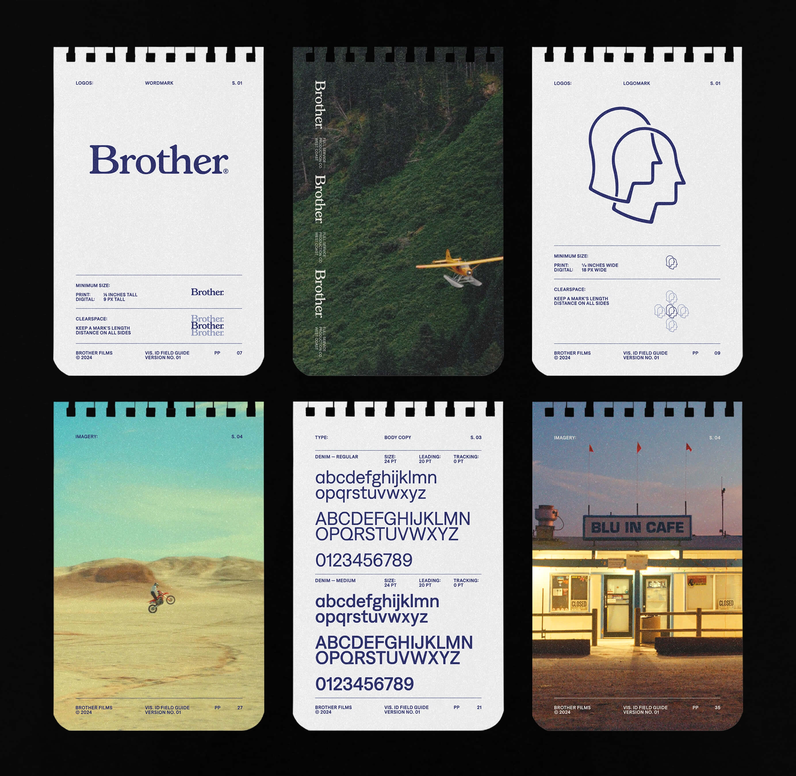

> Visual identity for <n>Brother Films</n>, a West Coast production company, designed by <n>Forth + Back</n> in 2024.

**Tags:** `salamander`, `product`, `font`, `line`, `slope`, `terrestrial plant`, `screenshot`, `adaptation`, `technology`

---

### 110. Item 110

- **Type:** Element
- **Source:** [https://twitter.com/vishlbhardwaj/status/1718644651702509623/photo/1](https://twitter.com/vishlbhardwaj/status/1718644651702509623/photo/1)
- **ID:** `488443284`

**Tags:** `world`, `art`, `publication`, `font`, `collage`

---

### 111. Item 111

- **Type:** Element
- **Source:** [https://twitter.com/paolalien/status/1786796078290841720/photo/1](https://twitter.com/paolalien/status/1786796078290841720/photo/1)
- **ID:** `1928249196`

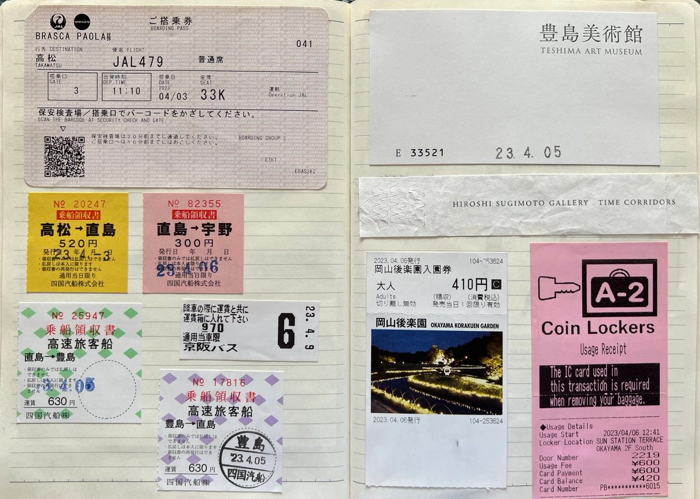

**Tags:** `font`, `material property`, `handwriting`, `rectangle`, `document`

---

### 112. Item 112

- **Type:** PinterestElement
- **Source:** [https://damselindior.com/summer-road-trip-essentials/](https://damselindior.com/summer-road-trip-essentials/)
- **ID:** `1842537307`

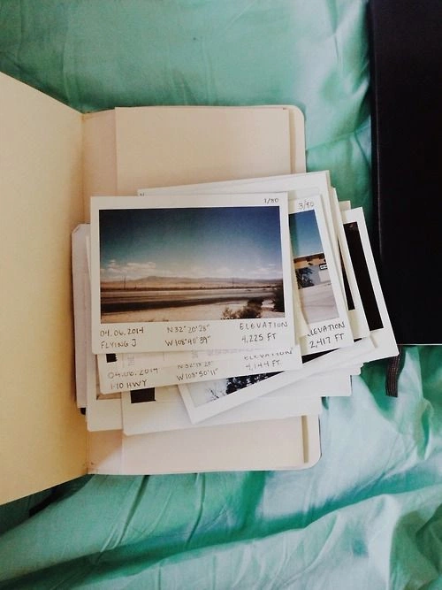

> Photo by <n>Jessica DeMaio</n>.

**Tags:** `font`, `material property`, `rectangle`, `shelf`, `office equipment`, `medical equipment`

---

### 113. Item 113

- **Type:** InstagramElement
- **Source:** [https://www.instagram.com/p/B_FMSDQhyO_/?igsh=MXU5djI4dzV3ZDRwcA==](https://www.instagram.com/p/B_FMSDQhyO_/?igsh=MXU5djI4dzV3ZDRwcA==)
- **ID:** `981127773`

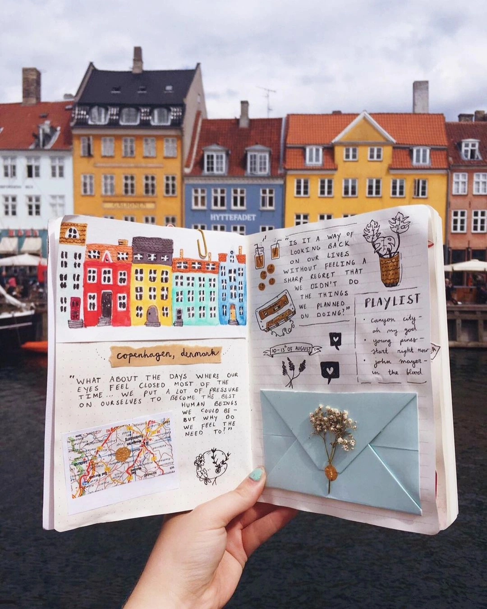

> A travel journal spread by <n>Merel Journals</n> featuring an illustration of <n>Nyhavn</n>, Copenhagen.

**Tags:** `skipperkroen`, `diary`, `travel`, `building`, `window`, `sky`, `cloud`, `font`, `house`, `art`

---
