# Webflow Collection

> Exported from [Cosmos.so](https://www.cosmos.so/arjunphlox/webflow) on 2026-03-30
> Total items: 15

---

### 1. Webflow - Flexbox Game

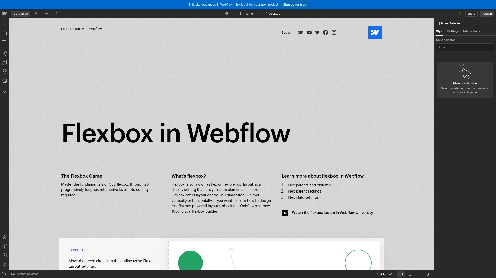

**Type:** Article | **Format:** ARTICLE | **Source:** [https://preview.webflow.com/preview/flexbox-game?preview=d1a...](https://preview.webflow.com/preview/flexbox-game?preview=d1a26b027c4803817087a91c651e321f&m=1)

**Tags:** `screenshot`

---

### 2. Mast <> A CSS Framework for Webflow

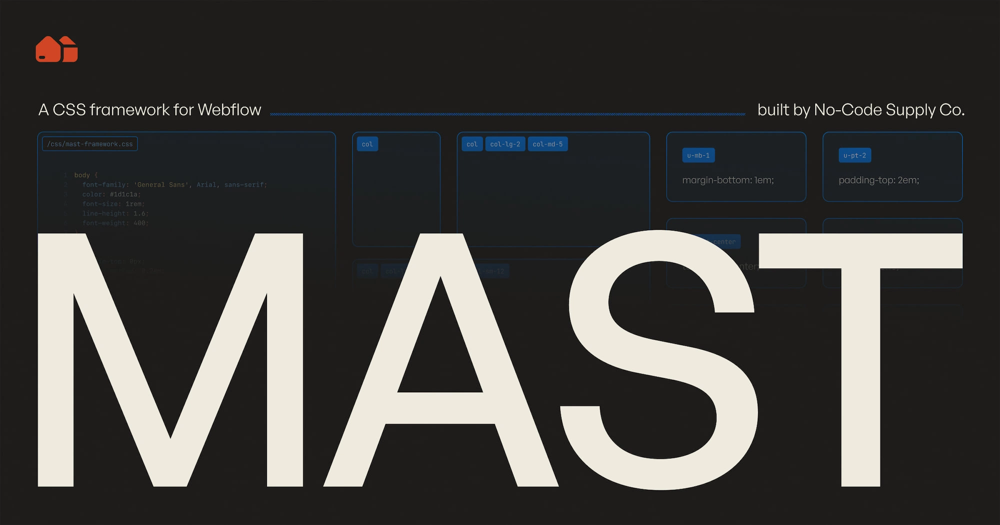

**Type:** Article | **Format:** ARTICLE | **Source:** [https://www.nocodesupply.co/mast](https://www.nocodesupply.co/mast)

**Tags:** `font` `website`

---

### 3. Components for Webflow, Figma & Framer | Flowbase

**Type:** Article | **Format:** ARTICLE | **Source:** [https://www.flowbase.co/components](https://www.flowbase.co/components)

> The logo for <n>Flowbase</n>, a <n>Webflow</n> component and asset library.

**Tags:** `graphic design` `webflow` `design` `sky` `blue` `cloud` `font` `electric blue`

---

### 4. Relume | Build Faster, Design Better in Webflow & Figma

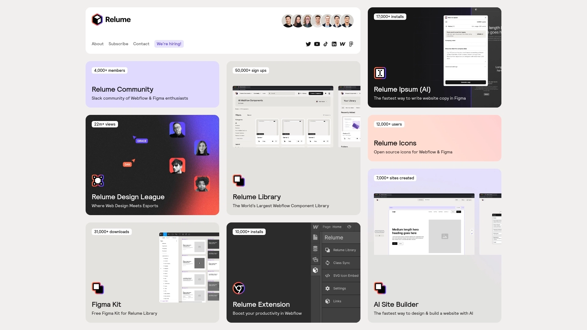

**Type:** Article | **Format:** ARTICLE | **Source:** [https://www.relume.io/](https://www.relume.io/)

> A graphic showcasing products from <n>Relume</n>, an AI-powered platform for website design.

---

### 5. CutCopy App - Developer Tools for Webflow Power Users

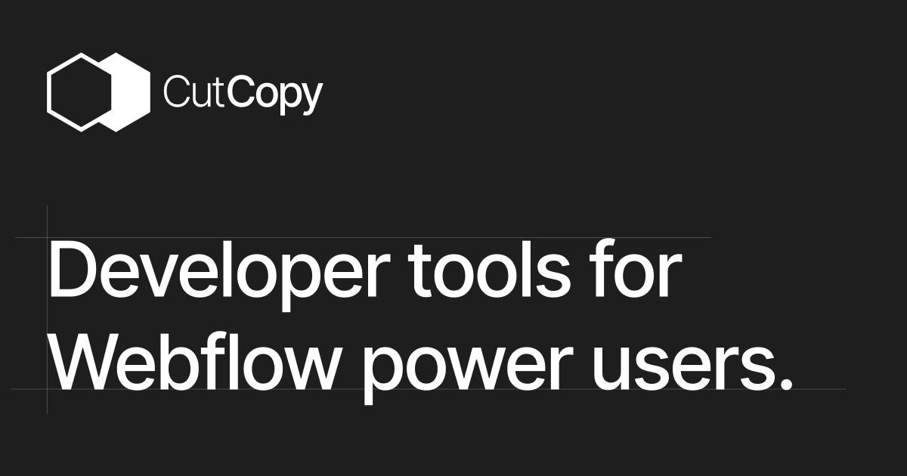

**Type:** Article | **Format:** ARTICLE | **Source:** [https://www.cutcopy.io/](https://www.cutcopy.io/)

**Tags:** `darkness` `font`

---

### 6. State of Flow

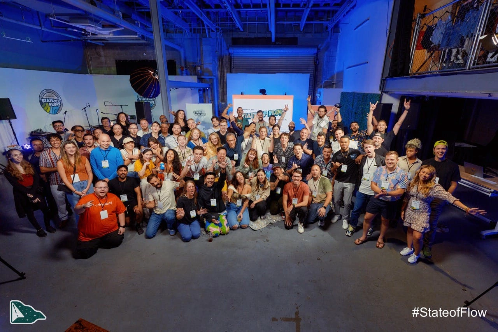

**Type:** Article | **Format:** ARTICLE | **Source:** [https://fierce-founder-2979.ck.page/profile/posts](https://fierce-founder-2979.ck.page/profile/posts)

**Tags:** `auto show` `blue` `entertainment` `leisure` `crowd` `music`

---

### 7. Boosters & Webflow Integration - Webflow Apps

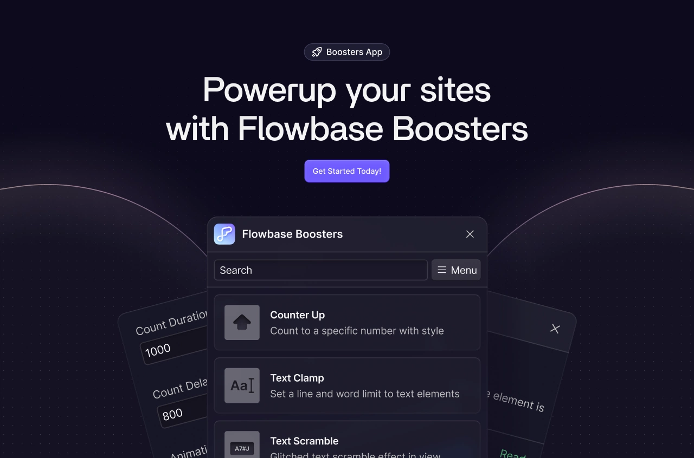

**Type:** Article | **Format:** ARTICLE | **Source:** [https://webflow.com/apps/detail/boosters](https://webflow.com/apps/detail/boosters)

**Tags:** `screenshot` `font` `sky` `material property` `technology` `gadget`

---

### 8. Web Collector - By Atmos

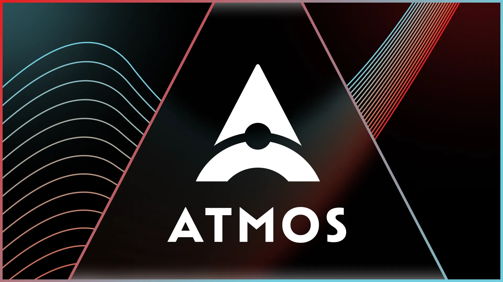

**Type:** Article | **Format:** ARTICLE | **Source:** [https://www.atmospr.com/web-collector](https://www.atmospr.com/web-collector)

**Tags:** `font` `triangle` `graphic design`

---

### 9. Freelance web design boot camp - Webflow University Courses

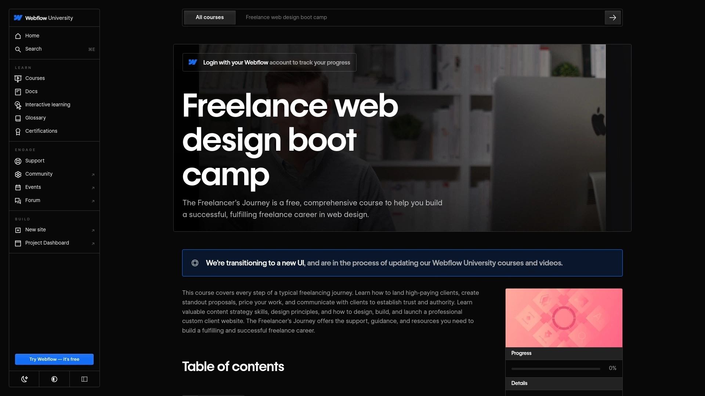

**Type:** Article | **Format:** ARTICLE | **Source:** [https://university.webflow.com/courses/the-freelancers-journ...](https://university.webflow.com/courses/the-freelancers-journey)

---

### 10. Webflow Course - Creating a Clean & Simple Website with Webflow | Jan Losert - Store

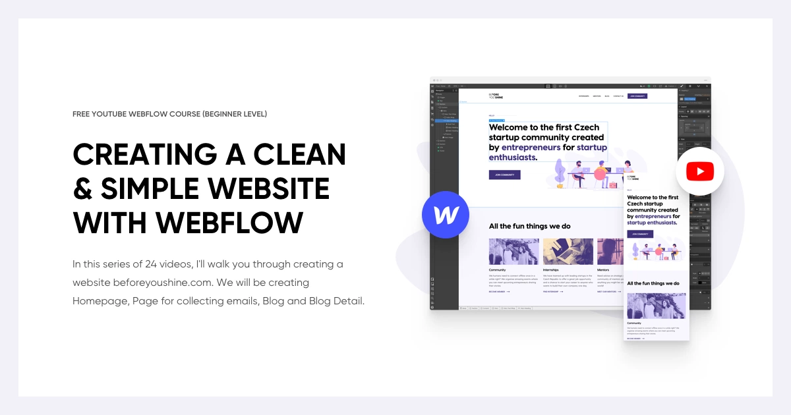

**Type:** Article | **Format:** ARTICLE | **Source:** [https://www.janlosert.com/webflow-course-simple-website](https://www.janlosert.com/webflow-course-simple-website)

> Designer <n>Jan Losert</n>'s free YouTube course, <n>Creating a Clean & Simple Website with Webflow</n>.

**Tags:** `font` `software` `website` `web design`

---

### 11. Every shortcut for designers, centralized and searchable

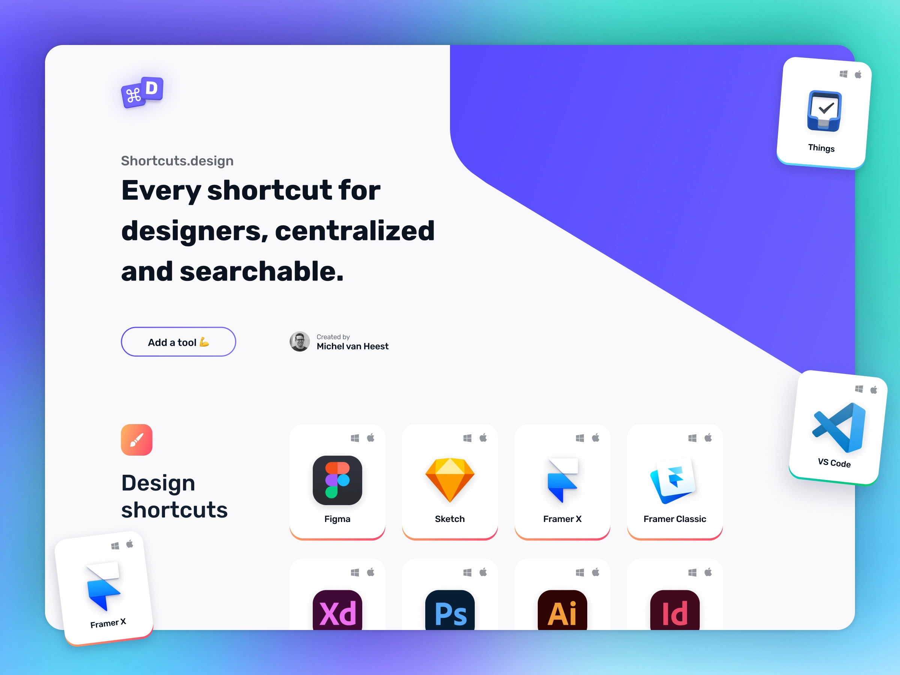

**Type:** Article | **Format:** ARTICLE | **Source:** [https://shortcuts.design/](https://shortcuts.design/)

> The homepage for <n>Shortcuts.design</n>, a website created by <n>Michel van Heest</n>.

**Tags:** `font` `rectangle` `computer keyboard` `screenshot` `software` `user interface` `figma` `adobe xd` `shortcuts ui` `keyboard shortcut`

---

### 12. ϟ Formly - Multistep Form Solution for Webflow | ViDesigns

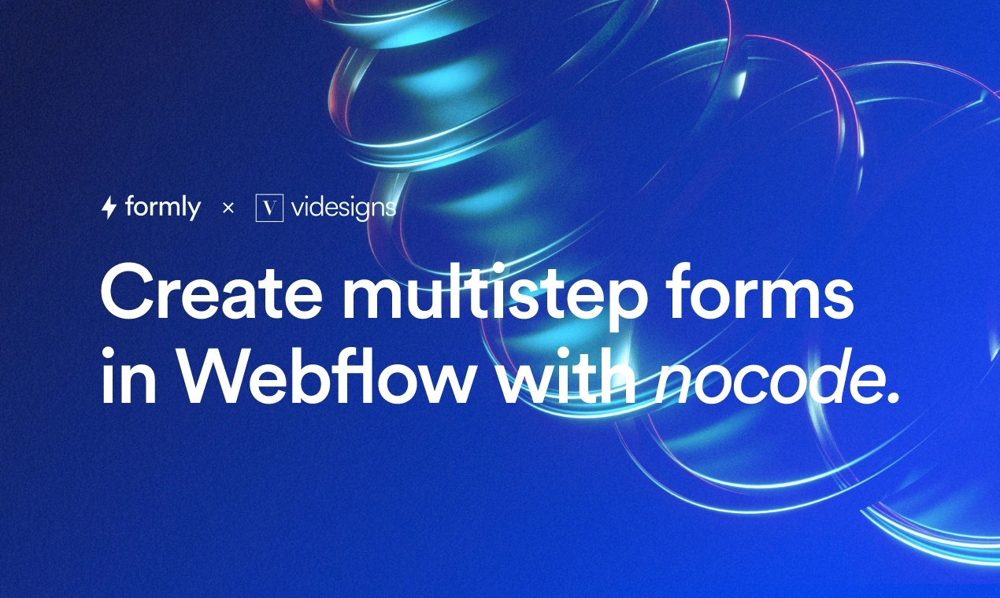

**Type:** Article | **Format:** ARTICLE | **Source:** [https://www.tryformly.com/](https://www.tryformly.com/)

**Tags:** `graphic design` `organism` `font` `electric blue`

---

### 13. Navbars  | Webflow Library

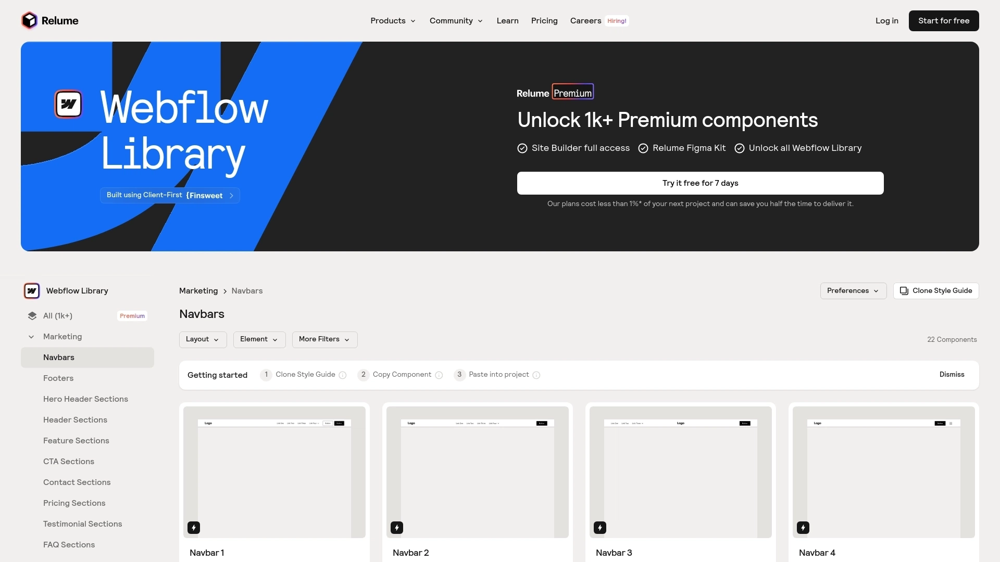

**Type:** Article | **Format:** ARTICLE | **Source:** [https://www.relume.io/categories/navbars](https://www.relume.io/categories/navbars)

**Tags:** `software` `light` `rectangle` `font` `line` `screenshot` `technology` `parallel`

---

### 14. Micro-Interactions library made for Webflow

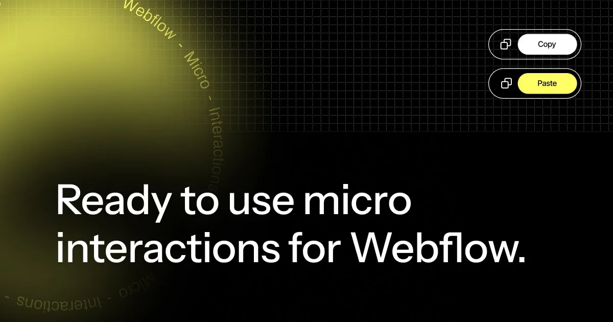

**Type:** Article | **Format:** ARTICLE | **Source:** [https://www.microinteractions.co/](https://www.microinteractions.co/)

**Tags:** `font` `multimedia`

---

### 15. Item 15

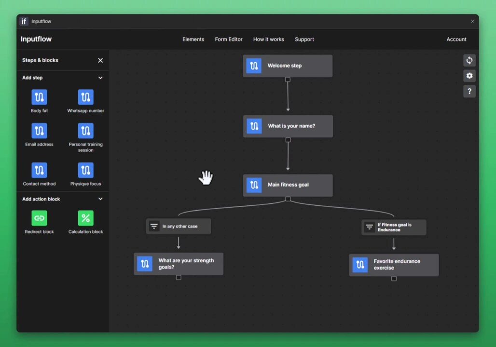

**Type:** Twitter | **Format:** TWITTER | **Source:** [https://x.com/mikepechadotcom/status/1762888282797408602?s=1...](https://x.com/mikepechadotcom/status/1762888282797408602?s=12&t=Kbl6Kd9qhuaRg9Z7iATEEw)

**Tags:** `screenshot` `computer` `gadget` `font`

---
