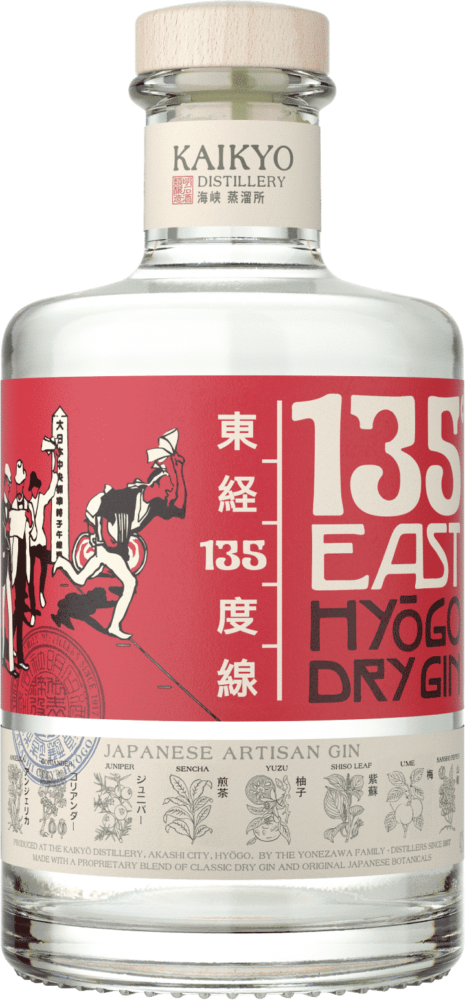

## Summary
Saved from akashisakebrewery.com: 135º East - Akashi sake brewery

## Key Details
- **Source:** [akashisakebrewery.com](https://akashisakebrewery.com/product/135o-east/)
- **Title:** 135º East - Akashi sake brewery

## Visual Assets

