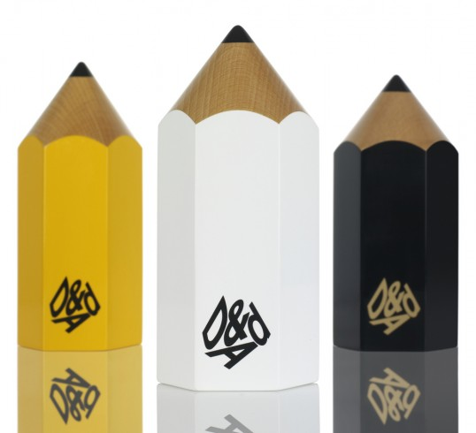

## Summary
The day started out with 200 entires from around the world, and over the course of  10 hours we culled that down to 12 In-book awards and 4 Nominations. The

## Key Details
- **Source:** [lovelypackage.com](http://lovelypackage.com/2012-dad-awards-packaging-design-winners/)
- **Title:** 2012 D&AD Awards Packaging Design Winners
- **Description:** The day started out with 200 entires from around the world, and over the course of  10 hours we culled that down to 12 In-book awards and 4 Nomination

## Visual Assets

