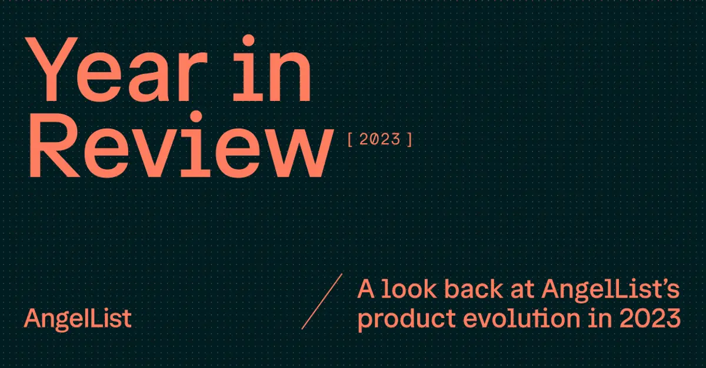

## Summary
A look back at AngelList’s product evolution in 2023, built for the diverse needs of venture and private equity firms, founders, and investors alike.

## Key Details
- **Source:** [angellist.com](https://www.angellist.com/2023)
- **Title:** 2023 Year in Review | AngelList
- **Description:** A look back at AngelList’s product evolution in 2023, built for the diverse needs of venture and private equity firms, founders, and investors alike.

## Visual Assets

