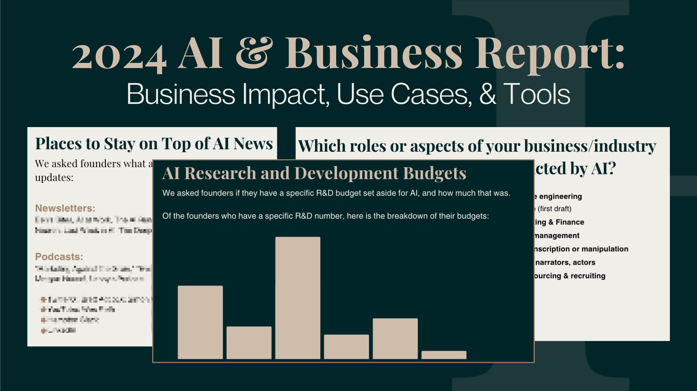

## Summary
Learn how AI is impacting business in 2024: revenue, top tools, R&D budgets and more. We covered it all!

## Key Details
- **Source:** [joinhampton.com](https://joinhampton.com/ai-report)
- **Title:** 2024 AI & Business Report: Uses, Tools, and Business Impact
- **Description:** Learn how AI is impacting business in 2024: revenue, top tools, R&D budgets and more. We covered it all!

## Visual Assets

