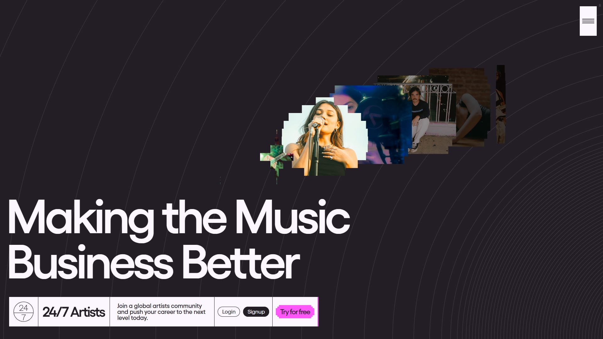

## Summary
The world’s most comprehensive ecosystem for creatives, combining Education Technology and a global Network of like - minded artists and industry pros.

## Key Details
- **Source:** [247artists.com](https://247artists.com/)
- **Title:** 24/7 Artists - Making the Music Business Better
- **Description:** The world’s most comprehensive ecosystem for creatives, combining Education Technology and a global Network of like - minded artists and industry pros

## Visual Assets

