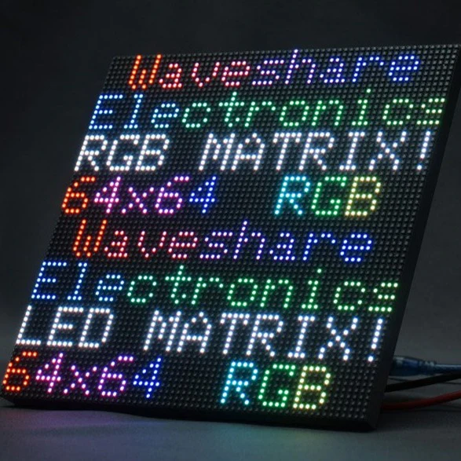

## Summary
64x64 RGB full color LED matrix panel with 4096 LEDs and adjustable brightness. 3mm pitch, 192x192 mm, HUB75 input and output headers, chainable. Compatible with Raspberry Pi Pico, ESP32, and Arduino.

## Key Details
- **Source:** [thinkrobotics.com](https://thinkrobotics.com/products/32-32-rgb-full-color-led-matrix-panel?utm_content=Facebook_UA&utm_source=SpikeROAS&variant=40097633075286&media_type=image&utm_medium=Advantage&utm_campaign=Advantage%2B+shopping+campaign+01%2F24%2F2024&campaign_id=120203437142360743&ad_id=120203437232850743)
- **Title:** 64x64 RGB Full Color LED Matrix Panel 3mm Pitch
- **Description:** 64x64 RGB full color LED matrix panel with 4096 LEDs and adjustable brightness. 3mm pitch, 192x192 mm, HUB75 input and output headers, chainable. Comp

## Visual Assets

