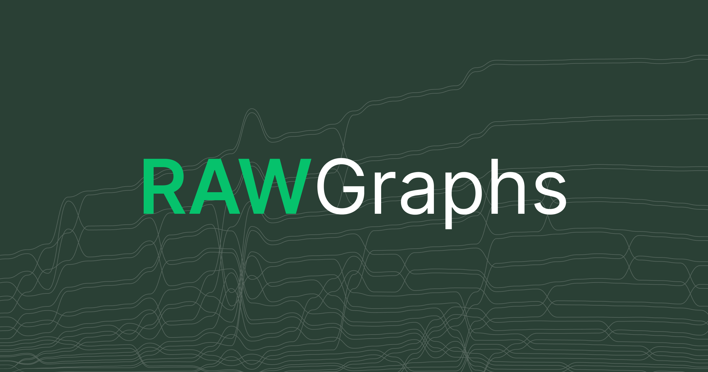

## Summary
A free and open source tool for data visualization.

## Key Details
- **Source:** [rawgraphs.io](https://www.rawgraphs.io)
- **Title:** A free and open source tool for data visualization.
- **Description:** A free and open source tool for data visualization.

## Visual Assets

