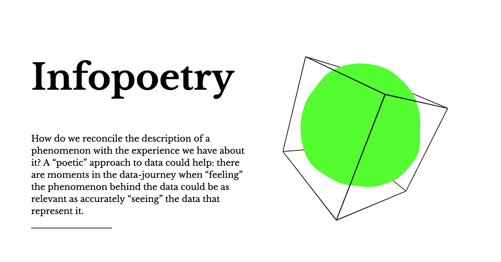

## Summary
A poetic approach to data-journey where feeling the phenomenon behind the data is as relevant as seeing the numbers describing it.

## Key Details
- **Source:** [infopoetry.densitydesign.org](https://infopoetry.densitydesign.org/)
- **Title:** A repository of infopoetries
- **Description:** A poetic approach to data-journey where feeling the phenomenon behind the data is as relevant as seeing the numbers describing it.

## Visual Assets

