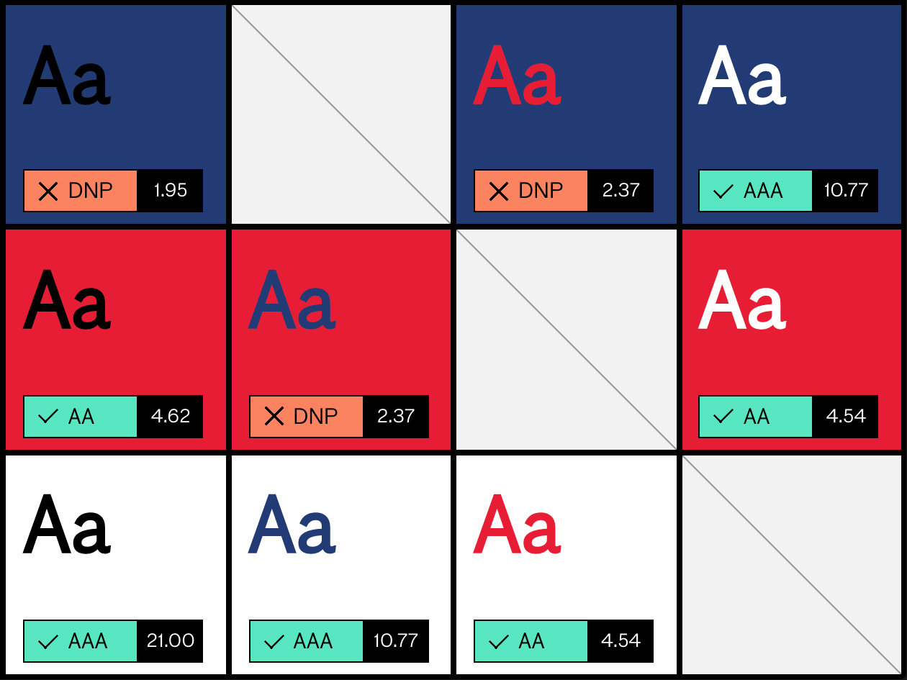

## Summary
A tool that evaluates the ADA compliance of your brand’s color palette.

## Key Details
- **Source:** [abc.useallfive.com](https://abc.useallfive.com/?colors%5B%5D=1A2B21,19452C,146638,05853C,07A64C,38C977,5AE094,6EF0A6,A2FAC8,EBFFF4)
- **Title:** Accessible Brand Colors
- **Description:** A tool that evaluates the ADA compliance of your brand’s color palette.

## Visual Assets

