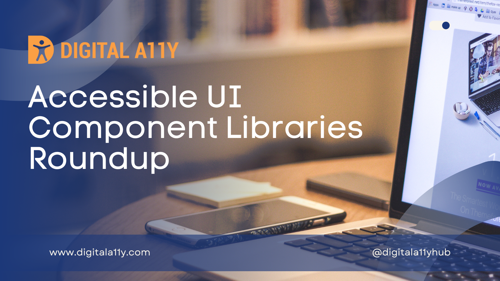

## Summary
Here is a list of accessible UI components that you can use for your next project. Please do let me know if there are any resources that are missing &

## Key Details
- **Source:** [digitala11y.com](https://www.digitala11y.com/accessible-ui-component-libraries-roundup/)
- **Title:** Accessible UI Component Libraries Roundup • DigitalA11Y
- **Description:** Here is a list of accessible UI components that you can use for your next project. Please do let me know if there are any resources that are missing &

## Visual Assets

