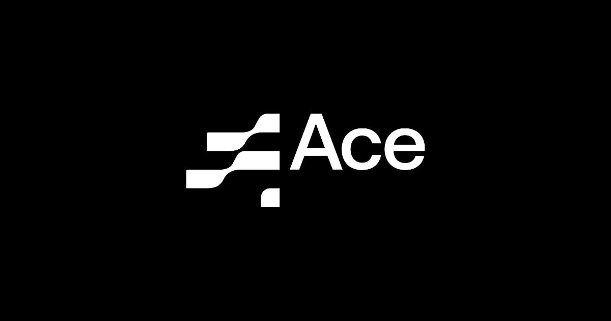

## Summary
It is a brave new world out there. Business cycles are getting shorter. Culture is more elusive. And tech more dominant than ever. As a brand, you either…

## Key Details
- **Source:** [ace.nl](https://ace.nl/en)
- **Title:** ACE | For the brands of tomorrow
- **Description:** It is a brave new world out there. Business cycles are getting shorter. Culture is more elusive. And tech more dominant than ever. As a brand, you eit

## Visual Assets

