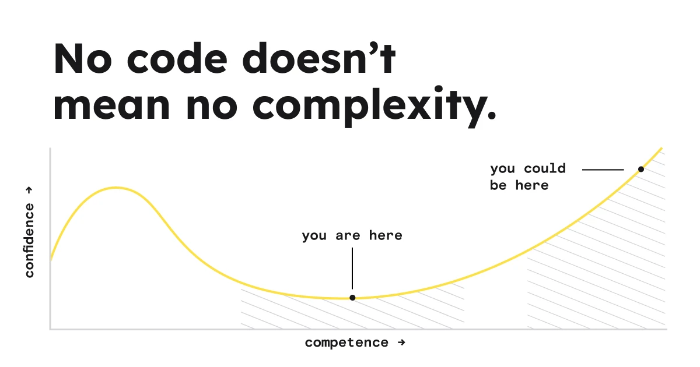

## Summary
Learn to build your own ideas in Framer.

## Key Details
- **Source:** [advancedframer.com](https://www.advancedframer.com/)
- **Title:** advanced_framer
- **Description:** Learn to build your own ideas in Framer.

## Visual Assets

