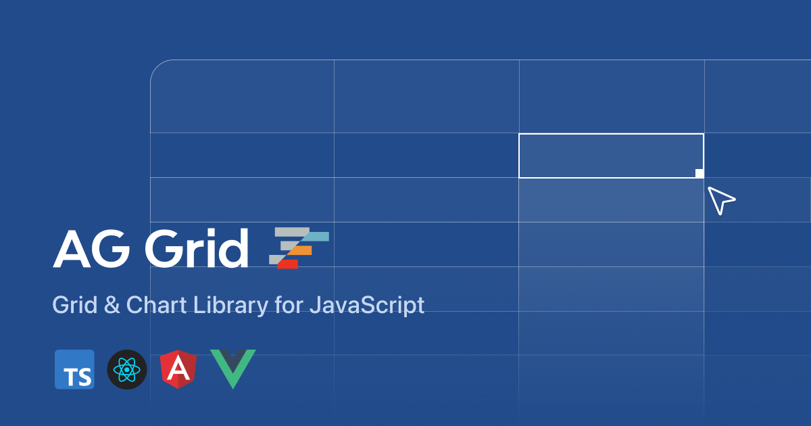

## Summary
AG Grid is a feature-rich Data Grid for all major JavaScript frameworks, offering filtering, grouping, pivoting, and more. Free and open-source. Upgrade to Enterprise for advanced features.

## Key Details
- **Source:** [ag-grid.com](https://www.ag-grid.com/)
- **Title:** AG Grid: High-Performance React Grid, Angular Grid, JavaScript Grid
- **Description:** AG Grid is a feature-rich Data Grid for all major JavaScript frameworks, offering filtering, grouping, pivoting, and more. Free and open-source. Upgra

## Visual Assets

