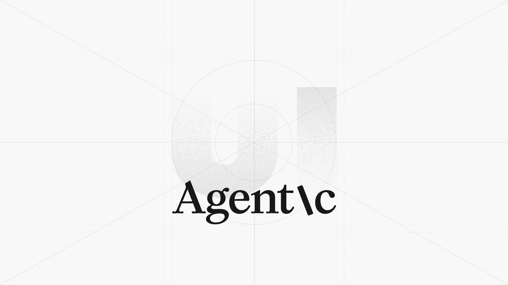

## Summary
The world’s first enterprise-grade design system for building scalable agentic experiences.

## Key Details
- **Source:** [agenticui.net](https://agenticui.net/)
- **Title:** Agentic UI - Figma Design System
- **Description:** The world’s first enterprise-grade design system for building scalable agentic experiences.

## Visual Assets

