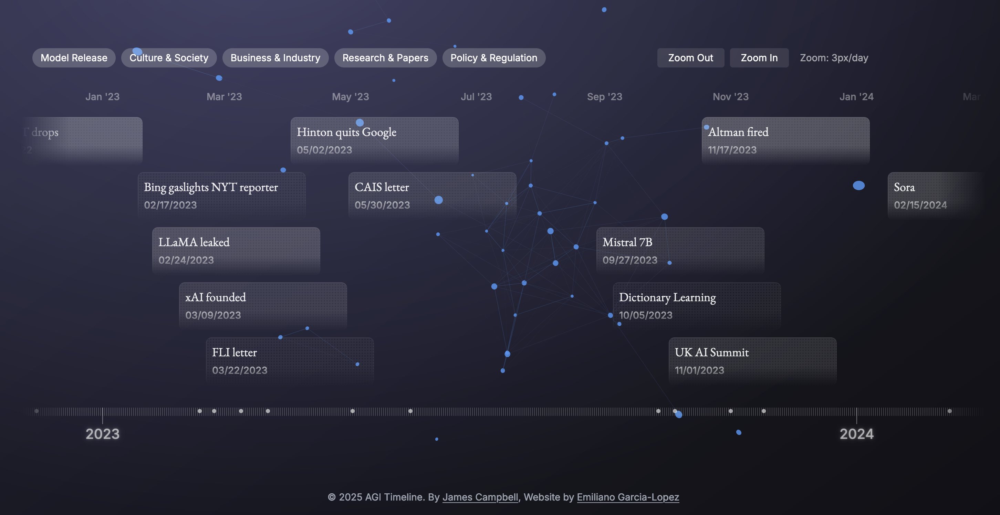

## Summary
A timeline of the history of artificial general intelligence.

## Key Details
- **Source:** [ai-timeline.org](https://ai-timeline.org/)
- **Title:** AGI Timeline
- **Description:** A timeline of the history of artificial general intelligence.

## Visual Assets

