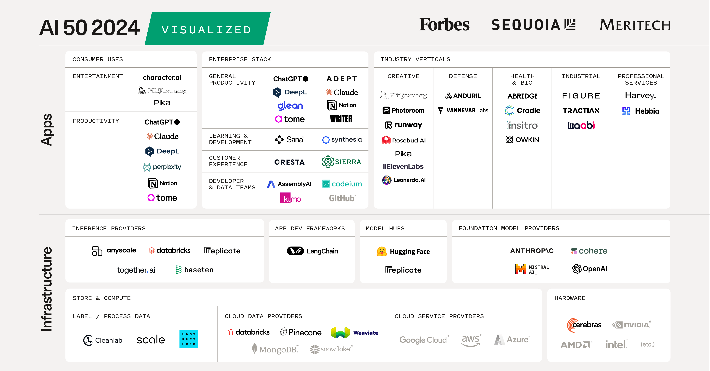

## Summary
The 2024 edition of the AI 50 shows how Gen AI is starting to transform enterprise productivity.

## Key Details
- **Source:** [sequoiacap.com](https://www.sequoiacap.com/article/ai-50-2024/)
- **Title:** AI 50: Companies of the Future
- **Description:** The 2024 edition of the AI 50 shows how Gen AI is starting to transform enterprise productivity.

## Visual Assets

