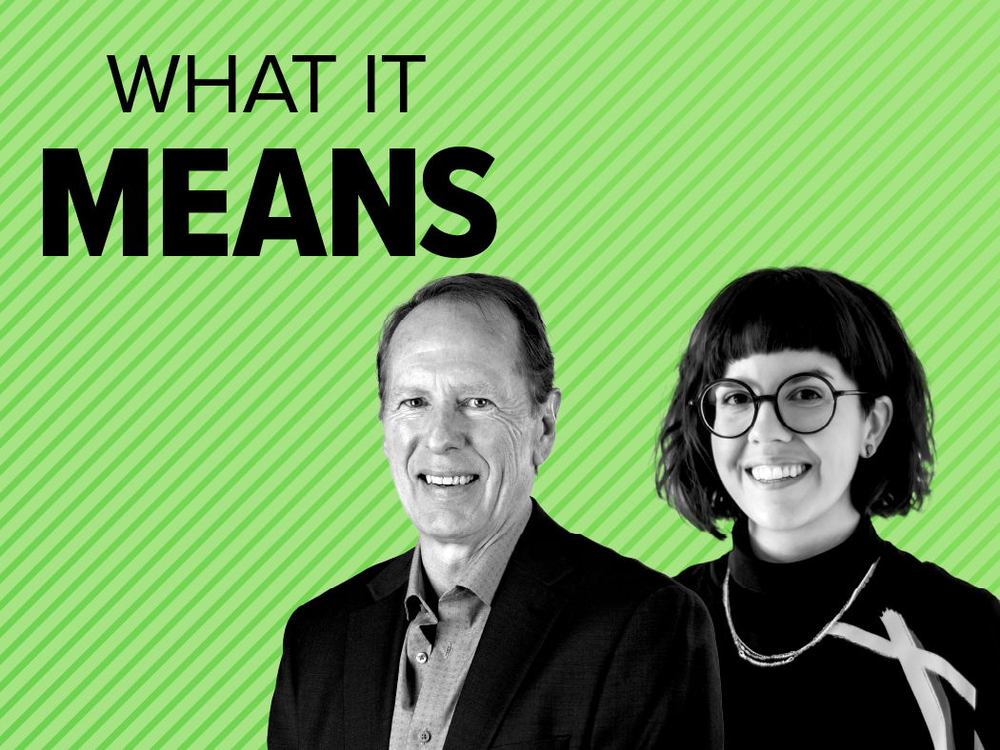

## Summary
Discover how AI agents differ from agentic AI and explore their use cases in B2B and B2C contexts with insights from Forrester analysts.

## Key Details
- **Source:** [forrester.com](https://www.forrester.com/what-it-means/ep403-ai-agent-use-cases/)
- **Title:** AI Agents Vs. Agentic AI: Definitions And Use Cases
- **Description:** Discover how AI agents differ from agentic AI and explore their use cases in B2B and B2C contexts with insights from Forrester analysts.

## Visual Assets

