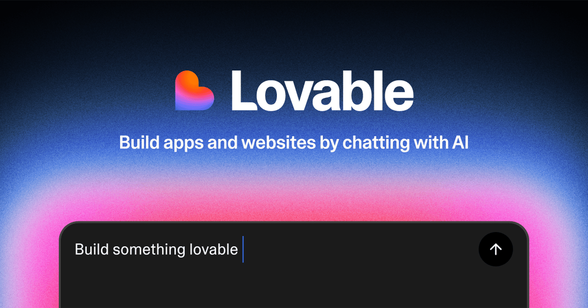

## Summary
Build apps, websites, and digital products faster using Lovable’s no-code and AI-powered platform, no deep coding skills required.

## Key Details
- **Source:** [lovable.dev](https://lovable.dev/)
- **Title:** AI App Builder | Vibe Code Apps & Websites with AI, Fast
- **Description:** Build apps, websites, and digital products faster using Lovable’s no-code and AI-powered platform, no deep coding skills required.

## Visual Assets

