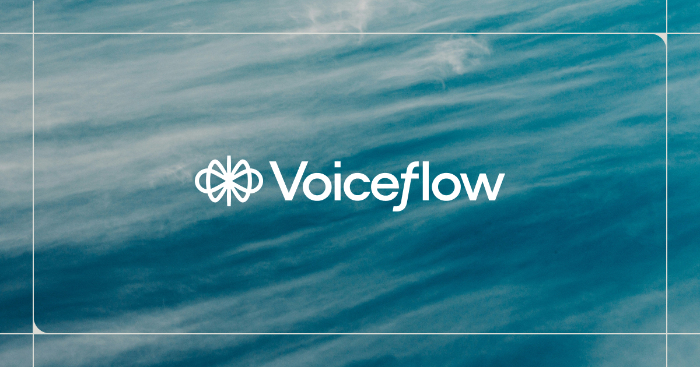

## Summary
AI chat and voice agents: Build, test, deploy, and monitor AI agents that scale with your business.

## Key Details
- **Source:** [voiceflow.com](https://www.voiceflow.com/)
- **Title:** AI chat and voice agents: Build, test, deploy, and monitor AI agents that scale with your business.
- **Description:** AI chat and voice agents: Build, test, deploy, and monitor AI agents that scale with your business.

## Visual Assets

