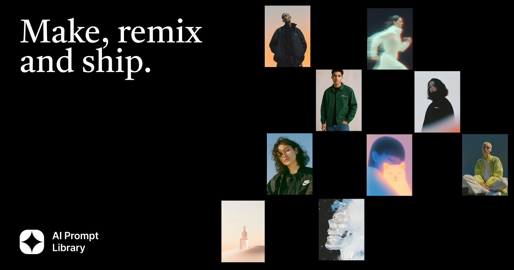

## Summary
Prompts, style references and techniques used to teach 300+ designers from Google, Figma, Uber and Reddit. Take them, remix them, make them yours.

## Key Details
- **Source:** [aiprompt.process-masterclass.com](https://aiprompt.process-masterclass.com/)
- **Title:** AI Prompt Library — For designers to make, remix and ship
- **Description:** Prompts, style references and techniques used to teach 300+ designers from Google, Figma, Uber and Reddit. Take them, remix them, make them yours.

## Visual Assets

