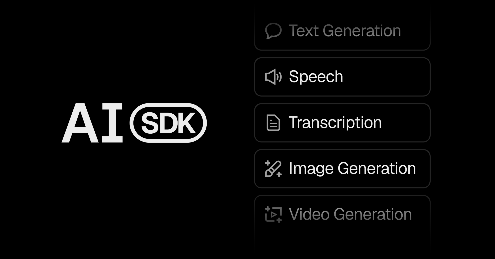

## Summary
The AI Toolkit for TypeScript, from the creators of Next.js.

## Key Details
- **Source:** [ai-sdk.dev](https://ai-sdk.dev/)
- **Title:** AI SDK
- **Description:** The AI Toolkit for TypeScript, from the creators of Next.js.

## Visual Assets

