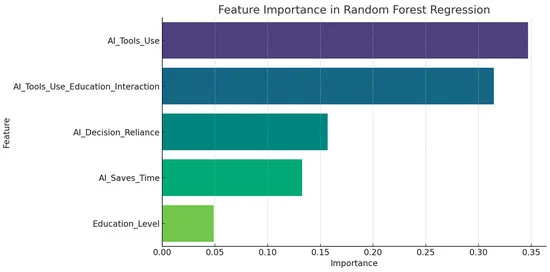

## Summary
The proliferation of artificial intelligence (AI) tools has transformed numerous aspects of daily life, yet its impact on critical thinking remains underexplored. This study investigates the relations

## Key Details
- **Source:** [mdpi.com](https://www.mdpi.com/2075-4698/15/1/6)
- **Title:** AI Tools in Society: Impacts on Cognitive Offloading and the Future of Critical Thinking
- **Description:** The proliferation of artificial intelligence (AI) tools has transformed numerous aspects of daily life, yet its impact on critical thinking remains un

## Visual Assets

