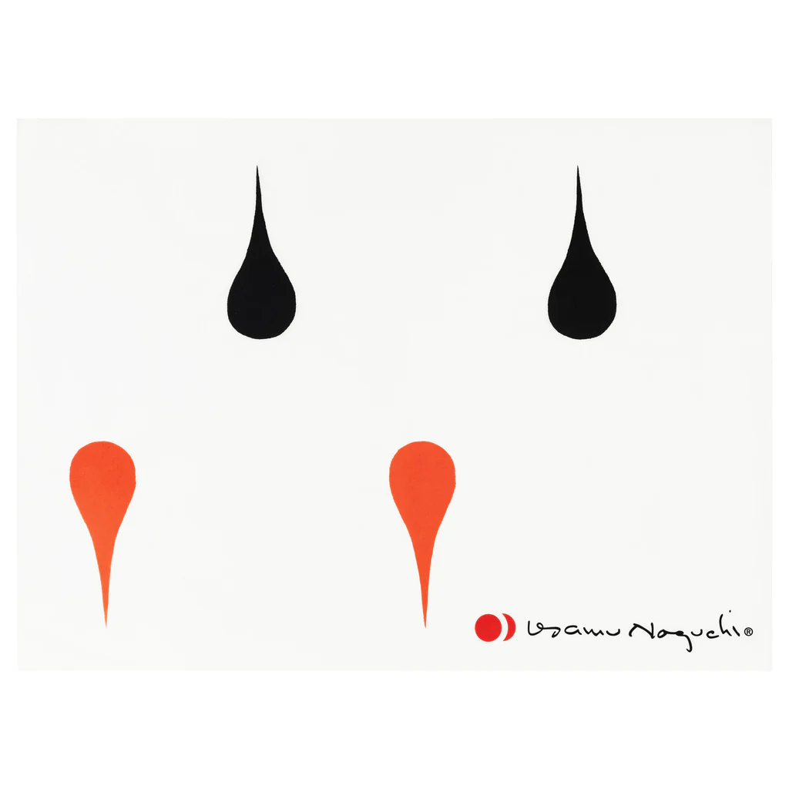

## Summary
Design for Akari by Isamu Noguchi Made in Japan Screenprint on mulberry bark washi paper 26.75 x 19.5 in.

## Key Details
- **Source:** [shop.noguchi.org](https://shop.noguchi.org/products/print-3ad)
- **Title:** Akari 3AD Print
- **Description:** Design for Akari by Isamu Noguchi Made in Japan Screenprint on mulberry bark washi paper 26.75 x 19.5 in.

## Visual Assets

