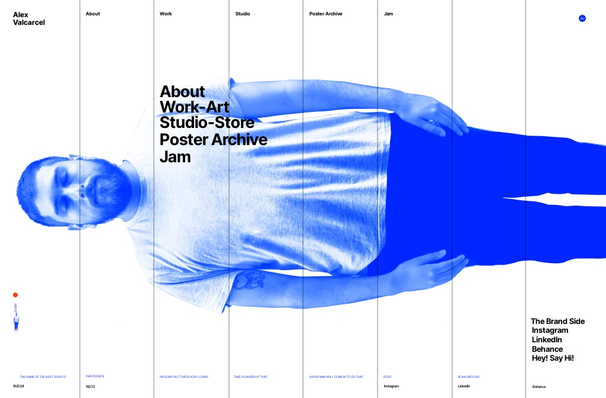

## Summary
Alexandro 'Alex' Valcarcel, a Peruvian graphic designer, artist, and art director based in Lima and Buenos Aires, specializing in brand and poster design.

## Key Details
- **Source:** [alexvalcarcel.pe](https://alexvalcarcel.pe/)
- **Title:** Alex Valcarcel - Work
- **Description:** Alexandro 'Alex' Valcarcel, a Peruvian graphic designer, artist, and art director based in Lima and Buenos Aires, specializing in brand and poster des

## Visual Assets

