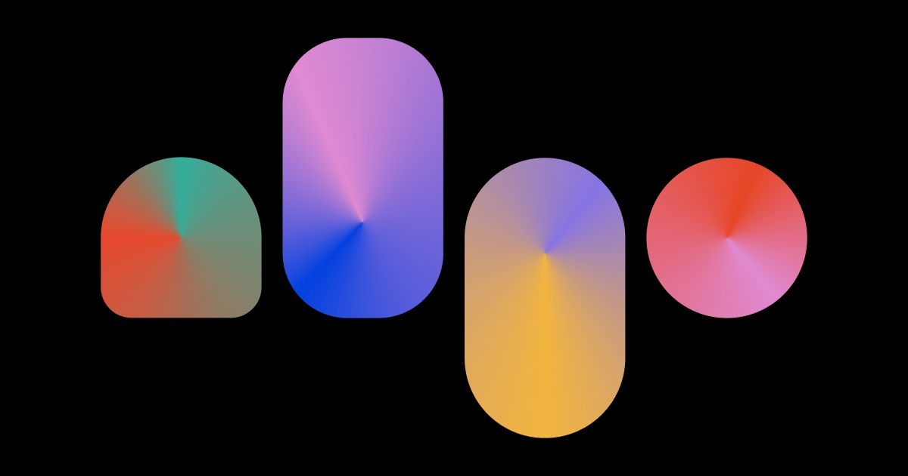

## Summary
Algo is a data-visualization studio specializing in video automation. We run a platform that turns data into videos, at scale.

## Key Details
- **Source:** [algo.tv](https://algo.tv/)
- **Title:** Algo — Video Automation
- **Description:** Algo is a data-visualization studio specializing in video automation. We run a platform that turns data into videos, at scale.

## Visual Assets

