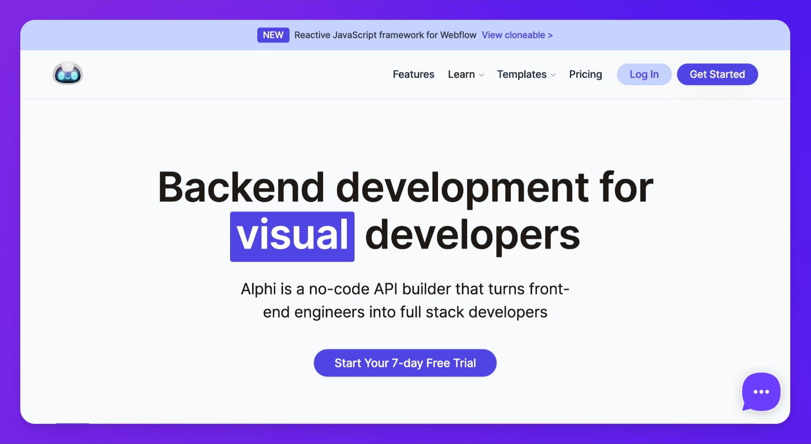

## Summary
Alphi is a powerful no-code backend development platform that allows you to build APIs and micro-services without writing code and managing server infrastructure or environments.

## Key Details
- **Source:** [alphi.dev](https://www.alphi.dev/)
- **Title:** Alphi is a powerful no-code backend development platform that allows you to build APIs and micro-services without writing code and managing server infrastructure or environments.
- **Description:** Alphi is a powerful no-code backend development platform that allows you to build APIs and micro-services without writing code and managing server inf

## Visual Assets

