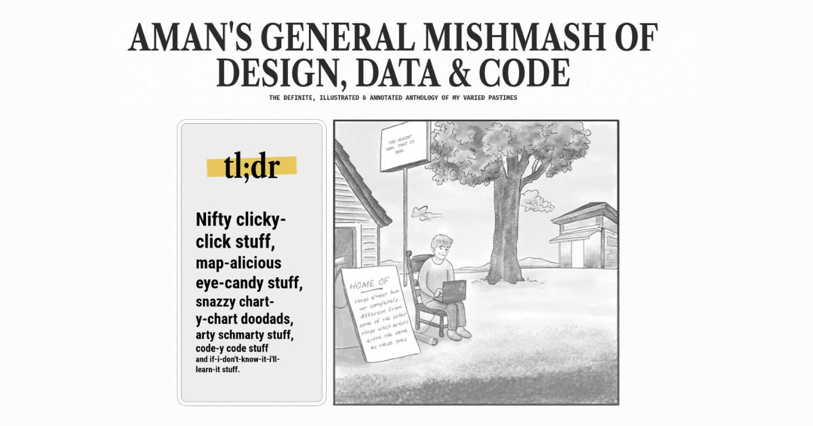

## Summary
Personal website of Aman Bhargava - data visualization designer and developer specializing in data storytelling, web development, and design

## Key Details
- **Source:** [aman.bh](https://aman.bh/)
- **Title:** Aman Bhargava
- **Description:** Personal website of Aman Bhargava - data visualization designer and developer specializing in data storytelling, web development, and design

## Visual Assets

