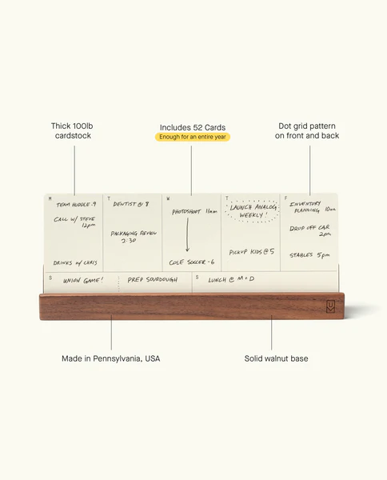

## Summary
The Analog Weekly Planning Kit is an easy way to see your whole week at a glance. The kit includes the Weekly Card Holder and 52 Weekly Cards – enough for an entire year. Thick 100lb uncoated cardstoc

## Key Details
- **Source:** [ugmonk.com](https://ugmonk.com/collections/analog/products/analog-weekly-kit?variant=42716905373846)
- **Title:** Analog Weekly Planning Kit (Walnut)
- **Description:** The Analog Weekly Planning Kit is an easy way to see your whole week at a glance. The kit includes the Weekly Card Holder and 52 Weekly Cards – enough

## Visual Assets

