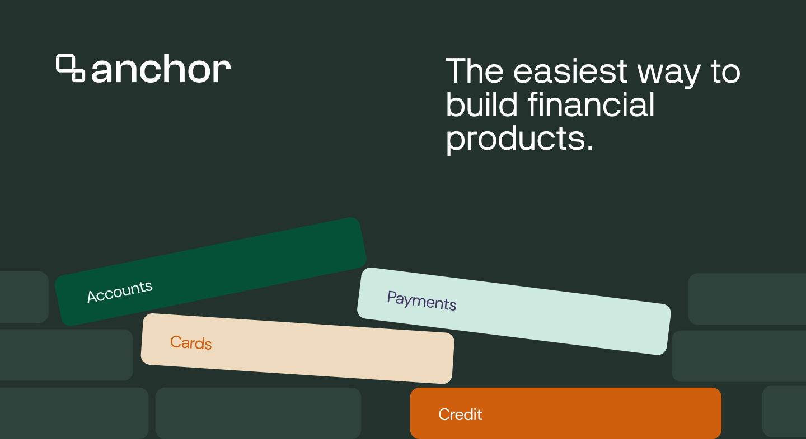

## Summary
Anchor is building the infrastructure needed for businesses to build, launch, and scale banking and payment solutions.

## Key Details
- **Source:** [getanchor.co](https://getanchor.co/index.html)
- **Title:** Anchor | The Easiest Way to Build Financial Products
- **Description:** Anchor is building the infrastructure needed for businesses to build, launch, and scale banking and payment solutions.

## Visual Assets

