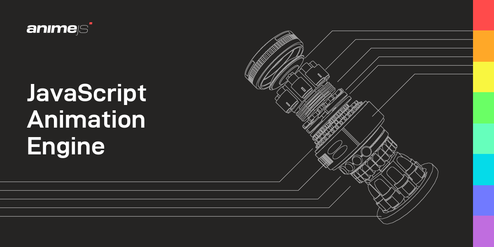

## Summary
A fast, multipurpose and lightweight JavaScript animation library

## Key Details
- **Source:** [animejs.com](https://animejs.com/)
- **Title:** Anime.js | JavaScript Animation Engine
- **Description:** A fast, multipurpose and lightweight JavaScript animation library

## Visual Assets

