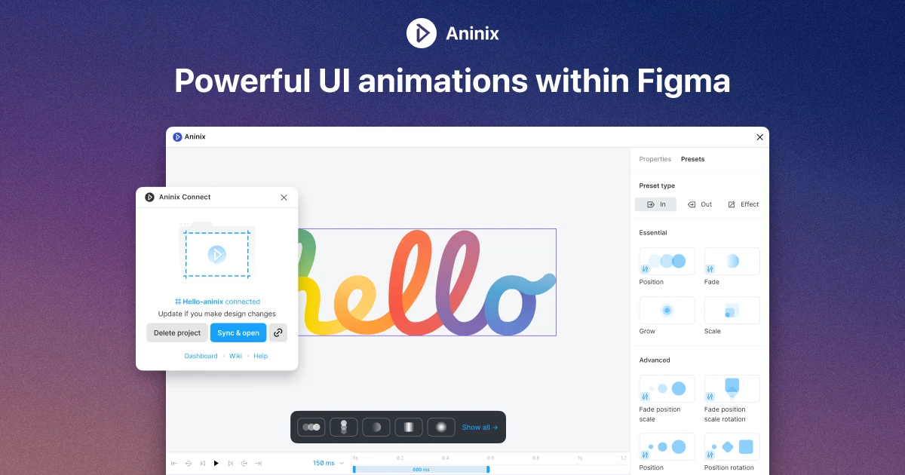

## Summary
Bring your Figma designs to life with Lottie animation! Add interactivity, animate elements, and export animated content as Lottie animations, GIFs, or mp4 — perfect for web, apps, or presentations.

## Key Details
- **Source:** [aninix.com](https://www.aninix.com)
- **Title:** Aninix · Lottie Animation in Figma
- **Description:** Bring your Figma designs to life with Lottie animation! Add interactivity, animate elements, and export animated content as Lottie animations, GIFs, o

## Visual Assets

