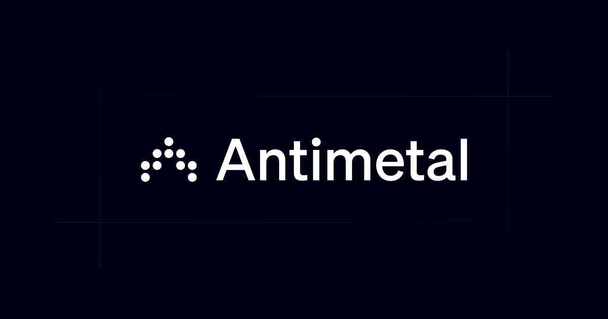

## Summary
For everything that happens after you deploy. Antimetal is the AI platform to better understand, manage, and automate your infrastructure.

## Key Details
- **Source:** [antimetal.com](https://antimetal.com/)
- **Title:** Antimetal
- **Description:** For everything that happens after you deploy. Antimetal is the AI platform to better understand, manage, and automate your infrastructure.

## Visual Assets

