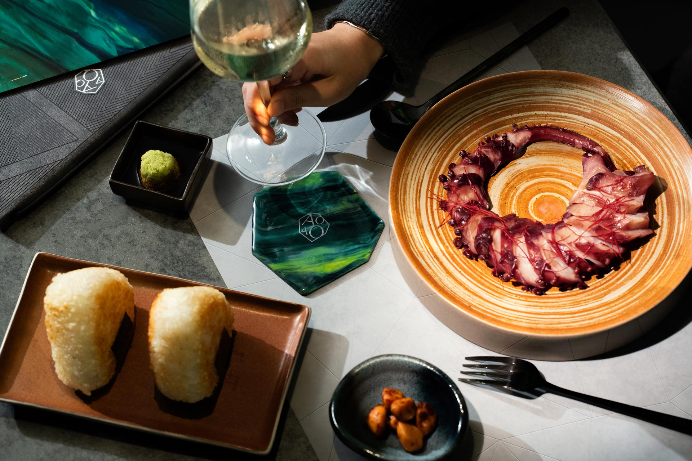

## Summary
AOAO, a resin-art driven Japanese restaurant and bar in Hong Kong. Toby Ng Design built the restaurant brand identity around the greens in a raw gemstone.

## Key Details
- **Source:** [toby-ng.com](https://www.toby-ng.com/works/aoao/)
- **Title:** AOAO | Restaurant Brand Identity | Toby Ng Design
- **Description:** AOAO, a resin-art driven Japanese restaurant and bar in Hong Kong. Toby Ng Design built the restaurant brand identity around the greens in a raw gemst

## Visual Assets

