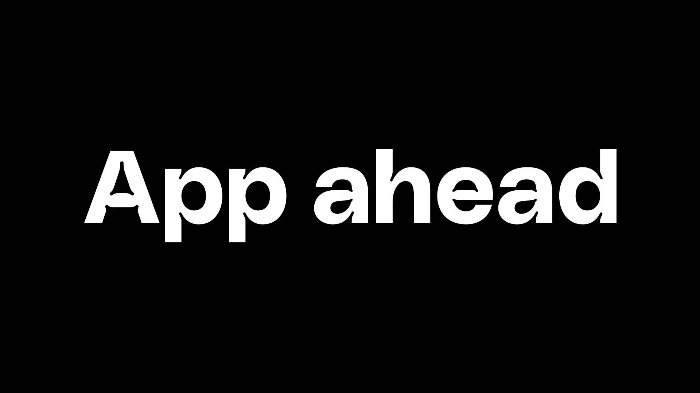

## Summary
App ahead is a software studio led and founded by Martin Lexow. I craft opinionated apps that are honest and functional.

## Key Details
- **Source:** [appahead.studio](https://appahead.studio/)
- **Title:** App ahead
- **Description:** App ahead is a software studio led and founded by Martin Lexow. I craft opinionated apps that are honest and functional.

## Visual Assets

