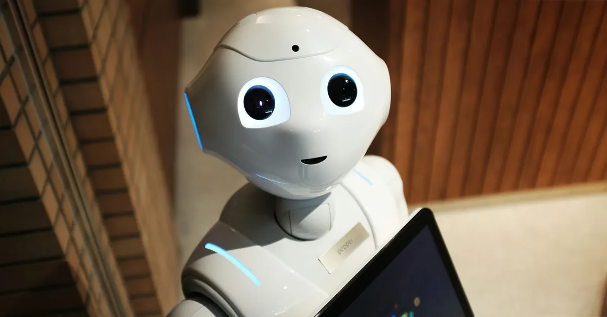

## Summary
A new Apple study introduces ILuvUI: a model that understands mobile app interfaces from screenshots and from natural language conversations.

## Key Details
- **Source:** [9to5mac.com](https://9to5mac.com/2025/07/15/apple-researchers-taught-an-ai-model-to-reason-about-app-interfaces/)
- **Title:** Apple taught an AI model to reason about app interfaces - 9to5Mac
- **Description:** A new Apple study introduces ILuvUI: a model that understands mobile app interfaces from screenshots and from natural language conversations.

## Visual Assets

