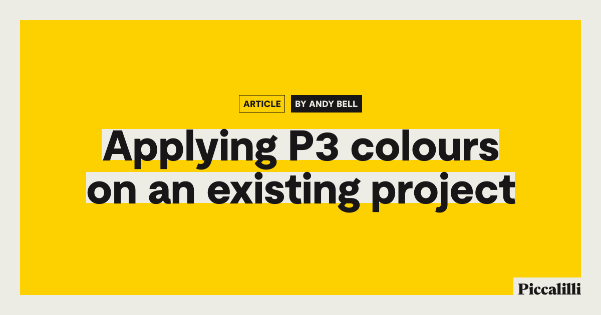

## Summary
The set.studio site is powered by design tokens, which for colours, are hex codes. I managed to automatically convert those to P3 colours with a custom PostCSS plugin.

## Key Details
- **Source:** [piccalil.li](https://piccalil.li/blog/applying-p3-colours-on-an-existing-project/)
- **Title:** Applying P3 colours on an existing project
- **Description:** The set.studio site is powered by design tokens, which for colours, are hex codes. I managed to automatically convert those to P3 colours with a custo

## Visual Assets

