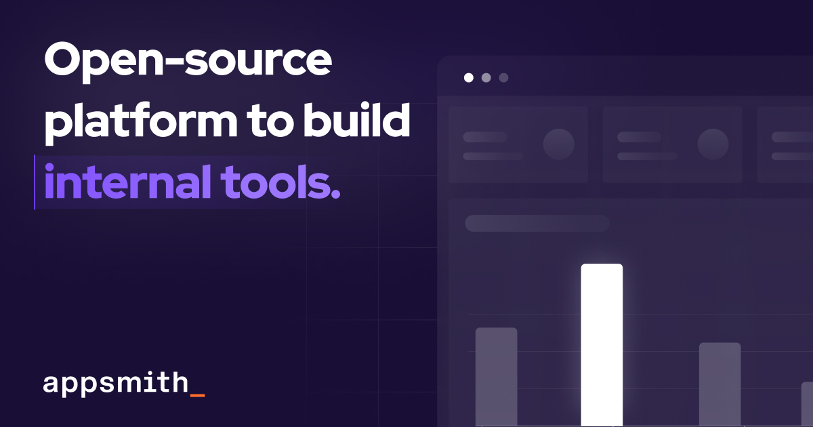

## Summary
Stop grappling with data, scouring for the perfect React library, and coding everything from scratch. Build custom software 10X faster with Appsmith.

## Key Details
- **Source:** [appsmith.com](https://www.appsmith.com/)
- **Title:** Appsmith | Open-Source Low-Code Application Platform
- **Description:** Stop grappling with data, scouring for the perfect React library, and coding everything from scratch. Build custom software 10X faster with Appsmith.

## Visual Assets

