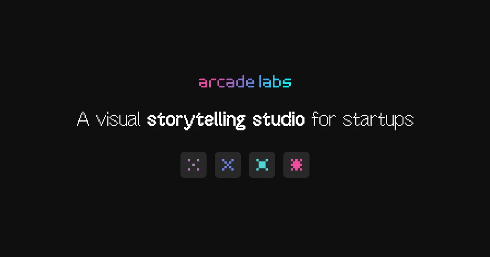

## Summary
Arcade Labs is a small creative lab based in Los Angeles founded by Mason Watson. I partner with early-stage startups designing zero to one brand and product design. I do web design, UI/UX design, ind

## Key Details
- **Source:** [arcade.la](https://arcade.la/?ref=minimal.gallery)
- **Title:** Arcade Labs — Startup Design Studio — Los Angeles
- **Description:** Arcade Labs is a small creative lab based in Los Angeles founded by Mason Watson. I partner with early-stage startups designing zero to one brand and 

## Visual Assets

