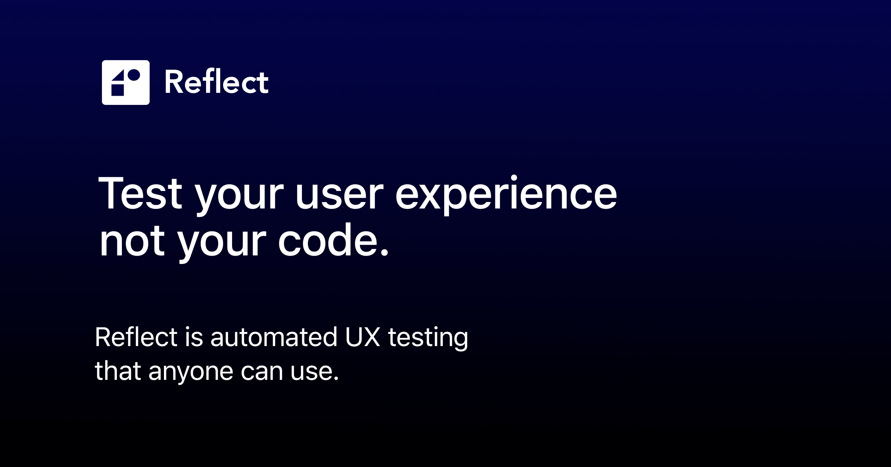

## Summary
Reflect is an automated end-to-end testing platform that makes tests easy to create and maintain.

## Key Details
- **Source:** [reflect.run](https://reflect.run/)
- **Title:** Automated Web Testing | Reflect
- **Description:** Reflect is an automated end-to-end testing platform that makes tests easy to create and maintain.

## Visual Assets

